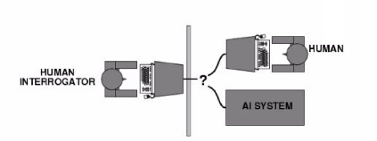
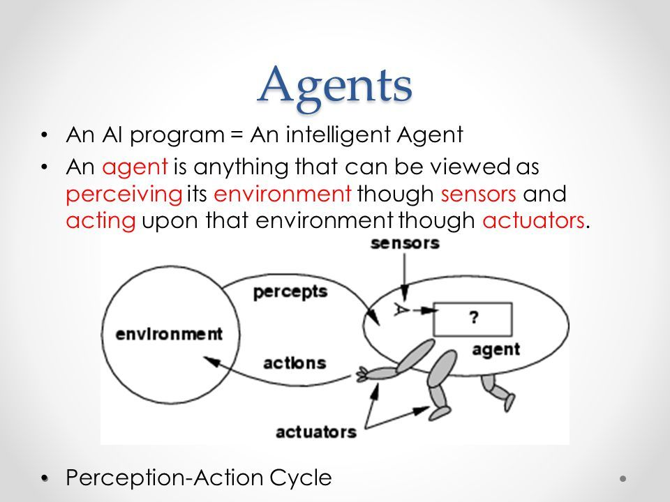

# Introduction
> Artificial Intelligence is the science of making machines that can think like humans.

- AI technology can process large amounts of data in ways, unlike humans.
- The **goal** for AI is to be able to do things such as recognize patterns, make decisions and judge like humans.
- How Artificial Intelligence Works:
	- It all starts with designing the AI to meet a specific goal.
	- From there, it is trained on available data as it learns how to best achieve the given goal.
	- When it reaches a level of learning, the AI then takes on the data independently.
	- Then, after analyizing all the data, AI makes predictions based on what it finds.
	- Going foward, it uses what it learns to improve its approach.

## Pros and Cons of Artificial Intelligence:
|Pros|Cons|
|:--:|:--:|
|Reducing human error|Higher overall costs|
|Allows for quicker decision-making|Job loss / replacements|
|Reduces the risk|Lacks the ability to be creative|
|Automates repetition|Emotional range isn't there|
|Assists with digital tasks|Inability to integrate ethical principles|
## Key Components of AI
- Artificial Intelligence
	- Machine Learning
		- Deep Learning

Deep Learning: The subset of machine learning composed of algorithms that permit software to train itself to perform tasks, like speech and image recognition, by exposing multilayered neural networks to vast amounts of data.

Machine Learning: The subset of AI that includes abstruse statistical techniques that enable machines to improve at tasks with experience.

Artificial Intelligence: The broadest term. Applies to any technique that enables computers to mimic human intelligence, using logic, if-then rules, decision trees, etc.

# Foundations of AI

<table>
<tr>
<td><b>Thinking Humanly</b> 
Cognitive Science: Relating to the mental process involved in knowing, learning and understanding things.
</td>
<td><b>Thinking Rationally</b> 
"Laws of thought": pattern based answers for solving argument structures using logic.
</tr>
<tr><td><b>Acting Humanly</b> To be able to be indistinguishable from a Human faced with a similiar challenge / question.
</td><td><b>Acting Rationally</b> 
Doing the right thing: That which is expected to maximize goal achievement, given available information.
</td>
</table>

### The test behind Acting Humanly: The Turing Test
- There are 3 actors here: Interrogator, Human & AI System.

- The Interrogator who doesn't know which is which, will ask questions to both the Human and the AI System.

- The Interrogator 30 minutes to ask whatever they wish to ask and determine only through questions and answers which is which.

- The AI System is deemed intelligent if the Interrogator can't distinguish between the Human and the AI System.

# Philosophy in AI
- Rationalism - reasoning
- Dualism - houl in Human
- Materialism - hold brain to work with law of physics
- Empiricism - no understanding, if not first in the senses
- Induction - repeated associations
- Logical Positivism
- Observation sentence - sensory inputs
- Theory confirmation - acquired from experience

# AI prehistory
|||
|---|---|
|Philosophy|Logic, methods of reasoning, mind as physical system foundation of learning, language, rationality.|
|Mathematics|Formal representation and proof algorithms, computation, (un)decidability, (in)tractability, probability.|
|Economics|utility, decision theory|
|Neuroscience|physical substrate for mental activity|
|Psychology|phenomenon of perception and motor control, experimental techniques|
|Computer Engineering|building fast computers|
|Control Theory|design system that maximize and objective function over time|
|Linguistics|knowledge representation, grammar|

# Agent
> An agent is just something that acts. (the word itself comes from the Latin *agere*, meaning to do).

- A computer agent is one which is expected to:
	- Operate autonomously
	- Perceive their environment, persist over a prolonged time period.
	- Adapt to change.
	- Create and pursue goals.

- A rational agent is one that acts so as to achieve the best outcome or, when there is uncertainty, the best expected outcome.

- In AI, an agent is anything that can be viewed as perceiving its environment through sensors and acting upon that environment through actuators.

- In AI, artificial agents that have a physical presence in the world are usually known as **robots**.

## Some Definitions
- Percept: The term used to refer to the agent's perceptual inputs at any given instant.

- Percept Sequence: The complete history of everything the agent has ever perceived.

- Agent function: The function that maps any given percept sequence to an action.

- Agent Program: An independent program or entity that interacts with its environment by perceiving its surroundings via sensors, then acting through actuators or effectors.

In general, an agent's choice of action at any given instant can depend on the entire percept sequence observed to date, but not on anything it hasn't perceived.

# The concept of rationality
- A rational agent is one that does the right thing
	- What is the right thing:
		- Approximation: the most *successful* agent.
		- Measure of success?
	- Performance measure should be objective.
		- E.g. the amount of dirt cleaned within a certain time.
	- Performance measure according to what is wanted in the environment instad of how the agents should behave.

Rationality depends of four things:
1. The performance measure that defines the criterion of success.
2. The agent's prior knowledge of the environment.
3. The actions that the agent can perform.
4. The agent's percept sequence to date.

For each possible percept sequence, a rational agent should select an action that is expected to maximize its performance measure, given the evidence provided by the percept sequence and whatever built-in knowledge the agent has.

Note:
- Rationality != Omniscience
	- An omniscient agent knows the actual outcome of its actions.
- Rationality != Perfection
	- Rationality maximizes expected performance, while perfection maximizs actual performance.

Steps for Rationality:
- Information gathering/exploration.
	- To maximize future rewards.
- Learn from percepts
	- Extending prior knowledge
- Agent autonomy
	- Compensate for incorrect prior knowledge.

## Autonomy and its impotance
> "Independence"
- A system is autonomous if its behavior is determined by its percepts (As opposed to built-in prior knowledge)
	- An alarm that goes off at a prespecified time is now autonomous.
	- An alarm that goes off when smoke is sensed is somewhat autonomous
	- An alarm that learns over time via feedback when smoke is from cooking vs a real fire is really autonomous.

- A system without autonomy lacks flexibility

- A rational agent should be autonomous - it should learn what it can to compensate for partial or incorrect prior knowledge.

# PEAS
- Correct problem identification is task environment, which are essentially the "problems" to which rational agents are the "solutions".
- In designing an agent, the first step must always be to specify the task environment as fully as possible.

- For this we use PEAS (Performance, Environment, Actuators, Sensors)

## Types of Environments:
- Fully / Partially Observable
- Deterministic / Non-Deterministic
- Episodic / Non-Episodic (Sequential)
- Static / Dynamic
- Discrete / Continous
- Single / Multiple agents

### Fully / Partially Observable
- An agent's sensors give it access to complete state of the environment at each point in time, then we say that the task environment is fully observable; otherwise it is partially observable.
	- Chess is fully observed.
	- Poker is partially observed.

### Deterministic / Non-Deterministic
- If the next state of the environment is completely determined by the current state and the actions of the agent, then the environment is deterministic; otherwise it is non-deterministic.
	- Tic Tac Toe is Deterministic
	- Self-driving vehicles are Non-Deterministic idk how??

### Episodic / Non-episodic (Sequential)

The agent's experience is divided into atomic "episodes" (each episode consists of the )

continue from page 65