# Knowledge-Based Agents
- The central compoent of Intelligent agents is knowledge (about the world to reach good decisions.)

- A Knowledge-Based Agent is composed of:
    - Inference mechanism
    - Knowledge Base(KB)
- Knowledge Base (KB) is a set of representations of facts about the world known as <u><b>Sentences</b></u>. (here sentence is used as a technical term, it is related but is not identical to the sentence of English or other language)
    - The sentences are expresses in a language called knowledge representation language (KRL).
- KB agent can operate by storing sentences about the world in its KB, using the inference mechanism to infer new sentences and & using them to decide what action to take.

- Knowledge-based agents are those agents who have the capability of maintaining an internal state of knowledge, reason over that knowledge, update their knowledge after observations and take actions.
    - These agents can represent the world with some formal representation and act intelligently.

<br>

A knowledge based agent must be able to do the following:
- represent states, actions, etc.
- incorporate new percepts.
- update the internal representation of the world.
- deduce the internal representation of the world.
- deduce appropriate actions.

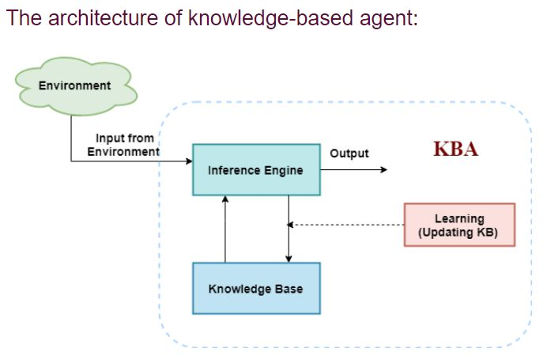

## A simple knowledge-based agent
```pseudo
function KB-Agent(percept) returns an action:
    static: KB, a knowledge base.
        t, a counter, initially 0, indicating time

    TELL(KB, MAKE-PERCEPT-SENTENCE(percept, t))
    action <- ASK(KB, MAKE-ACTION-QUERY(t))
    TELL(KB, MAKE-ACTION-SEQUENCE(action, t))
    t <- t+1
    return action
```

Agent gain additional knowledge about the world while interacting with its environment.

The agent operates as follows:
(Operations performed by KBA)
1. It `TELL`s the KB what it perceives.
2. It `ASK`s the KB what action it should perform.
3. It performs the chosen action.

## Architecture of a KB Agent
Agents can be view at 3 levels:
- At the Knowledge level: the most abstract - describes agent by saying what it knows.
- At the Logical Level: It describes how the agent knows.
- At the implementation level: it describes how knowledge is implemented.
    - i.e. data structures in KB and algorithms that manipulate them.

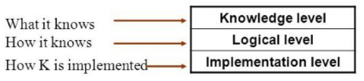

# The Wumpus World
> Example of a knowledge-based agent that represents Knowledge representation, reasoning and planning.
- Knowledge-Based agent links general knowledge with current percepts to infer hidden characters of current state before selecting actions.
- Its necessity is vital in partially observable environments.

**Problem Statement:**
1. The Wumpus wolrd is a cave with 16 rooms (4x4)
2. Each room is conected to others through walkways (no rooms are connected diagonally)
3. The knowledge-based agent starts from Room[1, 1].
4. The cave has – some pits, a treasure and a beast named Wumpus.
5. The Wumpus can not move but eats the one who enters its room.
6. If the agent enters the pit, it gets stuck there.
7. The goal of the agent is to take the treasure and come out of the cave.
8. The agent is rewarded, when the goal conditions are met.
9. The agent is penalized, when it falls into a pit or being eaten by the Wumpus.
10. Some elements support the agent to explore the cave, like
    - The wumpus’s adjacent rooms are stenchy.
    - The agent is given one arrow which it can use to kill the wumpus when facing it (Wumpus screams when it is killed).
    - The adjacent rooms of the room with pits are filled with breeze.
    - The treasure room is always glittery.


Following is a sample diagram for representing the Wumpus world. It is showing some rooms with Pits, one room with Wumpus and one agent at (1,1) sqaure location of the world.
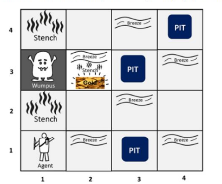

## PEAS description of Wumpus world
**Performance Measure:**
- +1000 reward points if the agent comes out of the cave with the gold.
- -1000 reward points for being eaten by the Wumpus or falling into the pit.
- -1 for each action, and -10 for using an arrow.
- The game ends if either agent dies or comes out of the cave.

**Environment:**
- A 4x4 grid of rooms.
- The agent is initially in [1,1].
- Location of Wumpus and gold are chosen randomly except [1,1]
- Each square of the cave can be a pit with probability 0.2 except [1,1].
- There can only be one item on a square (pit, gold, Wumpus, etc.)

**Actuators:**
- Up
- Down
- Left
- Right
- Use
- Shoot

**Sensors:**
- The agent will perceive the `stench` if he is in the room adjacent to the Wumpus. (not diagonally)
- The agent will perceive `breeze` if he is a room directly adjacent to the pit.
- The agent will perceive `glitter` in the room that gold is present.
- The agent will perceive `bump` if he walks into a wall.
- When the wumpus is shot it emits a horrible scream which can be perceived anywhere in the cave.
- These percepts acan be represented as a five element list in which we will have different indicators for each sensor:
    - Example if agent perceives stench, breeze but no glitter, no bump and no scream then it can be represented as:
    `[Stench, Breeze, None, None, None]`.

### The Wumpus world properties:
**Partially Observable:** The Wumpus world is partially observable because the agent can only perceive the close environment such as an adjacent room.

**Deterministic:** It is deterministic, as the result and outcome of the world are already known.

**Sequential:** The order is important, so it is sequential.

**Static:** It is static as Wumpus and pits are not moving.

**Discrete:** The environment is discrete.

**One agent:** The environment is a single agent as we have one agent only and Wumpus is not considered as an agent.

## Basic Solution Idea
The general idea revolves around the fact that in a room where nothing is sensed, the adjacent rooms must be safe.

Also, in rooms where something is sensed the rooms adjacent to the adjacent rooms of that room (2nd nearest neighbour) can be used to infer where the threat is present.

# Logic
- **Logic** is a formal language for representing information such that conclusions can be drawn.

- It consists of two parts, a language and a method of reasoning. The objective of KRL (Knowledge Representation Language) is to express knowledge in a computer adaptable manner, so that agents can perform well.

A knowledge representation is defined by two aspects:
- **Syntax:** Specifies the symbols in the language and how they can be combined to form sentences.
- **Semantic:** defines the meaning of sentences.
    - Example: $x\geq y$ is a sentence with semantics that say that $x\geq y$ is false if $y$ is a bigger number than $x$ and true otherwise.

If a language has well defined syntax and semantics, then it is called a logic.

## Connection between sentences & facts
Facts are part of this world - their representation must be encoded to physically store within an agent.

Cannot put the world inside a computer - all reasoning must operate on representation of facts, rather than on facts themselves.

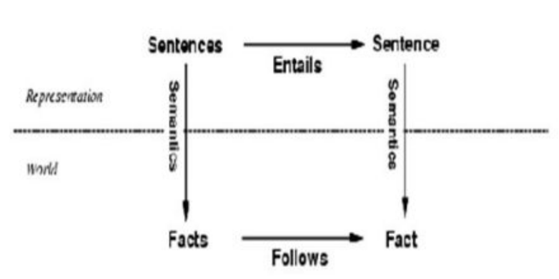

Semantics maps sentences in logic into facts in the world.

The property of one fact following from some other facts is mirrored by the property of one sentence being entailed by another.

## Entailment
> Entailment means that one thing follows from another
> Example $x+y=4$ entails $4=x+y$
> In mathematical notation: $\text{KB}\models\alpha$

Knowledge base $\text{KB}$ entails sentence $\alpha$ if and only if $\alpha$ is true in all world where $\text{KB}$ is true.

Example: the $\text{KB}$ containing "A won" and "B won" entails "Either A won or B won".

Entailment is a relationship between sentences (i.e. syntax) that is based on semantics.

## Inference
> A process by which conclusions are reached.
>$\text{KB}\vdash_i\alpha$ = sentence $\alpha$ can be derived from $\text{KB}$ by procedure $i$

- **Logical inference:** is the process of generating new sentences based on existing sentences.

- An inference algorithm or process that drives only entailed sentences is called **Sound / truth-preserving**.

- An inferencing process having is **complete** if it can derive all sentences that are entailed (Have as a logical consequence).

- <u>Notice</u> that if we make wrong statements about our 'world' the inference is likely to be wrong.

# Type of Logic
|Language|Ontological commitment<br>(what exists in the world)|Epistemological commitment<br>(what an agent believes)|
|:---|:-----:|:----:|
|Propositional Logic|Facts|True/false/unknown|
|First-Order Logic|Facts, objects, relations|True/false/unknown|
|Temporal Logic|Facts, object, relations, times|True/false/unknown|
|Probability|Facts|Degree of belief 0..1|
|Fuzzy Logic|Degree of truth|Degree of belief 0..1|

**Ontological commitments** defines the entities that a language uses to describe the world.

**Epistemological commitments** are the values that a sentence can have according to the experiences of an agent.

## Roles for Logic in AI
We consider three modern roles for logic in AI:
1) As a basis for computation.
2) For learning from a combination of data and knowledge
3) For reasoning about the behaviour of machine learning systems.

# Propositional Logic (PL)
> Propositional / Boolean logic is the simplest logic and ilustrates many of the concepts of logic.

Sentences in Propositional logic are made of the following symbols:
- **Constants:** TRUE, FALSE
- **Propositional Symbols:** $\text P_1$, $\text P_2$ etc are sentences.
- **Round Brackets:** $()$ to wrap sentences which yields a single sentence e.g. $(\text P_1 \cup \text P_2)$
- **Logical Connectives:** $\land$ (and), $\lor$ (or), $\implies$ (implication), $\iff$ (equivalance), $\neg$ (negation).

A sentence can be formed by combining simpler sentences with oone of the 5 logical connectives:
- If $\text S$ is a sentence, $\neg \ \text S$ is a sentence (**negation**).
    - A literal is either an atomic sentence (a positive literal) or a negated atomic sequence (a negative literal)
- If $\text S_1$ and $\text S_2$ are sentences, $\text S_1\land\text S_2$ is a sentence (**conjunction:** The state of being joined together.)
- If $\text S_1$ and $\text S_2$ are sentences, $\text S_1\lor\text S_2$ is a sentence (**disjunction:** The state of being disconnected.)
- If $\text S_1$ and $\text S_2$ are sentences, $\text S_1\implies\text S_2$ is a sentence (**implication:** Something that is conditional (entailed).)
    - Implications are also known as rules or if-then statements. The implication symbol is sometimes written as $\rightarrow$ or $\supset$.
- If $\text S_1$ and $\text S_2$ are sentences, $\text S_1\iff\text S_2$ is a sentence (**biconditional:** if and only if.)
    - Biconditional symbol is sometimes written as $\equiv$

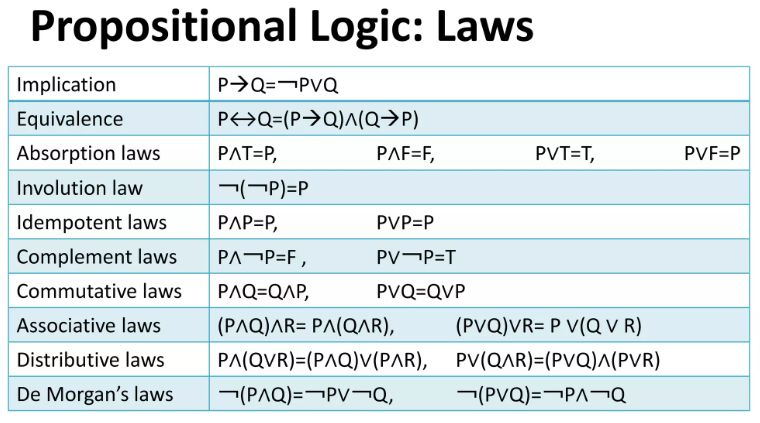

# Backus-Naur Form (BNF)
> It is a formal, mathematical way to specify context-free grammars.

BNF is a Meta langage (a language that describes a language, which can describe a programming language).

It is precise and unambigous.

BNF grammar consists of 4 parts:
- The set of tokens (terminals)
- The set of non terminal symbols
- The start symbol
- The set of productions

**Terminals / Terminal Symbols** are the base tokens of the language. for e.g. in a programming language these can be keywords, operators or the characters used in identifiers.

**Nonterminals / Nonterminal Symbols** are used to represent pieces of the structure of the language.

**Productions / Production Rules** are the rules that make up the grammar. They translate a nonterminal into a sequence of one or more terminals or nonterminals.

## Elements of BNF
- Terminals are simply written out: `while`

- Nonterminals are enclosed in angle brackets: `<statement>`

- Productions are of the form:
    ```
    <nonterminal> := <sequence of terminals or nonterminals>
    ```
    - Note: sometimes `::=` or `:-` can be used in place of `:=`

- We can use `|` to represent or.

Examples:

```
<digit> := 0|1|2|3|4|5|6|7|8|9
<integer> := <digit> | <digit><integer>
<float> := <integer>.<integer>
```

for example (in the case of programming languages):
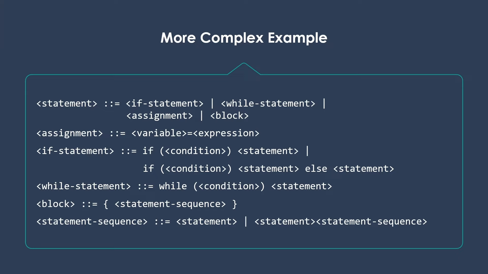

# Propositional Logic (contd.)
The semantic of sentences in propositional logic is defined by:
- Interpreting the proposition symbols - they are considered satisfiable (true in some models) but not valid sentences.
- Interpreting the constants - their meaning is fixed. e.g. TRUE and FALSE.
- Specifiying the meanings of the 5 logical connectives


# Models
- Logicians typically think in terms of **models**, which are formally strucutred world with respect to which truth can be evaluated.
- We say $m$ is a model of a sentence $\alpha$ is $\alpha$ is true in $m$.
- $M(\alpha)$ is the set of all models of $\alpha$

Then:
$$
\text{KB} \models \alpha \text{ iff } M(\text{KB})\subseteq M(\alpha)
$$
Example:
$\text{KB = Giants won and Reds won}$
$\alpha \text{ = Giants won}$
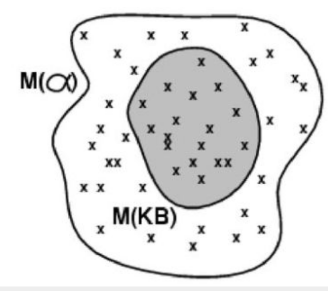

## Truth table enumeration algorithm for deciding propositional entailment:
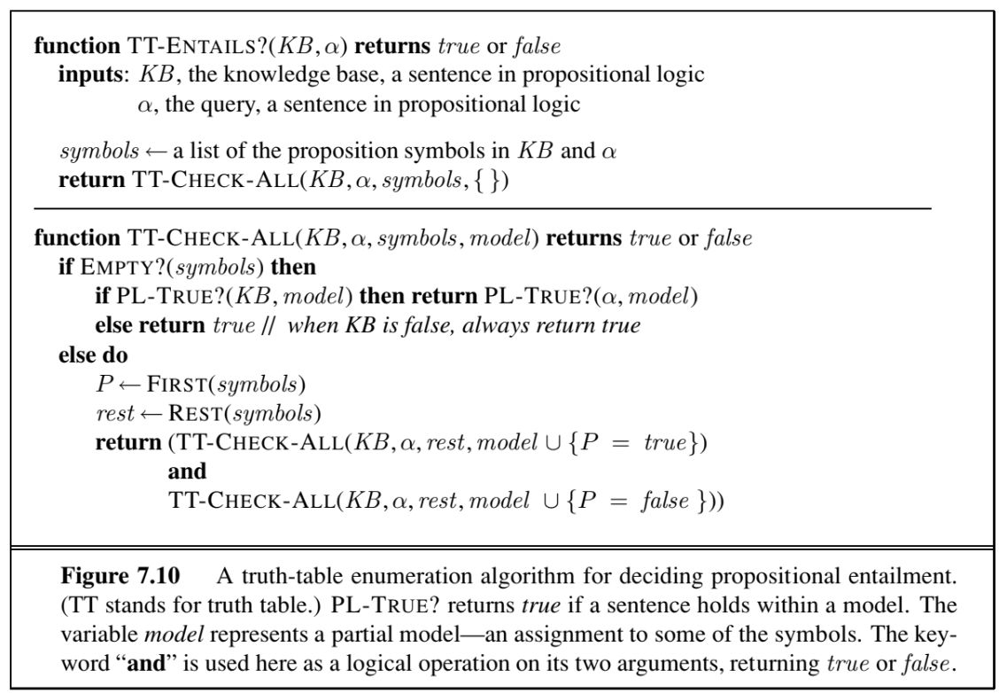

# Propositional Theorem Proving
## Logical Equivalence
Two sentences are logically equivalent $\text{iff}$ they are true in the same models:
$$
\alpha\equiv\beta\text{ iff }\alpha \models \beta \text{ and }\beta \models \alpha 
$$

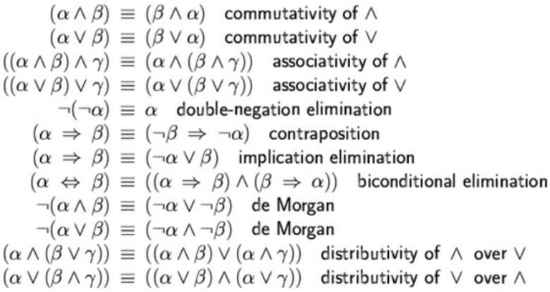


These equivalences can be used to modify sentences.

## Validity and Satisfiability
There are three types of sentences:
- **Valid:** Sentences that are always true. Also called *tautologies*.
    - Example: $A\lor\lnot A$ and $A\implies A$
- **Satisfiable:** Sentences that may or may not be true.
    - Example: $A\lor B$
- **Unsatifiable:** Sentences that are always false.
    - Example: $A\land\lnot A$

## Inference Rules for Propositional Logic

**Inference:** Deriving conclusions from inferences.

**Rules of Inference:** Templates for constructing valid arguments.

The inferencing rules that can be used to derive new sentences in propositional logic are described below:

all the given rules are of the form if $A$ and $B$ are given then $C$ is implied.

these can be rephrased as saying that if $A$ and $B$ are true then $C$ must also be $true$

**1) Modus-Ponens (Implication elimination):**
$$
\text{Given: }\alpha\implies\beta, \ \alpha
\\
\text{Inferred: }\beta
$$

**2) Modus-Tollens:**
$$
\text{Given: }\alpha\implies\beta, \ \lnot\beta
\\
\text{Inferred: }\lnot\alpha
$$

**3) Hypothetical Syllogism:**
$$
\text{Given: }\alpha\implies\beta, \ \beta\implies\gamma
\\
\text{Inferred: }\alpha\implies\gamma
$$


**4) Disjunctive Syllogism:**
$$
\text{Given: }\alpha\lor\beta, \ \lnot\alpha
\\
\text{Inferred: }\beta
$$

**5) Addition:**
$$
\text{Given: }\alpha
\\
\text{Inferred: }\alpha\lor\beta
$$

**6) Simplification:**
$$
\text{Given: }\alpha\land\beta
\\
\text{Inferred: }\alpha,\ \beta
$$

**7) Conjunction:**
$$
\text{Given: }\alpha,\ \beta
\\
\text{Inferred: }\alpha\land\beta
$$

**8) Resolution:**
$$
\text{Given: }\alpha\lor\beta, \ \lnot\alpha \lor \gamma
\\
\text{Inferred: }\beta\lor\gamma
$$

# Resolution
- Resolution yields a complete inference algorithm when coupled with any complete search algorithm.

- Resolution makes use of the inference rules.

- Resolution performs deductive inference.

- Resolution uses proof by contradiction.

- One can perform Resolution from a Knowledge Base.
    - Knowledge Base is a collection of facts or a database with all facts.

## Resoltion in Propositional Logic
- Resolution is one method for automated theorem proving.

- It is important to Artifical Intelligence because it helps logical agents to reason about the world.

- It helps them to prove new theorems and therefore helps them to add to their knowledge.

## Resolution Algorithm
- Resolution basically works by using the principle of proof by contradiction.
- To find the conclusion we should negate the conclusion.
- Then the resolution is appklied to the resulting clauses.
- Each clause that contain complementary literals is resolved to produce a two new clause, which can be added to the set of facts (if it is not already present).
- This process continues until one of two things happen:
    - There are no new clauses that can be added.
    - An application of the resolution rule derives the empty clause.

### Resolution Algorithm
- Input a knowledge base and an expression.
- It negates the expression, adds that to the knowledge base, and then finds a contradiction if one exits.
- If it finds a contradiction, then the negated statement is false.
- Therefore, the original statement must be true.

**Example:**

# Conjuctive Normal Form (CNF)
- Resolution algorithm 'resolves' clauses.
- In fact, it only applies to clauses.
- Each pair of clauses that contains complementary literals is resolved.
- Complementary literals have the property that one negates the other.
- Conjuctive normal form (CNF) is an approach to Boolean logic that expresses formulas as conjunctions of clauses with an AND or OR.
- Each clause connected by a conjunction, or AND, must be either a literal or contain a disjunction, or OR operator.
- CNF is useful for automated theorem proving.

## Procedure for converting to CNF
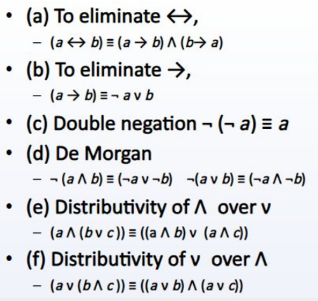

## Simple Resolution Algorithm for Propositional Logic.
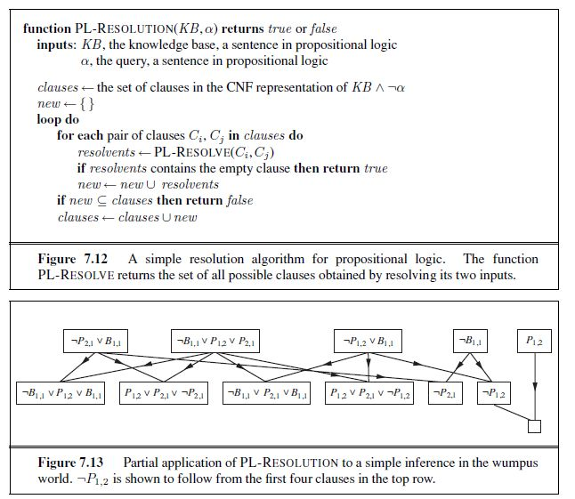

# Unification
- In propositional logic it is easy to determine that two literals can not both be true at the same time.
- In predicate logic, this matching process is more complicated, since bindings of variables must be considered.
- Therefore, in order to determine contradictions we need a matching procedure that compares two literals and discovers whether there exist a set of substitutions that makes them identical.
- There is a recursive procedure that does this matching called the Unification algorithm.
- In Unification algorithm, each literal is represented as a list, where first element is the name of a predicate and the remaining elements are arguments.
- The argument may be a single element (atom) or may be another list.

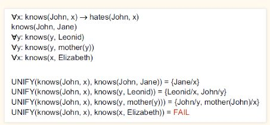

The Unification algorithm is listed below as a procedure `UNIFY(L1, L2)`
- It returns a list representing the composition of the substitutions that were performed during the match.
- An empty list NIL indicates that a match was found without any substitutions.
- If the list contains a single value F, it indicates that the unification procedure failed.
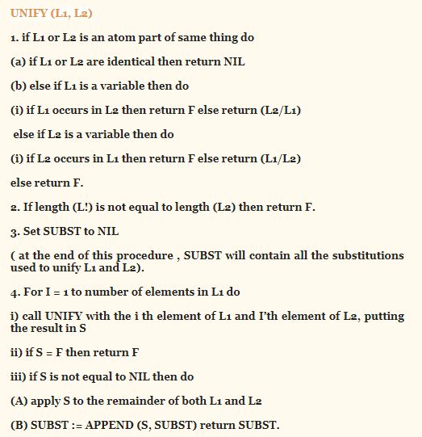

# First Order Logic
> Also called Predicate Logic or First Order Predicate Logic.

- Statements are represented usign propositional logic.
- In propositional logic, we can only represent the facts, which are either true or false.
- PL is not sufficient to represent the complex sentences or natural language statements.
- The propositional logic has very limited expressive power.
- First order logic in AI is a technique for knowledge representation and is robust enough to represent any natural language sentence.
- It is an extension of propositional logic and unlike it, it is sufficiently expressive in representing any natural language construct.
- It is a robust technique to represent objects as well as their relationships.

## Sapir-Whorf Hypothesis
- Revolves around the idea that language has power and can control how you see the world.
    - Langauge is a guide to your reality structuring your thoughts. It provides the frameword through which you make sense of the world.

## Ontological Commitments
Mathematically, expressed through the nature of the formal models with respect to which the truth of the sentences is defined.
- Propositional Logic
    - Propositional logic assumes that there are facts that either hold or do not hold in the world.
    - Each fact can be either true or false.
    - Each models assigns true or false to each propositional symbol.
- First-Order Logic
    - First Order logic assumes that the world consists of objects with certain relations among them that do or do not hold.
    - The formal models are correspondingly more complicated than those for propositional logic.

## Epistemological Commitments
