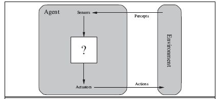
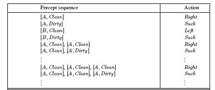
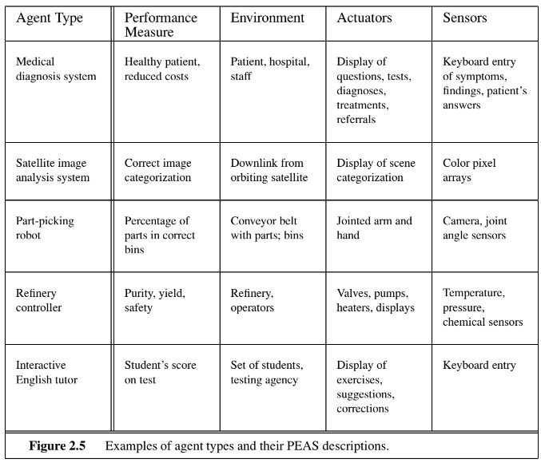

# Introduction
> Artificial Intelligence is the science of making machines that can think like humans.

- AI technology can process large amounts of data in ways, unlike humans.
- The **goal** for AI is to be able to do things such as recognize patterns, make decisions and judge like humans.
- How Artificial Intelligence Works:
	- It all starts with designing the AI to meet a specific goal.
	- From there, it is trained on available data as it learns how to best achieve the given goal.
	- When it reaches a level of learning, the AI then takes on the data independently.
	- Then, after analyizing all the data, AI makes predictions based on what it finds.
	- Going foward, it uses what it learns to improve its approach.

## Pros and Cons of Artificial Intelligence:
|Pros|Cons|
|:--:|:--:|
|Reducing human error|Higher overall costs|
|Allows for quicker decision-making|Job loss / replacements|
|Reduces the risk|Lacks the ability to be creative|
|Automates repetition|Emotional range isn't there|
|Assists with digital tasks|Inability to integrate ethical principles|

<font color=red>everything above this is fluff, i'll go through it later, continuing from chapter 2 now</font>
# Intelligent Agents
> An agent is anything that can be viewed as perceiving its environment through sensors and acting upon that environment through actuators.

Perception-action cycle:


- **Percept:** To refer to the agent's perceptual inputs at any given instant.
- **Percept sequence:** An agent's percept sequence is the complete history of everything the agent has ever percieved.
	- In general, an agent's choice of action at any given instant can depend on the entire percept sequence observed to date, but not on anything it hasn't percieved.
 
- **Agent function:** An agent's behaviour is described by the agent function that maps any given percept sequence to an action.
- **Agent program:** an independent program or entity that interacts with its environment by perceiving its surrounding via sensors, then acting through actuators or effectors.

### Agent function for Vacuum Cleaner problem
```psuedocode
function REFLEX-VACUUM-AGENT([location, status]) returns an action

if status = Dirty then return Suck
else if location = A then return Right
else if location = B then return Left
```

# The concept of rationality
> A rational agent is one that does the right thing.

- In the context of AI, the right thing can be measured by the success which can be measure by performance.
- Performance measure according to what is wanted in the environment instead of how the agents should behave.

- **Rationality depends on four things:**
	1. The performance measure that defines the criterion of success.
	2. The agent's prior knowledge of the environment.
	3. The actions that the agent can perform.
	4. The agent's percept sequence to date.
 
- For each possible percept sequence, a rational agent should select an action that is expected to maximize its performance measure, given the evidence provided by the percept sequence and whatever built-in knowledge the agent has.

- A rational agent knows the actual outcome of its actions and can act accordingly, but omniscience is impossible in reality.
- Rationality $\neq$ Omniscience:
	- An omniscent agent knows the actual outcome of its actions.
 
- Rationality $\neq$ perfection
	- Rationality maximizes *expected* performance, while perfection maximizes *actual* performance
 
- The proposed definition requires:
	- Information gathering / exploration
		- To maximize future rewards
	 
	- Learn from percepts
		- Extended prior knowledge
	 
	- Agent autonomy
		- Compensate for incorrect prior knowledge.
	 
### Tic Tac Toe Algorithm
- Create a board using a 2D array and initialize each element as empty.
- Write a function to check whether the board is filled or not.
	- Iterate over the board and return `false` if the board contains an empty sign or else return `true`.
 
- Write a function to check whether either player has won or not.
	- Check for all the rows, columns and two diagonals.
 
- Write a function to show the board as we will show the board multiple times to the users while they are playing.

- Write a function to start the game.
	- Select the first turn of the player randomly.
	- Write an infinite loop that breaks when the game is over (either win or draw)
		- Show the board to the user to select the spot for the next move.
		- Ask the user to enter the row and column number.
		- Check whether the current player has won the game or not.
		- If the current player won the game, then print a winning message and break the infinite loop.
		- Next, check whether the board is filed or not.
		- If the board is filled then print the draw message and break the infinite loop.
	 
	- Finally, show the user the final view of the board.
 
## Information Gathering
- Doing action in order to modify future percepts is an important part of rationality.
- It can be exemplified by the exploration that must be undertaken by an agent in an initially unknown environment.
- Why is information gathering important?
	- A rational agent not only requires to gather information but also to learn as much as possible from what it percieves
 
# Autonomy
> Independence

A system is autonomous if its behaviour is determined by its percepts (as opposed to built-in prior knowledge)

A system without autonomy lacks flexibility.

## Importance of autonomy
A rational agent should be autonomous - It should learn what it can to compensate for partial or incorrect prior knowledge.

## The nature of environments
Correct problem identification is task environments, which are essentially the "problems" to which rational agents are the "solution."

In designing an agent, the first step must always be to specify the task environment as fully as possible.

**PEAS (Performance, Environment, Actuators, Sensors)**



### Types of environment in AI
- Fully Observable / Partially Observable
- Deterministic / Non-Deterministic
- Episodic / Non-episodic (Sequential)
- Static / Dynamic
- Discrete / Continous
- Single Agent / Multiple Agents

#### Fully Observable / Partially Observable
- An agent's sensors give it access to complete state of the environment at each point in time, then we say that the task environment is fully observable.
	- otherwise, it is partially observable.
 
- Examples:
	- Chess is fully observed: A player gets to see the whole board.
	- Poker is partially observable: A player gets to see only his own cards, not the cards of everyone in the game.
 
#### Deterministic / Non-Deterministic
If the next state of the environment is completely determined by the current state and action of the agent, then the environment is deterministic. Otherwise it is non-deterministic.

- Examples:
	- Tic Tac Toe is Deterministic
	- Self-driving vehicles are Non-Deterministic.
 
#### Episodic / Non-Episodic (Sequential)
The agent's experience is divided into atomic "episodes" (each episode consists of the agent perceiving and then performing a single action) and the choice of action in each episode depends only on the episode itself. Episodic environments are much simpler because the agent does not need to think ahead.

Sequential if current decisions affect future decision, or rely on previous ones.

Examples:
- Mail Sorting system is Episodic.
- Chess is Non-Episodic.

In other words: In an episodic task environment, the agent's experience is divided in to atomic episodes. In each episode the agent receives a percept and then performs a single action.

#### Static / Dynamic
If the environment does not change while an agent is acting, then it is static; otherwise it is dynamic.

or

An environment is static if only the actions of an agent modify it. It is dynamic on the other hand if other processes are operating on it.

- Examples:
	- Static: 2+2=4 will remain same and never change <font color=red>give example of an agent, not this crap.</font>
	- Dynamic: Football game, other players make it dynamic.
 
#### Discrete / Continous
**Discrete:** If there are a limited number of distinct, clearly defined, states of the environment, the environment is discrete.

e.g. A game of chess or checkers where there are set number of moves.


**Continous:** Signals constantly coming into sensors, actions continually changing.

e.g. Car Self-Driving System