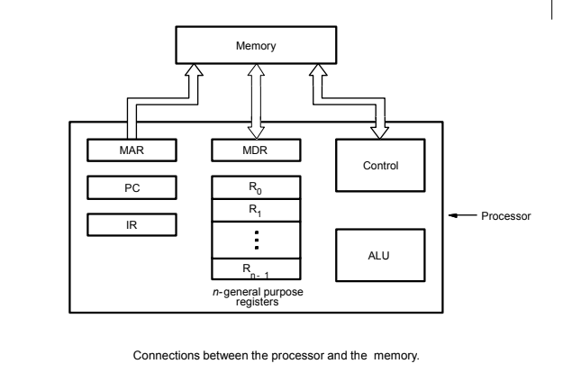

# Introduction
\<insert image of the memory , IO, and CPU being connected to an "intercommunication network">

## Three basic instruciton types:
- `LOAD` instruction
	- Memory / Input device to processor register.
 - `STORE` instruction
	 - Processor register to memory / Input Device.
- `OPERATE` instruction
	- Perform an arithmetic / logic operation on data operands in processor register.
 
## Basic Operational Concepts




- **MAR:** Memory Address Register
- **MDR:** Memory Data Register
- **PC:** Program Counter: Register which holds the memory address of the current instruction.
- **IR:** Instruction Register: Holds the current instruction.
- **General Purpose Register:** Holds the data and addresses (R~0~, R~1~, ...)
- Control Circuits and ALU fetch and execute instructions.

**Example:**
```asm
LOAD R2, LOC
```
1. Send address in PC to memory; issue Read.
2. LOAD instruction from memory to IR.
3. Increment PC to point to next instruction.
4. Send address from LOC to memory; issue Read.
5. LOAD word from memory into register R2.

**Role of PC:**
The Program Counter holds the address of the instrution to be executed next. To begin execution of the program, the address of its first instruction must be placed into RC.

**Role of IR:**
Used to hold the instruction which is currently being executed. The contents of the IR are available to the CU, which generate the timing signals that control various prcessing elements involved in executing the instruction.


**Another Example:**

## Logical Left Shift Instruction
General Syntax:
```asm
LShiftL, Ri, Rj, Count
```

## Logical Right Shift Instruction
General Syntax:
```asm
LShift Ri, Rj, Count
```