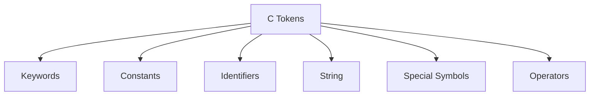
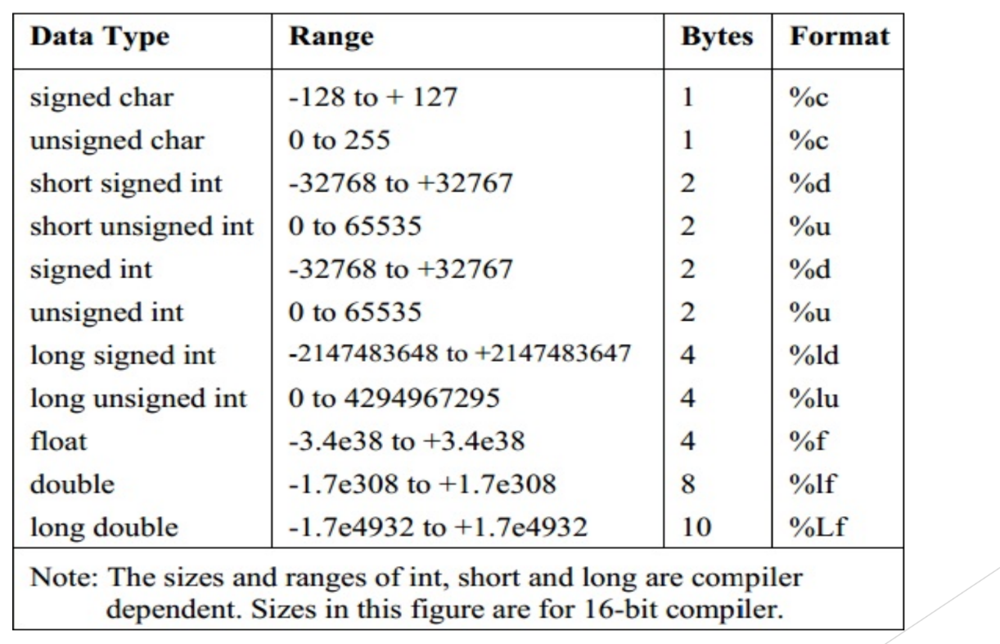
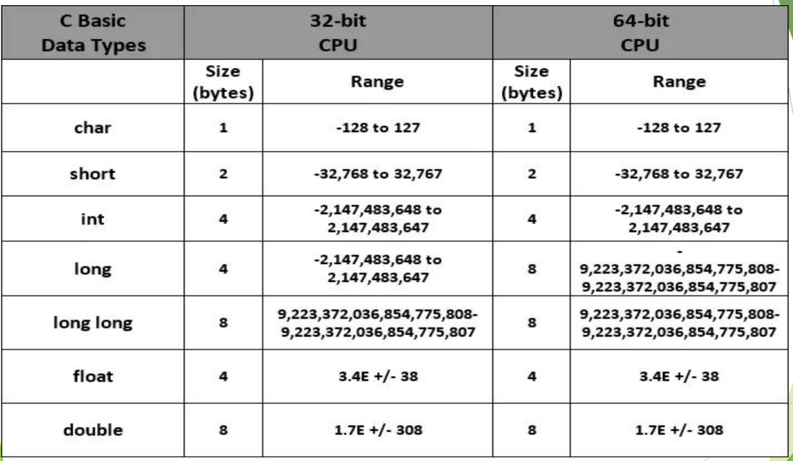
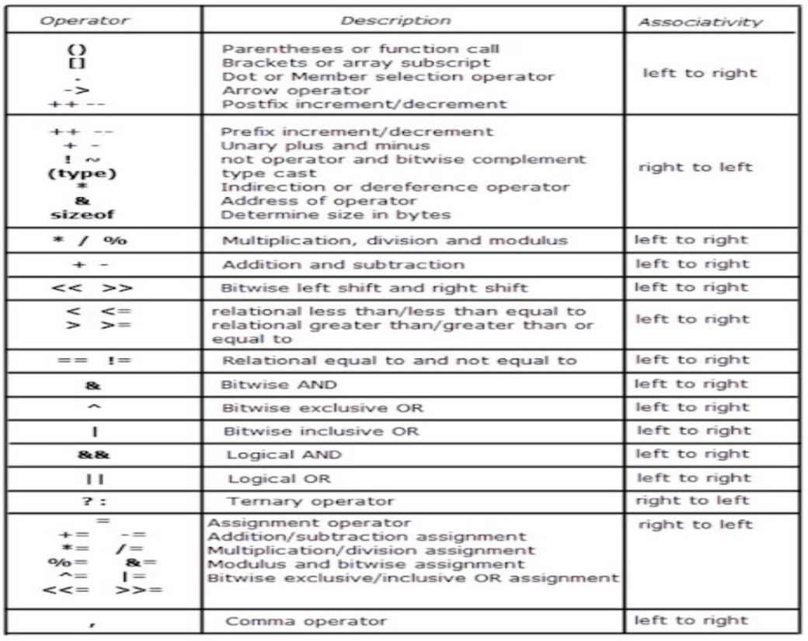

# 1) History
- created by Dennis Ritchie at the AT&T Bell Laboratories in 1972.

### Difference b/w C and C++
- C++ was developed as an extension of C, and both languages have almost the same syntax
- The main difference between C and C++ is that C++ support classes and objects, while C does not

### Basic Structure of C Programming
```c
Preprocess Directives //Libraries
Global Declarations
var main(){
	local declarations;
	statements;
}
```
# 2) Tokens
Token is the smallest unit of a C program. It is a meaningful word formed by a sequence of characters.

Valid characters in C are:
- Alphanumeric Characters: a-Z + 0-9
- Special Characters: . , ; :
- White Spaces: \<tab>, \<blank_space>, \<carriage_return>



## 2.1) Keywords
- pre-defined words that have fixed meanings.
- lowercase only
- These are instructions given to the compiler.
- There are 32 keywords in C Programming:
```c
auto double int struct break do
else long switch goto sizeof if case enum register
typedef default char extern return union volatile const float short unsigned while
continue for signed void static
```
## 2.2) Indentifier (Variables)
- User defined names and do not have any meaning prior to this.
	- names of variables, functions and arrays as defined by the user.
- Rules for identifier names:
	- First character must be an alphabet or an underscore (`_`)
	-  Remaining characters can be alphabet, digits or underscore
	-  Cannot contain special characters or white spaces.
	-  Cannot use the same name as keywords.
	-  Cannot have two successive underscores (`__`)
	-  Max length is 31 characters.

### Variables
- Name given to memory location whose value changes
- Variables must be declared before they can be used as `data_type var_name1,var_name2... = value;`
	- giving a value is optional
	- more than one variable can be defined by seperating variable names by commas.
- This step is called assignement of values / initialization of variable.
- Here, var_name is the name given to the memory location where the value will be stored.
- 
- To output these variables we cannot do `printf(variable_name)` and must use format specifiers instead.
- When we declare a variable without giving value, after reserving the memory and naming it `var_name` it stores some value (not empty) known as **Garbage Value.** 

## 2.3) Data Types
- Specifies the type and size of information a variable will store.
- Three main classes of Data types:
	- Primary (Built-In)
	- Derived: Array, Pointer, functions, structures, etc.
	- User-Defined: enum, Typedef, etc.

|Data Type|Size|Description|Example|
|:----:|:----:|:----:|:----:|
|int|2 or 4 Bytes|Whole Numbers|2|
|float|4 bytes|Decimal upto 6 Decimal Places|1.000000|
|double|8 bytes|Decimal upto 16 Decimal Places|1.000000000000000|
|char|1 Byte|Single Character/Letter/Number, or ASCII values|'A'|
|void|No Value|Used mainly to specify type of function to return no value|

### 2.3.1) `int` Data Type
- Maximum Value
	- 16-bit machine: -32768 to 32767
	- 32-bit machine: -2,147,483,648 to 2,147,483,647
- Out of n-bits, 1 bit is reserved for the sign while the other (n-1)-bits is reserved for the magnitude of the number,
- We can also specify `long` and `short` keywords to change <font color=red>something.</font> along with signed or unsigned form <font color=red>How?</font>.
- There are classes of integers:

|Unsigned|Signed|
|:----:|:----:|
|short int (1B)|signed short int (1B)|
|int (2B)|signed int (2B)|
|long int (4B)|signed long int (4B)|

### 2.3.2) `char` Data Type
- Used to store a **single** character.
- Must be in **single quotes**
- Can be used in the form of ASCII values as well:
`printf("%c",'A');` and `printf("%c",65);` will both print `A`
- using the `%d` format specifier will output its ASCII value.
`printf("%d",'A');` will output `65`

**Note:** If you try to store more than a single character, it will only print the last character.
`printf("%c", 'AB');` will print `B`

### 2.3.3) `float` and `double` data type
- Used to store decimal point nuimbers which can also be expressed in fractional or expotential form.
- A floating point number can also be a scientific number with an "e" to indicate the power of 10:
`printf("%f", 2e1);` will print `20.000000`

- To set precision we use a dot followed by a number in the format specifier. (Default is 6 for float and 16 for double)
`printf("%.1f", float);` will show 1 number after decimal place.
- There also exists a long double type which takes 10Bytes of space.
<font color=red>check how float (decimal) is stored in system language (binary)</font>


### 2.3.3) Strings
- One dimensional array of characters terminated by null `'\0'` which is introduced by the compiler itself.
- Written inside double quotes **only**, single will not work
	- <font color=red>Not sure why</font>
- Can be manipulated with many built-in functions like `strcpy` and `strlen`

### 2.3.4) Constants
- data values that cannot be changed during the execution of a program

<font color=red>Check what is the benefit to using a constant when compared to variables apart from readability</font>
- C can have the following types of constants:
	- int
	- char
	- float
	- bool
	- str
- Constants can be defined in one of 2 ways:
1) Using `#define` in the header:
```c
#define const_name value
```
2) Using `const` keyword
```c
const data_type var_name = value;
```
## 2.3.5) Type Conversion
- 2 Types of conversion in C:
 	- Implicit (Automatically)
 	- Explicit (Manually)
- Implicit: Occurs when assigning a value of one type to another.
 ```c
float x=9;
printf("%f", x); 
//9.000000
```

```c
int x=9.999999999999;
printf("%d",x);
//9
```
**Note:** for the case of division, at least one term must be a float / double otherwise the result will be an int converted to float which will essentially truncate the decimal part and give X.000000
- Explicit: is done manually by placing paranthesis `()` in front of the value.
Example:
```c
int x,y
div=(float) x/y;

```
# 3) Some common functions
## 3.1) `printf()` function
- function used to output (print) data.
- String must **only** use double quotation marks, single does not work. <font color=red>(Dunno Why)</font>
- Does **not** insert new line (`\n`) at the end of output.
- Specific format specifier is used depending upon the type of data to be printed.

### Format Specifier
- Basically, a placeholder for some value.
- starts with `%`, followed by a character.
- Value mentioned doesn't have to be a variable and can just be the value itself so long as it is the correct data type.

|Data Type|Format Specifier|
|:---:|:---:|
|int|`%d` or `%i`|
|float|`%f` or `%F`|
|char|`%c`|
|double|`%lf`|
|string|`%s`|

**Note:**
The compilers render both float and double as 6 values after the decimal. To identify the difference take b = 6.68756321456 and use `%.10f` and `%.10lf`. In case of float only 6 digits after decimal will be correct after which there will be garbage values. However with double all the 10 digits after the decimal will be correct.
## 3.2) `scanf()` function
- Function used to recieve input from the user.
- Uses the same format specifiers.
## 3.3)  `sizeof()` operator
- used to get the size (in bytes) of a data type or variable
- The memory size refers to how much space a type occupies in the computer's memory.
- While printing the value returned by `sizeof()` operator we should use `%lu` format specifer to print the result, instead of %d.
	- It is because the compiler expects the sizeof operator to return a long unsigned int (%lu), instead of int (%d). On some computers it might work with %d, but it is safer to use %lu.

### Comments
- Single Line Comments start with `//`
- Multi-Line Comments must start and end with `/*` and `*/` respectively.

# Operators
- An operator is the symbol that tells the computer to perform certain mathematical or logical operations.
- Used to evaluate data and variables.


## Operands
- The data (variable / constant) that is operated upon.
- Example `a` and `b` in `a+b`

## Expression
- A sequence of operands and operators that reduce to single value is an expression.

## Classification of Operators
### Based on number of Operands:
|Unary|Binary|Ternary|Special|
|:---:|:---:|:---:|:---:|
| `-a`,`a++`, `a--`, etc.|`a+b`, `a-b`, etc.|`?` and `:`, etc.|comma `,`, `sizeof()`, etc.|
### Based on type of Operation.
- Arithmetic
- Relational
- Logical
- Assignment
- Increment / Decrement
- Conditional
- Bitwise
- Special

### Increment & Decrement operator
They can be either pre or post operations.
e.g.
- `y=--x` or `y=++x` translates to
	- Firstly, `x=x-1` or `x=x+1`
	- Then, `y=x`
- `y=x--` or `y=x++` translates to:
	- Firstly, `y=x`
	- Then, `x=x-1` or `x=x+1`
**Note:** The operand **must** be a variable, increment / decrement cannot be applied to a constant or expression.

### Arithmetic Operators
- 5 Arithmetic Operators;
	- `+`
	- `-`
	- `*`
	- `/`
	- `%`
- Primarily 3 types:
	- Integer
		- When both operands are integer.
	- Real <font color=red>// here, they have used float to mention real. Check what "real" actually means coz int is also real, mathematically.</font>
		- Involves only real operands
		- % cannot be used with real operands
	- Mixed Mode
		- One operand is integer and the other is <font color=red>"</font>real<font color=red>"</font>.

### Relational Operators
- Returns `1` when true and `0` for false.
- 6 Operators:
	- `<`
	- `>`
	- `<=`
	- `>=`
	- `==`
	- `!=`

### Logical Operators
- Used when we wish to test multiple conditions.
- Used for combining multiple simple conditions to form a complex condition.
- There are 3 Operators:

|AND|OR|NOT|
|:---:|:---:|:---:|
|`&&`|`\|\|`|`!`|

### Assignement Operator
- In C, `=` is an assignment operator with the syntax:
```c
var <operator>= expression
```
Here \<operator> can be any arithmetic operator.
**Note:** C also supports multiple assignment so `a=b=c=10` is valid.

### Conditional Operator (Ternary)
```c
var = <expression>?Val_True:Val_False
```
here,
`<expression>` is the relational expression
`Val_True` is the assigned value if the expression evaluates to true (non-zero)
`Val_False` is the assigned value if the expression evaluates to false (zero)

### Bitwise Operators
- Help in performing bit level operations
- There are 6 Bitwise Operators:

|Bitwise AND|Bitwise OR|Bitwise XOR|Bitwise Complement|Bitwise Left Shift|Bitwise Right Shift|
|:---:|:---:|:---:|:---:|:---:|:---:|
|`&`|`\|`|`^`|`~`|`<<`|`>>`|
- Left / Right Shift operators shift all bit towards the respected direction by a specific number of bits as:
`num >> bits` will shift all bits of binary num, bits places to the right.
	- e.g. `4 << 1` is `8`
- Complement is the two's complement and **not** the one's complement
	- One's complement: Invert all bits
	- Two's Complement: one's complement + 1
	- Therefore, for any integer, `n`bitwise complement = `-(n+1)`
		- e.g. `~35 = -36`

### Special Operators
- We have four special operators
	- Comma operator (,)
	- sizeof() operator
	- Address Operator (&)
	- Dot Operator (.)

Comma operator is used to link related expressions together. e.g. `int a,b,c`

sizeof() operator returns the size of an operand. Mainly used to determine length of arrays, structures, etc.

## Operator Precedence and Associativity
An arithmetic expression without parenthesis will be evaluated from left to right using PEMDAS / BODMAS. (% is the same as /)

|Operator|Description|Associativity|Precedence (Rank)|
|:---:|:---:|:---:|:---:|
|`()`<br>`[]`|Function Call<br>Array Element Reference|Left to Right|1|
|`+`<br>`-`<br>`++`<br>`--`<br>`!`<br>`~`<br>`*`<br>`&`<br>`sizeof()`<br>`(type)`|Unary Plus<br>Unary minus<br>Increment<br>Decrement<br>Logical Negation<br>Ones Complement<br>Pointer to reference<br>Address<br>Size of an Object<br>Type cast (conversion)|Right to Left|2|
|`*`<br>`/`<br>`%`|Multiplication<br>Division<br>Modulus|Left to right|3|
|`+`<br>`-`|Addition<br>Subtraction|Left to Right|4|
|`<<`<br>`>>`|Left Shift<br>Right Shift|Left to Right|5|
|`<`<br>`<=`<br>`>`<br>`>=`|Less than<br>Less than or equal to<br>Greater than<br>Greater than or equal to|Left to Right|6|
|`==`<br>`!=`|Equality<br>Inequality|Left to Right|7|
|`&`|Bitwise AND|Left to Right|8|
|`^`|Bitwise XOR|Left to Right|9|
|`\|`|Bitwose OR|Left to Right|10|
|`&&`|Logical AND|Left to Right|11|
|`\|\|`|Logical OR|Left to Right|12|
|`?:`|Conditional / Ternary Operator|Right to Left|13|
|`=`|Assignement Operators|Right to Left|14|
|`,`|Comma operator|Left to Right|15|