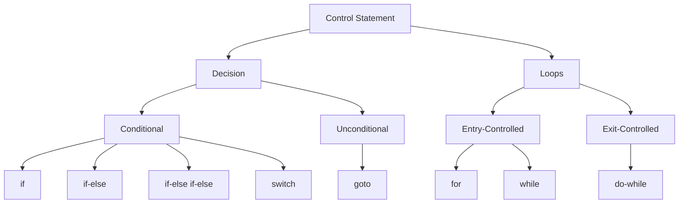

# Decision Control
## If Statements
```c
if (condition1){
	Statement1
}
else if (condition2){
	Statement2
}
else{
	Statement3
}
if (condition3){
	Statement5
}
```
Here the compiler will first check for `condition1` if true it will continue to `Statement1` and skip to the next `if` statement

Otherwise it will keep checking the else if statements until the condition is satisfied. If none of else if statements satisfy the conditions then the else block will get executed

After all this the next if statement will be checked irrespective of whether the prior if-else if-else block was executed or not.

**Note:** Curly brackets are not required for single line statements but I would recommend putting them anyways to avoid the confusing the compiler (Dangling -else problem).
Otherwise you can specify else for each if statement.
```c
if (cond_1)
	statement1;
	if (cond_2)
		statement2;
	else //which if is this for?
		statement3;
```

## Switch Statement
- Multiway decision statement
- Best used when number of cases increases to avoid writing a long if-else if ladder.
- `switch` tests the value of a given expression against a list of case values and when a match is found a block of statement associated with that case is executed.

**Note:** here `break` statement must be used accordingly depending on whether we wish the expression to keep being checked or not.

If the break statement is not used then every case from the matched case label till the end of the switch, including the default is executed.
```c
switch(expression){
	case case1:block1;
		break;
	case case2:block2;
		break;
		....
			case casen:blockn;
		break;
	default:block;
}
```

here default is executed if none of the cases match the expression.

Note the following:
- the `expression` is an integer expression or characters
- The `case1`, `case2`... are constants or constant expressions which evaluate to integer constants.
- There is no need to put braces around these blocks. Note that case labels end with colon (`:`)

# Loops
Loops execute the sequence of statements many times until the stated condition becomes false.

A loop consists of two parts; the body and a control statement. The control statement is a combination of some conditions that direct the body of the loop to execute until the specified condition becomes false.

Three important concepts of any loop are:
1. Initialization
2. Test Condition
3. Updating loop control values.

**Differences between all 3 loops:**

- Entry and Exit controlled loops are also called pre-test and post-test loops respectively.

|for|while|do while|
|:---:|:---:|:---:|
|The initial value is only performed once, the the condition tests and compares the counter to a fixed value after each iteration, stopping when the specified value is not satisfied.|Condition is evaluated before process a body of the loop. If a condition is true then and only then body of a loop is executed.|The condition is always executed after the body of the loop.|
|Used when execution is to be made fixed number of times(no. of iteration is known)|Used when condition is important(no. of iteration not known)|Used when process is important(no. of iterations not known)|
|Executed if and only if condition is true|Executed if and only if condition is true|Executed at least once even if the condition is false|

## While Loop
```c
while (condition){
	statement-block;
}
```
- The body of the loop is only executed if the test condition is true.
- After execution of the body, the test condiition is evaluated again and if true, the body gets executed again.
- This process is repeated until the condition finally becomes false and control comes out of the body of the loop.

## Do While Loop
```c
do{
	statement-block;
} while(condition);
```

- Body of the loop is executed first and then the test condition is evaluated. If the condition is true then the body is executed again. 
- This process continues as long as condition is true. When condition becomes false, the loop will be terminated and control comes out of the loop.

# For Loop
```c
for (initialization; test-condition; updation){
	statement-block;
}
```
- Here, the head of the loop contains all three components: initialization, condition, updation.
It follows the following flow of execution:
1. First the control variable is initialized.
2. The value of the control variable is tested using the test condition.
3. If condition is true, body of the loop is executes else it is terminated.
4. If loop is executed, then control variable wil be updated as per `updation`, then the condition is checked again.

In for loops, both `i++` and `++i`  are treated as pre-increment.

# Break, Continue and GoTo:
- break and continue are unconditional control constructs.
## break
- terminated the execution of remaining iteration of the loop.
- Works with looping and switch statements

## continue
- Terminates only the current iteration of the loop
- Used in loops.

## goto
```c
// Forward Jump
goto label;
....
label:
	statement;
```

can also be used as:
```c
// Backward Jump
label:
	statement;
....
goto label;
```
the goto statement breaks the normal flow of execution in the program.