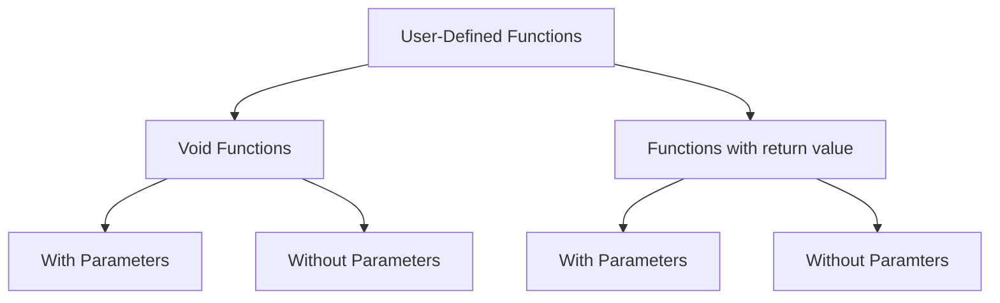

# Introduction
- A block of code to perform a specific task.
- main() function is necessary. All programs start execution from main function.
- Advantages:
	- Makes program modular
		- More readable
		- Easier Maintenance
		- Debugging easier
	- Reusability
	- Data protection
- Function Types
	- Built-in (Library)
	- User-Defined
## Function Declaration
- Every function in C should be declared before they are used.
- Function declaration gives compiler information about:
	- Function name
	- Type of argument to be passed
	- return type
```c
return_type func_name(parameters);
```

## Function Call
- A function is called by specifying its name followed by parenthesis containing the arguments (if any), seperated by commas.
```c
func_name(arguments);
```

## Function Definition
- Contains the programming codes to perform the specific task.
```c
return_type func_name(parameters){
	variable declarations;
	statements;
	return value;
}
```

## Parameters vs Arguments
|Actual Parameters|Formal Parameters|
|:----:|:----:|
|Used in function call|Used in function header|
|Can be constant, variable or expressions|Can only be variables|
|send values to parameters|recieve values from arguments|
|address can be sent to parameters|if parameters contain address they should be declared in pointers|

The number, type and order of paramters and arguments should always match.

## Location of Functions
- Refers to the placement of function definition with respect to the main() function.

### Method 1
Function definition before main().

Therefore, no need for function declaration or prototype. It is considered "poor style" to omit function prototype even if it is not technically necessary <font color=red>why?</font>
```c
#include <stdio.h>
return_type func_name(parameters){
	statements
}
void main{
	statments
}
```

## Method 2
Function definition placeed after main() program.

Therefore we require a function prototype in order to assist C compiler for type checking and function call location with respect to function definition.
```c
int addition (int, int); //Here we only mention the type and not the variables themselves

void main(){
	statements;
}

int addition(int a, int b){
	statements;	
}
```

## Categories of Functions


## Inter-function communication
Two functions can communicate with each other by two methods
- Passing arguments as values (Pass by value)
- Passing arguments as address (Pass by address)
### Pass by Value
- the function sends a copy of the arguments to the function
- This change does not affect the actual value
```c
// Swapping (Pass by Value)
void swap(int x,int y){
	int temp=x;
	x=y;
	y=temp;
}

void main{
	int a=5, b=10;
	swap(a,b);
	printf("%d %d",a,b); //output: 5 10
}
```

### Pass by address
- Function sends the address of arguments to the function.
- This change affects the actual value.
```c
// Swapping (Pass by Address)
void swap(int *x, int *y){
	int temp=*x;
	*x=*y;
	*y=*x;
}

void main(){
	int a=5, b=10;
	swap(&a,&b);
	printf("%d %d",a,b); //Output: 10 5	
}
```
# Return Statement
- return statement is used in a function to return a value to the calling function.
- After the execution of the first return statement, the function is terminated.
- Therefore the return function can be used in two ways
	- We can use it to terminate the execution of the function when it does not return any value by `return;`
	- We can use it to return a value with function calls by `return expression;`

