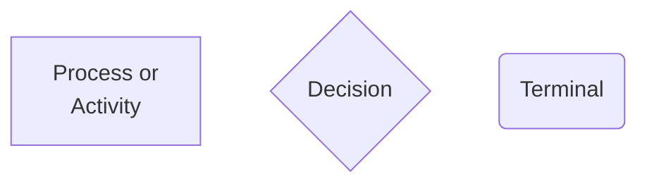

**Note:** All this isn't applicable in real word applications and will not make sense without the context of the IIT-M DS Course.

## Check
- Why index starts from 0.

# Flowcharts


# Data Types:
## Reason For Typing:
- Identify errors as early as possible - saves cost, effort,
- In general, compilers cannot check whether a program will work correctly.
	- Proved by Alan Turing - Halting Problem
- With variable declarations, compilers can detect errors at compile time - static analysis.
	- Dynamic Typing would only catch these errors at Runtime.
	- Executing code also slows down due to simultaneous monitoring for type correctness.
- Compilers can also perform optimazations based on static analysis.
	- Reorder statements to optimize reads and writes.
	- Store previously computed expressions to re-use later.
- Therefore, types have many uses:
	- Making sense of arbitrary bit sequences in memory.
	- Organizing concepts in our code in a meaningful way.
	- Helping compilers catch bugs early, optimized compiled code.
- Some languages also support automatic type inference.
	- Deduce the type of the variable statically, based on the context in which they are used.
	- if the inferred type is consistent across the program, all is well.
## 1) Boolean
- Value in the form of **TRUE** or **FALSE**
- Logic Operations Valid: (Result = Boolean)
	- AND
	- OR
## 2) Integer
- Value is integer
- Arithmetic Operations Valid: (Result = Integer)
	- $+$
	- $-$
	- $\times$
	- $\div$
- Comparitive Operators Valid: (Result = Boolean)
	- $>$ & $\geq$
	- $<$ & $\leq$
	- $=$
### i) Date
- Range of Values from 0 to 365
	- 0 $\longrightarrow$ 1 Jan
	- 1 $\longrightarrow$ 2 Jan
	- $\vdots$
	- 59 $\longrightarrow$ 29 Feb
- `print` Operation converts integer back to readable (String) form
- Comparitive Operators Valid: (Result = Boolean)
	- $>$ & $\geq$
	- $<$ & $\leq$
	- $=$
### ii) Float
- Multiplies fractional values by $10^n$ where $n$ = no. of number of digits after the decimal point to convert to integer value
- `print` Operation converts integer back to decimal form in the form of **String**
- Arithmetic Operations Valid: (Result = Integer)
	- $+$
	- $-$
	- $\times$ & $\div$ Operations do not make sense
- Comparitive Operators Valid: (Result = Boolean)
	- $>$ & $\geq$
	- $<$ & $\leq$
	- $=$
### iii) SeqNo
- Value from 0 to a Max value that is defined.
- No Arithmetic Operation make sense
- Comparitive Operators Valid: (Result = Boolean)
	- $>$ & $\geq$
	- $<$ & $\leq$
	- $=$
### iv) Marks / Count
- Range from 0 to 100 (for count max can be defined as something else)
- Arithmetic Operations Valid: (Result = Integer)
	- $+$
	- $-$
	- $\times$ & $\div$ Operations do not make sense
- Comparitive Operators Valid: (Result = Boolean)
	- $>$ & $\geq$
	- $<$ & $\leq$
	- $=$
## 3) Character
- Values include **alphanumeric characters** along with **special characters**
- Only Comparitive $=$ Operator Valid (Result = Boolean)
- Subtype: Gender
## 4) String
- Value is a sequence of characters.
-  `in` Logic Operator valid (Result = Boolean)
- Only Comparitive $=$ Operator Valid (Result = Boolean)
### i) Name / City
- Strings with no numeric or special characters.
- Only Comparitive $=$ Operator Valid (Result = Boolean)
### ii) Words
- Strings with alphanumeric and some special characters ( . , ; : ...)
### iii) Category
- Can only take one value out of predefined values
- **e.g.** "Noun", "Verb", "Adjective" etc. 

## 5) Record / Struct / Tuple / Class
- Contains multiple elements each having a Name and Datatype
- each element is called a field

## 6) Lists
- Sequence of Data Elements (Records)
- **e.g.** a list of records

**Note:** A record is equivalent to 1 card from the dataset
**Note:** A list is equivalent to the whole dataset itself

# Pseudocodes
- Basically Python Code but with sentences
**Note** Curly Brackets are used in place of indentation {}
```Python
Count=0
while (Pile 1 has cards) {
	Pick a card X from Pile 1
	Move X to Pile 2
	Increment Count by 1
}
```

**Note:** `return()` exits the program / procedure and returns the value specified as parameter.

# Styles of programming:
- Imperative
	- How to compute?
	- Step by Step instructions on what to do
- Declarative
	- What the computation should produce?
	- Often exploit inductive stucture, express in terms of smaller computations.
	- Typically avoid using intermediate variables.
	- Combination of smaller transformation - functional programs.
- Examples:
	- ```python
	  #imperative
	  def sumlist(l):
		mysum = 0
		for x in l:
			  mysum += x
		return
	  ```
	- ```python
	  #declarative
	  def sumlist(l):
		if l=[]:
			return 0
		else:
			return(l[0]+sumlist(l[1:]))
	  ```

# Memory Management
- Scope of a variable refers to the region within which a variable is accessible.
- Lifetime of a variable refers to the time during which a variable's storage remains allocated.
- Accessing variables can be done with 2 main ways:
	- Call by Value
		- Here the value of the variable is copied.
		- Changing the value of the copied variable will NOT change the original variable.
	- Call by reference
		- Here the address of the variable is copied.
		- Therefore, here the result is that two variable will now point to the same memory location.
		- Therefore, changing the value of one variable will also change the other since it is pointing to the same object.
- Activation records for functions are maintained as a stack.
	- Control Link points to the previous activation record.
	- Return value link tells where to store the result.
- Heap is used to dynamically store allocated data.
	- Outlives activation record of function that created the storage,
	- Need to be careful about deallocating the heap storage,
	- Two ways to deallocate the heap storage.
		- Explicit Deallocation
		- Automatic Garbage Collection