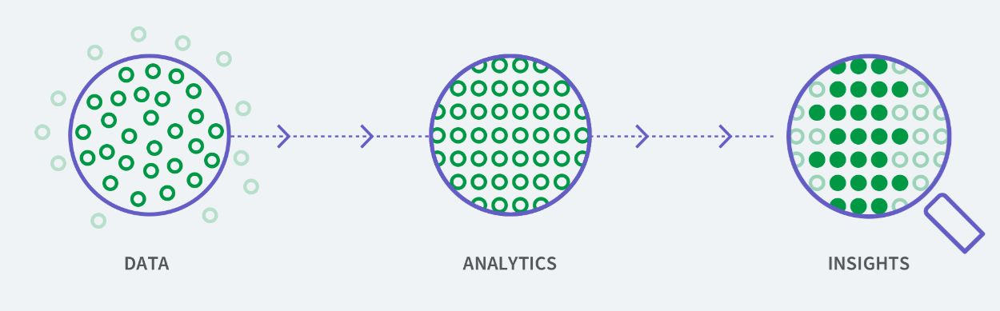
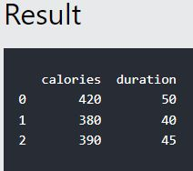
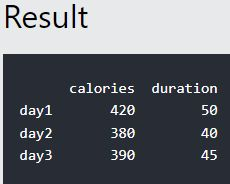
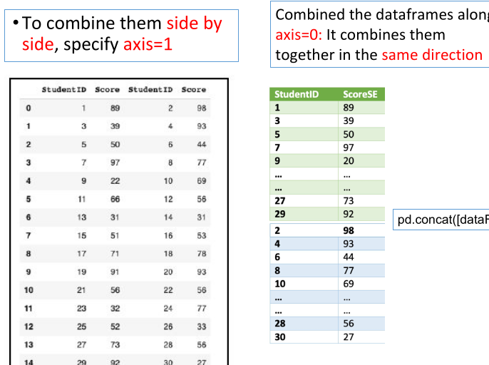

# Introduction
- **Data** is a collection of numbers, words, events, facts, measurements, observations or even description of things.
- Such data is collected and stored by every event or process occuring in several disciplines.
- A **Dataset** is a set or collection of data. This set is normally presented in a tabular pattern.
	- Here columns denote attributes/variable/features while rows denote samples.
 
## Types of Data
- **Structured Data:** Data that has a standardized format. It is typically tabular with rows and columns that clearly define data attributes.
	- Associated with relational databases, CSV / XLSX files.
- **Semi-Structured Data** Form of strctured data that does not obey the tabular structure of data models associated with realtional databases or other forms of data tables.
	- Nonetheless, it contains tags or other markers to seperate semantic elements and enforce hierarchies of records and fields within the data.
		- XML
		- JSON
		- PDF
		- Email
	 
- **Unstructured Data / Information:** Information that either does not have a pre-defined data model or is not organized in a pre-defined manner.
- Typically text-heavy:
	- Documents
	- Web Pages
	- Short Text (e.g. social media)
 
- **Streaming Data:** Data that is continously generated by different sources. Such data should be process incrementally using stream process techniques without having to access all of the data.
	- Continous flow of real-time information
		- Stock Trades
		- Weather Data
		- Social Media
		- Video Streaming
	 
	- Streaming data can be structured, unstructured or semi-structured. It can vary in volume, velocity and varierty.
 
## Eploratory Data Analysis (EDA)
- A set of procedures for examining the data.
- Summarizing the data with the help of descriptive and graphical tools.
- "No Assumption" study of data.
- Determining the relationships among variables.
- Handling missing values.
- Data analytics is the process of analyzing raw data in order to draw information and make conclusions about the data.
- EDA exposes trends, patterns, and 
 relationships within the dataset that may not be apparent.
- EDA is generally classified into two methods:
	- Graphical Analysis.
	- Non-Graphical Analysis.
 
## Data Insight
> refers to the process of collecting, analyzing and acting on data.


- When people talk about data insights, they are usually referring to three core components:



## Data Analytics
- Analytics is the use of tools and processes to combine and examing sets of data to identify patterns, relationships and trends.
- The goal of analytics is to answer specific questions, discover new insights and help make better data driven decisions.

### Insight
> The broad definition of insight is a deep understanding of a situation (or person or thing)

In the context of data and analytics, the word insight refers to an analyst or business user discovering a pattern or a relationship between variables that they didn't previously know existed.

### Example of Business Questions:
- Simple (descriptive) Stats:
	- "Who are the most profitable customers?"
 
- Hypothesis Testing:
	- "Is there a difference in value to the company of these customers?"
 
- Segmentation / Classification:
	- "What are the common characteristics of these customers?"
 
- Prediction:
- "Will this new customer become a profitable customer? If so, how profitable?"

## Descriptive vs Inferential Statistics:
- **Descriptive:**
	- Describes data you have but can't be generalized beyond that, e.g. Mean.
 
- **Inferential:**
	- Enables inferences about the population beyond our data, e.g. $t\text{-test}$
 
## Steps in EDA:
- Problem Definition
- Data preperation
- Data analysis
- Development and representation of the results.

#### Problem Definition:
- Before trying to extract useful insights from the data, it is essential to define the problem to be solved.
- The problem definition execution plan involves:
	- Defining main objective of the analysis
	- Defining the main deliverables
	- Outlining the main roles and responsibilities
	- Obtaining the current state of the data
	- Performing Cost/benefit analysis
	- Defining the time table
 
#### Data Preperation
<font color=red>will continue later</font>

# Data Transformation
Set of techniques used to convert data from one format or structure to another format or structure:
- Data Deduplication
- Data cleansing
- Data validation
- Format revisioning
- Data derivation
- Data aggregation
- Data integration
- Data filtering
- Data joining

## Python Libraries:
- Pandas:
	- Used for working with data sets.
	- It has functions for analyzing, cleaning, exploring and manipulating data.
 
- NumPy:
	- Used for working with arrays.
	- It has functions for working in domain linear lagebra, fourier transform and matrices.
 
- Seaborn
	- Widely popular data visualization library that is commonly used for data science and machine learning tasks.
 
- Matplotlib
	- Used for creating static, animated and interactive visualizations in Python.
 
### Pandas DataFrames
- A Pandas DataFrame is a 2D data structure, similiar to a 2D array or a table iwth rows and columns.
- To create a simple Pandas Dataframe:
```python
import pandas as pd
data = {
	"calories": [420, 380, 390],
	"duration": [50, 40, 45]
}

#load data into a DataFrame object:
df = pd.DataFrame(data)

print(df)
```


**Using Named Indexes:**
- Add a list of names to give each row a name;
```python
import pandas as pd
data = {
	"calories": [450, 380, 390],
	"duration": [50, 40, 45]
}

df = pd.DataFrame(data, index = ["day1", "day2", "day3"])

print(df)
```


### Load Files Into a DataFrame
- If your data sets are stored in a file, Pandas can load them into a DataFrame.
• Load a comma separated file (CSV file) into DataFrame:

```python
import pandas as pd

df = pd.read_csv('data.csv')

print(df)
```

## DataFrames functions:
- `merge()` for combining data on common columns or indices.
- `join()` is used to combine two DataFrams on the index but not on columns.
- `concat()` for combining DataFrames accross rows or columns.

## `concat()`
- `concat()` combines datasets together along an axis - either row or column axis.
- Syntax:
```python
import pandas as pd
pd.concat([dataFrame1, dataFrame2], axis=0, ignore_index=False)
```

- `axis` represents the axis that you’ll concatenate along. The default value is 0, which concatenates along the index, or row axis. Alternatively, a value of 1 will concatenate vertically, along columns. You can also use the string values "index" or "columns"
- `ignore_index` takes a Boolean True or False value. It defaults to False. If True, then the new combined dataset won’t preserve the original index values in the axis specified in the axis parameter. This lets you have entirely new index values.




### `merge()`
- Combining data on common columnsor indices.
- Merge is functionally similiar to a databse's `join` operations.
- `how` defines what kind of merge to make:
	- `inner` : default
	- `outer`
	- `left`
	- `right`
 
- `on` tells `merge()` which columns or indices, also called key columns or key indices, you want to join on.
- `left_on` and `right_on` specify a column or index that's present only in the left or right object you're merging. Both default to `None`.
- `left_index` and `right_index` both default to `False`, but if you want to use the index of the left or right object to be merged, then you can set the relevant argument to `True`.

- Different Type of Joins:
	- *inner join* takes the intersection from two or more data frames.
		- corresponds to *INNER JOIN* in SQL.
	 
	- *outer join* takes the union from two or more dataframes.
		- corresponds to the *FULL OUTER JOIN* in SQL.
	- *left join* uses the keys from the left dataframe only.
		- corresponds to *LEFT OUTER JOIN* in SQL.
	 
	- *right join* uses the keys from the right dataframe only.
	- It corresponds to the *RIGHT OUTER JOIN* in SQL.
 
