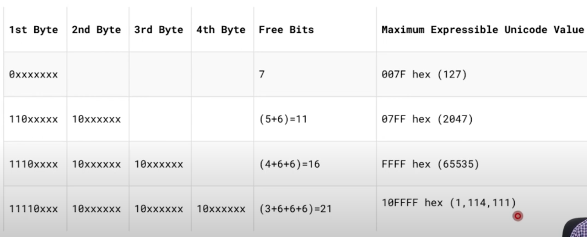

# Digital Number Systems

1.  Decimal (0-9)
2.  Binary (0 / 1)
3.  Octal (0-7)
4.  Hexadecimal (0-9 + A-F)

Note: Base of a number system is also called radix.

# Conversion

## Decimal to $X$

### For Integer Part

- Repeatedly divide the decimal number by base $X$ noting the remainders at each step.
- The final result is obtained by assembling all the remainders, with the last remainder being the most significant bit (MSB).

### For Fractional Part

- Repeatedly multiply the fractional part with the base $X$ subtracting and noting the integer part at each step.
- The final (fractional) result is obtained by writing the subtracted integer numbers in the order in which they were subtracted, with the last subtracted number being least significant bit (LSB)

## $X$ to Decimal

### Repeated Multiplication

- Repeatedly multiply each bit with the Base $X$ value with positional value as exponent, where units place is 0. Moving towards the left we add 1 with each position and to the right we subtract 1.

### Dibble-Dobble Method

Check for other bases as well. Also check for fractional part

- Mulitply the most significant bit (MSB) by 2 and add the next bit.
- Then multiply the result by 2 and add the next bit.
- The final result after repeating this process is the decimal value.

## $X^n$ to $X$

- Take each bit in the $X^n$ system and convert each bit to its n-bit base X equivalent. (e.g. 7~8~ = 111~2~)
- Rewrite the number in base $X$ system maintaining the order.

## $X$ to $X^n$

- Say we wish to convert a number in base $X$ to a number in base $X^n$ (e.g. 2 to 8)
- We first take the first number and group the bits in groups of $n$ from LSB to MSB (on both sides of decimal point) adding 0 to MSB side as required.
- Then the groups are converted to $X^n$ numbers and the number formed (with same order) is the number in $X^n$

# Binary Addition:

Rules:

- $0_2+0_2=0_2$
- $0_2+1_2=1_2$
- $1_2+0_2=1_2$
- $1_2+1_2=10_2$
- $1_2+1_2+1_2=11_2$

**Note:** We add from the rightmost bit (even ignoring the decimal point) and apply these rules.

# Character / String Representation

## Encoding Terminology

1.  Code Space:
    - Refers to all the codes that an encoding scheme uses to represent characters.
    - E.g. ASCII has a code space from 0 to 127
2.  Code Point
    - Refers to a code from the code space that represents a single character.
    - E.g. 0x41 represents 'A' in ASCII

## ASCII

- **ASCII:** American Standard Code for Information Interchange.
- used in most microcomputers, minicomputers and mainframes.
- It is a 7-bit code, and so has 2^7^ = 128 possible code points.
- This is more than enough to represent all standard keyboard characters as well as control characters such as `\n` and `\t`

## ISCII

- **ISCII:** Indian Standard Code for Information Interchange
    - It is also called "Indian Scripts Code for Information Interchange"
- It retains all ASCII characters and offers encoding for Indian scripts as well.
- Because the structure of most Indian scripts is so similiar, a single coding can be applied to all of them, immediately providing transliteration between the scripts.

## Unicode

- Universal character set with an aim to:
    - Define all the characters needed for writing the majority of known languages in use on computers in one place.
    - to be a superset of all other character sets that have been encoded.
- Unicode defines multiple encoding systems to represent characters:
    - UTF-8
    - UTF-16
    - UTF-32

### UTF-8 (Unicode Transformation Format - 8)
Need to verify ALL in current section 
- Variable width encoding that can represent ever character in the Unicode character set. (1,114,112 code points)
- The code unit is 8-bits, called an octet.
- UTF-8 can use 1 to maximum 6 octets to represent code points depending on their size.
    - Although, till now it has used only upto 4 octets to represent a character.
- It is a multi-byte encoding. Sometimes we use only 8 bytes to store a character, other times 16 or 24 bits.
- Unicode code points are often written as `U+<codepoint_number>`

### Encoding Optimisation
do some reasearch	
