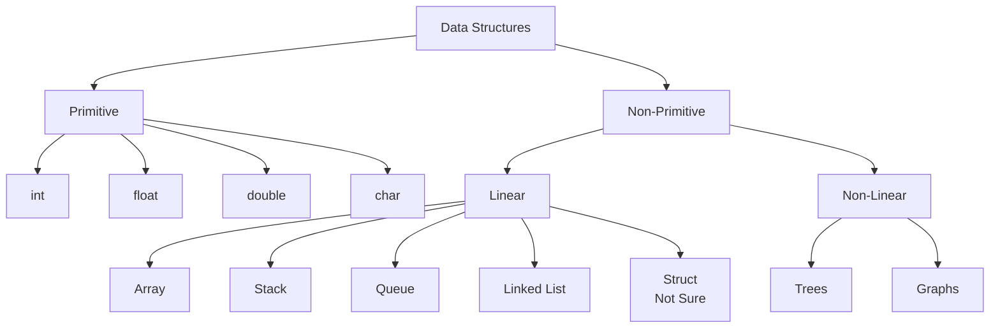

# Introduction

- **Primitive:** During compilitation var name is replaced by the memory address without the need of any calculation. (maybe)
- **Non-Primitive:** May need some calculation (i think)
- **Linear:** Can be accessed sequentially (One <u>after</u> the other) a -> b -> c -> d
- **Non-Linear:** Cannot be accessed sequentially (One <u>or</u> the other) a->b / a->c // b/c -> d