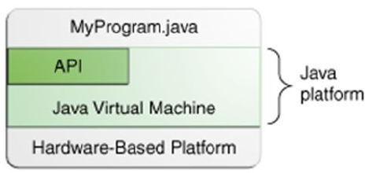
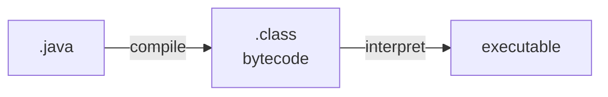
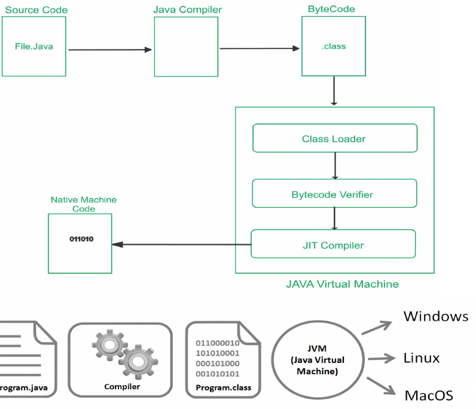
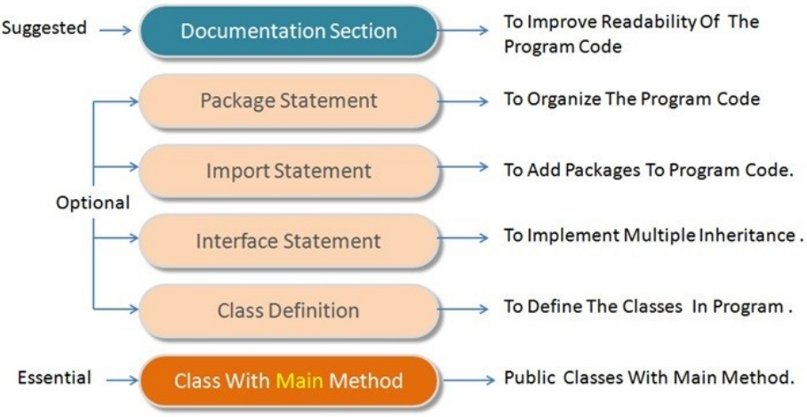

# History & Evolution
A program must be translated into machine language before it can be executed on a particular type of CPU.

This can be accomplished in several ways.

A compiler is a software tool which translaes source code into a specific target lanugage.
Often, that target language is the machine language for a particular CPU type.

- Java began as project Green in 1991 founded by Patrick Noughton, Mike Sheridan and James Gosling who worked for Sun Microsystems.
- The purpose was to draft and plan for a future computer program that can be executed on any machine.
- Began with the name Oak programming language that was developed in the early 90's by Sun Microsystems.
# Working of the Java Language
The java compiler translates Java source code into a special representation called *bytecode*.

Java bytecode is not machine language for any traditional CPU.

Another software tool, called an interpreter, translates bytecode into machine language and executes it.

Therefore the Java compiler is not tied to any particular machine.

Java is therefore, an *architecture-neutral* language.

The popularity of the Java language is greatly attributed to the rise of the Internet and the need for such a language.

## Java Platform
- A platform is the hardware or software environment in which a program runs.
	- Most platforms can be described as a combination of the operating and underlying hardware.
 - The Java platform differs from most other platforms in that it's a software-only platform that runs on top of other hardware-based platforms.



## Java Bytecode




- Java Bytecode is the instruction set for the Java Virtual Machine (JVM)
- It acts similiar to an assembler.
- As soon as a Java program is compiled, java bytecode is generated.
- It is the machine code in the form of a <b><font color=cyan>.class</font></b> file.
- With the help of Java bytecode, we achieve platform independence in Java.



# Features of Java.
1. Simple
	- Java was Designed to be easy for the professional programmer to learn and use effectively.
	- With knowledge of C and Object oriented principles, Java is a simple language to learn.
2. Secure
	- Java confines the running of code to JVM only and does not let it to access the other parts of the computer.
3. Portable
	- Java is known as a portable language because Java code can execute on all major platforms.
	- Bytecode, A highly optimized set of instructions makes java a portable programming language.
	- Java bytecode on any hardware that has a compliant JVM.
4. Object oriented
	- Incorporated the object oriented principles: Encapsulation, Abstraction, Inheritance and Polymorphism.
	- The object oriented model allows the user to incorporate all the features mentioned above into the code.
	- Everything in Java is considered an object and hence programs are modular.
5. Robust
	- Java restricts the programmer in a few key areas, thus helping them identify mistakes early in the program development.
	- Compile time checks helps identifying programming errors.
	- Run time errors can be checked through Exception handling mechanism.
	- Memory management is a tedious task in C and C++. The programmer need to manually allocate and free the dynamic memory.
	- Java's memory allocation is simple and deallocation of memory is automatic through garbage collection.
	- Exceptional conditions like file not found, array index out of bound, divide by zero can be easily handles through Exception handling mechanisms.
6. Multithreaded
	- Java allows multithreading i.e. it allows the user to write programs that can do many things simultaneosly.
   - The Java run time provides solutions for multiprocess synchronizations that helps the user to construct interactive programs.
7. Architecture Neutral
	- "Write once, run anywhere, anytime, forever" was the goal with which Java was created and the goal was accomplished to a great extent.
	- Operating system upgrades, the processor upgrades and changes in the core system resources do not affect the bytecode runs.
8. Interpreted and High performance
	- Java enables creation of cross platform programs by compiling into an intermediate representation callled the bytecode.
	- This code can be run on any machine with a JVM.
	- Java bytecode was carefully designed so that it would be easy to translate directly into native machine code by using Just-in-time compiler.
9. Distributed
	- Java can handle the TCP/IP protocols.
	- Java also supports Remote Method Invocation which enables a program to invoke methods across the network.
10. Dynamic
	- Java programs carry substatial amounts of run time information that is used to verify and resolve access to objects at run time.
	- This helps in linking the code dynamically in a safe manner thus making the language robust.
11. No Pointers
	- Java has a similiar understanding and syntax to C and C++, as they wished to create a better, refined version of these languages and so pointers were ommited as they felt it was not required <font color=red>(not sure, own definition)</font>.

## Object Oriented Programming

- Need for Object Oriented Java Programming:
	- More Modularized
	- Reusable

- OOP is an approach to program orgranization and development, which attempts to eliminate some of the drawbacks of conventional programming methods by incorporating the best of structured programming features with several new concepts.
- OOP allows us to decompose a problem into a number of entities called *objects* and then build data and *methods* (functions) around these entities.
- The data of an object can be accessed only by the methods associated with the object.

Object oriented programming provides concepts like:

- **Object:** An instance of a class.
	- Each object provides values to the variables in the class.
	- Memory is only occupied after objects have been made / declared.

- **Class:** Template which lists properties that could include variables & methods.
	- A class when declared does not occupy any memory
	- Data Types are in a way a class and classes are essentially user defined data types. (<font color=red>I think</font>)
	- Something about <font color=red>wrapper</font>: most datatypes in java are primitive, but the have wrappers which are the class version of primitive data types.
		- Example: Integer for int, Double for double.
	- Therefore, we can have a function have a return type to be a class.
		- And the value returned from that function will be an object of said class.

- **Encapsulation:** Mechanism that binds together code and the data it manipulates, keeping both safe from outside interference and misuse.
	- Encapsulation acts as a protective wrapper that prevents the code and data from being aribitrarilt accessed by other code defined outside the wrapper.
	- Access to the code and data inside the wrapper is tightly controlled through a well-defined interface.
	- In Java, the basis of encapsulation is through classes.

- **Abstraction:** Hiding of complex features or implementation details.

- **Inheritance:** Property through which one class can obtain the properties of another class.
	- This supports the concept of hierarchical classification.
		- Without the use of hierarchies, each object would need to define all of its characteristics explicitly.
		- However by the use of inheritance, an object need only define those qualities that make it unique within its class. It can inherit its general attributes from its parent.
	- Thus, inheritance makes it possible for one class to a more specialized instance of a general class.

- **Polymorpism:** Feature that allows one interface to be used for a general class of actions. ("One entity, mulitple forms.")
- Dynamic Binding
- Message Passing

## Java Program Structure


### Keywords in Java
```Java
abstract continue goto package synchronized assert
default if private this boolean do implements protected
throw break double import public throws byte else
instanceOf return transient case extends int short try
catch final interface static void char finally long strictfp
volatile class float native super while const for new switch
```

