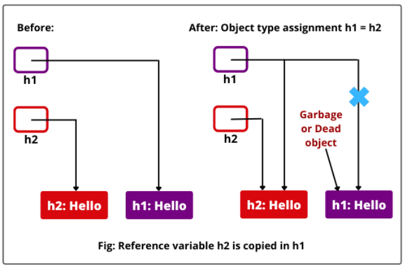

# Data Types in Java:
Java is a statically typed language.
- Data is the information that a program has to work with.
- Data is of different types. The type of a piece of data tells Java what can be done with it, and how much memory needs to be put aside for it.
- When we create a variable in Java, we need to specify.
	- The type of the value we want to put in there, and
	- the name we will use for that variable.


## Primitive Data Types:
There are exactly 8 primitve data types in Java.
- They are mentioned in the form of `type (class Wrapper_class)`
	- Integer: For whole-valued signed numbers
		- ```java
		  byte (class Byte)
			```
		- ```java
		  short (class Short)
			```
		- ```java
		  int (class Integer)
			```
		- ```java
		  long (class Long)
			```
	- Float: For numbers with fractional precision
		- ```java
		  float (class Float)
			```
		- ```java
		  double (class Double)
		  ```
	- Character: Represents symbols in a character set, like letters and numbers
		- ```java
		  char (class Character)
		  ```
	 - Boolean (logical): Special type for representing true / false values
		- ```java
		  boolean (class Boolean)
			```
			 	
### Range:
|Data type|Width in bits|Range|
|:----:|:----:|:----:|
|long|64|-9,223,372,036,854,775,808 to 9,223,372,036,854,775,807|
|int|32|-2,147,483,648 to 2,147,483,647|
|short|16|-32,768 to 32,767|
|byte|8|-128 to 127|
|double|64|4.9e-324 to 1.8e+308|
|float|32|1.4e-045 to 3.4e+038|
|char|16|0 to 65,536|

## Non-Primitive Data Types
- Non-primitive data types are not deined by the programming language, but are instead created by the programmer.
- They are sometimes called "reference variables" or "object references," since they reference a memory location, which stores the data.
- In Java, non-primitive data types are simply called "objects" because they are created, rather than predefined.
- While an object may contain any type of data, the information referenced by the object may still be stored as a primitive data type.
- For example:- Class, Array, String, Interface, Collection, etc. 

## Type Conversion & Casting
Type conversion, typecasting, refers to different ways of explicitly or implicitly, changing an entity of one data type into another.

Types of conversions:
1. Widening conversion.
2. Narrowing conversion.

### Widening Conversion
Widening conversion is permitted when going from a smaller data type to a larger one:


e.g. you can convert from `byte` to `float` but not from `long` to `int`

This is an implicit conversion.

i.e. conversion from smaller data type to larger data type of similiar characteristics.

- When one type of data is assigned to another type, an automatic type conversion will take place if the following two conditions are met:
	1. The 2 types are compatible
	2. The destination type is larger than the source type.
- When these two conditions are met, a *widening* conversion takes place.
- E.g. `char` and `boolean` are not compatible with each other


```java
class Widening{
	public static void main(String args[]){
		short s;
		int i1, i2;
		byte b1=10,b2=20;
		s=b1; //byte to short
		i1=b2; //byte to int
		System.out.println("byte to short conversion");
		System.out.println(b1+" "+s);
		System.out.println("byte to int conversion");
		System.out.println(b1+" "+i1);
		i2=c; //char to int
		System.out.println("char to int conversion");
		System.out.println(c+" "+i2);
	}
}

/*
output:
byte to short conversion
_ _
byte to int conversion
_ _ 
char to int conversion
_ _
*/
```

### Narrowing
Narrowing primitive conversion can occur in these cases:


This is explicit conversion and is used to cast the above incompatabile values:
```
(<target_type>) value
````

- This is called a cast and is used to create a conversion b/w two incompitable types.
- if the integer values is larger than the range of the byte, it will  be reduced Modulo byte's range (128).
	- e.g. `int i = 257` converted to `byte` will give `1`.
- When a `float` or `double` is converted to `int` then the floating point will be truncated.

### Automatic Type Promotion in Expressions
- In addition to assignements, some type conversions can also take place in expressions.
- In an expression, the precision required of an intermediate value will sometimes exceed the range of either operand.
	- for e.g. `byte b=20; b=b*3` will give a compile time error, cannot assign int to byte as b got promoted to an int.
		- Therefore we will use explicit type conversion `byte b =20; b=(byte)b*3`
	 
- The general rule for type conversion is that if there is atleast one operand of a higher type (largest range) then the entire expression is promoted to that type.
# Variables
- The variable is a name for a location in memory and is the basic unit of storage in a Java program.
- A variable is deined by the combination of an identifier, a type, and an optional initializer.
- In Java, all variables must be *declared*, specifying the variable's identifier (name) and type of information it will contain before they are used.
	- ```
	  <type> identifier [= value][,identifier [= value]...];
	  ```


## Types of Variables:
1. Local Variable
	- Variable defined inside methods, constructors or blocks.
	- The variable will be declared and initialized within the method.
		-  They will be created when the method, constructor or block is entered and destroyed when the method, constructor or block has completed.
	-  Access modifiers cannot be used for local variables.
	-  They are only visible within the declared method, constructor or block.
	-  There is no default value for local variables so they should be declared and an initial value should be assigned before first use.
2. Instance Variable
	- Variable within a class but outside any method, constructor or block.
	- These variables are initialized when the class is instantiated.
	- Instance variables are created when an object is created with the use of the keyword `new` and destroyed when the object is destroyed.
	- Access modifiers can be given for instance variables.
		- They are visible for all methods, constructors or blocks of that particular class.
	- Instance variables can have default values.
	- They can be directly accessed by calling the variable name inside the class.
	- However within static methods and different classes (when instance variable are given accessibility) that should be called using the fully qualified name: `ObjectReference.VariableName`
3. Class Variable
	- Variables declared within a class, outside any method, constructor or block with the static keyword.
	- There would be only one copy of each class variable per class, regardless of how many objects are created from it.
	- Static variables are stored in static memory.
	- Static variables are created when the program starts and destroyed when the program stops.
	- Visibility is similiar to instance variables.
	- Default values are same as instance variables.
	- Static variables can be accessed by calling with class name: `ClassName.VariableName`
		- Note that instance variables were called using OBJECT name and not the class name.
4. Parameters

Example of variables:
```java
public class Employee{
	public String Namel //Instance Variable w/ Public access modifier
	private int Salary; //Instance Variable w/ Private access modifier
	public static String company; // Not an instance variable as it is static, and the values is class specific and not INSTANCE-specific (this is a class variable.)
}
```

## Scope & Lifetime
Note that variables are to be declared within a block.

A block begins with a `{` and ends with a `}`

- **Scope:** It is the portion of the program where the element is visible. <font color = red>why have they used the word element here? why not variable?</font>
	- Variables declared inside a scope are not accessible to code outside.
	- Scopes can be nested. The outer scope encloses the inner scope
		- Variables declared in the outer scope are visible to the inner scope.
		- Variables denotes in the inner scope are not visible to the outer scope.

 - **Lifetime:** Is is the period of time during which a declared element is alive. <font color=red>same question as above</font>
	 - The lifetime of a variable can be determined by looking at the context in which they're defined.

# Operators
1. Arithmetic Operators
2. Bitwise Operators
3. Relational Operators
4. Boolean Logical Operators

## Arithmetic Operators:
|Operator|Result|
|:---:|:---:|
|`+`|Addition|
|`-`|Subtraction|
|`*`|Multiplication|
|`/`|Division|
|`%`|Modulus|
|`++`|Increment|
|`+=`|Addition assignement|
|`-=`|Subtraction assignement|
|`*=`|Multiplication assignement|
|`/=`|Division assignement|
|`%=`|Modulus assignement|
|`--`|Decrement|

## Bitwise Operators
- Can be applied to `int`, `long`, `short`, `byte` and `char`
- These operators act upon the individual bits of their operators.

|Operator|Result|
|:----:|:-----:|
|`~`|Bitwise unary NOT|
|`&`|Bitwise AND|
|`\|`|Bitwise OR|
|`^`|Bitwise exclusive OR|
|`>>`|Shift right|
|`>>>`|Shift right zero fill|
|`<<`|Shift left|
|`&=`|Bitwise AND assignement|
|`\|=`|Bitwise OR assignement|
|`^=`|Bitwise exclusive OR assignement|
|`>>=`|Shift right assignement|
|`>>>=`|Shift right zero fill assignement|
|`<<=`|Shift left assignement|

## Relational Operators
- Determine the relationship that one operand has to the other.
- The determine equality and ordering.

|Operator|Result|
|:---:|:-------:|
|`==`|Equal to|
|`!=`|Not equal to|
|`>`|Greater than|
|`<`|Less than|
|`>=`|Greater than or equal to|
|`<=`|Less than or equal to|


## Boolean Logical Operators
- Operate only on boolean operands.
- All of the binary logical operators combine two boolean values to form a resulant boolean value.

|Operator|Result|
|:-----:|:-----:|
|`&`|Logical AND|
|`\|`|Logical OR|
|`^`|Logical XOR (exclusive OR)|
|`\|\|`|Short-circuit OR|
|`&&`|Short-circuit AND|
|`!`|Logical unary NOT|


# Control Statements
1. Selection Statements:
	- `if`, `switch`
2. Iteration Statements:
	- `for`, `while`, `do-while`
3. Jump Statements:
	- `break`, `continue`, `return`

<font color=red>
Skipping because it's the same as C
</font>

# Arrays
- An array is an indexed collection of data elements of the same datatype.
- The operator `new` is used for dynamic memory allocation
- Indexed means that the array elements are numbered
- Arrays are stored in consecutive memory cells.

**Note:** Arrays in Java are a non-primitive data type.

Syntax for array definition:
`type array[] = new type[size];`

- Multi-dimensional arrays are defined by `type array[x1][x2]...[xn] = new type[x1_size][x2_size]...[xn_size]`
	 - e.g. `double d[][][] = new double[1][2][3]`

- An array can also be declared explicitly.
	- e.g. `int num[] = {1,2,3};`
 
- If `x` is a reference to an array, then `x.length` will be the length of the array.

**Jagged Array:** `int x[][] = new int[3][]`

# Classes
- Class is a set of common properties / attributes which are common to all objects of one type..
- Class is not a real world entity. It is just a template or blueprint from which objects are created.
- A class does not occupy memory. (The objects do)
- Class is a group of variables of different datatypes and a group of methods.
- In general class declarations can include these components in order:
	- **Modifiers:** A class can be public or have default access.
	- `class` **keyword:** used to create a class.
	- **Class Name:** The name should begin with an initial letter (capitalized by convention).
	- **Superclass (if any):** The name of the superclass, if any, preceeded by the `extends` keyword.
	- **Interfaces (if any):** A comma-seperated list of interfaces implemented by the class, if any, preceeded by the `implements` keyword.
	- **Body:** The class body is surrounded by braces `{}`

```java
[public] class Class_name [extends Superclass] [implements Interface(s)]{
	body
}
```

# Objects
- It is a basic unit of Object Oriented Programming and represents real-life entities.
- A Java program creates many object which interact by invoking methods. An object consists of:
	- **State:** It is represented by attributes of any object. It also reflects the properties of an object.
	- **Behaviour:** It is represented by methods of an object. It reflects the response of an object with other objects.
	- **Identity:** It gives a unique anme to an object and enables one object to interact with other objects.

**Example:**
|Identity|State/Attributes|Behaviours
|:---:|:---:|:---:|
|Name of Dog|Breed<br>Age<br>Color|Bark<br>Sleep<br>Eat

## Object Creation
```java
Class_name obj_name = new Class_name();
```
- `new` will dynamically allocate memory to the object depending on the requirement of the class.
- An object is a reference variable of its respective class.
- There are three steps when creating an object from a class:
	- **Declaration:** A variable declaration with a variable name with an object type.
	- **Instantiation:** The `new` keyword is used to create the object.
	- **Initialization:** The `new` keyword is followed by a call to a constructor. This call initializes the new object.

Example:
```Java
Box b1 = new Box();
Box b2;
b2 = b1;
```
Here `b1` will have space alloted (cause of new) while `b2` does not.

In line 3, `b2` will point to the same address as `b1`.

### Assigning Object Reference Variables
1. When we create an object (instance) of class then space is reserved in heap memory.
2. A pointing element called Reference Variable which points out the object is created to access that space.
3. E.g. in `Demo D1 = new Demo();`, here `D1` will be the reference variable pointing to the object of Demo class in the heap memory.

We can therefore, initialize the values of variables in Java using three ways:
	- By using a constructor
	- By using a reference variable (`reference_var.attribute = val`)
	- By using a method
# Difference b/w classes and objects:
|Class|Object|
|:---:|:---:|
|Class is a collection of similiar objects|Object is an instance of a class|
|Class is conceptial (is a template)|Object is real|
|No memory is allocated for a class|Each object has its own memory|
|Class can exist without any objects|Objects can't exist without a class|
|Class does not have any values associated with the fields.|Every object has its own values associated with the fields|

# Constructors
- Constructors are a block of code used to initialize the instance objects of a class.
- They are similiar to methods and can have parameters passed to them.
- The constructor has the same name as that of the class.
- A constructor is called immediately after the object is created.
- Constructors should not have a return type, even void as JVM would consider it as a method otherwise.
- The default constructor initializes the values of the instance variables to 0 if the user requires the values to be initialized to different number, the user is expected to write a parameterized version of the constructor.
- **Note:** Once a different version of the constructor is written, the default one does not exist.
- **Note:** It is recommended that a class name start with a <U>capital</U> letter.


# Method
- A method in Java is a set of code used to write the logic of applications which performs some specific tak or operation.
- When a method is called, it returns value to the caller.
- It can also perform a task without returning any value.
- It can be called from anywhere.
- Therefore, we can also use methods to initialize value of an object.

```java
[public] return_type methodName (parameters){
	body
} 
```
**Note:** Methods are named using camelCase.


There are two types of method in Java:
1. Pre-defined methods
	- Already defined in the Java class libraries.
	- It is also known as the **standard library method** or **built-in method**.
	- We can directly use these methods just by calling them in the program at any point
		- Example: `length()`, `equals()`, `compareTo()`, `sqrt()`, etc.

2. User-defined methods
	- Written by the user and are modified according to requirement.

# Overloading
- <font color=red>Overloading can be done to both methods and constructors, below I have only mentioned methods, will correct later</font>
- When a method has the same name as another method name in the same class but their parameter declarations are different, the methods are said to be **overloaded**.
- Method overloading is one of the ways that Java supports polymorphism.
- Therefore same-named methods must be distinguished by:
	- Different number of arguments.
	- Different types of arguments.
**Note:** Different return types are not sufficient and will not compile.
```java
//will give ERROR
double test(char a){...}
int test(char a){...}
```

## Overloading & Conversion
- When an overloaded method is called, Java looks for a match between the arguments used to call the method and the method's parameters.
- When no exact match can be found, Java's automatic type conversion can aid overload resolution:
```java
class OverloadDemo{
	void test(){
		System.out.println("empty");
	}
	void test(int a, int b){
		System.out.println(a*b);
	}
	void test (double a){
		System.out.println(a);
	}
	public static void main(String args[]){
		OverloadDemo var = new OverloadDemo();
		var.test(10);
	}
}
//output:
10.0
```
# Constructor vs Method
||Constructor|Method|
|:----:|:----:|:-----:|
|**Name**|Constructors name should be the same name as the class.|Method's name can be anything|
|**Return Type**|Constructor doesn't have a return type.|Method must have a return type.|
|**Call**|Invoked implicitly by the system.|Method is invoked by the programmer|
|**Main Job**|Constructor can be used to initialize an object|Method consists of Java code to be executed.|
|**Overload**|Constructor can be overloaded|Methods can also be overloaded|

# `this` keyword
- ``this`` keyword is useful to find the current reference. It refers to the current object in a method or constructor.
	- It is especially useful to elimanate confusion b/w the name of instance variables and parameters if they are similiar.
- Sometimes, a method will need to refer to the object that invoked it.
	- To allow this, Java defines the `this` keyword.
- `this` can be used inside any method to refer to the current object.
- That is, `this` is always a reference to the object on which it was invoked.
- `this` can be used anywhere a reference to an object of the current class' type is permitted.
- `this` can also be used to:
	- Refer curremt class instance variable.
	- Invoke current class constructor
	- Invoke current class method
	- Return the current class object
	- Pass an argument in the method call.
	- Pass an argument in the constructor call

# Argument Passing
- Two primary ways of passing arguments:
	- **By Value:** A method recieves a copy of the original values; parameters of simple types.
	- **By Reference:** a method recieves the memory address of the original value, not the value itself, parameters of class types.
# Garbage Collection
- Garbage collection is a mechanism to remove objects from memory when they are no longer needed.
- Garbage collection is carried out by the garbage collector:
	- The garbage collector keeps track of how many references an object has.
	- It moreves an object from memory when it has no longer any references.
	- Thereafter, the memory occupied by the object can be allocated again.
	- The garbage collector invokes the `finalize()` method.



## `Finalize()` method
- The `finalize()` method is invoked just before the object is destroyed which is in contrast with a constructor that help to initialize an object just after it has been created.
- It is implemented in a class as:
`protected void finalize(){...}`
It is implemented when the usual way of removing object from memory is insufficient, and some special actions have to be carried out.
- To add a finalizer to a class, we simply define the `finalize()` method.
- The Java run time calls that method whenever it is about to recycle an object of that class.
- Inside the `finalize()` method, you will specify those actions that must be performed before an object is destroyed.
- The garbage collector runs periodically, checking for objects that are no longer referenced by any running state or indirectly through other referenced objects.
- The keyword `protected` is a specifier that limits access to `finalize()`

# `Stack` Class
- The `Stack` class defines two data items and three methods.
- The stack of integers is held by the array stack.
- The array is indexed by the variable `tos` which always contains the index of the top of the stack.
- the `Stack()` constructor initializes `tos` to `-1` which indicates an empty stack.
- The method `push()` puts an item on the stack.
- To retrieve an item, call `pop()`

# `Scanner` Class
### Example function for integer and double:
```java
import java.util.Scanner;

class Test_scan{
	public static void main(String a[]){
		int ai;
		double ad;
		Scanner s = new Scanner(System.in);
		System.out.println("Enter integer value");
		ai = s.nextInt();
		System.out.println("Enter double value");
		ad - s.nextDouble();
		System.out.println("Integer value is: "+ai);
		System.out.println("Double values is: "+ad);
	}
}
```


# Access Control
- Java's accesss specifiers are `public`, `private`, `protected`.
- `protected` applies only when inheritance is involved.
- When a member of a class is modified by the `public` specifier then that member can be accessed by any other code.
- When a member of a class is modified by the `private` specifier, then that member can only be accessed by other members of its class.


# `static` keyword
- When a member is declared `static`, it can be accessed before any objects of its class are created and without reference to any object.
- The most common example of a `static` member is `main()`.
- `main()` is declared as `static` becuase it must be called before any objects exits.
- Instance variables declared as `static` are, essentially, global variables.
- Methods declared as static have several restrictions:
	- They can only call other `static` methods.
	- They must only have `static` data.
	- They cannot refer to `this` or `super` in any way.
	- We can declare a `static` block which gets executed exactly once, when the class is first loaded.

If we wish to call a static method from outside its class, we can use `className.method()`


# `final` keyword
- A variable declared as final prevents its contents from being modified.
- This final variable should be initialized when it is declared.
- e.g. `final double g = 9.8`

variables declared as final do not occupy memory on a per-instance basis.

The keywrd final can also be applied to methods, but its meaning is substantially different than when it is applied to variables.

`final` is used to restrict the user.
```java
final variable; //stops value change
final method(); //prevents method overriding
final class; //prevents inheritance
```

# Command Line Arguments
- A command line argument is the information that directly follows the program's name on the command line when it is executed.

- These arguments are stored in a String array to the `args[]` parameter of `main()`

- The first argument is passed in `args[0]`, second argument in `args[1]` and so on

`java project Hello World` will run the program `project` with `"Hello"` in `arg[0]` and `"World"` in `arg[1]`