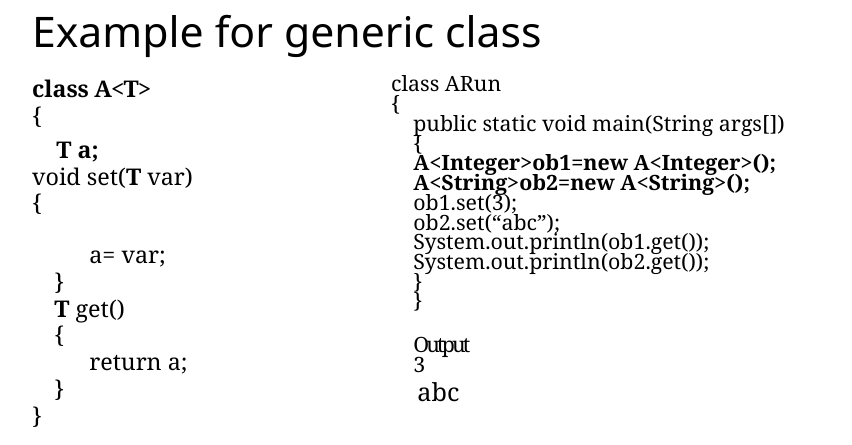
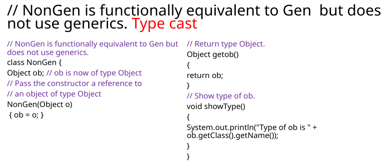

# Introduction
- Generics were introduced by JDK 5.

- Through the use of generics, it is possible to create classes, interfaces and methods that will work in a type-safe manner with various kinds of data.

- With generics, the user can define an algorithm once, independently of any specific type of data, and then apply that algorithm to a wide variety of data types without any additional effort.

- The term generics means parameterized types.

- Parameterized types help the user create classes, interfaces and methods in which the type of data upon which they operate is specified as a parameter.

- Using generics, it is possible to create a single class, for example, that automatically works with different types of data.

- The advantage of generics, is it provides high level of reusability.

- In old code, many classes and methods used `Object` as the type of data they operated on.

- The disadvantage of the old approach is that explicit conversion with type-casting is often necessary to convert to the actual type of data.

- For example, the algorithm for Stack is the same for Integer, String, Object, Thread, etc.
	- So generics will help unify all this datatypes and reuse the code.
 
General Form of a Generic Class:
```java
//creating a Generic class
class ClassName<type-param-list>{
	...
}
// Declaring a reference variable to the generic class:
ClassName<type-arg-list> varName = new ClassName<type-arg-list>()
```

In the `<type-arg-list>` , the type argument cannot be a primitive type such as `int` or `char`, it needs to be a class type such as `Integer` (wrapper class)


Generics also add type safety and prevent errors.

e.g.
```java
A<int> ob = new A<int>(); //ERROR: need to use wrapper class - Integer
A<Integer> ob1 = new A<Integer>();
A<String> ob2 = new A<String>();
ob1 = ob2 //Wrong!!!
```
Event though both `ob1` and `ob2` are of type `A<T>`, they are reference to different types as their type arguments differ.

```java
public class Gen_Sample<T>{
	T var;
	
	void pattern (T accept, int row){
		for (int i = 0; i<row; i++){
			for (int j=0;j<=i;j++){
				System.out.print(accept);
			}
			System.out.println();
		}
	}
}

public class GenRun{
	public static void main(String args[]){
		Gen_Sample<Character> gsc = new Gen_Sample<Character>();
		Gen_Sample<Integer> gsi = new Gen_Sample<Integer>();
		gsc.pattern('*',3);
		gsi.pattern(2,5);
	}
}
```



# Implementing Generics using `Object` Class
