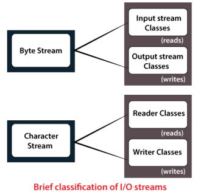

# Introduction
- In Java, a **File** is an abstract datatype.
	- It is a named location used to store related information.
 - A **stream** is a series of data.
	 - In Java, a stream is classified into 2 types:
		- Byte Stream
		- Character Stream
- `print()` and `println()` are both I/O methods.
- However, most applications of Java are not text-based console programs but are instead rely on Java's GUI frameworks lke Swing, AWT, JavaFX or are web application.
- Java's support for console I/O is limited however it will be used here as teaching examples and will not have much use in the real world.
- The original version of Java (1.0) did not include character streams and thus, all I/O was byte-oriented.
- Character streams were added by Java 1.1 and certain byte-oriented classes and methods were deprecated.
- At the lowest level, all I/O is byte-oriented. The character-based streams simply provide a covenient and efficient means for handling characters.

## `File` Class Methods
|S.No|Method|Return Type|Description|
|:--:|:----:|:---------:|:---------:|
|1.  |`canRead()`|Boolean|used to check whether we can read the data of the file or not.|
|2.|`createNewFile()`|Boolean|used to create a new empty file.|
|3.|`canWrite()`|Boolean|used to check whether we can write the data into the file or not.|
|4.|`exists()`|Boolean|used to check whether the specified file is present or not.|
|5.|`delete()`|Boolean|used to delete a file.|
|6.|`getName()`|String|used to find the file name.|
|7.|`getAbsolutePath()`|String|used to get the absolute pathname of the file.|
|8.|`length()`|Long|used to get the size of the file in bytes.|
|9.|`list()`|String[]|used to get an array of the files available in the directory.|
|10.|`mkdir()`|Boolean|used for creating a new directory.|
### Example program to create a new file
#### Using `throws`
```java
import java.io.File;
import java.io.IOException;
public class DemoFile{
	public static void main(String args[]) throws IOException{
		File file = new File("/home/anag/Desktop/SampleFile.txt");
		if (file.createNewFile()){
			System.out.println("File created successfully.");
		}
		else{
			System.out.println("File already exists");
		}
	}
}
```
**Note:** It might be possible to run this without using `throws IOException`  but i couldn't get it to work.

#### Using `try` and `catch`
```java
import java.io.File;
import java.io.IOException;
public class DemoFile{
	public static void main(String[] args){
		File file = new File("/home/anag/Desktop/SampleFile.txt");
		try{
			if(file.createNewFile()){
				System.out.println("File Created Successfully");
			}
			else{
				System.out.println("File already exists");
			}
		}catch(IOException i){
			System.out.println("Exception Handled");
		}
	}
}
```

### Example program to print info about a file
```java
import java.io.File;
class FileInfo{
	public static void main(String[] args){
		File f0 = new File("/home/anag/JavaLab/Extra Programs/SampleFile.txt");
		if(f0.exists()){
			//code
			System.out.println("name of the file is: "+f0.getName());
			System.out.println("abs path is: "+f0.getAbsolutePath());
			System.out.println("Is file writable: "+f0.canWrite());
			System.out.println("Is file readable: "+f0.canRead());
			System.out.println("length of file in bytes: "+f0.length());
		}
		else{
			System.out.println("File does not exist");
		}
	}
}
```
# Streams
- Java programs perform I/O through streams.
- A stream is an abstraction that either produces or consumes information.
- A stream is linked to a physical device by the Java I/O system.
- All streams behave in the same manner, even if the actual physical devices to which they are linked differ.
	- Therefore, the same I/O classes and methods can be applied to different types of devices.
	- This means an input stream can abstract many different kinds of input:
		- Keyboard
		- Disk
		- Network socket etc.
	- Similiarly an output stream can refer to many types of output:
		- Console
		- Disk
		- Network connection etc.
	- Streams are a clean way to deal with input / output without having every part of your code understand the difference between a keyboard and network.
	- for example, Java implements streams within class hierarchies defined in the `java.io` package.
<center>

</center>

## Byte Stream
- A byte stream is mainly involved with byte data. A file handling process with a byte stream is a process in which an input is provided and executed with the byte data.
- They provide a convenient means for handling input and output of bytes.
- They are used, for example, when reading or writing binary data.

### Byte Stream Classes
- Byte streams are defined by using two class hierarchies.
- At the top are two abstract classes: InputStream and OutputStream.
- Each of these abstract classes has several concrete subclasses that handle the differences among various devices, such as disk files, network connections, and even memory buffers.
- The byte stream classes provide a rich environment for handling byte-oriented I/O.
- A byte stream can be used with any type of object, including binary data.
- This versatility makes byte streams important to many types of programs.
- In order to use the stream classes we must first import `java.io`

|Stream Class|Meaning|
|:--:|:--:|
|`BufferedInputStream`|Buffered input stream.|
|`BufferedOutputStream`|Buffered output stream|
|`ByteArrayInputStream`|Input stream that reads from a byte array|
|`ByteArrayOutputStream`|Output stream that writes to a byte array|
|`DataInputStream`|An input stream that contains the methods for reading the Java standard types|
|`DataOutputStream`|An output stream that contains methods for writing the Java standard data types|
|`FileInputStream`|Input stream that reads from a file|
|`FileOutputStream`|Output stream that writes to a file|
|`FilterInputStream`|Implements `InputStream`|
|`FilterOutputStream`|Implements `OutputStream`|
|`InputStream`|Abstract class that describes stream input|
|`ObjectInputStream`|Input stream for objects|
|`ObjectOutputStream`|Output stream for objects|
|`OutputStream`|Abstract class that describes stream output|
|`PipedInputStream`|Input pipe|
|`PipedOutputStream`|Output pipe|
|`PrintStream`|Output stream that contains `print()` and `println()`|
|`PushbackInputStream`|Input stream that supports one-byte "unget", which returns a byte to the input stream|
|`SequenceInputStream`|Input stream that is a combination of two or more input streams that will be read sequentially, one after the other|

### Example program to write text into a file
```java
import java.io.File;
import java.io.FileOutputStream;
import java.io.IOException; //added bcoz i was getting error otherwise
public class FileOut{
	public static void main(String[] args)throws IOException{ //same reason for adding throws
		File file = new File("/home/anag/JavaLab/Extra Programs/SampleFile.txt");
		FileOutputStream fos = new FileOutputStream(file);
		String text = "OOJ Class";
		fos.write(text.getBytes());
		fos.flush();
		fos.close();
	}
}
```
getting error if not importing `java.io.IOException` and adding `throws IOException` (don't know why)
### Example program to read text from a file
```java
import java.io.File;
import java.io.FileInputStream;
import java.io.IOException;
public class FileIn{
	public static void main(String[] args)throws IOException{
		File file = new File("/home/anag/Extra Programs/SampleFile.txt");
		FileInputStream fis = new FileInputStream(file);
		System.out.println(fis.read());
	}
}
```
Note: `read()` here return the UNICODE value of the first character it encounters which in this case is O
when the `read()` function encounters the end of file it returns `-1`

an example program the read the entire contents of a file would be:
```java
import java.io.File;
import java.io.FileInputStream;
import java.io.IOException;
public class ReadFull{
	public static void main(String[] args) throws IOException{
		File file = new File("/home/anag/JavaLab/Extra Programs/SampleFile.txt");
		FileInputStream fis = new FileInputStream(file);
		int i = fis.read();
		while (i!=-1){
			System.out.print((char)i);
			i = fis.read();
		}
		fis.close();
	}
}
```
### About `InputStream`
- `InputStream` is an abstract class that defines Java's model of streaming byte input.
- It implements the `AutoCloseable` and `Closeable` interfaces.
- Most of the methods in this class will throw an `IOException` when an I/O error occurs.
- In order to create an `InputStream`, we must import the `java.io.InputStream` package first.
- Once we import the package, we create an input stream object:
	- ```java
	  InputStream input = new FileInputStream(file);
	  ```
#### About `FileInputStream`
- The `FileInputStream` class creates an `InputStream` that you can use to read bytes from the file.
- Two commonly used constructors are:
	- ```java
	  FileInputStream(String filePath);
	  ```
	- ```java
	  FileInputStream(File fileObj);
	  ```
	- **Note:** Either of these can throw a `FileNotFoundException`

#### Methods defined by `InputStream`:
|Method|Description|
|:---:|:----:|
|`int available()`|Returns the number of bytes of input currently available for reading|
|`void close()`|closes the input source. Further read attempts will generate an `IOException`.
|`void mark(int numBytes)`|Places a mark at the current point in the input stream that will remain valid until `numBytes` bytes are read.|
|`int read()`|Returns an integer representation of the next available byte of input. `-1` is returned when EOF is encountered.|
|`int read(byte buffer[])`|Attempts to read up to `buffer.length` bytes into `buffer` and returns the actual number of bytes that were successfully read. `-1` is returned when EOF is encountered.|
|`int read(byte buffer[], int offset, int numBytes)`|Attempts to read up to `numBytes` bytes into `buffer` starting at `buffer[offset]`, returning the number of bytes successfully read. `-1` is returned when EOF is encountered.|
|`void reset()`| Resets the input pointer to the previously set mark.|
|`long skip(long numBytes)`|Ignores (i.e. skips) `numBytes`, returning the number of bytes actually ignored.
#### Example program using `InputStream`
```java
import java.io.InputStream;
import java.io.FileInputStream;
class Main_InputStream{
	public static void main(String args[]){
		byte[] array = new byte[100];
		try{
			InputStream input = new FileInputStream("/home/anag/JavaLab/Extra Programs/SampleFile.txt");
			System.out.println("Number of available bytes in the file = "+input.available());
			input.read(array); //Read byte from the input stream
			System.out.print("Data read from the file: ");
			String data = new String(array);//Converting byte array to string
			System.out.println(data);
			input.close();			
		}catch(Exception e){
			e.getStackTrace();
		}
	}
}
```

### About `OutputStream`
- `OutputStream` is an abstract class that defines streaming byte output.
- It implements `AutoCloseable`, `Closeable` and `Flushable` interfaces.
- Most of the methods defined by this class return `void` and throw `IOException` in the case of I/O errors.
- We import the `java.io.OutputStream` package and create an `OutputStream` object:
	- ```java
	  OutputStream output = new FileOutputStream(file)
	  ```
#### About `FileOutputStream`
- `FileOutputStream` creates an `OutputStream` that you can use to write bytes to a file.
- It implements the `AutoCloseable`, `Closeable` and `Flushable` interfaces.
- Four of its commonly used constructors are:
	- ```java
		FileOutputStream(String filePath)
	  ```
	- ```java
		FileOutputStream(File fileObj)
	  ```
	- ```java
		FileOutputStream(String filePath, boolean append)
	  ```
	- ```java
		FileOutputStream(File fileObj, boolean append)
	  ```
- They all can throw a `FileNotFoundException`
#### Methods defined by `OutputStream`
|Method|Description|
|:-----:|:--------:|
|`void close()`|Closes the output stream. Further write attempts will generate an `IOException`.|
|`void flush()`|Finalizes the output state so that any buffers are cleared. That is, it flushes the output buffers.|
|`void write(int b)`|Writes a single byte to an output stream. Note that the paramter is an `int`, which allows us to call `write()` without having to cast it back to byte.|
|`void write(byte buffer[])`|Writes a complete array of bytes to an output stream.|
|`void write(byte buffer[], int offset, int numBytes)`| Writes a subrange of `numBytes` bytes from `buffer`, beginning at `buffer[offset]`|
#### Example program using `OutputStream`
```java
import java.io.FileOutputStream;
import java.io.OutputStream;
class Main_OutputStream{
	public static void main(String[] args){
		String data = "This is a demo line of text";
		try{
			OutputStream output = new FileOutputStream("/home/anag/JavaLab/Extra Programs/SampleFile.txt");
			byte[] dataBytes = data.getBytes(); //converts the string into a byte array
			output.write(dataBytes);
			System.out.println("data written");
			output.flush();
			output.close();
		}catch (Exception e){
			e.getStackTrace();
		}
	}
}
```

### About `ByteArrayInputStream` class
- The `ByteArrayInputStream` is composed of two words: `ByteArray` and `InputStream`. As the name suggests, it can be used to read byte array as input stream.
- The class contains an internal buffer which is used to read byte array as stream.
- In this stream, the data is read from a byte array.
- The buffer of `ByteArrayInputStream` automatically grows according to data.
- `ByteArrayInputStream` is an implementation of an input stream that uses a byte array as the source.
- The class has two constructors:
	- ```java
	  ByteArrayInputStream(byte array[])
	  ```
	- ```java
	  ByteArrayInputStream(byte array[], int start, int numBytes)
	  ```
	  - Here this constructor creates an `InputStream` from a subset of `array` that begins at `array[start]` and is `numBytes` long.
	 
- The `close()` method has no effect on a `ByteArrayInputStream`.
- Therefore, it is not necessary to call close() on a `ByteArrayInputStream`, but doing so is **not** an error.

#### Example Program for `ByteArrayInputStream`
<style>.red{color:red;font-size:24px;}</style>
<p class=red>I understood nothing</p>

```java
import java.io.*;
class ByteArrayInputStreamReset{
	public static void main(String[] args){
		String tmp="abc";
		byte b[] = tmp.getBytes();
		ByteArrayInputStream in = new ByteArrayInputStream(b);
		for(int i=0;i<2; i++){
			int c;
			while((c=in.read())!=-1){
				if (i==0){
					System.out.print((char) c);
				}
				else{
					System.out.print(Character.toUpperCase((char)c));
				}
			}
			System.out.println();
			in.reset();
		}
	}
}
```
### About `ByteArrayOutputStream`
- `ByteArrayOutputStream` is an implementation of an output stream that uses a byte array as the destination.
- It has two constructors:
	- ```java
	  ByteArrayOutputStream()
	  ```
		- Here, a buffer of 32 bytes is created.
	- ```java
	  ByteArrayOutputStream(int numBytes)
	  ```
	  - Here, a buffer of `numBytes` size is created.
- The buffer is held in the protected buf field of `ByteArrayOutputStream`.
- The buffer size will be increased automatically, if needed.
- The number of bytes held by the buffer is contained in the protected count field of `ByteArrayOutputStream`.
- The `close()` method has no effect on a ByteArray. Therefore it is not necessary to call `close()` on a `ByteArrayOutputStream`, but doing so is **not** an error.
- The `ByteArrayOuputStream` class is used to write common data into multiple files.
- In this stream, the data is written into byte array which can be writen to multiple streams later.
- The `ByteArrayOutputStream` holds a copy of data and forwards it to multiple streams.
#### Example program for `ByteArrayOutputStream`
```java
import java.io.*;
class ByteArrayOutputStreamReset{
	public static void main(String[] args){
		String data = "This is a line of text inside the string.";
		try{
			ByteArrayOutputStream out = new ByteArrayOutputStream();
			byte[] array = data.getBytes(); //array is a byte array of data
			out.write(array);
			String streamData = out.toString();
			System.out.println("Output stream: "+streamData);
			out.close();
		}catch(Exception e){
			e.getStackTrace();
		}
	}
}
```

### Filtered Byte Streams:
- Filtered streams are simply wrappers around underlying input or output streams that transparently provide some extended level of functionality.
- These streams are typically accessed by methods that are expecting a generic stream, which is a superclass of the filtered streams.
- Typical extensions are buffering, character translation and raw data translation.
- The filtered byte streams are `FilterInputStream` and `FilterOutputStream`, their constructors, respectively are:
	- ```java
	  FilterInputStream(InputStream is);
	  ```
	- ```java
	  FilterOutputStream(OutputStream os);
	  ```
- The methods provided in these classes are identical to those in `InputStream` and `OutputStream`.

### Buffered Byte Streams:
- for the byte-oriented streams, a buffered stream extends a filetered stream class by attaching a memory buffer to the I/O stream.
- This buffer allows Java to do I/O operations on more than a byte at a time, thereby improving performance.
- Because the buffer is available, skipping, marking and resetting of the stream becomes possible.
- The buffered byte stream classes are `BufferedInputStream` and `BufferedOutputStream`.
	- `PushbackInputStream` also implements a buffered stream.

#### About `BufferedInputStream`
- Buffering I//O is a very common performance optimization.
- Java's `BufferedInputStream` class allows you to "wrap" any `InputStream` into a buffered stream to improve performance.
- `BufferedInputStream` has two constructors:
	- ```java
	  BufferedInputStream(InputStream inputStream)
	  ```
	- ```java
	  BufferedInputStream(InputStream inputStream, int buffSize)
	  ```
##### Example Program for `BufferedInputStream`
```java
import java.io.BufferedInputStream;
import java.io.FileInputStream;
class Main_BufferedInputStream{
	public static void main(String[] args){
		try{
			FileInputStream file = new FileInputStream("/home/anag/JavaLab/Extra Programs/SampleFile.txt");
			BufferedInputStream input = new BufferedInputStream(file);
			int i = input.read();
			while (i!=-1){
				System.out.print((char) i);
				i = input.read();
			}
			input.close();
		}catch(Exception e){
			e.getStackTrace();
		}
	}
}
```

#### About `BufferedOutputStream`
- A `BufferedOutputStream` is similiar to any `OutputStream` with the exception that the `flush()` method is used to ensure that the data buffers are written to stream being buffered.
- Since the point of a `BufferedOutputStream` is to improve performance by reducing the number of times the system actually writes data, you need to call flush() to cause any data that is in the buffer to be immediately written.
- Here are the two available constructors:
	- ```java
	  BufferedOutputStream(OutputStream outputStream)
	  ```
	  - Creates a buffered stream using the default buffer size.
	- ```java
	  BufferedOutputStream(OutputStream outputStream, int buffSize)
	  ```
	  - Created a buffered stream with the size of the buffer equal to `buffSize`.
	 
##### Example program on `BufferedOutputStream`
```java
import java.io.FileOutputStream;
import java.io.BufferedOutputStream;
class Main_BufferedOutputStream{
	public static void main(String[] args){
		String data = "This is a line of text inside the file";
		try{
			FileOutputStream file = new FileOutputStream("/home/anag/JavaLab/Extra Programs/SampleFile.txt");
			BufferedOutputStream output = new BufferedOutputStream(file);
			byte[] array = data.getBytes();
			output.write(array);
			output.close();
		}catch(Exception e){
			e.getStackTrace();
		}
	}
}
```
### About `PrintStream`
- The `PrintStream` class provides all of the output capabilities we have been using from the `System` file handle, `System.out`, since the beginning.
- It implements the `Appendable`, `AutoCloseable`, `Closeable` and `Flushable` interfaces.
- `PrintStream` defines several constructors.
- The ones shown here have been specified from the start:
	- ```java
	  PrintStream(OutputStream outputStream)
	  ```
	- ```java
	  PrintStream(OutputStream outputStream, boolean autoFlushingOn)
	  ```
	- ```java
	  PrintStream(OutputStream outputStream, boolean autoFlushingOn, String charSet) throws UnsupportedEncodingException
	  ```

#### Example program on `PrintStream`
```java
import java.io.PrintStream;
class Main_PrintStream{
	public static void main(String[] args){
		String data = "this is a text inside the file. ABC";
		try{
			PrintStream output = new PrintStream("/home/anag/JavaLab/Extra Programs/SampleFile.txt");
			output.print(data);
			output.close();
		}catch(Exception e){
			e.getStackTrace();
		}
	}
}
```

### About `PushbackInputStream`
- One of the novel uses of buffering is the implementation of pushback.
- Pushback is used on an input stream to allow a byte to be read and then returned (that is, "pushed back") to the stream.
- The `PushbackInputStream` class implements this idea.
- it provides a mechanism to "peek" at what is coming from an input stream without disrupting it.
- `PushbackInputStream` has the following constructors:
	- ```java
	  PushbackInputStream(InputStream inputStream)
	  ```
	- ```java
	  PushbackInputStream(InputStream inputStream, int numBytes)
	  ```
#### Example program on `PushbackInputStream`
```java
import java.io.*;
public class InputStreamExample{
public static void main(String[] args)throws Exception{
		String srg = "1##2#34###12";
		byte ary[] = srg.getBytes();
		ByteArrayInputStream array = new ByteArrayInputStream(ary);
		PushbackInputStream push = new PushbackInputStream(array);
		int i;
		while((i=push.read())!=-1){
			if (i=='#'){
				int j;
				if ((j=push.read()) =='#'){
					System.out.print("**");
				}
				else{
					push.unread(j);
					System.out.print((char)i);
				}
			}
			else{
				System.out.print((char)i);
			}
		}
	}
}
```

### About `SequenceInputStream`
- The `SequenceInputStream` class allows you to concatenate multiple `InputStream`s.
- The construction of a `SequenceInputStream` is different from any other `InputStream`.
- A `SequenceInputStream` constructor uses either a pair of `InputStream`s or an `Enumeration` of `InputStream`s as its argument:
	- ```java
	  SequenceInputStream(InputStream first, InputStream second)
	  ```
	  - Operationally, the class fulfils read requests for from the first `InputStream` until it runs out and then switches over to the second one.
	- ```java
	  SequenceInputStream(Enumeration streamEnum)
	  ```
	  - In the case of an `Enumeration`, it will continue through all of the `InputStream`s until the end of the last one is reached.
- When the end of each file is reached, its associated stream is closed. Closing the stream created by `SequenceInputStream` causes all unclosed streams to be closed.
#### Example program for `SequenceInputStream`
```java
class SequenceISDemo{
	public static void main(String args[])throws IOException{
		FileInputStream fin = new FileInputStream("file1.txt");
		FileInputStream fin2 = new FileInputStream("file2.txt");
		FileInputStream fin3 = new FileInputStream("file3.txt");
		Vector v = new Vector();
		v.add(fin);
		v.add(fin2);
		v.add(fin3);
		Enumeration enumeration = v.elements();
		SequenceInputStream sin = new SequenceInputStream(enumeration);
		//determine how many bytes are available in the first stream
		System.out.println("bytes available: "+sin.available());
		int i=0;
		while((i=sin.read())!=-1)//not sure if correct (filled in myself)
		//fill in code here incomplete (not in ppt)
	}
}
```
## Character Stream
- A character stream is mainly involved with character data. A file handling process with a character stram is a process in which an input is provided and executed with the character data.
- They provide a convenient means for handling input and output of characters.
- They use UNICODE and, therefore can be internationalized.
- Also in some cases, character streams are more efficient than byte streams.
### Character Stream Classes
- Character streams are defined by using two class hierarchies.
- At the top are two abstract classes: Reader and Writer
- These abstract classes handle Unicode character streams.
- Java has several concrete subclasses of each of these.

|Stream Class|Meaning|
|:---:|:----:|
|`BufferedReader`|Buffered input character stream|
|`BufferedWriter`|Buffered output character stream|
|`CharArrayReader`|Input stream that reads from a character array|
|`CharArrayWriter`|Output stream that writes to a character array.|
|`FileReader`|Input stream that reads from a file|
|`FileWriter`|Output stream that writes to a file|
|`FilterReader`|Filtered reader|
|`FilteredWriter`|Filtered writer|
|`InputStreamReader`|Input stream that translates bytes to characters|
|`LineNumberReader`|Input stream that counts lines|
|`OutputStreamWriter`|Output stream that translates characters to bytes|
|`PipedReader`|Input pipe|
|`PipedWriter`|Output pipe|
|`PrintWriter`|Output stream that contains `print()` and `println()`|
|`PushbackReader`|Input stream that allows characters to be returned to the input stream|
|`Reader`|Abstract calss that describes character stream input|
|`StringReader`|Input stream that reads from a string|
|`StringWriter`|Output stream that writes to a string|
|`Writer`|Abstract class that describes character stream output|