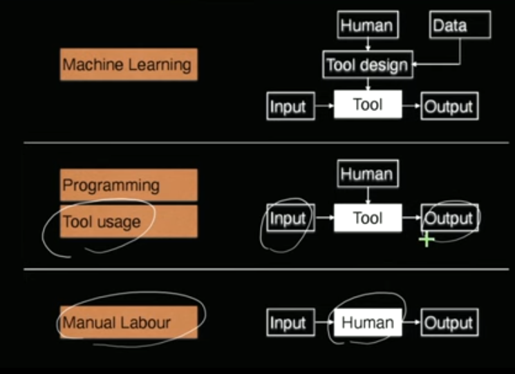

> Machine Learning (ML) is the study of computer algorithms that improve automatically through experience and by use of data.

# Task Hierarchy
> A process that converts an input into an output.

## Why and When ML:
1. Programming/Human Labour Fails
	1. Scale/Speed/Cost of human labour
	2. Inability to express rules using language
	3. Don't know the exact rules transforming input to output
2. Machine Learning can succeed:
	1. Have lots of example data
	2. Have some structural idea on the rules.

- Example where programming is prefered:
	- Password Verification
- Example where ML is preferred:
	- Face Detection
	- Weather Prediction
	- Spam Mail detection
	- Recommendations of products, videos, etc.
	- Smart Assistants (Siri, Google, Alexa)
		- Both the voice detection and the commands recieved
	- Robot AIs
	- Games (Chess, etc.)
	- Marketing (How to reach the most number of people?)

In order for machine learning to be a viable option, the only requirement is the existence of a function which will convert input to output.

The function may not even be necessarily known to us.

Example: conversion of radar map (input) to a weather forecast prediction (output) cannot be done by programming or manual labour as we do not know the rules that dictate whether it will rain or not. But we know that such a set of rules (a function) exists that checks moisture, wind speed, etc. as it is implemented by nature.

# Data & Models
In the context of machine learning, data is a **collection of vectors.**

A model is a mathematical simplification of reality.

> "All models are wrong, but some are useful"
>  \- George Box

No model can be correct as it is, by nature a simplification of reality into a few mathematical equations on which operations are performed.

- Examples:
	- The Ideal Gas Model ($PV=nRT$),
	- Inverse square law of gravitational attraction.
	- Moore's Law of semiconductors.
	- Cobb-Douglas model in Economics.

There are two main types of models used in ML:
- Predictive Model
	- Regression Model
	- Classification Model
	- ...
- Probabilistic Model
	- ...
 
## Predictive Models
### Regression Model 
Regression Models predict a real value variable.

Example: Modelling the price of a house based on Area and Distance from the city.

$$
\text{Price = 0.5Area}-\text{Distance}
$$

Here, the coefficients are not of importance, what is important to notice is that the Price increases with Area and it decreases the further it is from the city.

Therefore we get a real valued number as the Price.

### Classification Model
Classification Models give an output that is discrete in nature.

Example: Modelling whether a house is closer than 2kms to a metro based on price and area.

$$
Answer=\begin{cases}
\text{CLOSE,}\quad\text{if 2*Rooms}-\text{Price}<1
\\
\text{FAR,}\quad\text{otherwise}
\end{cases}
$$

## Probabilistic Model
The goal is NOT used to make a prediction.

The goal is to evaluate how likely an event or a configuration is.

Example: Modeling the probability that a randomly chosen person is in lat-long (25N, 30E)

Example: Modelling the probability that a given tweet was generated by Mr. West

# Learning Algorithm
Means to convert data to models.

Choose from a collection of models with same structure but different parameters.

Example:
$$
\text{Price = a*Area + b*Room + c*Distance}
$$

Here the parameters are $a,\ b\text{ and } c$

We use the data to get the "best" parameters.

# Supervised Learning
## Regression
Some notations that are used throughout:

|Symbol|Meaning|
|:---:|:---|
|$\R^d$|$d-$dimensional vector of reals|
|$x$|vector|
|$x_j$|$j^\text{th}$ coordinate of vector $x$|
|$\|\|x\|\|$|Length of vector $x$|
|$x^i$|$i^\text{th}$ vector in a collection of vectors|
|$x_j^i$|$j^\text{th}$ coordinate of the $i^\text{th}$ vector|
|$(x_j)^n$|$n^\text{th}$ power of the $j^\text{th}$ coordinate of vector $x$|
|$1(\text{Condition})$|Equates to $1$ if $\text{Condition}$ is true and $0$ if false. 

At its core, supervised learning is merely curve-fitting.

For example:
Given: $\{(x^1,y^1), (x^2,y^2), \dots,(x^n,y^n)\}$
Find a model $f$ such that $f(x^i)$ is close to $y^i$

In supervised learning, we denote a value, Loss by:
$$
\text{Loss}[f] =\frac{1}{n}\sum_{j=1}^n(f(x^i)-y^i)^2  
$$

The most common representation of a function $f$ is linear parametrization:
$$
f(x) = w^\text T x+b=\sum_{j=1}^d w_jx_j+b
$$

where $w_1,\ w_2, \dots$ are the linear parameters.

The dependance of the ouput model is linear in terms of its input, that's why it is called the linear model.

## Classification

