<font color=red>need to resize images</font>

# Introduction
## Data Communication
**Data communication** is the exchange of data between two devices via some form of transmission medium.

### Characteristics of an effective data communication system
1. Delivery
	- To the correct destination
2. Accuracy
	- Data must be unaltered
3. Timeliness
	- Data must be delivered in a timely manner.
	- Real-time transmission is one where data is delivered as they are produced, in the same order that they are produced, without significant delay.
4. Jitter
	- Refers to variation in packet arrival time.
### Components of a Data Communication System
There are five components in a data communication system:
1. Message
	- Data to be communicated
  
2. Sender
	- Device that sends the message
  
3. Reciever
	- Device that receives the message
  
4. Transmision medium
	- Physical path by which a message travels.
  
5. Protocol
	- Set of rules that govern data communications, represents agreement between the communicating devices.
	- Without a protocol, two devices may be connected but not communicating.

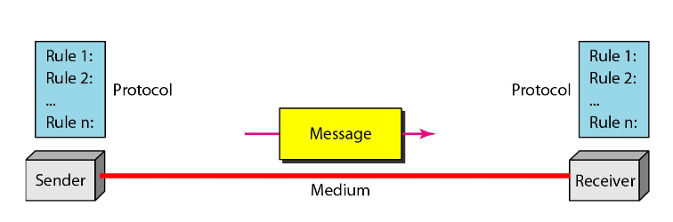

### Data Representation
Information comes in different forms:
1. Text
	- In data communications, text is represented as a bit pattern.
	- Each set is called a code, and the process of representing symbols is called coding.
	- Today, the prevalent coding system is Unicode, which uses 32-bits to represent a symbol or character used in any language in the world.
  
2. Numbers
	- Also represented by bit patterns. However, a code such as ASCII is not used to represent number; the number is directly converted to a binary number to simplifiy mathematical operations.
  
3. Images
	- Images are also represented by bit patterns, where each image is a matrix of pixels.
	- Each pixel is assigned a bit pattern
	- The size and value of the pattern depends on the image.
		- Example, for an image made of only black and white dots (e.g. chessboard), a 1-bit pattern is enough to represent a pixel.
		- The common method used is RGB.
	 
4. Audio
	- Audio is by nature different from text, numbers, or images. It is continous, not discrete.
  
5. Video
	- Video can be produced as a continous entity, or it can be a combination of images, each a discrete entity, arranged to convey the idea of motion.

### Data Flow:
Communication between two devices can be of three types:
1. Simplex
	- Unidirectional transmission.
	- One device can only transmit, while the other can only receive.
	- The entire capacity of the channel can be used to send data in one direction.
2. Half-Duplex
	- Each station can both transmit and receive, but not at the same time.
	- When one device is sending, the other can only receive and vice-versa.
	- The entire capacity of the channel is taken over by whichever of the two devices is transmitting at the time.
3. Full-Duplex
	- Also called duplex.
	- Both station can transmit and receive simultaneously.
	- SIgnals going in one direction share the capacity of the link with signals going in the other direction.
	- Sharing can occur in two ways:
		- Either the link contains two physically seperate transmission paths, one for sending and the other for receiving.
		- Or the capacity of the channel is divided between signals travelling in both directions.

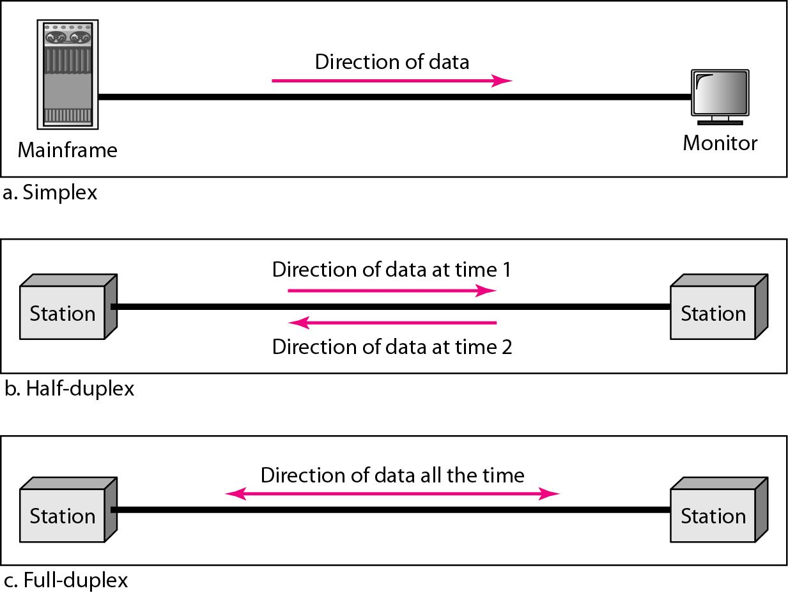

## Networks
A network is a set of devices (often called nodes) connected by communication links.

Most networks use **distrubuted processing**, in which a task is divided among multiple computers.

### Network Criteria
There are three imporant criteria that a network must meet:
1. Performance
	- Depends on network elements:
		- No. of users
		- Transmission Medium
		- Capabilities of hardware
		- Efficiency of software
	- It is measured by:
		- Transit Time: Amount of time required for a message to travel from one device to another.
		- Response Time: Elapsed time bet
	- Evaluated in terms of two networking metrics: Delay and Throughput.
		- We often need more throughput and less delay
2. Reliability
	- Failure rate of network components
	- Measured by:
		- Frequency of failure
		- Recovery time
		- Network's robustness in a catastrophe.
3. Security
	- Data protection against corruption / loss of data due to:
		- Errors
		- Unauthorized access.
	- Implementation of policies and procedure for recovery from breaches and data losses.
	 
### Physical Structures
- Type of Connections
	- Point to Point: single transmitter and reciever
		- provides a dedicted link between two devices.
		- The entire capacity of the link is reserved for transmission between those two devices
	- Multipoint: Multiple recipients of single transmission.
		- Also called multidrop
		- The capacity of the channel is shared, either spatially or temporally.
		- If several devices can use the link simultaneosly, it is a spatially shared connection. If users must take turns, it is a timeshared connection.
 
 
### Topology
The term physical topology refers to the way in which a network is laid out physically.

Two or more devices connect to a link; Two or more links form a topology.

- Type of transmission: unicast, multicast, broadcast.
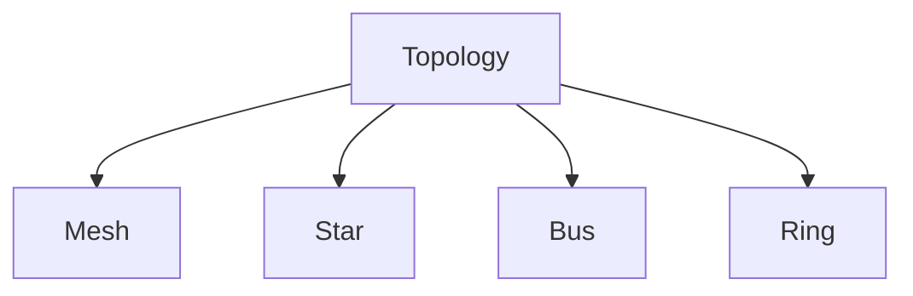


#### Mesh
- Every device has a dedicated point-to-point link to every other device. The link carries traffic only between the two devices it connects.
- Advantages:
	1. The use of dedicated links guarantees that each connection can carry its own data load, thus eliminating the traffic problems that can occur when links must be shared by multiple devices.
	2. A mesh topology is robust. If one link becomes unusable, it does not incapacitate the entire system
	3. There is advantage of privacy & security. When every message travels along a dedicated line, only the intended recipient sees it. Physical boundaries prevent other uses from gaining access to messages.
	4. Point-to-point links make fault identication and fault isolation easy. Traffic can be routed to avoid links with suspected problems. This facility enables the network manager to discover the precise location of the fault and aids in finding its cause and solution.
 
- Disadvantages:
	1. Difficult installation and reconnection.
	2. Sheer bulk of the wiring can be greater than available space.
	3. Hardware required to connect each link can be prohibitively expensive.
 
	- For these reasons a mesh topolgy is usually implemented in a limited fashion
	- For example, as a backbone connecting the main computers of a hybrid network that can include several other topologies.
### Network Types
- Personal Area Networks (PANs)
- Local Area Networks (LANs)
- Wide Area Networks (WANs)
- Metropolitan Area Networks (MANs)


## Switching
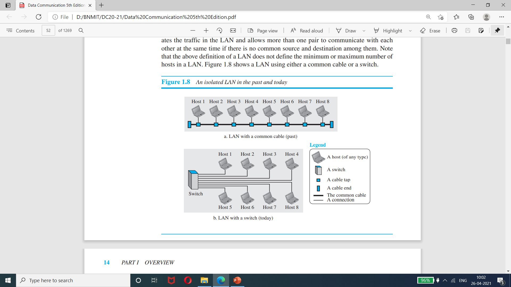
## The Internet
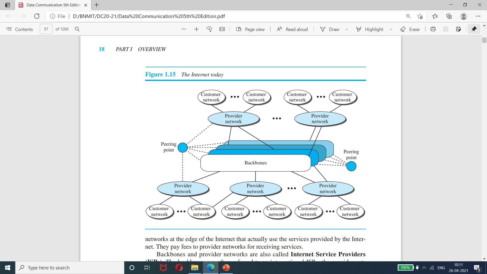
### History of the Internet
#### Early History
- Birth of Packet-switched networks.
- Advanced Research Projects Agency Network (ARPANet)

#### Birth of Internet
- TCP/IP
- Military Network (MILNET)
- Computer Science Network (CSNET)
- National Science Foundation Network (NSFNET)
- Advanced Network Services Network (ANSNET)

#### Internet Today
- World Wide Web
- Multimedia
- Peer-to-Peer Application

### Internet Standards
#### Maturity Levels
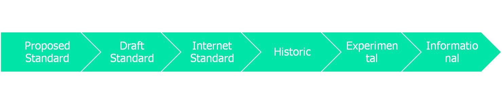

#### Requirement Levels


### Maturity Levels of an RFC
<font color=red>wtf is an RFC?</font>
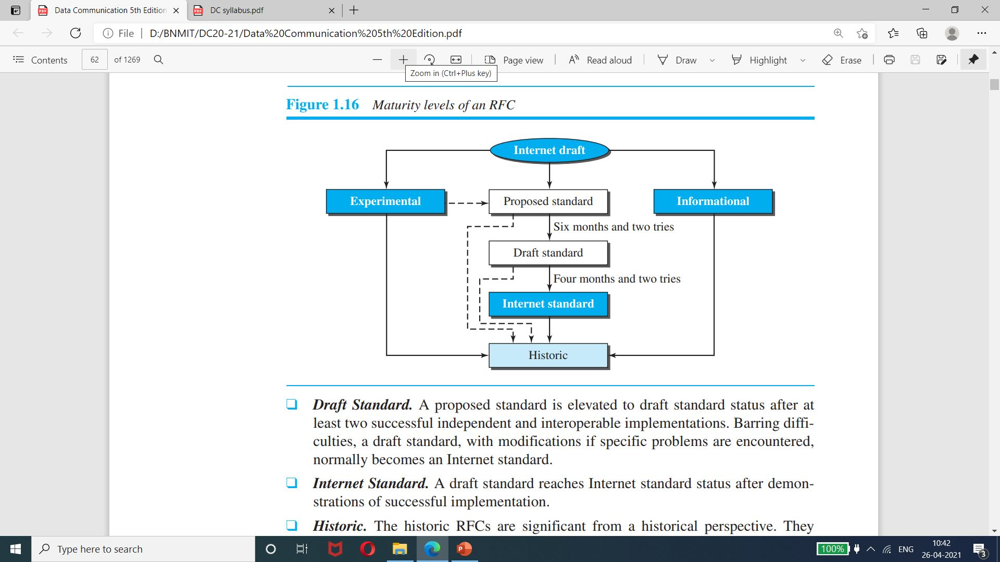

### Internet Administration
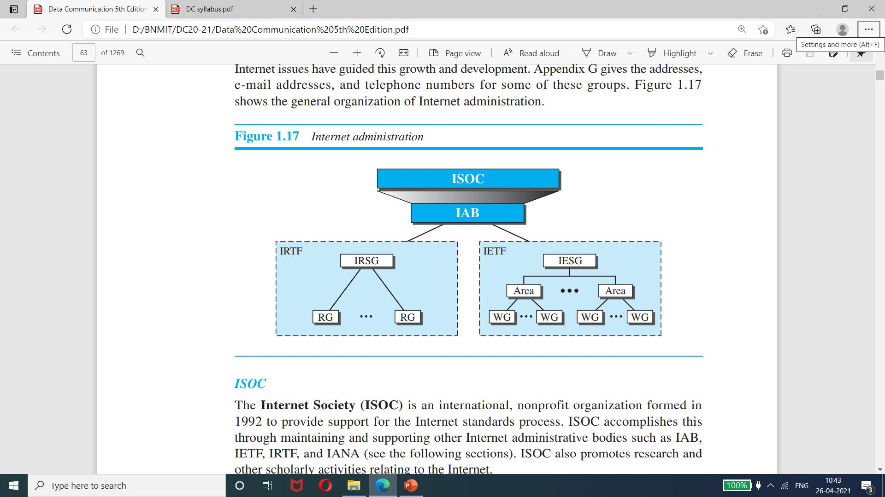

# TCP/IP Protocol Suite
It is a hierarchical protocol made up of interactive modules, each of which provides a specific functionality.

The term hierarchical means that each upper level protocol is supported by the services provided by one or more lower level protocols.

The original TCP/IP protocol suite was defined as having four layers:
1. host-to-network
2. internet
3. transport
4. application

however, today TCP/IP is made of five layers:
1. physical
2. data link
3. network
4. transport
5. application

## Description of each layer:
### Physical Layer
- The physical layer is responsible for carrying individual bits in a frame across the link.
- Although the physical layer is the lowest level in the TCP/IP protocol suite, the communication between two devices at the physical layer is still a logical communication because there is another, hidden layer, the transmission media, under the physical layer.
- Two devices are connected by a transmission medium (cable or air)

### Data Link Layer
- Internet is made up of several links (LANs and WANs) connected by routers. There may be several overlapping sets of links that a datagram can travel from the host to the destination.
- The routers are responsible for choosing the best link. However, when the next link to travel is determined by the router, the data-link layer is responsible for taking the datagram and moving it across the link.
- The link can be a wired LAN with a link-layer switch, a wireless LAN, a wired WAN, or a wireless WAN.
- We can also have different protocols used with any link type. In each case, the data-link layer is responsible for moving the packet through the link.
- TCP/IP does not define any specific protocol for the data-link layer. It supports all the standard and proprietary protocols.
- Any protocol that can take the data gram and carry it suffices for the network layer.
- The data-link layer takes a datagram and encapsulates it in a packet called a frame.
- Each link-layer protocol may provide a different service.
- Some link-layer protocols provide complete error detection and correction, some provide only error correction.

### Network Layer
- The network layer is responsible for creating a connection between the source computer and the destination computer.
- The communication at the network layer is host-to-host. However, since there can be several routers from the source to the destination, the routers in the path are responsible for choosing the best route for each packet.
- The Network layer is responsible for host-to-host communication and routing the packet through possible routes.
- The network layer in the Internet inlcudes the main protocol, Internet Protocol (IP) that defines the format of the packet, called a datagram at the network layer.
- IP also defines the format of and the structure of the adresses used in this layer.
- IP is also responsible for routing a packet from its source to its destination, which is achieved by each router forwarding the datagram to the next router in its path.
- IP is a connectionless protocol that provides no flow control, no error control, and no congestion control services.
- The network layer also includes unicast (one-to-one) and multicast (on-to-many) routing protocols.
- A routing protocol does not take in rounting (it is the responsibility of IP), but it creates forwarding tables for routers to help them in the routing process.
- Network Layer Protocols:
	- The **Internet Control Message Protocol (ICMP)** helps IP to report some problems when routing a packet.
	- The **Internet Group Management Protocol (IGMP)** is another protocol that helps IP in multitasking.
	- The **Dynamic Host Configuration Protocol (DHCP)** helps IP to get the network-layer address for a host.
	- The **Address Resolution Protocol (ARP)** is a protocol that helps IP to find the link-layer address of a host or a router when its network-layer address is given.
 
### Transport Layer
- The logical connection at the transport layer is also end-to-end.
- The transport layer at the source host gets the message from the application layer, encapsulates it in a transport layer packet (called a segment or a user datagram in different protocols) and sends it, through the logical (imaginary) connection, to the transport layer at the detination host.
- The main protocol, **Transmission Control Protocol (TCP)** is a connection-oriented protocol, that first establishes a logical connection between transpot layers at two hosts before transferring data.
- It creates a logical pipe between two TCPs for transferring a stream of bytes.
- TCP provides:
	-  Flow control (matching the sending data rate of the source host with the recieving data rate of the destination host to prevent overwhelming the destination)
	- Error control (to guarantee that the segments arrive at the destination without error and resending the corrupt ones).
	- Congestion control to reduce loss of segments due to congestion in the network.
 
- **User Datagram Protocol (UDP)** is a connectionless protocol that transmits user datagrams without first creating a logical connection.
- In UDP, each user datagram is an independent entity without being realted to the previous or next one (The meaning of the term connectionless)
- UDP is a simple protocol that does not provide flow, error, or congestion control. Its simplicity, which means small overhead, is attractive to an application program that need to send short messages and cannot afford the retransmission of the packets involved in TCP, when a packet is corrupted or lost.
- A new protocol, **Stream Control Transmission Protocol (STCP)** is designed to respond to new application that are emerging in the multimedia.

### Application Layer
- The logical connection between two application layers is end-to-end. The two application layers exhange messages between each other as though there were a bridge between the two layers.
- Communication at the application layer is between two process (two programs running at this layer).
- To communicate, a process sends a request to the other process and receives a response.
- Process-to-process communication is the duty of the application layer.
- The **HyperText Transfer Protocol (HTTPS)** is a vehicle for accessing the World Wide Web (WWW)
- The **Simple Mail Transfer Protocol (SMTP)** is the main protocol used in e-mail services.
- The **File Transfer Protocol (FTP)** is used for transferring files from one host to another.
- The **Terminal Network (TELNET) and Secure Shell (SSH)** are used for accessing a site remotely.
- The **Domain Name System (DNS)** is used by other protocols to find the network-layer address of a computer.
- The **Internet Group Management Protocol (IGMP)** is used to collect membership in a group.

## Encapsulation / Decapsulation
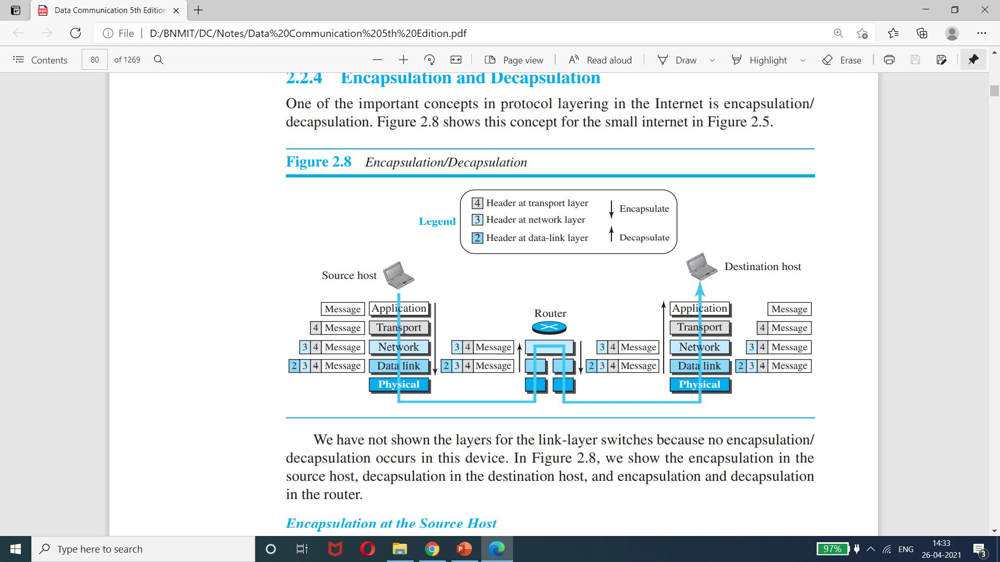

# Addressing in the TCP/IP Protocol Suite
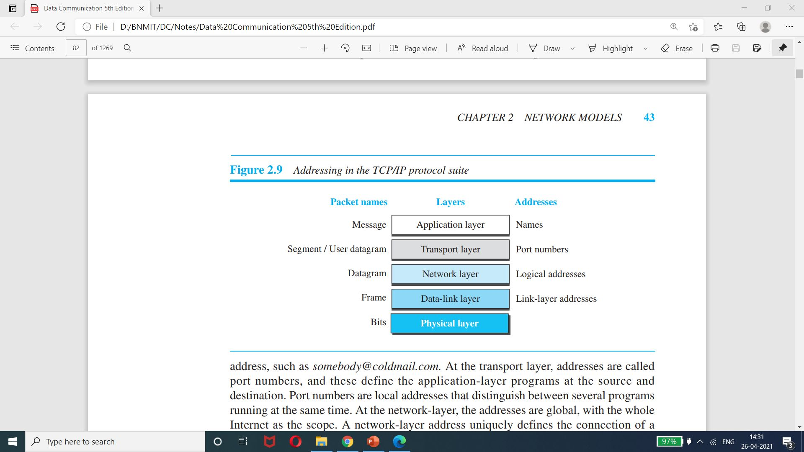

## Physical Address
- The physical address, also known as the link address, is the addresss of a node as defined by its LAN or WAN. It is included in the frame used by the data link layer. It is the lowest level address.
- The physical addresses have authority over the network (LAN or WAN). The size and format of these addresses vary depending on the network.
- For example, Ethernet uses a 6-byte (48-bit) physical address that is imprinted on the Network Interface Card (NIC). LocalTalk (Apple), however has a 1-byte dynamic address that changes each time the station come up.
- Example:
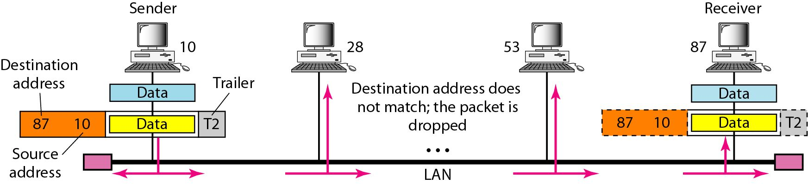

- Most local-area networks use a 48-bit (6-byte) physical address written as 12 hexadecimal digits
		- every byte (2 hexadecimal digits) is seperated by a colon:
```c
//A 6-byte physical address:
07:01:02:01:2F:4B
```

## Logical (IP) Address
- Logical addresses are necessary for universal communications that are independent of underlying physical networks.
- A universal addressing system is needed in which each host can be identified uniquely, regardless of the underlying physical network. The logical address are designed for this purpose.
- A logical address in the Internet is currently a 32-bit address that can uniquely define a host connected to the Internet. No two publicly addressed and visible hosts on the Internet can have the same IP address.
- The figure below shows a part of an internet with two routers connecting three LANs. Each device (computer or router) has a pair of addresses (logical and physical) for each connection. In this case, each computer is connected to only one link and therefore has 
 only one pair of addresses. Each router, however, is connected to three networks (only two are shown in the figure). So each router has three pairs of addresses, one for each connection.
 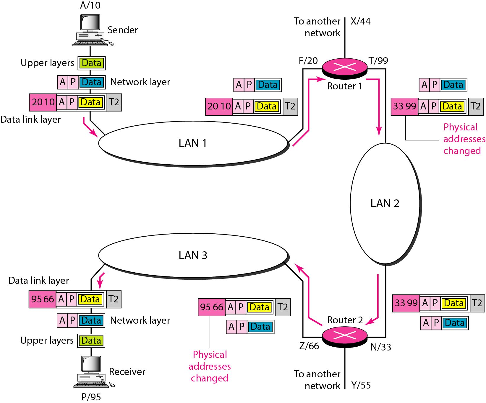

 ## Port Address
 - The IP address and the physical address are necessary for a quantity of data to travel from a source to the destination host.
 - However, arrival at the destination host is not the final objective of data ommunications on the Internet.
 - A system that sends nothing but data from one computer to another is not complete. Today, computers are devices that can run multiple processes at the same time.
 - The end objective of Internet communication is a process communicating with another process.
 - For example, computer A can communicate with computer C by using TELNET. At the same time, computer A communicates with computer B by using FTP.
	 - For these process to receive data simultaneosly, we need a method to label the different processes.
	 - In other words, they need addresses. In the TCP/IP architecture, the label assigned to a process is called a port address. A port address in TCP/IP is 16 bits in length.
  
 - A port address is a 16 bit address represented by one decimal number as shown:
	```c
	//A 16-bit port address
	753
	```
  
**Note:** The physical addresses will change from hop to hop, but the logical addresses and port addresses usually remain the same.


## Multiplexing and Demultiplexing
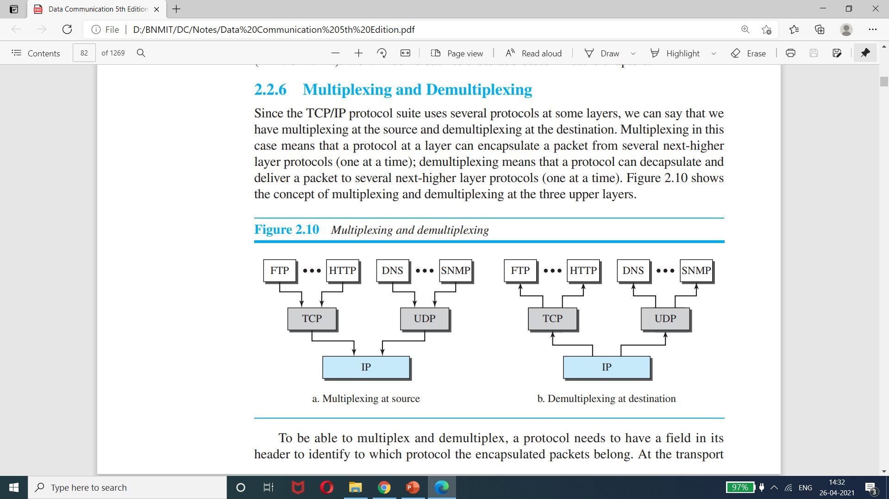


# OSI Layer with TCP/IP
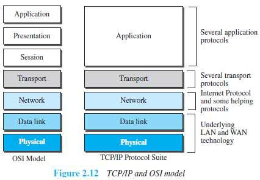

## Limitation of OSI Layer
- OSI was completed when TCP/IP was fully in place and a lot of time and money had been spent on the suite; changing it would cost a lot.
- Some layers in the OSI model were never fully defined.
- When OSI was implemented by an organization in a different application, it did not show a high enough level of performance