> for recomendations / errors / typos:
> [WhatsApp Anag](https://wa.me/919152512006)

# Introduction
- The intent is to learn to apply OO concepts to all stages of the software development cycle.
- OOMD is a way of thinking about problems using models based on real world concepts.
- Objects are the fundamental construct which combine both data structure & behaviour.

## Object Oriented Approach
- OO approach organizes software as a collection of discrete objects.

### The 4 aspects of Object Oriented Approach:
**1. Identity:**
- Data is quantized into discrete, distinguishable entities called objects.
- Objects can be concrete or conceptual
- Each object has its own inherent identity.

**2. Classification**
- Objects with the same data structure & behaviour are grouped into a class.
- Each object is said to be an instance of its class.
  
**3. Inheritance:**
- Sharing of attributes & operations among classes based on a hierarchical relationship.
	- A super class has general information that a sub classes refine, elaborate and create new definitions of.
	 
**4. Polymorphism**
- For the different classes, the same operations may behave differently.
- An operation is a procedure / transformation that an object performs or is subjected to.
	- An implementation of an operation by a specific class is called a method.
	 
## Object Oriented Development
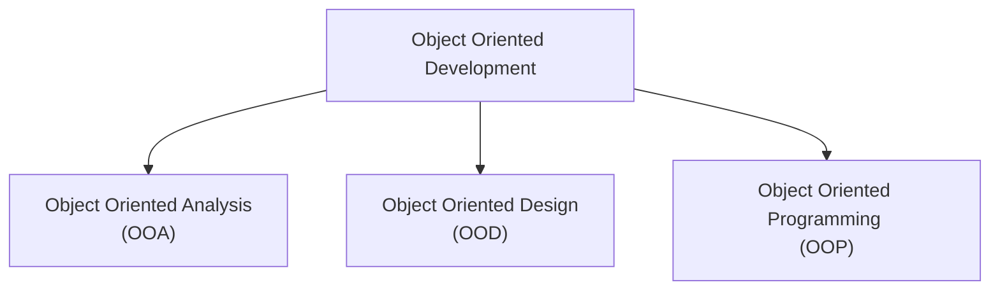

- The essence of OO Development is the identification and organization of application concepts.

## Object Oriented Methodology
> The process consists of building a model of an application and then adding details to it during design.

### Stages of Object-Oriented Methodology:

**1. System conception:**
- Users: Application conception and tentative requirements formulation
  
**2. Analysis:**
- Analyst: Revaluating reqiurements by constructing models
- The analysis model is a concise, precise abstraction of what the desired system must do, NOT how it will be done.
- The analysis model has two parts:
	
	**2.1. Domain Model:**
  	- Description of real world objects reflected within the system. e.g. stock & bonds.

  **2.2. Application Model:**
  	- Description of parts of the application system itself that are visible to the user. e.g. trade execution processes.
	
**3. System Design**
- Development Teams: High-level strategy for solving the application problem: <u>The System Architecture</u>
- System Designer: Decides performance characteristics to optimize, choose strategies for problem-solving, make tentative resource allocation.

**4. Class Design:**
- Class Designer: Adds details to the analysis model in accordance with the system design strategy.

**5. Implementation:**
- Implementers: Translate the classes and relationships from models into a particular programming language, database or hardware.

## Object Oriented Themes
### Abstraction:
- Most important skill required for OO development
- Allows you to focus on key aspects of an application while ignoring the details.
	- i.e. focusing on what an object is and does, before deciding how to implement it.
 
- Abstraction is therefore, the selective examination of certain aspects of a problem.
- All abstractions are incomplete and inaccurate.
-  A good model captures the crucial aspects of a problem and omits others.
 
### Encapsulation
> (Information hiding)

- Seperates the external aspects of an object from the internal implementation details.
- Encapsulation prevents extreme interdependencies and ripple effects due to minor changes.

### Combining data & behaviour
- Caller of an operaton need not consider how many implementations exist.
- The data structure hierarchy matches the operation inheritance hierarchy.

### Sharing
- Inheritance of both data structure and behavior lets sub classes share common code.
- OO offers the prospect of reusing designs and code on future projects.

### Emphasis on the essence of an object
- Data structure has a greater emphasis on data structure than procedure structure than functional-decomposition methodologies.

### Synergy
- The 4 aspects of OOP characterize OO Languages.
- Each of these concepts can be used in isolation, but together they complement each other synergistically.

# Modelling
> A model is an abstraction of something for the purpose of understanding it before building it.

## Purposes served by models:
- **Testing a physical entity before building it.**
	- e.g. Engineering Models of cars.
- **Communication with customers.**
	- e.g. Architects with mock-ups.
- **Visualization**
	- e.g. Storyboads of movies, TV shows.
- **Reduction of complexity.**

## The Three Models:
### 1. Class Model:
> for objects in the system & their relationships.

- Describes the static structure of the objects in the system, their relationships and the attributes and operations for each class of objects.
- Goal: Capture those concepts from the real world that are important to an application.
- Class diagrams: Graph such that: $(V,E)\to(\text{classes},\text{relationships})$

### 2. State Model:
> for the life history of objects.

- Describes the aspects of an object that change over time.
	- Represents the temporal, behavioral "control" aspects of a system.
- State Diagrams: Graph such that: $(V,E)\to(\text{states},\text{transitions})$
	- $\text{transitions}$ are caused between states by events.
	 - State diagrams refer to other models.
	 
### 3. Interaction Model:
> for the interaction among objects.

- Describes how the objects in the system co-operate to achieve broader results.
	- How inividual objects collaborate to achieve the behaviour of the system as a whole.
- This model starts with use cases that are then elaborated with sequence and activity diagrams:
	- **Use Case:** Documents interaction between system and actor. - focuses on the functionality of the system and what it does. 
	- **Sequence Diagrams:** shows the object that interact the time sequence of their interactions.
	- **Activity Diagrams:** Flow of control - elaborates important processing steps.
 
### Relationship among the models:
- The class model describes data structure on which the state and interaction models operate.
- The operations in the class model correspond to events and actions.
- The state model describes the control structure of objects.
- The interaction model focuses on the exchanges between objects.
- The goal is to simplify the system description without loading down the model with so many constructs that it becomes a burden and not help.

# Class Modelling
Class models consist of:
- **Object**:
	- Concept, abstraction or thing with identity that has meaning for an application.
	- Objects can be concrete or conceptual,
	- The choice of object depnds on judgement and the nature of the problem.
	- All objects have identity and are distiguishable.
		- They are distinguished by their inherent existence and not by descriptive properties they may have.
	 
- **Class**
	- An object is an instance of a class.
	- A class describes a group of objecs with same properties (attributes), behaviour (operations), kinds of relationships and semantics.
	- Objects in a class have the same attributes and forms of behaviour.
	- The objects in a class share a common semantic purpose.
 
- **Class Diagrams:**
	- Graphical notation for modelling classes and their relationships, thereby describing possible objects.
	- A class diagram corresponds to infinite set of object diagrams.
		- An **object diagram** shows individual objects and their relationships.
	- **Conventions Used (UML):**
		- UML symbol for both classes and objects is a box.
		- Objects are modelled using box with object name followed by class name.
		- Use boldface to list class name, center the name in the box and capitalize the first letter. Use singular nouns for names of classes.
		- Multiword names (such as AnagDevnani) can be seperated by an intervening capital letter.

		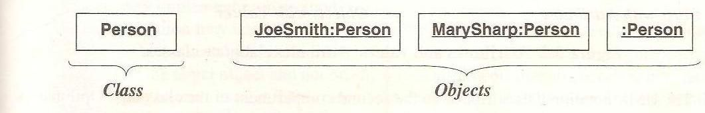$\underbrace{\boxed{\text{Class\_name}}}_\text{Class}\qquad\underbrace{\boxed{\text{object1\_name:Class\_name}}\quad\boxed{\text{object2\_name:Class\_name}}}_\text{Objects}$

- **Values & Attributes:**
	- Value is a piece of data
	- Attribute is a nmaed property of a class that describes a value held by each object of the class.
	- $\text{Object:Class::Value:Atrribute}$
	- Different objects may have the same or different values for a given attribute.
	- Each attribute has a value for each object.
	- Each attribute name is unique within a class.
	- **Conventions used (UML):**
		- List attributes in the 2nd compartment of the class box. Optional details (like default value) may follow each attribute.
		- A colon precedes the type, an equal sign precedes default value.
		- Show attribute name in regular face, left align the name in the box and use small case for the first letter.
		- Similarly we may also include attribute values in the 2nd compartment of object boxes with same conventions.
		
		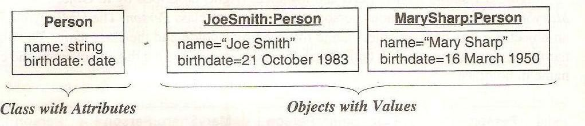
		- **Do not list object identifiers; they are implicit in models.**
		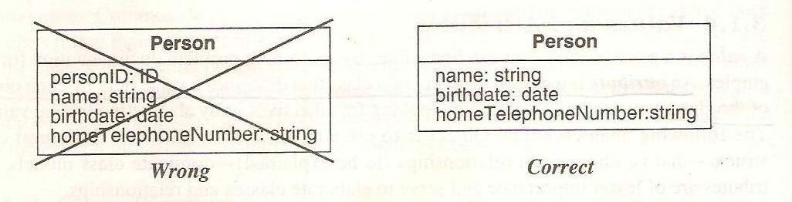

- **Operations & Methods**
	- An operation is a function or procedurer that may be applied to or by objects in a class.
	- Same operation may appply to many different classes. Such an operation is **polymorphic**.
	- A method is the implementation of an operation for a class.
	- When an operation has methods on several classes, it is important that the methods all have the same signature / arguments.
	- **Feature** is a generic word for either an attribute or operations.
	- **Conventions used (UML):**
		- List operation in 3rd compartment of class box.
		- List operation name in regular face, left align and use lowercase for first letter.
		- Optional details like argument list and return type may follow each operation name.
		- Parenthesis enclose an argument list, commas seperate the arguments. A colon precedes the result type.
		
		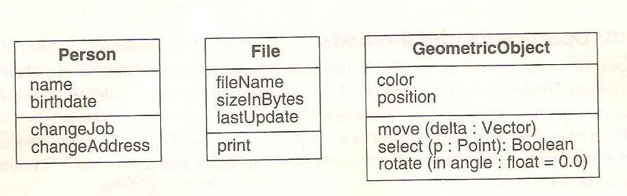

### Summary of Notation for classes:
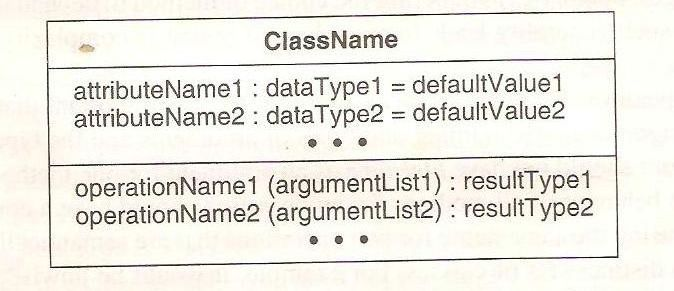

## Link & Assocation
- A **link** is a physical or conceptual connection among objects.
- Mathematically, it is defined a tuple - a list of objects.
- A link is an instance of an **association.**
- An **association** is a description of a group of links with common structure and semantics.
- An association describes a set of potential links in the same way that a class describes a set of potential objects.
- Developers often implement associations in programming languages as references from one object to another.
- A reference is an attribute in one object that refers to another object.
- **Conventions used (UML):**
	- Link is a line between objects; a line may consist of several line segments (wtf is this supposed to mean?)
	- If a link is named, it is underlined.
	- Association connects related classes and is also denoted by a line.
	- Link and association names are shown in *italics*.
	- Association name is optional, if the model is unambigous. Ambiguity arises when a model has multiple associations among same classes.
	- One can use the symbol "arrow()" to make the direction of the name clear
	
	
	- Associations are inherently bidirectional, but the name might change with direction.

	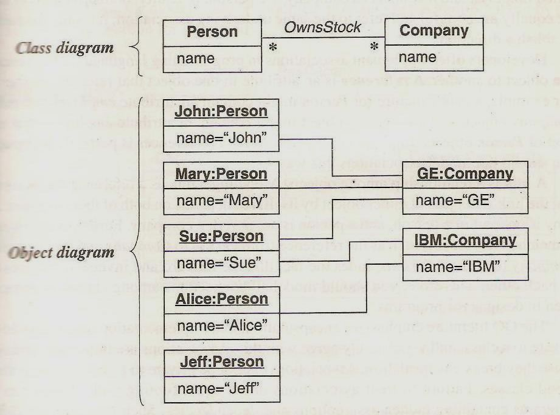

## Multiplicity
- Specifies the number of instances of one class that may realte to a single instance of an associated class.
- Multiplicity constrains the number of related objects.
- **Conventions used (UML):**
	- Multiplicity is listed at the ends of the association lines.
	- Multiplicity is specified with an interval:
		- "1" (exactly one)
		- "1.." (one or more)
		- "3..5" (three to five, inclusive)
		- " * " (many, zero or more)

	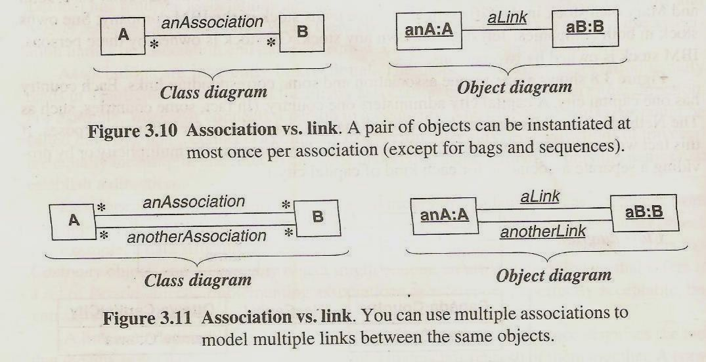
	- Examples:
		- One to One Multiplicity:
		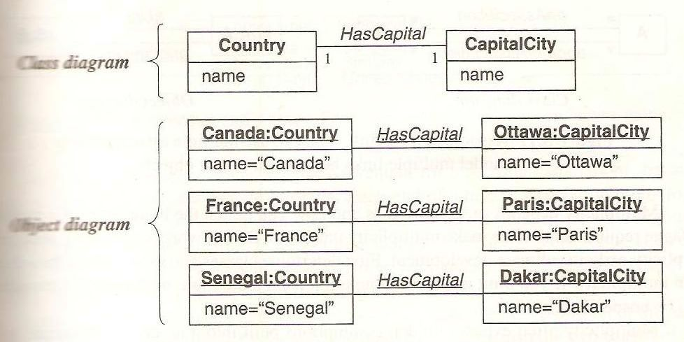
		- Zero to One Multiplicity
		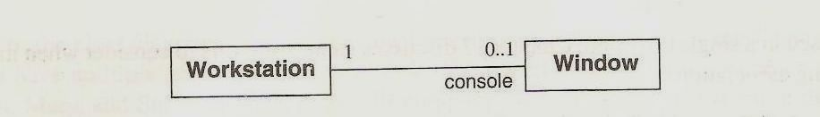

## Association end names
- You can not only assign a multiplicity to an association end, but you can give it a name as well.
- Association end names are necessary for associations between two objects of the same class. They can also distinguish multiple associations between a pair of classes.
- Association end names unify multiple references to the
same class.
- When constructing class diagrams you should properly use association end names and not introduce a separate class for each reference as below fig shows.
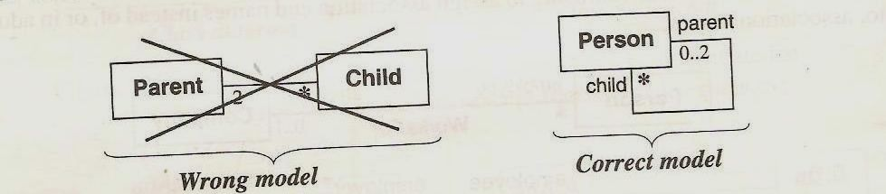

- **Ordering** is an inherent part of association. You can indicate an ordered set of objects by writing “{ordered}” next to the appropriate association end.
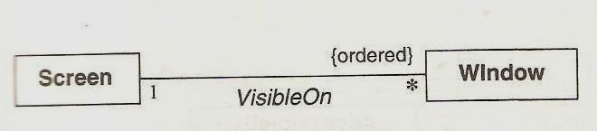

- A **bag** is a collection of elements with duplicates allowed.
- A **sequence** is an ordered collection of elements with
duplicates allowed.
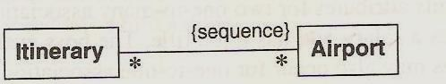

## Association Classes
- An **association class** is an association that is also a class.
- Like the links of an association, the instances of an association class derive identity from instances of the constituent classes.
- Like a class, an association class can have attributes and operations and participate in associations.
- Important in many-to-many associations.
- Attributes for association class unmistakably belong to the link and cannot be ascribed to either object.
- UML notation for association class is a box attached to the association by a dashed line.
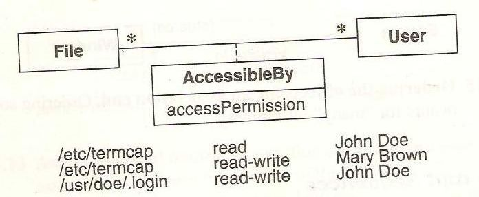
- `accessPermission` is a joint property of `File` and `User` and cannot be attached to either `File` or `User` alone without losing information.
- An association class participating in an association.
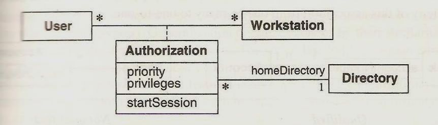

## Qualified Associations
- A **Qualified Association** is an association in which an attribute called the qualifier disambiguates the objects for a “many” association ends.
- It is possible to define qualifiers for one-to-many and many-to-many associations.
- A qualifier selects among the target objects, reducing the effective multiplicity from "many" to "one"
- Qualification increases the precision of a model.

- A bank services multiple accounts. An account belongs to single bank.  Within the context of a bank, the  Account Number specifies a unique account. Bank and account are classes, and Account Number is a qualifier.
- Qualification reduces effective multiplicity association from one-to-many to one-to-one.
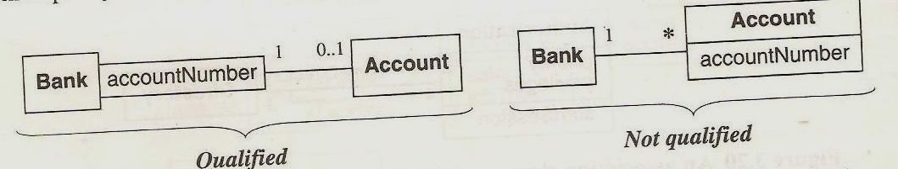

- The notation of a qualifier is a small box on the end of
the association line near the source class.
	- The qualifier box may grow out of any side(top,
bottom , left , right) of the source class.
- The source class plus the qualifier yields the target
class.
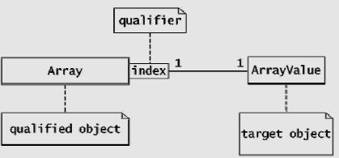

## Generalization & Inheritance
- Generalizaton is the relationship between the super class and the sub classes.
	- i.e. between a class and one or more variations of the class.
- Generalization oraganizes classes by their similiarities and differences, structuring the description of objects.
- The super class holds common attributes, operations and associations, the subclasses add specific attributes, operations, and associations.
- Each subclass is said to inherit the features of its superclass.

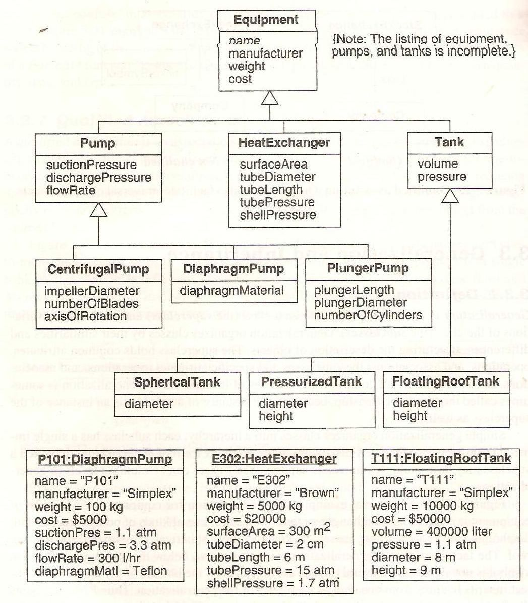

- Generalization is transitive across an arbitrary number of levels.
- The term *ancestor* and *descendent* refers to the generalization of classes across mulitple levels.
- An instanct of subclass is simultaneously an instance of all its ancestor classes.
- An instance includes a value for every attribute of every ancestor class.
- An instance can invoke any operation on any ancestor class.
- a **generalization set name** is an enumertaed attribute that indicates which aspect of an object is being abstracted by a particular generalization.
- The word written next to the generalization line diagram `dimensionality` is a generalization set name. 
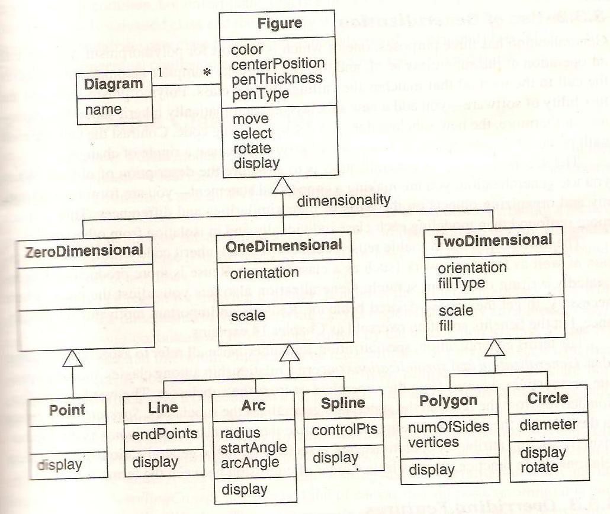

- There can be multiple levels of generalizaiton.
- **Convention used (UML):**
	- Large hollow arrowheads are used to denote generalization. The arrowheads point to the superclass.
 
### Use of Generalization:
- **To support polymorphism:** You can call an operation at the super class level, and the OO language compiler automatically, resolves the call to the method that matches the calling object's class.
- **To strucutre the description of objects:** i.e. to frame a taxonomy and organize objects on the basis of their similiarities and differences.
- **To enable reuse of code:** Reuse is more productive than repeatedly writing code from scratch.

- The terms generalization, specialization and inheritance all refer to aspects of the same idea:
	- *Generalization* derives from the fact that the super class generalizes the subclasses.
	- *Specialization* refers to the fact that the super class refine or speicalize the subclasses.
	- *Inherticance* is the mechanism for sharing attributes, operations and associations via the generalization / specialization relationship.
 
- **Overriding Features**:
	- A subclass may override a super class feature by defining a feature with the same name.
		- The overriding feature refines and replaces the overriden feature.
	 
	- Why Override Features?
		- To specify behaviour that depends on subclass.
		- To tighten the specification of a feature.
		- To improve performance.
	- You may override methods and default values of attributes. You should never override the signature, or form of a feature.

Incomplete: 4 - Advanced Class Modelling
 
5 - State Modelling
