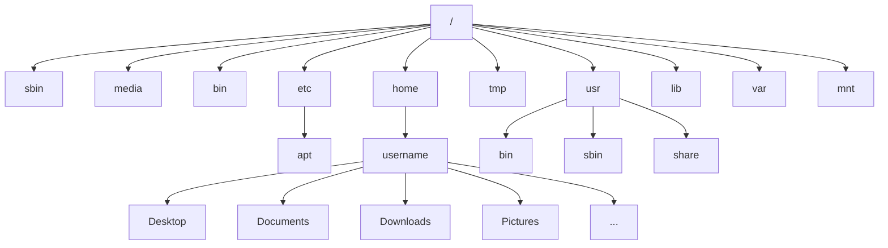

# Introduction
A typical shell environment presents us with (for example):
```
[anag@thinkpad ~]$ ls -a
```

here,
`anag` is the username
<br>
`thinkpad` is the hostname
<br>
`~` is the path of the current working directory. (in this case it is `/home/anag`)
<br>
`ls` is the command
<br>
`-a` is an option (or argument)
<br>
`[anag@thinkpad ~]$` together comprise something called as the command prompt.

# Some simple commands
`clear`: clears the current screen (can also be called with `ctrl+L`)
<br>
`pwd`: returns the present working directory
<br>
`ls`: list all folders and files in a directory.
<br>
`ps`: returns the current active processes.
<br>
`uname`: gives information about the system, kernel, user, etc.
<br>
`exit` exits the terminal. (can also be called with `ctrl+D`)
<br>
`date`: date and time
<br>
`cal`: calendar
<br>
`free`: memory statistics
<br>
`groups`: groups to which the current user belongs
<br>
`file` gives information about a file
### Additional info about these simple commands
- `ls` has three very useful arguments `-l`, `-a` and `-i`.
  - `ls -l` give the output in a long format which provides information the following in their respective order:
  ```
  drwx-xr-x 5 anag anag 12288 Jul 25 13:05 Documents
  ```
    - these are file type, permissions, number of hard links, owner, group, size (in bytes), date modified, filename respectively.
    - file types displayed by `ls -l` are:
      |denotation|description|
      |----------|-----------|
      |-|regular file|
      |d|directory|
      |l|symbolic link|
      |c|character file|
      |b|block file|
      |s|socket file|
      |p|named pipe|
  - `ls -a` lists all the file present in the pwd, even the hidden files denoted by a dot (`.`)    in the beginning of the name (e.g. `.bashrc`)
  - `ls -i` returns the inode of the file.
    - an inode is an entry in the filesystem table about the location in the storage media.
- `cd` command can be given hyphen (`-`) as an argument to return to the previous directory: `cd -` 

# File Permissions
Permissions are generally denoted by a 9 chararcter string such that the first 3 denote the permission of the owner, the next 3 denote the permissions of the group and the final 3 for other users.

the 3 character permission template is used across all 3 user subgroups.
it follows the format of read, write and execute denoted by `r`, `w` and `x` respectively.

if the appropriate character is present, then that subgroup (owner, group or others) has permissions to perform that particular action. If the character is absent, we denote the absence with a hyphen (`-`).

example, let this be the permissions of a file:
```
rwxr-xr--
```
here the 9 character string denotes that:
- owner has permissions to read, write and execute.
- group has permissions to read and execute.
- others has permissions to read.


### File permissions for directories
for directories the following holds true:
- `r` implies the permission to view the contents of the directory.
- `w` implies the permissions to create files or folders within the directory.
- `x` implies the permission to `cd` into said directory.

### Numerical representation
These permissions can also be represented numerically as a 3 digit (technically, octet) integer.
the first digit denotes the permissions of the owner, the second of the group and the third of others.

To convert regular 9 character string persmissions to integer we imagine the string to be a binary string where we replace `-` with `0` and anything else (`r`, `w` or `x`) with `1`.

example `rwxr-xr--` becomes `111101100`

we then convert this binary value to decimal taking groups of 3

therefore `111101100` becomes 751

this numerical value is used when changing permissions.

## Changing file permissions (`chmod`)
example:
```
chmod g-w file1
```
this command will remove the write (`w`) permission from group for a file called `file1`.

similiarly we can also use `u`, `o` and `a` for owner, others and all respectively.
`+` can be used in place of `-` for adding permissions.
`r` and `x` can be used for read and execute respectively.

Another way to use `chmod` is to provide the numerical representation for permissions such as:
```
chmod 700 file1
```

# Hardlinks

# File System Hierarchy
Linux uses FHS (Filesystem Hierarchy Standard)
FHS 3.0 released on June 03, 2015
available at: [Linux Foundation (.org)](https://refspecs.linuxfoundation.org/fhs.shtml)


- `/` is the root of the file system
- `/` is also the delimeter for sub-directories
- `.` is the current directory
- `..` is the parent directory

**Note:** path for traversal can be absolute or relative.
## File System Hierarchy Explained:
|Directory|Description|
|:---|:---|
|/bin|Essential command binaries|
|/boot|Static files of the boot loader|
|/dev|Device files|
|/etc|Host specific system configuration|
|/lib|Essential shared libraries and kernel modules|
|/media|Mount points for removable devices|
|/mnt|Mount points|
|/opt|Add on application software packages|
|/run|Data relevant to running processes|
|/sbin|Essential system binaries|
|/srv|Data for services|
|/tmp|Temporary files|
|/usr|Secondary hierarchy|
|/var|Variable data|

## /usr hierarchy explained:
|Directory|Description|
|:---|:----|
|/usr/bin|User commands|
|/usr/lib|Libraries|
|/usr/local|Local hierarchy|
|/usr/sbin|Non-vital system binaries|
|/usr/share|Architecture independent data|
|/usr/include|Header files included by C programs|
|/usr/src|Source code|

## /var hierarchy explained
|Directory|Description|
|:----|:----|
|/var/cache|Application cache data|
|/var/lib|Variable state information|
|/var/local|Variable data for /usr/local
|/var/lock|Lock files|
|/var/log|Log files and directories|
|/var/run|Data relevant to running processes|
|/var/tmp|Temporary files preserved between reboots|

||sharable|unsharable|
|:----:|:----:|:----:|
|**static**|/usr<br>/opt|/etc<br>/boot|
|**variable**|/var/mail|/var/run<br>/var/lock|

1.2: 22:13
