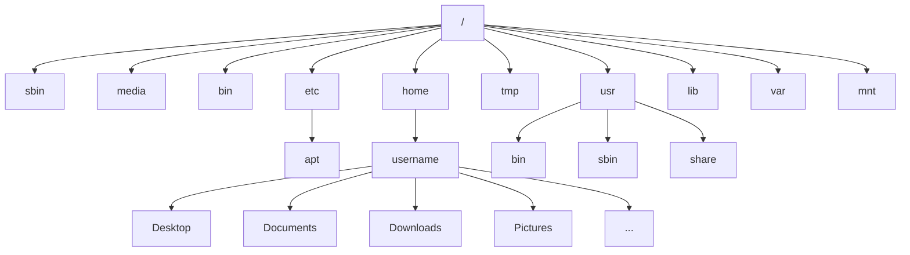

# Introduction
A typical shell environment presents us with (for example):

[anag@archlinux ~]$ ls -a

here,
`anag` is the username
`archlinux` is the hostname
`~` is the path of the current working directory. (in this case it is `/home/anag`)
`ls` is the command
`-a` is an option (or argument)
`[anag@archlinus ~]$` together comprise something called as the command prompt.

# File System Hierarchy
Linux uses FHS (Filesystem Hierarchy Standard)
FHS 3.0 released on June 03, 2015
available at: [Linux Foundation (.org)](https://refspecs.linuxfoundation.org/fhs.shtml)

- `/` is the root of the file system
- `/` is also the delimeter for sub-directories
- `.` is the current directory
- `..` is the parent directory

**Note:** path for traversal can be absolute or relative.
## File System Hierarchy Explained:
|Directory|Description|
|:---|:---|
|/bin|Essential command binaries|
|/boot|Static files of the boot loader|
|/dev|Device files|
|/etc|Host specific system configuration|
|/lib|Essential shared libraries and kernel modules|
|/media|Mount points for removable devices|
|/mnt|Mount points|
|/opt|Add on application software packages|
|/run|Data relevant to running processes|
|/sbin|Essential system binaries|
|/srv|Data for services|
|/tmp|Temporary files|
|/usr|Secondary hierarchy|
|/var|Variable data|

## /usr hierarchy explained:
|Directory|Description|
|:---|:----|
|/usr/bin|User commands|
|/usr/lib|Libraries|
|/usr/local|Local hierarchy|
|/usr/sbin|Non-vital system binaries|
|/usr/share|Architecture independent data|
|/usr/include|Header files included by C programs|
|/usr/src|Source code|

## /var hierarchy explained
|Directory|Description|
|:----|:----|
|/var/cache|Application cache data|
|/var/lib|Variable state information|
|/var/local|Variable data for /usr/local
|/var/lock|Lock files|
|/var/log|Log files and directories|
|/var/run|Data relevant to running processes|
|/var/tmp|Temporary files preserved between reboots|

||sharable|unsharable|
|:----:|:----:|:----:|
|**static**|/usr /opt|/etc /boot|
|**variable**|/var/mail|/var/run /var/lock|

1.2: 22:13
# Some simple commands
`clear`: clears the current screen (can also be called with `ctrl+L`)
`pwd`: returns the present working directory
`ls`: list all folders and files in a directory.
`ps`: returns the current active processes.
`uname`: gives information about the system, kernel, user, etc.
`exit` exits the terminal. (can also be called with `ctrl+D`)