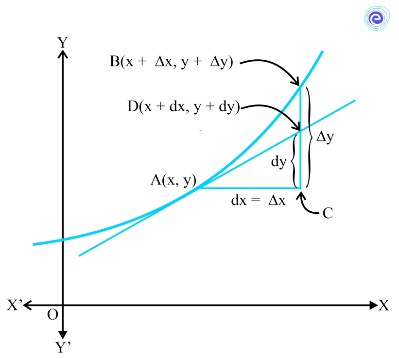

# Marginal Rate
- Rate of change of some economic variable (revenue, cost, profit...)
	- $\text{If }C(x)\text{ is Total Cost }\implies\text{ Marginal Cost }= \frac{dC(x)}{dx}$
	- $\text{If }R(x)\text{ is Total Revenue }\implies\text{ Marginal Revenue }= \frac{dR(x)}{dx}$

# Errors & Approximation

$$
\text{Slope of Line AB}  = \frac{\Delta x}{\Delta y} = f'(x)
\\
\
\\
\text{Change in }y = \Delta y = f'(x)\times\Delta x
\\
\
\\
\text{Relative change in }y = \frac{\Delta y}{y} = \frac{f'(x)\times\Delta x}{y}
$$

## Tangent & Normal
The Derivative of a function give the tangent at that point.
$$
\text{Slope at point }P = \tan\theta = f'(x)|_{P}
\\
\
\\
\text{Slope of Normal at point }P = \frac{-1}{f'(x)|_{P}}
\\
\
\\
\therefore \text{ Equation of Tangent }\implies \frac{y-y_o}{x-x_o} = \frac{dy}{dx}\bigg|_{P}
\\
\
\\
\implies y-y_o = f'(x)|_P\space(x-x_0)
\\
\
\\
\therefore \text{Equation of Normal:}
\\
\
\\
\implies \frac{-1}{f'(x)|_P} = \frac{-dx}{dy}\bigg|_P
$$