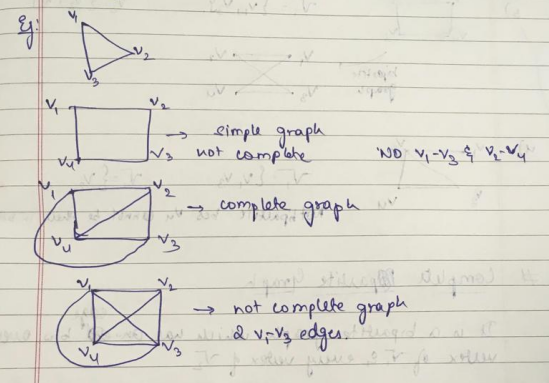
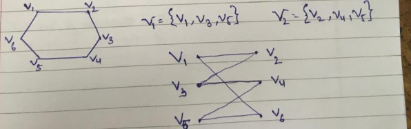
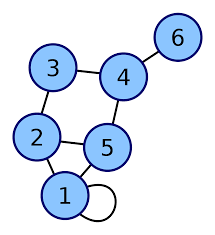
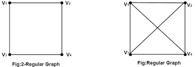
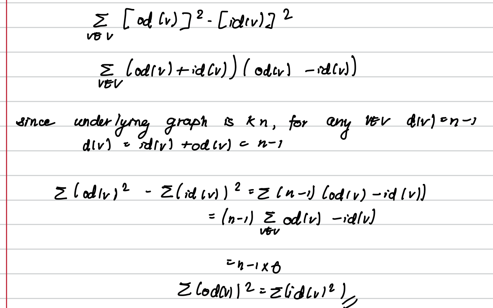
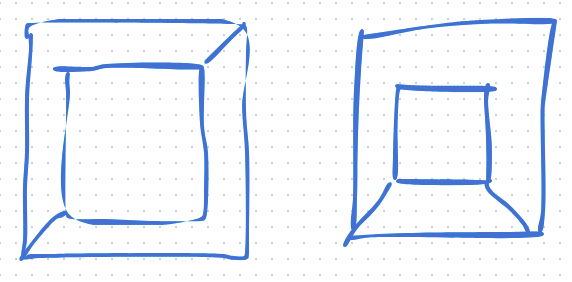
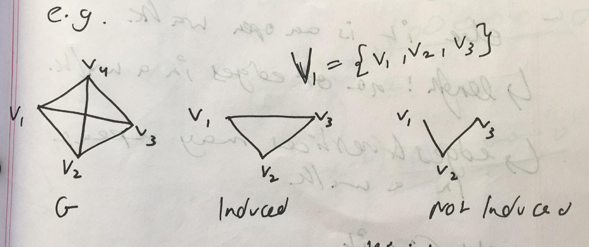
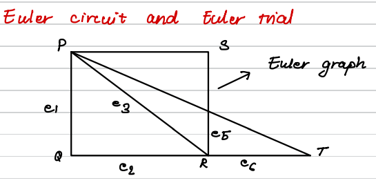
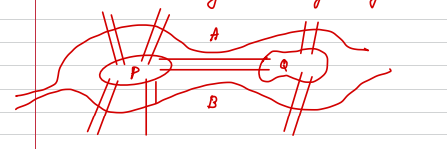

# Introduction
- **Graph:** Collection of edges and vertices.
- Can also be a set of vertices with no edges (null graph)
- A graph with only 1 vertex is a Trivial Graph (Special case of null graph)
    - Therefore a graph, is the collection of $(V,E)$ where $V$ is the non-empty set of vertices and $E$, the set of edges is a set of <u>**unordered**</u> pairs of the elements of V.

- Any graph with direction is called a directed graph / Digraph.
    - Therefore a digraph, is the collection of $(V,E)$ where $V$ is the non-empty set of vertices and $E$, the set of edges is a set of <u>**ordered**</u> pairs of the elements of V.
    - For such graph the edge name should have proper vertex direction.
e.g. VAVB is an edge from VA to VB. (and not from VB to VA)

- Simple Graph:
    - No Loops
        - A loop is an edge with originates and terminates at the same point.
    - No Multiple / Parallel Edges between two vertices.
### Order, Size, Indegree & Outdegree
- Order: Number of vertices in the graph = $|V|$
- Size: Number of Edges in the graph = $|E|$
- Indegree = Number of edges entering a vertex = $\text{id}(v)$ = $d^-(v)$
- Outdegree = Number of edges leaving a vertex = $\text{od}(v)$ = $d^+(v)$
- Note: The sum of all the indegrees / outdegrees of all the vertices in the graph is equal to the number of edges.
    - This value is **not** equal to $\frac{n(n-1)}{2}$ because it may not work for graphs where each vertex is not connected to every other vertex.

NOTE: If 2 edges overlap / intercept the point of intersection is NOT a new vertex. Therefore, Geometrical appearance may not match the theoretical value.

## Parallel
- Parallel Vertices: Two vertices are said to be parallel if they are connected by an edge.
- Parallel Edges: Two edges are said to be parallel if they are contained within the same two vertices (i.e. they have the same origin and terminal point, direction doesn't matter)
- Multiple Edges: Edges are said to be multiple if there are more than 2 parallel edges within two vertices.
## Complete Graph
- A simple graph of order $\geq 2$ is said to be a complete graph if there is ?exactly 1? edge b/w every pair of vertices.

## Biparite Graph
Let $G$ be the simple graph with the vertex set V is the union of 2 mutually disjoint subset $V_1\  \&\  V_2$ such that each edge in $G$ has one end vertex in $V_1$ and another end vertex in $V_2$.
E.g. 

## Complete Bipartite Graph
 It is a bipartite graph which has an edge b/w every vertex of $V_1$ and every vertex of $V_2$
 i.e. every vertex connected to other set's every vertex.

own way to identify whether a graph is bipartite or not:
there should not be a path such that, there are two vertices from the same set adjacent to each other (ignoring the edges).
i.e. the vertices in a path must alternate between the two sets.

 **Note:** A complete partite graph is denoted by $G(V_1,V_2:E)$ or $k_{r,s}$
 where:
 $r\rightarrow\text{no. of vertices in }V_1\\s\rightarrow\text{no. of vertices in }V_2$

**Note:** If $G$ is a complete bipartite graph, $k_{r,s}$, then:
	- No. of vertices = $r + s$
	- No. of edges = $r.s$

 ### Property
 > If $G$ is a simple graph. $2|E|\leq|V|^2-|V|$
 
Proof:
$$
\text{Let }|E|\text{ be m \& }|V| = n;
\\
\because G\text{ is a simple graph, max no. of edges is number of pairs of vertices in }G\\
\
\\
\therefore m\leq\ ^nC_2
\\
\
\\
m\leq\frac{n!}{(n-2)!\ 2!}
\\
\
\\
m\leq\frac{n(n-1)\cancel{(n-2)!}}{\cancel{(n-2)!}2!}
\\
\
\\
\therefore 2m\leq n^2-n\implies \boxed{2|E|\leq|V|^2-|V|} 
$$

### Property
> If $G$ is a complete graph with 'n' vertices then:
$2|E| = |V|^2-|V|\\2m = n^2-n$

## Degree of a vertex
Degree of a vertex, $v$ is the no. of edges incident to $v$ denoted by $d(v)$
**Note:** A loop counts for 2 degrees as it will be incident from both the sides.

Example here, 
$d(v_1) = 4$
## $k-$regular graph
- A graph is said to be regular if degree of each vertex is $k$.

**Some Notations:**
- Complete Graph: $k_n$
- Complete bipartite graph: $k_{r,s}$

## $k-$hypercube
- A loop free k-regular graph with $2^k$ vertices is called $k-$ dimensioned hypercube, denoted by $Q_k$.

## Handshake property
let $v_1,\ v_2,\ v_3\dots,\ v_n$ be the vertices of a graph then:
$$
\sum_{i=1}^{n} d(v_i) = 2|E|
$$
### Theorem 1
> The number of odd degree vertices is even.

**Proof:**
1. Take it to be false.
2. Find sum of degreee of all vertices.
3. compare with handshake property.
4. This poses a contradiction, therefore it must be true.

### Theorem 2
> Let $G$ be a bipartite graph $|V| = n$, $|E| = m$, then $4m\leq n^2$

Proof:
1. Split bipartite $|V|$ into $|V_1| + |V_2|$
2. $\text{AM} \geq \text{GM}$
3. $\frac{r+s}{2}\geq\sqrt{rs}$
	- $\frac{n}{2} \geq \sqrt{m}$
		- $n^2\geq 4m$

### Theorem 3 
> For a graph with n vertices and n edges if $\delta$ is minimum and $\Delta$ is the maximum of the degree of the vertices, then show that $\delta \leq \frac{2m}{n}\leq\Delta$

1. $\delta\leq \deg(v_i)\leq \Delta$
2. $n\delta\leq \sum\deg(v_i)\leq n\Delta$ (Applying sum)
3. $\delta\leq \frac{2m}{n}\leq \Delta$ (By Handshake property)

### Theorem 4
> Show that $k-$dim hypercube has $k2^{k-1}$ edges.

1. Each vertex in $Q_k$ has degree $k$
2. Number of vertices in $Q_k= 2^k$
3. Use handshake property

### Q)
> Let $G$ be any graph of order 9 such that each vertex has degree either 5 or 6.
Prove that atleast 5 vertices have degree 6 or 6 vertices have degree 5.

1. Take $p=\text{number of vertices with deg. }5$
	- Therefore $(9-p)=\text{number of vertices with deg. }6$
2. By Handshake property:
	- $5(p)+6(9-p)=\text{Even}$
3. Therefore $54-p=Even$
4. Limit $0\leq p\leq 9$ and $p\in\{\text{Even}\}$
5. Take cases for values of $p$ and $9-p$

### Q)
> Let $D$ be a digraph with $n$ vertices if the underlying graph is $k_n$.
Prove that
$$
\sum od(v)^2 = \sum id (v)^2
$$

# Isomorphism
Two Graphs $G= (V,E)$ and $G' = (V^{-1}, E^{-1})$ are said to be isomorphic to each other if there exists $f: V\longrightarrow V^{-1}$ such that:
	- $f$ is one-one & onto.
	- $\forall \ v,u \in V$ if $(v,u)$ is an edge in $E$ then $(f(v),\ f(u))$ be an edge in $E^{-1}$
	
Note: To prove 2 graphs are isomorphic in a question, show one-one correspondence between vertices and between edges.
	- If not, show why it can't be isomorphic.

**Note:** It is possible two graphs have the same number of vertices, degree and edges but still be anisomophic.
Example:

## Isomorphism for digraphs
2 digraphs, $D_1$ & $D_2$ are said to be isomorphic to each other, if:

There is one-one correspondance between their vertices and their edges such that adjacency and directon is preserved.

## Incidence matrix
Let $G$ be a graph with $n$ vertices and $m$ be the number of edges.
Then the incident matrix of G is of order $n\times m$ say $B = (b_{ij})_{i,j\geq 1}$ such that the elements of matrix $B$:
$$
b_{ij} = \begin{cases}1,\qquad\text{If the edge, }e_j\text{ is incident with }v_i\\2,\qquad\text{If the edge, }e_j\text{ is in loop with }v_i\\0,\qquad\text{Otherwise.}\end{cases}
$$

### Observations of Incidence Matrix
1) Sum of entries of row $R_i$ is the degree of vertex $v_i$
2) Sum of entries of any column $C_j$ is always 2.
	- Because an edge, $e_j$ can only be formed by two vertices.
3. If two columns are similiar, they imply the presence of multiple edges.

## Adjacency Matrix
Let $G$ be the graph with $v_1, \ v_2,\ v_3\dots\ v_n$ vertices. Then the adjacency matrix of G is:
$$
A = (a_{ij})_{i,j\ \geq\ 1}
$$
where $a_{ij}$ is the number of edges incident from $v_i$ to $v_j$.

We can get the number of edges in a graph by counting the number of elements in the upper or lower triangular matrix (of the adjacency matrix)

### Observations of Adjacency Matrix
1. It is a square symmetric matrix
2. Sum of row / column gives the degree of the coresponding vertex.
3. Any value greater than 1 implies multiple edges.
4. Any value $\neq 0$ in diagonal implies a loop is present.

# Subgraphs
- Given two graphs, $G$ and $G_1$, we say $G_1$ is a subgraph of $G$ if the following holds:
	- All the vertices and edges of $G_1$ are in $G$.
	- Each edge of $G_1$ has the same end vertices in $G$ as in $G_1$

## Spanning Subgraphs
Given a graph $G=(V,E)$ and subgraph $G_1=(V_1,E_1)$ then $G_1$ is said to be a spanning subgraph if $V=V_1$

## Induced Subgraph
Given a graph $G=(V,E)$ and subgraph $G_1=(V_1,E_1)$ such that every edge $(A,B)$ of $G$ where $A,B\in V_1$ is an edge in of $G_1$ also then $G_1$ is called induced subgraph of $G$.

Basically, $G_1$ should contain every possible edge in $G$ which has its endpoints in $V_1$.

## Edge disjoint & vertex disjoint
Let $G$ be a graph $(V,E)$ & $G_1(V_1,E_1)$ & $G_2(V_2, E_2)$ be 2 subgraphs of $G$.

Then $G_1$ and $G_2$ are said to be vertex disjoint if $V_1\cap V_2=\phi$

And they are said to be edge disjoint if $E_1\cap E_2=\phi$

# Walks and their types
- **Walk:** Sequence of vertices and edges.
	- Example: $v_1e_1v_2e_2\dots v_n$
	- A walk is said to be **closed** if the end vertices are the same.
	- Similiarly, it is said to be **open** otherwise.
	- **Length:** The number of edges in a walk.
	- Edges and vertices may repeat in a walk.
- **Trail:** An open walk with no edge repeated.
- **Circuit:** A closed walk with no edge repeated.
- **Path:** Trail with no vertex repeated.
- **Cycle:** Circuit with no vertex repeated except the end vertex.
- **Distance:** Shortest path between 2 points.

### Connected Graphs
**Connected Graph:** If there is a path b/w every pair of distinct vertices (class definition)
If there is atleast 1 walk containing all the vertices. (Own Definition)

### Component of a Graph
The subgraph $G_1$ is said to be component of $G$ if it satisfies the following:
1. $G$ is connected.
2. If $G_2$ is connected subgraph of $G$ and $G_1$ is subgraph of $G_2$, then $G_1=G_2$

From Wikipedia:
- A component graph is a connected subgraph of a graph that is not a connected subgraph of a larger graph.

**Note:** Number of components in a graph $G$ is denoted by $\underbrace{\kappa}_\text{kappa}(G)$

### Theorem 1:
> If a graph has exactly 2 vertices of odd degree then there must be a path connecting the vertices.

**Proof:**

let $v_1$ and $v_2$ be 2 vertices of odd degree

Assume that there is no path between them making the graph disconnected.

i.e. the graph G contains at least two components say $H_1$ and $H_2$.

Now, $v_1 \in H_1\text{ or }H_2$ and $v_2 \in H_2\text{ or }H_1$

$H_1$ and $H_2$ are connected graphs containing 1 vertex of odd degree.

However since every graph must have an even number of odd degree vertices (From Handshake theorem) our initial assumption must be wrong.
### Theorem 2:
> A simple graph with $n$ vertices and $k$ components can have atmost $\frac{1}{2}(n-k)(n-k+1)$ number of edges.
### Theorem 3:
 > A connected graph with $n$ vertices has atleast $n-1$ edges.

### Theorem 4:
> If $G$ is a simple graph with $n$ vertices and in which the degree of every vertex is atleast $\frac{n-1}{2}$ then prove that $G$ is a connected graph.

### Theorem 5:
> Prove that connected graph $G$ remains connected after removing an edge $e$ from $\text{iff }e$ is a part of some cycle $C$.

### Theorem 6:
> Let $G$ be a disconnected graph of even order $n$ with two components each of which is complete. Prove that $G$ has a minimum of $\frac{n(n-2)}{4}$ edge.

# Trees
- **Tree:** A connected graph with no cycles.
- **Leaf:** A pendant vertex of the tree.
	- pendant vertex is a vertex with degree 1.
- **Forest:** A graph where each of its components is a tree.

### Theorem 1:
> In a tree there is one and only one path between every pair of vertices.

The converse is also true.
i.e.
> If in a graph, there is one and only one path between each pair of vertices then that graph is a tree.

### Theorem 2:
> A tree with $n$ vertices has $(n-1)$ edges.

## Spanning Trees
Let $G$ be a connected graph, A subgraph $T$ of $G$ is called a spanning tree of $G$ if:
1. $T$ is a tree.
2. $T$ contains all vertices of $G$

The edges of a spanning tree are called branches.

## Minimal Spanning Tree
The sum of the weights / values of all edges must be minimum.

Let $G$ be a graph and suppose there is a positive real number associated with each edge of $G$, then $G$ is a weighted graph.

A spanning tree whose weight is the minimum is called a minimal spanning tree. This tree is not unique.

### Kryskol's Algorithm for Minimal Spanning Tree
Used to connect all the points with each other and have the lowest total weight.
Steps:
1. List all $n$ edges on the plane.
2. In order of increasing weight, plot each edge one by one making sure that no cycles are formed at each edge insertion. (This step is called the Greedy method.)
3. Stop checking once the number of edges is equal to $(n-1)$.

**Note:** Will not return a unique minimal spanning tree as there is possibility of multiple edges, loops or edges with the same weight.

### Dijkstra's Algorithm (NOT for Minimal Spaning Tree)
Steps:
Used to find the lowest weight to travel between two vertices. (Shortest Path), while at the same time having the lowest possible total weight which is greater than or equal to the lowest weight.
i.e. the primary objective is to find the lowest weight between say a vertex and all other vertices.

Let $D=D(V,E)$ where $V=\{1,2,3\dots n\}$ is the vertex set, be a weighted directed network in which the weight of every directed edge is non-negative.

Then:
if $d(i) + c(i,j)<d(j)$:
then set $d(j)=d(i)+c(i,j)$
essentially we are iterating through the entire graph to find the lowest weight from two arbitrary points, A to B.

# Euler Graph
- A circuit in a connected graph is a Euler circuit if it contains all the edges of $G$.
- a trail in a connected graph $G$ is a Euler trail if it contains all the edges of $G$. 
- A connected graph that contains Euler circuit is called Euler graph.
- A connected graph that contains Euler trail is called semi-Euler graph.

### Theorem 1:
> A connected graph $G$ has Euler circuit $\text{iff}$ all the vertices are of even degree.

### Theorem 2:
> Show that a connected graph with exactly 2 odd degree vertices has an Euler trail.

Proof:
Let $A$ and $B$ be the only 2 vertices of odd degree in $G$.
Add an edge, $e$ b/w $A$ & $B$ making $A$ & $B$ vertices of even degree.
Since all other vertices are of even degree as well, we have a graph with all vertices with even degree therefore $G$ contains a Euler circuit. If we remove $e$ from Euler's circuit we get a Euler's trail that is part of $G$.

# Hamiltonian Cycle
A cycle of a connected graph $G$ is said to be hamiltonian if it contains every vertex.

## Hamiltonian Graph
A connected graph $G$ is said to be a hamiltonian graph if it contains a hamiltonian cycle.

### Theorem 1:
> If in a simple connected graph with $n$ vertices ($n\geq3$), the sum of the degrees of every pair of non-adjacent vertices is $\geq n$ then the graph is said to be hamiltonian.

### Theorem 2:
> If in a simple connected graph with $n$ vertices ($n\geq 3$) the degree of every vertex $\geq \frac n2$.

### Theroem 3:
> Let $G$ be a simple graph with $n$ vertices and $m$ edges ($m\geq$). If $m\geq\frac12(n-1)(n2)+2$ then $G$ is a hamiltonian graph.

Proof: 
Let $u$ & $v$ be 2 non-adjacent vertices and $\deg(u)=x$ & $\deg(v)=y$.

if we delete $u$ & $v$ from $G$, we get a graph with $q$ edges (say),

$\therefore G_1\text{ is a simple graph with }n-2\text{ vertices then:}$
$$
q\leq \frac{(n-2)(n-3)}{2}
\\
\
\\
\therefore -q\geq-\frac{(n-2)(n-3)}{2}
$$

since $u$ & $v$ are non-adjacent vertices:
$$
\therefore x+y=m-q
$$

# Some Questions
### Q) Suppose a commitee has 7 members. These members meet each day for lunch at a round table. They decide to sit in such a way that every member has different neighbours at each lunch. Find the number of days this can work.
A) Answer is $\frac{n-1}{2}$ somehow where $n$ is the number of people.

### Q) Konig's Bridge: Is it possible to travel through each bridge exactly once by starting and ending at the same side.

A) Since the graph is connected and $\deg(A) = \deg(B) = \text{odd}$ therefore there is no euler circuit in G (Euler Threorem 1).