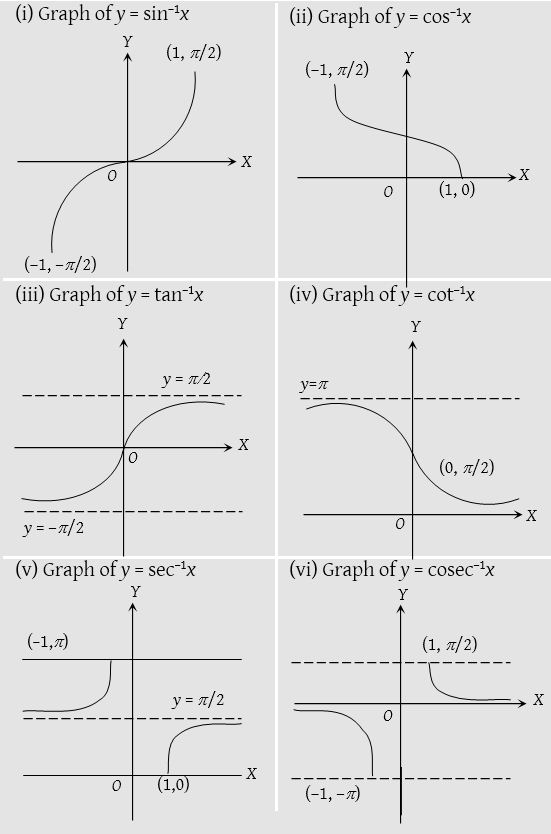

# Graphs of Inverse Trigonometric Functions
				

# Graphs of $f(f^{-1}(x))$

# Graphs of $f^{-1}(f(x))$

# Domain & Range
|Function|Domain|Range|
|:------:|:----:|:---:|
|$\sin^{-1}x$|$\pmb[-1,1\pmb]$|$\big[-\frac\pi2,\frac\pi2\big]$|
|$\cos^{-1}x$|$\pmb[-1,1\pmb]$|$\big[0,\pi]$|
|$\tan^{-1}x$|$(-\infty,\infty)$|$\big(-\frac\pi2,\frac\pi2\big)$|
|$\cot^{-1}x$|$(-\infty,\infty)$|$\big(0,\pi)$|
|$\cosec^{-1}x$|$\R - (-1,1)$|$\big[0,\pi]-\big\{\frac \pi2\big\}$|
|$\sec^{-1}x$|$\R-(-1,1)$|$\big[-\frac\pi2,\frac\pi2\big] - \{0\}$|

# Properties
## Negative Sign
$$
\sin^{-1}(-x)=-\sin^{-1}(x)\qquad x\in \pmb[-1,1\pmb]
$$

$$
\tan^{-1}(-x)=-\tan^{-1}(x)\qquad x\in (-\infty,\infty)
$$

$$
\cosec^{-1}(-x)=-\cosec^{-1}(x)\qquad x\in \R - (-1,1)
$$
 

$$
\cos^{-1}(-x)=\pi-\cos^{-1}(x)\qquad x\in \pmb[-1,1\pmb]
$$

$$
\cot^{-1}(-x)=\pi-\cot^{-1}(x)\qquad x\in (-\infty,\infty)
$$

$$
\sec^{-1}(-x)=\pi-\sec^{-1}(x)\qquad x\in \R - (-1,1)
$$

## Co-Function
$$
\sin^{-1}x + \cos^{-1}x = \frac \pi2\qquad x\in \pmb[-1,1\pmb]
$$

$$
\tan^{-1}x + \cot^{-1}x = \frac \pi2\qquad x\in (-\infty,\infty)
$$

$$
\cosec^{-1}x + \sec^{-1}x = \frac \pi2\qquad x\in \R - (-1,1)
$$

## Reciprocal
$$
\sin^{-1}x =  \cosec^{-1}\bigg(\frac 1x\bigg)\qquad x\in \pmb[-1,1\pmb] - \{0\}
$$

$$
\cos^{-1}x =  \sec^{-1}\bigg(\frac 1x\bigg)\qquad x\in \pmb[-1,1\pmb] - \{0\}
$$

$$
\cosec^{-1}x =  \sin^{-1}\bigg(\frac 1x\bigg)\qquad x\in \R - (-1,1)
$$

$$
\sec^{-1}x =  \cos^{-1}\bigg(\frac 1x\bigg)\qquad x\in \R - (-1,1)
$$

 

$$
\tan^{-1}x = \begin{cases} \cot^{-1}\bigg(\frac 1x\bigg)\qquad x\in (0,\infty)\\
-\pi + \cot^{-1}\bigg(\frac 1x\bigg)\qquad x\in (-\infty, 0) \end{cases}
$$

 

$$
\cot^{-1}x =\begin{cases} \tan^{-1}\bigg(\frac 1x\bigg)\qquad x\in (0,\infty)\\
\pi + \tan^{-1}\bigg(\frac 1x\bigg)\qquad x\in (-\infty, 0) \end{cases}
$$

## Conversion to Another Inverse Function
$$
\sin^{-1}x = \begin{cases} \cos^{-1}\sqrt{1-x^2} \qquad x\in \pmb[0,1\pmb]\\\\
-\cos^{-1}\sqrt{1-x^2} \qquad x\in \pmb[-1, 0\pmb]\\\\
\tan^{-1}\frac{x}{\sqrt{1-x^2}} \qquad x\in \pmb[-1, 1\pmb]\\
\end{cases}
$$

 

$$
\cos^{-1}x = \begin{cases}
\sin^{-1}\sqrt{1-x^2} \qquad x\in \pmb[0,1\pmb]\\\\
\pi -\sin^{-1}\sqrt{1-x^2} \qquad x\in \pmb[-1, 0\pmb]\\\\
\tan^{-1}\frac{\sqrt{1-x^2}}{x} \qquad x\in (0, 1\pmb]\\\\
\pi+\tan^{-1}\frac{\sqrt{1-x^2}}{x} \qquad x\in \pmb[-1, 0)

\end{cases}
$$

## Sum/Difference Formula
### $\tan^{-1}\theta$
****
$$
\tan^{-1}x +\tan^{-1}y = \begin{cases}
\tan^{-1}\large\frac{x+y}{1-xy} &,xy<1\\\\
\pi + \tan^{-1}\large\frac{x+y}{1-xy} &,xy>1 \text{ and } x,y>0 \\\\
- \pi + \tan^{-1}\large\frac{x+y}{1-xy} &,xy>1 \text{ and } x,y<0 \
\end{cases}
$$

 

$$
\tan^{-1}x -\tan^{-1}y = \begin{cases}
\tan^{-1}\large\frac{x-y}{1+xy} &,xy>-1\\\\
\pi + \tan^{-1}\large\frac{x-y}{1+xy} &,xy<-1 \text{ and } x>0,y<0 \\\\
- \pi + \tan^{-1}\large\frac{x-y}{1+xy} &,xy<-1 \text{ and } x<0,y>0
\end{cases}
$$

 

### $\sin^{-1}\theta$
****
$$
\sin^{-1}x + \sin^{-1}y = \begin{cases}
\sin^{-1}\bigg(x\sqrt{1-y^2}+y\sqrt{1-x^2}\bigg)&x^2+y^2\leq1 \text{ or } xy<0
\\\\
\pi -\sin^{-1}\bigg(x\sqrt{1-y^2}+y\sqrt{1-x^2}\bigg)&x^2+y^2>1 \text{ and } x,y>0
\\\\
-\pi -\sin^{-1}\bigg(x\sqrt{1-y^2}+y\sqrt{1-x^2}\bigg)&x^2+y^2>1 \text{ and } x,y<0
\end{cases}
$$

 

$$
\sin^{-1}x + \sin^{-1}y = \begin{cases}
\sin^{-1}\bigg(x\sqrt{1-y^2}-y\sqrt{1-x^2}\bigg)&x^2+y^2\leq1 \text{ or } xy>0
\\\\
\pi -\sin^{-1}\bigg(x\sqrt{1-y^2}-y\sqrt{1-x^2}\bigg)&x^2+y^2>1 \text{ and } x>0,y<0
\\\\
-\pi -\sin^{-1}\bigg(x\sqrt{1-y^2}-y\sqrt{1-x^2}\bigg)&x^2+y^2>1 \text{ and } x<0,y>0
\end{cases}
$$

 

### $\cos^{-1}\theta$
****
$$
\cos^{-1}x + \cos^{-1}y = \begin{cases} 
\cos^{-1} \Big(xy - \sqrt{1-x^2}\sqrt{1-y^2}\Big) & -1\leq x,y\leq 1\text{ and } x+y\geq0\\\\
2\pi - \cos^{-1} \Big(xy - \sqrt{1-x^2}\sqrt{1-y^2}\Big) & -1\leq x,y\leq 1\text{ and } x+y\leq0\
\end{cases}
$$

$$
\cos^{-1}x + \cos^{-1}y = \begin{cases} 
\cos^{-1} \Big(xy + \sqrt{1-x^2}\sqrt{1-y^2}\Big) & -1\leq x,y\leq 1\text{ and } x\leq y\\\\
- \cos^{-1} \Big(xy + \sqrt{1-x^2}\sqrt{1-y^2}\Big) & -1\leq y<0 , \space 0<x\leq 1\text{ and } x\geq y\
\end{cases}
$$
## Multiple Inverse Functions
$$
2\sin^{-1}x = \begin{cases}
\sin^{-1}\Big(2x\sqrt{1-x^2}\Big)&\large{-\frac{1}{\sqrt2} 	\leq x \leq \frac{1}{\sqrt2}}
\\\\
\pi - \sin^{-1}\Big(2x\sqrt{1-x^2}\Big) & \large{\frac{1}{\sqrt2}\leq x \leq 1}
\\\\
-\pi -\sin^{-1}\Big(2x\sqrt{1-x^2}\Big)&\large{-1 \leq x \leq-\frac{1}{\sqrt2}}
\end{cases}
$$

 

$$
2\cos^{-1}x = \begin{cases}\cos^{-1}(2x^2 -1) & 0\leq x\leq1
\\\\
2\pi-\cos^{-1}(2x^2 -1) & -1\leq x\leq0 \end{cases}
$$

 

$$
2\tan^{-1}x=
\begin{cases}
\tan^{-1} \large\frac{2x}{1-x^2} &-1<x<1
\\\\
\pi + \tan^{-1} \large\frac{2x}{1-x^2} &x>1
\\\\
-\pi + \tan^{-1} \large\frac{2x}{1-x^2} &x<-1
\end{cases}
$$

 

$$
2\tan^{-1}x=
\begin{cases}
\sin^{-1} \large\frac{2x}{1+x^2} &-1\leq x\leq 1
\\\\
\pi - \sin^{-1} \large\frac{2x}{1+x^2} &x>1
\\\\
-\pi - \sin^{-1} \large\frac{2x}{1+x^2} &x<-1
\end{cases}
$$

 

$$
2\tan^{-1}x=
\begin{cases}
\cos^{-1}\large\frac{1-x^2}{1+x^2} & -\infty<x\leq 0
\\\\
-\cos^{-1}\large\frac{1-x^2}{1+x^2} & 0\leq x<\infty
\end{cases}
$$

 

$$
3\sin^{-1}x= 
\begin{cases}
\sin^{-1}(3x-4x^3) & -\frac 12\leq x \leq \frac 12
\\\\
\pi -\sin^{-1}(3x-4x^3) & \frac 12\leq x \leq 1
\\\\
-\pi -\sin^{-1}(3x-4x^3) & -1 \leq x \leq -\frac 12
\end{cases}
$$

 

$$
3\cos^{-1}x=
\begin{cases}
\cos^{-1}(4x^3-3x) &  \frac 12\leq x \leq 1
\\\\
2\pi +\cos^{-1}(4x^3-3x) & -1 \leq x \leq -\frac 12
\\\\
2\pi -\cos^{-1}(4x^3-3x) &-\frac 12\leq x \leq \frac 12
\end{cases}
$$

 

$$
3\tan^{-1}x= 
\begin{cases}
\tan^{-1}\Big(\large\frac{3x-x^3}{1-3x^2}\Big) & -\frac{1}{\sqrt3} <x <\frac{1}{\sqrt3} 
\\\\
\pi + \tan^{-1}\Big(\large\frac{3x-x^3}{1-3x^2}\Big) & x >\frac{1}{\sqrt3}
\\\\
-\pi + \tan^{-1}\Big(\large\frac{3x-x^3}{1-3x^2}\Big) & x <-\frac{1}{\sqrt3}
\end{cases}
$$

# $\tan^{-1}x$ Series Problems
$$
\text{Convert in the form of } \tan^{-1}\bigg(\frac{a-b}{1+ab}\bigg) = \tan^{-1}a -\tan^{-1}b \space\text{ And Diagonally Cancel}
$$