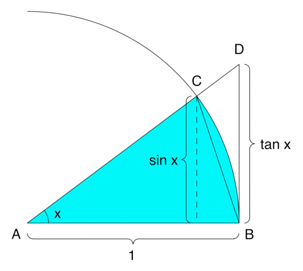
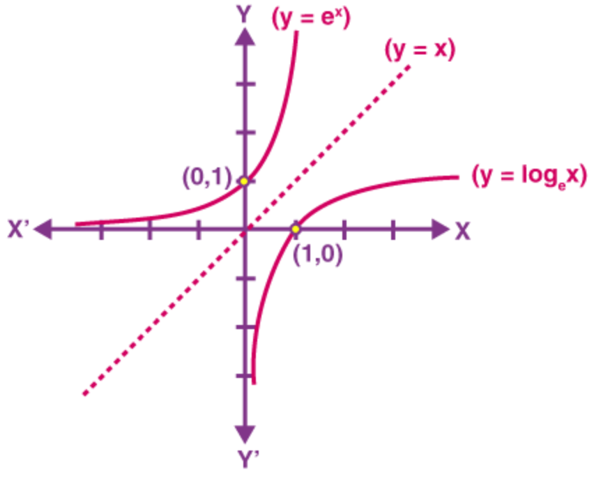
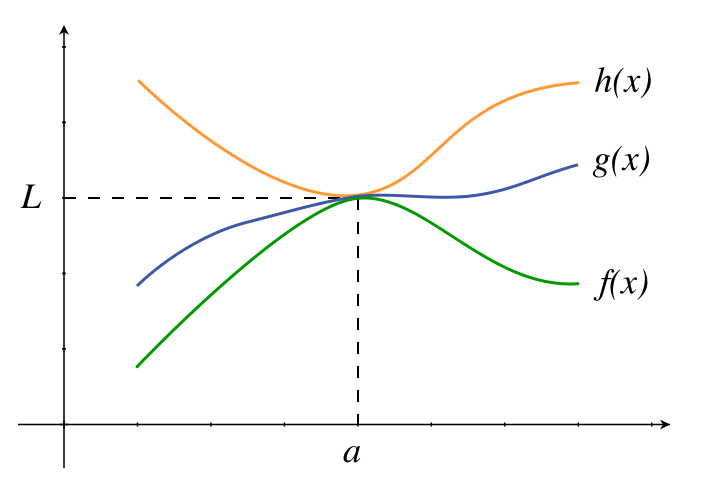
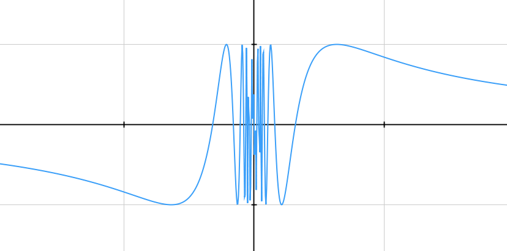
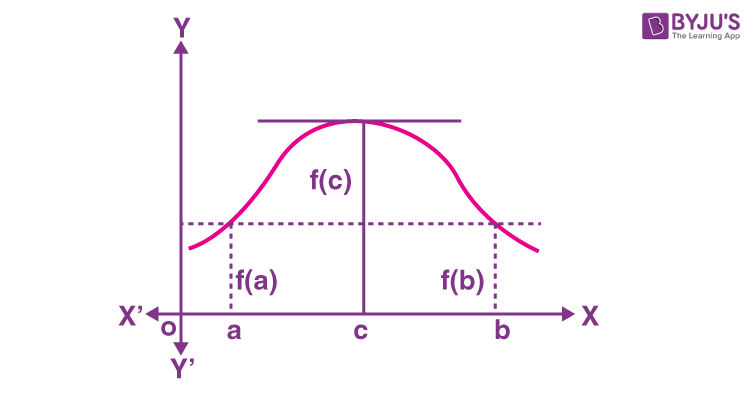
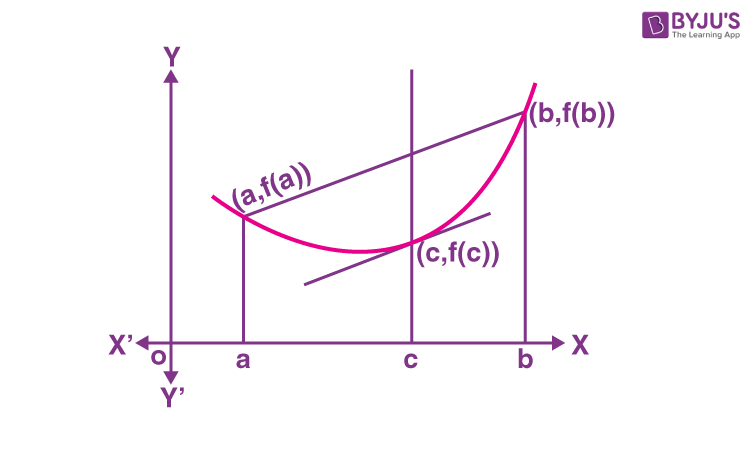
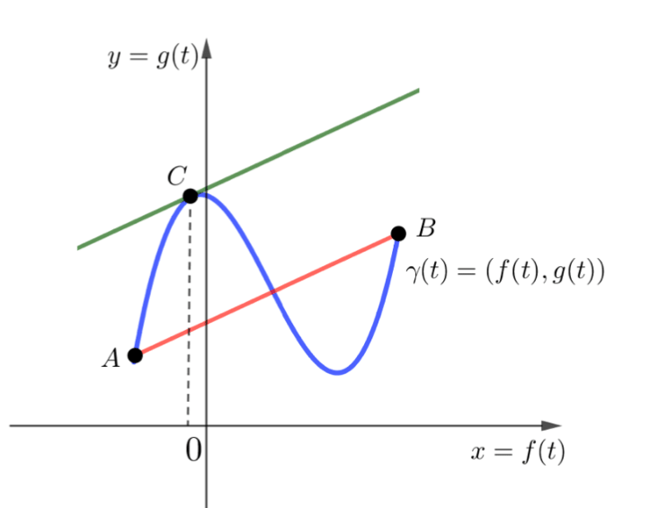

# Limits
- Used to find behaviour of the function in the neighbourhood of a a point.
- for existence of $\lim\limits_{x\rightarrow a}:$
	- $\text L=\text{L.H.L.} = \text{R.H.L.} = \lim\limits_{x\rightarrow a}f(x)$

	$\therefore\space \text{L} = \lim\limits_{h\rightarrow 0}f(a-h) =\lim\limits_{h\rightarrow 0}f(a+h)  = \lim\limits_{x\rightarrow a}f(x)$
	
$\therefore$ The existence of the limit at any point does not depend on the defintion of the function at that point.

## 7 Indeterminate Forms:
$$
\boxed{
\frac 00, \space \frac \infty\infty, \space \infty-\infty, \space 0\times\infty, \space 1^\infty, \space \infty^0, \space0^0
}
$$

## Concept of Finite Limits 
- The Value of the limit is the ratio of coefficents of same power of x.

### $\text{for }x\rightarrow0$ 

$$
\lim\limits_{x\rightarrow0} \frac{a_0 + a_1x + a_2x^2 \dots a_kx^k + a_{k+1}x^{k+1}\dots a_nx^n}{b_kx^k}
\\
\
\\ 
\text{Then, } a_0 = a_1=a_2\dots a_{k-1}=0
\\
\
\\
\therefore \space \text{ limit} = \frac{a_k}{b_k}
$$
### $\text{for }x\rightarrow\infty$
$$
\lim\limits_{x\rightarrow0} \frac{a_0 + a_1x + a_2x^2 \dots a_kx^k + a_{k+1}x^{k+1}\dots a_nx^n}{b_kx^k}
\\
\
\\ 
\text{Then, } a_{k+1} = a_{k+2}=\dots a_n=0
\\
\
\\
\therefore \space \text{ limit} = \frac{a_k}{b_k}
$$

# Some Important Series Expansions	

$$
e^x = 1+x+\frac{x^2}{2!} + \frac{x^3}{3!} + \frac{x^4}{4!} \dots
\\
\
\\
a^x = 1+x\ln a+\frac{(x\ln a)^2}{2!} + \frac{(x\ln a)^3}{3!} + \frac{(x\ln a)^4}{4!} \dots
\\
\
\\
\log(1+x) = x-\frac{x^2}{2} + \frac{x^3}{3}- \frac{x^4}{4} \dots
\\
\
\\
\sin x = x-\frac{x^3}{3!} + \frac{x^5}{5!} - \frac{x^7}{7!} \dots
\\
\
\\
\cos x = 1-\frac{x^2}{2!}+ \frac{x^4}{4!} -\frac{x^6}{6!}  \dots
\\
\
\\
\tan x = x +  \frac{x^3}{3} + \frac{2x^5}{15}
\\
\
\\
\sin^{-1}x = x+\frac{x^3}{6} + \frac{3x^5}{40}\dots
\\
\
\\
\tan^{-1}x = x-\frac{x^3}{3} + \frac{x^5}{5} - \dots
\\
\
\\
(1+x)^{\frac{1}{x}} = e\bigg(1-\frac{x}{2} + \frac{11x^2}{24}\dots\bigg)
$$
# Some Important Results on Limits
## 1)
$$
\lim\limits_{x\rightarrow0}\frac{x^n-a^n}{x-a}=na^{n-1} \quad\forall\space n\in\text{Q}
$$
## 2) Trignometrical Limits:-
$$
\lim\limits_{x\rightarrow0}\frac{\sin x}{x} = 1 
\\
\
\\
\lim\limits_{x\rightarrow0}\frac{\tan x}{x} = 1
\\
\
\\
\lim\limits_{x\rightarrow0}\cos x = 1
\\
\
\\
\lim\limits_{x\rightarrow0}x\cosec x = 1
\\
\
\\
\lim\limits_{x\rightarrow0}x\cot x = 1
\\
\
\\
\lim\limits_{x\rightarrow0}\sec x = 1
\\
$$
### Inverse:-
$$
\lim\limits_{x\rightarrow0}\frac{\sin^{-1}x}{x} = 1 
\\
\
\\
\lim\limits_{x\rightarrow0}\frac{\tan^{-1}x}{x} = 1
\\
\
\\
\lim\limits_{x\rightarrow0}\cos^{-1}x = \frac{\pi}{2}
$$
### Greatest Integer:-
$$
\lim\limits_{x\rightarrow0} \bigg[\frac{sinx}{x}\bigg]= 0
\\
\
\\
\lim\limits_{x\rightarrow0} \bigg[\frac{tan}{x}\bigg]= 1
\\
\
\\
\lim\limits_{x\rightarrow0} \big[cosx\big]= 1
$$
### Greatest Integer of Inverse
$$
\lim\limits_{x\rightarrow0} \bigg[\frac{sin^{-1}x}{x}\bigg]= 1
\\
\
\\
\lim\limits_{x\rightarrow0} \bigg[\frac{tan^{-1}}{x}\bigg]= 0
\\
\
\\
\lim\limits_{x\rightarrow0} \big[cos^{-1}x\big]= 1
$$
### Proof of $\lim\limits_{x\rightarrow0}\frac{\sin x}{x} = 1$
By Sandwhich Theorem:

Let $AB$ be the Arc of a circle of unit radius
Let $\angle AOB = x$
Let the Tangent at point $A$ meets $OB$ produced to $C$
From figure it is evident that:
$$
\text{Area}(AOB) \leq \text{Sector}(AOB) \leq \text{Area}(AOC)
\\
\
\\
\therefore \quad\lim\limits_{x\rightarrow \space 0}\quad\frac{1}{2} \times \sin x \times\cos x \leq \frac{x}{2\pi}\times \pi\times 1^2 \leq \frac 12 \times\tan x \times 1
\\
\
\\
\implies \lim\limits_{x\rightarrow \space 0}\quad\frac{\sin x\cos x}{\cancel{2}} \leq \frac {x}{\cancel{2}} \leq \frac{\tan x}{\cancel{2}}
$$
Dividing by $\sin x$ we get:
$$
\lim\limits_{x\rightarrow \space 0}\quad\cos x \leq \frac{x}{\sin x} \leq \frac{1}{\cos x}
$$
Talking Reciprocal:
$$
\lim\limits_{x\rightarrow \space 0}\quad\cos x \leq \frac{\sin x}{x} \leq \frac{1}{\cos x}
$$
Applying Limit:
$$
1 \leq \frac{\sin x}{x} \leq 1
\\
\
\\
\therefore \lim\limits_{x\rightarrow \space 0}\quad\frac{\sin x}{x} = 1
$$

## 3) 
$$
\boxed{\lim\limits_{x\rightarrow0} \frac{a^x-1}{x} = \ln a}\qquad ,a>0,\neq1
\\
\
\\
\therefore \quad\lim\limits_{x\rightarrow0} \frac{e^x-1}{x} = 1
$$
## 4) 
$$
\lim\limits_{x\rightarrow0}\frac{\log_a(1+x)}{x}=\log_ae\qquad ,a>0,a\neq 1
\\
\
\\
\therefore \quad \lim\limits_{x\rightarrow0}\frac{\ln(1+x)}{x}=1
$$
## 5)
$$
\boxed{\lim\limits_{x\rightarrow\infty} \bigg(1+\frac{a}{x}\bigg)^x =\lim\limits_{h\rightarrow0} \big(1+ah\big)^\frac 1h = e^a}
$$
# Evaluation of Limits
## $1) \quad\frac 00 \text{ form}$
- if given as $\frac{p(x)}{q(x)}:$ where $p(x)$ and $q(x)$ are polynomials
	- Factorize $p(x) \space\&\space q(x)$ cancel the factor which is creating $0$.
	- if Factorize is not possible, divide the larger degree polynomial with smaller degree polynomial and put the limit. 
## $2) \quad\frac \infty\infty \text{ form}$
$$
\lim\limits_{x\rightarrow\infty} \frac{\text{Small Infinity}}{\text{Greater Infinity}} = 0\qquad\qquad\lim\limits_{x\rightarrow\infty} \frac{\text{Greater Infinity}}{\text{Small Infinity}} = \infty
$$

 

### Order of Infinities:

$$
\boxed{e^x>x^n>\log x}
$$

- Take highest power common from both numerator and denominator and cancel

OR

- Divide the Numerator and Denominator by highest degree term.
## $3) \quad\infty - \infty\text{ form}$
Rationalize or use trignometric identities to convert to $\frac{0}{0}$ or $\frac{\infty}{\infty}$
## $4) \quad0 \times \infty\text{ form}$
- Convert to $\frac{0}{0}$ or $\frac{\infty}{\infty}$ by rationalising or taking LCM
- $0\times \infty = 0 \times \frac{1}{0} = \frac {0}{0}$
- $0\times \infty = \frac{1}{\infty} \times \infty = \frac {\infty}{\infty}$
## $5)\quad 1^\infty$
$
\text{if,}\quad x\rightarrow a, \space f(x)\rightarrow 1, \space g(x)\rightarrow\infty\quad\text{,Then:}
$
$$
\boxed{\lim\limits_{x\rightarrow a}f(x)^{g(x)} = e^{\space\lim\limits_{x\rightarrow a}g(x)[f(x)-1]}}
$$
## $6) \quad 0^\infty, \space\infty^0 \text{ form}$
$
\text{if}\quad x\rightarrow a, \space f(x)\rightarrow 0 \text{ or } \infty, \space g(x)\rightarrow0\quad\text{,Then:}$

$$
\boxed{\lim\limits_{x\rightarrow a}f(x)^{g(x)} = e^{\space\lim\limits_{x\rightarrow a}g(x)\times\log{f(x)}}}
$$

 

**Note:** if $f(x) = \begin{cases} e^{\frac{1}{x}} & x>0 \\ \frac{1}{x^2} & x<0\end{cases}$

then $\lim\limits_{x\rightarrow0}f(x)$ does not exist despite both $LHL\text{ and }RHL$ being $\infty$ as $LHL\neq RHL\quad(\text{Case of Different Infinities})$

# L' Hospital's Rule
$\text{if }\lim\limits_{x\rightarrow a} \frac{f(x)}{g(x)}\text{ is of the form of }\frac 00\text{ or }\frac \infty\infty:$
$$
\lim\limits_{x\rightarrow a} \frac{f(x)}{g(x)}=\lim\limits_{x\rightarrow a} \frac{f'(x)}{g'(x)}
$$
- $\text{This Process can further be repeated if }\lim\limits_{x\rightarrow a} \frac{f'(x)}{g'(x)}\text{ is also of the form of }\frac 00\text{ or }\frac \infty\infty$

# Sandwhich Theorem [Squeeze Theorem]

- Let f(x), g(x) and h(x) be three real valued functions such that;
$$
f(x)\leq g(x) \leq h(x)
\\
\
\\
\text{Then, if } \lim\limits_{x\rightarrow a} f(x) = K \quad \text{and}\quad \lim\limits_{x\rightarrow a}h(x) = K
\\
\
\\
\text{Then, }\lim\limits_{x\rightarrow a}g(x) = K
$$

# Continuity
- $f(x)$ is said to be continous if:
$$
\lim\limits_{x\rightarrow a} f(x) = f(a) = \text{finite value}
$$
- Graphically it means that there is no jump, gap or hole at $x=a$.

**Tip:** If the graph can be made w/o lifting the pen, it is continous
## Continuity in Open Interval $(a,b):$
- if $f(x)$ is continous at every point form $a$ to $b$ excluding $a \space\&\space b$
## Continuity in Closed Interval $[a,b]$
f(x) should be continous in $(a,b)$ and
$$
\lim\limits_{x\rightarrow a^+} f(x) = f(a)\quad\text{ and }\quad\lim\limits_{x\rightarrow b^-} f(x) =f(b)
$$
# Discontinuity
## $\text{I) Removable Discontinuity [1st Kind Discontinuity]}$
$$
\text{if}:\qquad\lim\limits_{x\rightarrow a} f(x) \neq f(a)
\\
\
\\
\text{or}:\qquad f(a) \text{ is not defined}
\\
\
\\
\therefore \text{ Removable Discontinuity can become continous if}:
\\
\lim\limits_{x\rightarrow a} f(x) = f(a)\qquad \text{or}\qquad f(a) \text{ is redefined}
$$
### i) Missing Point Discontinuity
**e.g.** $f(x)  = \frac{x^2-5}{x-2}$ has missing point discontinuiity at $x=2$

### ii) Isolated Point Discontinuity
$$
\lim\limits_{x\rightarrow a} f(x) \neq f(a)
\\
\
\\
\text{e.g. } f(x) = [x] + [-x] = \begin{cases}0,&x\in\Z\\ -1,&x\notin\Z\end{cases}\\
\therefore\space f(x)\text{ is discontinous at all integal points} 
$$

## $\text{II) Non-removable Discontinuity [2nd Kind Discontinuity]}$
$$
\text{if}:\qquad\lim\limits_{x\rightarrow a} f(x)\text{ does not exist}
$$

- In this case, discontinuity **cannot** be removed.

### i) Finite-Type Discontinuity (Jump Discontinuity)
$$
\lim\limits_{x\rightarrow a^-} f(x)\neq \lim\limits_{x\rightarrow a^+} f(x)
$$
- The Non-Negative Difference between the two limits is called the **'Jump'**
### ii) Infinite-Type Discontinuity
$$
\text{either of }\quad\lim\limits_{x\rightarrow a^-} f(x)\quad\text{ or }\quad \lim\limits_{x\rightarrow a^+} f(x) \text{ tends to }\infty
$$

### iii) Oscillating Discontinuity
$$
\text{limiting value of }f(x)\text{ oscillates finitely or infinitely}
\\
\
\\
{e.g. } \sin\bigg(\frac 1x \bigg)\text{ oscillates between }-1\text{ and }1\text{ at }x=0
$$

# Properties of Continous & Discontinous Functions
## 1) $\text{if }f(x) \& g(x)\text{ are continous at }x = a\text{ then:}$
- $kf(x)$
- $f(x) \pm g(x)$
- $f(x)\times g(x)$
- $\frac{f(x)}{g(x)},\quad g(x)\neq 0$
- $(f(x))^{\frac{m}{n}},\quad f^{-1}(x)$

$\text{are also continous at }x=a$
**Note:** g(f(x)) will be continous at x=a if:
- g(x) is continous at x=f(a)
- g(f(x)) will also be discontinous wherever f(x) is discontinous
## 2) $\text{If }f(x)\text{ is continous }\&\space g(x)\text{ is discontinous at }x=a\text{then:}$
- $f(x) \pm g(x)\text{ is discontinous at }x=a$
- $f(x)\times g(x)\text{ may or may not be continous at }x=a$

## 3) $\text{if }f(x)\space \&\space g(x)\text{ are both discontinous at }x = a\text{ then:}$
- $f(x) \pm g(x)$
- $f(x)\times g(x)$

$\text{ may or may not be continous at }x=a$

## 4) $\text{if }f(a) = 0 \text{ then:}$
- $f(x) \times g(x)\text{ is continous at }x=a$

## 5) Some Important Functions:-
- $sgn(f(x))\text{ is discontinous at every point where }f(x) = 0$
 

- $[f(x)]\text{ is discontinous at all integral values of }f(x)$
	- $\text{Also, }f(x)\text{ should be a monotonic function}$
 
- $\{f(x)\}\text{ is discontinous at all integral values of }f(x)$

## 6) Suspicous points for continuity:
- The point where f(x) changes
- The point where f(x) is not defined

# Differentiability (Derivatives)
The instantaneous rate of change of $f(x)$ at $x$ is mathematically written as $f'(x)$ or $\frac{\footnotesize{d(f(x))}}{dx}$

Geometrically it represents the slope of the tangent at $(x,y)$ on the curve $y=f(x)$
$$
\boxed{f'(x) = \lim\limits_{x\rightarrow a} \frac{f(x)-f(a)}{x-a}}
$$

$$
LHD = \lim\limits_{h\rightarrow0} \frac{f(a-h)-f(a)}{-h} \tag{writing $x=a-h$}
$$

$$
RHD = \lim\limits_{h\rightarrow0} \frac{f(a+h)-f(a)}{h} \tag{writing $x=a+h$}
$$

$\text{A function is said to be differentiable at }x=a\text{ if:}$
$$
\underbrace{\lim\limits_{h\rightarrow0} \frac{f(a-h)-f(a)}{-h}}_{LHD} =
\underbrace{\lim\limits_{h\rightarrow0} \frac{f(a+h)-f(a)}{h}}_{RHD} =
\text{A finite value}
$$

**AND** $f(x)\text{ should be continous at }x=a$

Graphically, a function is differentiable if it is continous and does not contain any sharp edge or corner.
**i.e.** it should be a smooth continous curve

Note: Every Differentiable function is continous but the inverse may or may not be true

## Differentiability in Open Interval (a,b): 
- $f(x)\text{ should be differentiable at every point from }a\text{ to }b\text{ excluding }a\space \&\space b$

## Differentiability in Closed Interval [a,b]: 
- $f(x)\text{ should be differentiable at every point from }a\text{ to }b\text{ and:}
$$
\lim\limits_{x\rightarrow a^+} \frac{f(x)-f(a)}{x-a}=f'(a)\qquad \text{and}\qquad
\lim\limits_{x\rightarrow b^-} \frac{f(x)-f(b)}{x-b}=f'(b)
$$

## Properties of differentiable functions:
### $1) \space \text{if }f(x)\space\&\space g(x)\text{ are differentiable then:-}$
- $f(x) \pm g(x)\text{ is differentiable}$
- $f(x)\times g(x)\text{ is differentiable}$
- $\frac{f(x)}{g(x)}\text{ may or may not be differentiable}$
- $g(f(x))\text{ will be differentiable at }x=a$ 
	- where $f(x)$ and $g(x)$ are differential at $x=a$

### $2) \space \text{if either of }f(x)\text{ or } g(x)\text{ are non-differentiable then:-}$
- $f(x) \pm g(x)\text{ is not differentiable}$
- $f(x)\times g(x)\text{ may or may not be differentiable}$
- $\frac{f(x)}{g(x)}\text{ may or may not be differentiable}$

## Derivatives of some Standard Functions
$$
\frac{d(k)}{dx} = 0 \qquad,\space k\in \text{constant}
\\
\
\\
\frac{d(x^n)}{dx} = nx^{n-1}\qquad,n\in \R
\\
\
\\
\frac{d(e^x)}{dx} = e^x
\\
\
\\
\frac{d(a^x)}{dx} = a^x\times \ln a,\space a>0
\\
\
\\
\frac{d(\ln x)}{dx} = \frac 1x,\space x>0
\\
\
\\
\frac{d(\ln |x|)}{dx} = \frac 1x,\space x\neq 0
\\
\
\\
\frac{d(\log_a x)}{dx} = \frac 1x\times\log_a e,\space x>0,\space a>0,\space a\neq 1,
\\
\
\\
\frac{d( |x|)}{dx} = \frac{|x|}{x}\text{ or }\frac{x}{|x|} \qquad, x\neq 0
\\
\
\\
\frac{d(\sin x)}{dx} = \cos x 
\\
\
\\
\frac{d(\cos x)}{dx} = -\sin x 
\\
\
\\
\frac{d(\tan x)}{dx} = \sec^2x
\\
\
\\
\frac{d(\cot x)}{dx} = -\cosec^2x
\\
\
\\
\frac{d(\sec x)}{dx} = \sec x\tan x
\\
\
\\
\frac{d(\cosec x)}{dx} = -\cosec x\cot x
\\
\
\\
\frac{d(\sin^{-1}x)}{dx} = \frac{1}{\sqrt{1-x^2}}\qquad,-1<x<1
\\
\
\\
\frac{d(\cos^{-1}x)}{dx} = \frac{-1}{\sqrt{1-x^2}}\qquad,-1<x<1
\\
\
\\
\frac{d(\tan^{-1}x)}{dx} = \frac{1}{1+x^2}\qquad,x\in\R
\\
\
\\
\frac{d(\cot^{-1}x)}{dx} = -\frac{1}{1+x^2}\qquad,x\in\R
\\
\
\\
\frac{d(\sec^{-1}x)}{dx} = \frac{1}{|x|\sqrt{x^2-1}}\qquad,|x|>1
\\
\
\\
\frac{d(\cosec^{-1}x)}{dx} = -\frac{1}{|x|\sqrt{x^2-1}}\qquad,|x|>1
$$

## Basic Rules of Differentiation
Where $u$ and $v$ are $u(x)$ and $v(x)$ respectively

### Product Rule [Leibnitz Rule]
$$
(u\text{v})' = u'\text{v} + \text{v}'u
$$
### Quotient Rule
$$
\bigg(\frac{u}{\text{v}}\bigg)' = \bigg(\frac{u'\text{v}-\text{v}'u}{\text{v}^2}\bigg)
$$
### Chain Rule
$$
[u(\text{v})]' = u'(\text{v}) \times \text{v}'
$$

## Derivative of Implicit Functions
- $\text{Differentiate both sides w.r.t }x\text{ and find }\frac{dy}{dx}$

## Derivative of functions in Parametric Form
Two functions are said to be in parametric form if the both depend on a seperate third variable
$$
\text{let }x=f(t) \quad\text{and}\quad y = g(t)
\\
\
\\
\text{Then:} \qquad\frac{dy}{dx} = \frac{\frac{d(f(t))}{dt}}{\frac{d(g(t))}{dt}}
$$
**Note:** This is only possible when both the functions are depend on the same variable

### For Second Order:
$$
\frac{d^2y}{dx^2} = \frac{d}{dx}\bigg(\frac{dy}{dx}\bigg) = \frac{d}{dx}\bigg( \frac{f'(t)}{g'(t)}\bigg) = \frac{d}{dt}\bigg( \frac{f'(t)}{g'(t)}\bigg) \times \frac{dt}{dx} = \frac{\bigg(\Large{\frac{f'(t)}{g'(t)}}\bigg)'}{g'(t)}
$$

## Derivative using Logarithmic Function
When Function is of the form:
$$
u(x) = f(x)^{g(x)}
\\
or
\\
u(x)=f_1^{p_1}(x)+f_2^{p_2}(x)\dots f_n^{p_n}(x)
\\
or
\\
u(x)=\frac{f_1^{p_1}(x)+f_2^{p_2}(x)\dots f_n^{p_n}(x)}{g_1^{q_1}(x)+g_2^{q_2}(x)\dots g_n^{q_n}(x)}
$$
In such cases take $\log$ on both sides then differentiate.

### Short-cut for $y=f(x)^{g(x)}$
$y=f(x)^{g(x)}$

$\implies\boxed{\frac{dy}{dx}=\underbrace{\frac{d(f(x)^{g(x)})}{dx}}_{g(x)=\text{const.}}+\underbrace{\frac{d(f(x)^{g(x)})}{dx}}_{f(x)=\text{const.}}}$
## Higher Order Derivatives
$\text{for } y=f(x):$
$$
1^{st}\text{ Order}: \frac{dy}{dx} = f'(x) = y_1 = y'
\\
\
\\
2^{nd} \text{ Order}: \frac{d}{dx}\bigg(\frac{dy}{dx}\bigg) =\frac{d^2y}{dx^2}= f''(x) = y_2 = y''
\\
\
\\
n^{th}\text{ Order}: \frac{d}{dx}\bigg(\frac{d^{n-1}y}{dx^{n-1}}\bigg) =\frac{d^ny}{dx^n}= f^n(x) = y_n = y^n
$$

# Mean Value Theorems
# $\text{I) Rolle's MVT}$
$\text{If:}$
$$
f(x) \xrightarrow{continous} [a,b]
\\
\
\\
f(x)\xrightarrow{differentiable}(a,b)
\\
\
\\
f(a)=f(b)
\\
$$
$\text{Then there exists at least one value of }c\in(a,b)\text{ such that }f'(c)=0$
### Graphically:

# $\text{II) Lagrange's MVT}$
$\text{If:}$
$$
f(x) \xrightarrow{continous} [a,b]
\\
\
\\
f(x)\xrightarrow{differentiable}(a,b)
$$
$\text{Then there exists at least one value of }c\in(a,b)\text{ such that:}$
$$
f'(c)=\frac{f(b)-f(a)}{b-a}\tag{Putting $x=c$ in $f'(x)$}
$$

### Graphically:

$\therefore \text{ The slope of the curve ab at c is equal to the slope of the line joining a \& b}$
# $\text{III) Cauchy's MVT}$
$\text{If:}$
$$
f(x),\space g(x) \xrightarrow{continous} [a,b]
\\
\
\\
f(x),\space g(x)\xrightarrow{differentiable}(a,b)
$$
$\text{Then there exists at least one value of }c\in(a,b)\text{ such that:}$
$$
\frac{f'(c)}{g'(c)}=\frac{f(b)-f(a)}{g(b)-g(a)}
$$

### Graphically:

# Determining a $fn$ which satisfies a given relation

1. Write the given relation according to the question
2. Put the value of $y$ as given in question
	- **e.g.** if given that $f'(0) = 5$, put $y=0$
3. If $f'(a)$ is given differentiate both sides and equate.
4. Make sure to find the value of constant, $c$, if integrating.