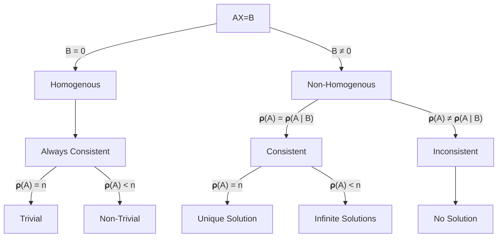

# Matrices
- Row and Coloumn-wise arrangement of data
-  for a matrix with $m$ rows and $n$ columns its order is $m\times n$
-  $a_{ij}\text{ is denoted as an element of the }i^{th}\text{ row and }j^{th}\text{ column}$
-  The No. of possible Matrices with $X \text{ Elements}= \text{No. of factors of } X$
-  The No. of possible Matrices with $X$ Elements and entry is from $\{1,2,3,4\dots n\}=  (\text{No. of factors of }X)\times n^X$
**e.g.** find the no. of possible matrices with $80$ elements & entry is from $\{2,4,6\}$
**Ans:** $10 \times 3^{80}$

$$
\begin{bmatrix}
a_{11}& a_{12}&\dots& a_{1n}
\\
a_{21}& a_{22}&\dots &a_{2n}
\\
\vdots&\vdots&\ddots&\vdots
\\
a_{n1}& a_{n2}&\dots &a_{nn}
\end{bmatrix}_{n\times n}
\\
\
\\
\text{No. of Diagonal Elements } (i=j) = n
\\
\
\\
\text{No. of Non-Diagonal Elements } (i\neq j) = n^2-n
\\
\
\\
\text{No. of Elements below or above Diagonal } (i< j\text{ or } i>j) = \frac{n^2-n}{2}
$$

# Types of Matrices

## 1) Row & Column Matrix [Row & Column Vectors]
- $m =1  \space \bold\& \space n=1 \text{ respectively. }
\qquad\qquad\qquad\qquad\begin{bmatrix}
   a & b &c
\end{bmatrix}\qquad\begin{bmatrix}
   a \\ b\\c
\end{bmatrix}$

## 2) Vertical & Horizontal Matrix [Rectangular Matrices]
- $m >n \space \bold\& \space m<n \text{ respectively. }
\qquad\qquad\qquad\qquad\begin{bmatrix}
 a&b \\ c&d\\e&f
\end{bmatrix}\qquad\begin{bmatrix}
a & b &c\\d&e&f
\end{bmatrix}$

## 3) Upper & Lower Triangular Matrix
- All Elements below & above the diagonal must be 0, respectively
$$
\begin{bmatrix}
a&b&c\\
0&d&e\\
0&0&f
\end{bmatrix}\qquad\qquad\begin{bmatrix}
a&0&0\\
b&c&0\\
d&e&f
\end{bmatrix}
$$
**Note:-**
- A Diagonal matrix is both an upper & lower triangular matrix

- The maximum no. of unique entries possible possible in an upper & lower triangular matrix of  $n \text{ order}= n + \large{\frac{n^2-n}{2}} +1$

 

## 4) Symmetric Matrix
- if $A^T = A, \text{ then } A \text{ is a symmetric matrix} \qquad\qquad\qquad\begin{bmatrix}x&a&b\\a&y&c\\b&c&z\end{bmatrix}$
- $i.e.\quad a_{ij}=a_{ji} \space\forall\space i,j$

 

## 5) Skew-Symmetric Matrix

- if $A^T = -A, \text{ then } A \text{ is a skew-symmetric matrix} \qquad\qquad\qquad\begin{bmatrix}0&a&b\\-a&0&c\\-b&-c&0\end{bmatrix}$
- $i.e.\quad a_{ij}=-a_{ji} \space\forall\space i,j \qquad \therefore a_{ij}=0 \space\forall\space i=j$

 

## 6) Singular Matrix
- if $|A| = 0
\qquad\qquad\qquad\qquad\qquad\qquad\qquad
\begin{vmatrix}
a&b&c\\ d&e&f\\g&h&i
\end{vmatrix}=0$
- if $|A| \neq 0, \text{ it is Non-Singular}$

 

## 7) Idempotent Matrix
- $\text{if } A=A^2=A^3 = \dots \space A^n
\qquad\qquad\qquad\qquad\begin{bmatrix}
 a&b \\ c&d
\end{bmatrix}\times\begin{bmatrix}
 a&b \\ c&d
\end{bmatrix} =\begin{bmatrix}
 a&b \\ c&d
\end{bmatrix}$

 

## 8) Nilpotent Matrix
- $\text{if }A^n = O, \space A^{n-1}\neq O
\qquad\qquad\qquad\begin{bmatrix}
 a&b \\ c&d
\end{bmatrix}\times\begin{bmatrix}
 a&b \\ c&d
\end{bmatrix} \times\dots n \text{ times} = O$
- $\text{where } \text{\textquoteleft} n \text{\textquoteright} \text{ is the index of the nilpotent matrix}$
 

## 9) Involuntary Matrix
$\text{if } A^2 = I
\qquad\qquad\qquad\qquad\begin{bmatrix}
 a&b \\ c&d
\end{bmatrix}\times\begin{bmatrix}
 a&b \\ c&d
\end{bmatrix} =\begin{bmatrix}
 1&0 \\ 0&1
\end{bmatrix}$
$\therefore A^n = I \space [n=\text{odd}]$
$\therefore A^n = A \space [n=\text{even}]$
 

## 10) Orthogonal Matrix
- $\text{if } AA^T = A^TA=I
\qquad\qquad\qquad\qquad\begin{bmatrix}
 a&b \\ c&d
\end{bmatrix}\times\begin{bmatrix}
 a&c \\ b&d
\end{bmatrix} =\begin{bmatrix}
 1&0 \\ 0&1
\end{bmatrix}$

## Some Important Points:-

- A **Zero** matrix is a **scalar, diagonal, upper & lower triangular, symmetric** and **skew-symmetric matrix**
- **Zero Row:** All elements in that particular row $=0$
- **Non-Zero Row:** Atleast 1 element in that row $\neq$ 0
## Properties of Symmetic & Skew-Symmetric Matrices
- $A + A^T \text{ is always symmetric}$
- $A - A^T \text{ is always skew-symmetric}$
- Every square matrix can be uniquely expressed in as the sum of symmetric & Skew-symmetric matrices:
$$
A = \underbrace{\frac{A+A^T}{2}}_{\text{Symmetric}} + \underbrace{\frac{A-A^T}{2}}_{\text{Skew-Symmetric}}
$$
- $AA^T \text{ is always symmetric}$
- if $A$ is a Symmetric matrix, then $A^n, \space n \in \N$ will also be symmetric.
- if $A$ is a Skew-Symmetric matrix, then $A^n, \space n \in \N$ will be:
	- Skew-Symmetric, if $n$ is odd
	- Symmetric, if $n$ is even
- A Skew-Symmetric matrix of odd order is always singular
- $\text{if }A\space \&\space B\text{ are both Symmetric then:}$
	- $A+B, \space A-B, \space AB + BA \text{ are Symmetric}$ 
	- $AB-BA \text{ is Skew-Symmetric}$

 

# Algebra of Matrices
## Equality

$2\text{ Matrices are only called equal if:}$
- $A\space \& \space B \text{ are comparable (same order)}$
- $a_{ij}=b_{ij} \space\forall\space i,\space  j\in(m.n)$

**Note:** Relation on equality of Matrices is an **Equivalence Relation.**

## Addition
- Only possible if they are comparable.
$$
\begin{bmatrix}
 a&b \\ c&d
\end{bmatrix}
+
\begin{bmatrix}
 e&f \\ g&h
\end{bmatrix} =\begin{bmatrix}
 a+e&b+f \\ c+g&d+h
\end{bmatrix}
$$
**Notes:**
- Commutative
- Associative
- Additive Identity: $O$
- Additive Inverse: $-A$

## Scalar Multiplication
$$
\lambda A = [\lambda a_{ij}]
\\
\
\\
\therefore\lambda \begin{bmatrix}a&b\\c&d\end{bmatrix} = \begin{bmatrix}\lambda a&\lambda b\\\lambda c&\lambda d\end{bmatrix}
$$
**Notes:** 
- $\lambda (A+B) = \lambda A+\lambda B$
- $(\lambda +K) A = \lambda A + KA$

## Multiplication
$\text{Matrices can only be multiplied if A has as many columns as B has rows}$
$i.e.\space n_{A} = m_{B}$
**Note:-** Determinants are multiplied in the same way.
$$
A_{x\times y}\times B_{y\times z} = C_{x\times z}
$$
$$
e.g. 
\begin{bmatrix}
 a&b \\ c&d
\end{bmatrix}
\times
\begin{bmatrix}
 e&f \\ g&h
\end{bmatrix} =\begin{bmatrix}
 ae+bg&af+bh \\ ce+dg&cf+dh
\end{bmatrix}
$$

**Properties:**
- $\text{ Associative: }A\times(B\times C) = (A\times B) \times C$
- $\text{ Distributive: }$
	- $A\times(B+C) = (A\times B)+(A \times C$)
	- $(B+C)\times A = (B\times A)+(C \times A$)
	- $(A+B)^2 = A^2 + B^2 +AB +BA$
- May or May not be Commutative:
	- $i.e. AB \neq BA \text{ in general}$
	- $\text{It is also not necessary that }BA\text{ should exist whenever }AB\text{ exists}$
	- $\text{Whenever }AB\space \&\space BA\text{ exist, it is not necessary that they be comparable.}$
- $AB = O\text{ doesn't necessary imply that at least }A\text{ or }B\text{ is a zero matrix}$
- $\text{ Multiplicative Identity: }I$
- $\text{Left-Right Cancellation Law does not exist:}$
	- $\text{i.e }AB=AC \rlap{\quad/}\implies B=C \text{ in general}$
	- $\text{i.e }AB=AC \implies B=C \text{ only when } |A|\neq 0$
- $|A|\times|B|=|AB|$

## Transpose
- $\text{Obtained by interchanging Rows \& Columns.} \qquad
A = \begin{bmatrix}
 a&b \\ c&d
\end{bmatrix}\implies A^T=\begin{bmatrix}
 a&c \\ b&d
\end{bmatrix}$
- $\text{i.e. }A = [a_{ij}]\quad \text{then, }A^T = [a_{ji}]$
- $\text{Denoted by } A^T/ \space A^t/\space A'$.
**Properties:**
- $(A^T)^T = A$
- $(A^T)^n = (A^n)^T$
- $(\lambda A)^T = \lambda A^T$
- $(AB)^T = B^TA^T\qquad[\text{Reversal Law}]$
- $(A + B)^T = A^T + B^T$

## Trace
- $\text{Sum of Diagonal Elements, Denoted by tr}(A)$
- $\text{tr}(A) = \displaystyle\sum_{i=1}^n a_{ii}$

**Properties:**
- $\text{tr}(\lambda A) = \lambda \times \text{tr}(A)$
- $\text{tr}(A^T) = \text{tr}(A)$
- $\text{tr}(AB) = \text{tr}(BA)\qquad\text{(Need To Verify)}$
- $\text{tr}(I_n) = n$
- $\text{tr}(A+B) = \text{tr}(A) + \text{tr}(B)$

# Determinants
- $\text{Real or Complex Number associated with every square matrix, Denoted by }|A|\text{ or }det(A)$
- Given by:
$$
|A|=\sum\underbrace{a_{ij}\times c_{ij}}_{\text{Same Row/Column}}
$$
## Minor
- $\text{Minor of an element }a_{ij}\text{ is the determinant obtained by leaving the }i^{\text{th}}\text{ row and }j^{\text{th}}\text{ column}$
- $\text{Denoted by } M_{ij}$

$$
\begin{bmatrix}
 a&b \\ c&d
\end{bmatrix}
\qquad\qquad\qquad\qquad\qquad\qquad\quad
\begin{bmatrix}
 a&b&c\\ d&e&f \\ g&h&i
\end{bmatrix}
\\
\
\\
\text{Minor of a }= |d|=d
\qquad\qquad\quad
\text{Minor of a }= \begin{vmatrix}
 e&f \\ h&i
\end{vmatrix}=ei-fh
$$

## Co-factor
$$
c_{ij} = (-1)^{i+j} M_{ij}
$$

**Note:** $\text{if }A=[a_{ij}];\text{ then }C=[c_{ij}]\text{ is the cofactor matrix}$ 

**Properties:**
$$
A = \begin{bmatrix}
a_{11}&a_{12}&a_{13}\\ a_{21}&a_{22}&a_{23} \\ a_{31}&a_{32}&a_{33}
\end{bmatrix}
\qquad\qquad\qquad\qquad\qquad\qquad\quad
C =\begin{bmatrix}
 c_{11}&c_{12}&c_{13}\\ c_{21}&c_{22}&c_{23} \\ c_{31}&c_{32}&c	_{33}
\end{bmatrix}
\\
\
\\
\text{Thus Determinant of A is given by:-}
\\
\
\\
\begin{rcases}
|A| = a_{21}c_{21} + a_{22}c_{22} + a_{23}c_{23}
\\
|A| = a_{11}c_{11} + a_{12}c_{12} + a_{13}c_{13}
\\
|A| = a_{31}c_{31} + a_{32}c_{32} + a_{33}c_{33}
\end{rcases} \text{Same Row/Column}
\\
\
\\
\therefore\text{the sum of the product of any row/column with their corresponding co-factors gives the Determinant}\\
\
\\
\begin{rcases}
a_{21}c_{11} + a_{22}c_{12} + a_{23}c_{13} = 0
\\
a_{11}c_{31} + a_{12}c_{32} + a_{13}c_{33} = 0
\end{rcases} \text{Different Row/Column} 
\\
\
\\
\therefore\text{the sum of the product of any row/column with any other co-factors is }0
$$

# Adjoint of a Matrix
- $\text{It is the transpose of Cofactor Matrix, denoted by Adj}(A)$
$$
\text{Let } A = \begin{bmatrix}
a_{11}&a_{12}&a_{13}\\ a_{21}&a_{22}&a_{23} \\ a_{31}&a_{32}&a_{33}
\end{bmatrix}
\qquad\text{And,}\qquad
C =\begin{bmatrix}
 c_{11}&c_{12}&c_{13}\\ c_{21}&c_{22}&c_{23} \\ c_{31}&c_{32}&c	_{33}
\end{bmatrix}
\\
\
\\
\text{Therefore,  Adj}(A) =C^T = \begin{bmatrix}
 c_{11}&c_{21}&c_{31}\\ c_{12}&c_{22}&c_{32} \\ c_{13}&c_{23}&c	_{33}
\end{bmatrix}
$$
**Tip to find Adjoint of a 2x2 Matrix**
$$
\text{Exhange elements along the diagonal \& change the sign of the others:}
\\
\
\\
\begin{bmatrix}
 a&b \\ c&d
\end{bmatrix}\longrightarrow 
\begin{bmatrix}
 d&-b \\ -c&a
\end{bmatrix}
$$
## Properties of Adjoint:
1) $(\text{Adj}A)A  =A(\text{Adj}A) = |A|I$
2) $(\text{Adj}A)^T = \text{Adj}(A^T)$
3) $\text{Adj}(kA) = k^{n-1}\text{Adj}A \qquad [n=\text{ Order}]$
4) $\text{Adj}(AB) = \text{Adj}B \times \text{Adj}A \qquad \text{(Reversal Law)}$
5) $\text{Adj}I = I$
6) $\text{Adj}O = O$
7) $\text{Adj}(\text{Adj}A) = |A|^{n-2}A\qquad [n=\text{ Order}]$
8) $|\text{Adj}\text{Adj}\dots^{r\text{ times}}\text A| = |A|^{(n-1)^r}\qquad [n=\text{ Order}]$
# Properties of Determinants
**Tip to find adjoint of a 2x2 Matrix**
### 1) The Value of Determinant remains the same, irrespective of how it is expanded.
- $\text{However the sign must be changed accordingly }[(-1)^{i+j}]$
- Therefore, |A^T| = |A|

### 2) If any 2 Row/Columns are changed , then the sign of determinant changes
$$
R_i \longleftrightarrow R_j \quad\text{ or }\quad C_i \longleftrightarrow C_j
\\
\
\\
\text{Then,}\qquad |A| \longrightarrow -|A|
$$
### 3) If the following transformations are applied are done on a determinant then the value does not change:
$$
R_i \longrightarrow R_i + \lambda R_j  + \mu R_k \quad\text{ or }\quad C_i \longrightarrow C_i + \lambda C_j  + \mu C_k \\
\
\\
\text{Note:  if a constant is multplied to the original column such that }R_i \longrightarrow KR_i + \lambda R_j \dots\\
\
\\ Then, \quad|A| \longrightarrow K|A|

$$

### 4) If any 2 rows/columns are identical / proportional then $|A|=0$ (Need to Verify)

$$
\begin{vmatrix}
a&b&c\\d&e&f \\ \lambda a&\lambda b&\lambda c
\end{vmatrix} 
=
\begin{vmatrix}
a&d&\lambda a\\b&e&\lambda b \\ c&f&\lambda c
\end{vmatrix} 
=0
$$

### 5) If a constant is multiplied / divided to a determinant, then the constant will only be multiplied / divided to a single row / column
$$
\lambda\begin{vmatrix}
a&b&c\\d&e&f \\ a& b& c
\end{vmatrix} 
=
\begin{vmatrix}
a&b&c\\d&e&f \\ \lambda a&\lambda b&\lambda c
\end{vmatrix} 
=\begin{vmatrix}

\lambda a&b&c\\ \lambda d&e&f \\ \lambda a& b& c
\end{vmatrix} 
$$

- Similiarly, we can take a common factor out from any one row/column.
**Note:** $|\lambda A|=\lambda^n|A|\qquad(n=\text{Order)}$

### 6) if some or all elements of a row or column are expressed as a sum of 2 or more term, then the determinant can be expressed as a sum of two or more determinants
$$
\begin{vmatrix}
a+x&b+y&c+z\\d&e&f \\ a& b& c
\end{vmatrix} = \begin{vmatrix}
a&b&c\\d&e&f \\ a& b& c
\end{vmatrix} + \begin{vmatrix}
x&y&z\\d&e&f \\ a& b& c
\end{vmatrix} 
\\
\
\\
\therefore \sum_{x=1}^n
\begin{vmatrix}
f(x)&g(x)&h(x)\\d&e&f \\ a& b& c
\end{vmatrix} = \begin{vmatrix}
\sum{f(x)}&\sum{g(x)}&\sum{h(x)}\\d&e&f \\ a& b& c
\end{vmatrix}
$$

**Example:-**
Q. Find the Number of Determinants it can be split into:-

$\begin{vmatrix}
a+b&c+d&e+f\\g+h&i+j&k+l \\ m+n&o+p&q+r
\end{vmatrix}$

Answer:- $8 \text{ Determinants}$

### 7) if replacing $x$ by $a$, $n$ rows/columns become identical, then $(x-a)^{n-1}$ is a factor of the determinant
$$
f(x) = \begin{vmatrix}
x&a&a\\a&x&a \\ a& a& x
\end{vmatrix} 
$$
### 8) Determinant of a lower \ upper triangle matrix is equal to the product of the diagonal elements (?Need to Verify?)
$$
\begin{vmatrix}
a&d&e\\0&b&f \\ 0&0&c
\end{vmatrix} = \begin{vmatrix}
a&0&0\\d&b&0\\ e&f&c
\end{vmatrix} = \begin{vmatrix}
a&0&0\\0&b&0 \\ 0&0&c
\end{vmatrix} = abc
$$
### 9) If all the elements in any row/column is 0 the value of the determinant is 0
$$
\begin{vmatrix}
a&b&c\\d&e&f \\ 0&0&0
\end{vmatrix} = 
\begin{vmatrix}
a&b&0\\c&d&0 \\ e&f&0
\end{vmatrix} = 0
$$
### 10) Determinant of a Skew-Symmetric Matrix of odd order = 0
$$
\begin{vmatrix}0&a&b\\-a&0&c\\-b&-c&0\end{vmatrix} = 0
$$
 

## Area of Triangle
Area of a triangle whose vertices are at $(x_1,y_1), (x_2,y_2), (x_3,y_3)$ respectively:
$$
\Delta = \frac 12 \begin{vmatrix}
x_1&y_1&1\\x_2&y_2&1\\ x_3&y_3&1
\end{vmatrix}
$$
**Note:** We take posititve value [Modulus] as Area cannot be Negative

# Area of n-Sided Polygon

## Product of Determinants
- Product of 2 Determinant is the Determinant of their product
$$
|A||B| = |AB|
$$

## Differentiation of a Determinant

- Differentiate the rows/columns 1 at a time and add them
$$
\text{Let }p(x) = \begin{vmatrix}
f_1(x)&f_2(x)&f_3(x)\\f_4(x)&f_5(x)&f_6(x)\\ f_7(x)&f_8(x)&f_9(x)
\end{vmatrix}
\\
\
\\
\text{Then, } p'(x) = \begin{vmatrix}
f_1'(x)&f_2'(x)&f_3'(x)\\f_4(x)&f_5(x)&f_6(x)\\ f_7(x)&f_8(x)&f_9(x)
\end{vmatrix} + \begin{vmatrix}
f_1(x)&f_2(x)&f_3(x)\\f_4'(x)&f_5'(x)&f_6'(x)\\ f_7(x)&f_8(x)&f_9(x)
\end{vmatrix} + \begin{vmatrix}
f_1(x)&f_2(x)&f_3(x)\\f_4(x)&f_5(x)&f_6(x)\\ f_7'(x)&f_8'(x)&f_9'(x)
\end{vmatrix}
$$

# Inverse of a Matrix
$$
\text{if } AB=BA=I\\ \text{Then } B = A^{-1}  
$$
A matrix is only invertible if it is:
- A Square Matrix
- $\text{Non-Singular }(|A| \neq0)$

The inverse of a matrix, if it exists, is **unique.**
$$
\text{As } A(\text{Adj}A) = (\text{Adj}A)A = I|A|
\\
\
\\
\text{Then, } A^{-1} = \frac{\text{AdjA}}{|A|}\qquad(\text{Dividing by }|A|)
$$	
**Properties:**
- $(A^{-1})^{-1}=A$
- $|A^{-1}| = \frac{1}{|A|}$
- $A^{-n} = (A^{-1})^{n}$
- $|A^{-n}| = \frac{1}{|A|^n}$
- $(A^{-1})^{T} = (A^T)^{-1}$
- $(AB)^{-1} = B^{-1}A^{-1}\quad (\text{Reversal Law})$
- $I^{-1} = I$
- $O^{-1} \text{ Does not exist}$

## Elementary Operations (Transformations of a Matrix):
- We can perform 6 transformaiton on a matrix; 3 on rows + 3 on columns

 

### 1) $R_i \longleftrightarrow R_j\space / \space C_i \longleftrightarrow C_j$
- Interchanging any 2 Rows or any 2 columns

### 2) $R_i \longrightarrow \lambda R_i\space / \space C_i \longrightarrow\lambda C_i$
- Multiply the elements of a any row or column by a non-zero number $\lambda$

### 3) $R_i \longrightarrow \lambda_1 R_i + \lambda_2 R_j\space / \space C_i \longrightarrow \lambda_1 C_i + \lambda_2 C_j$
- Add the elements of any row or column to the corresponding elements of another row/column both multiplied by non-zero numbers \lambda_1 & \lambda_2

**Note:** We can only apply either ONLY row transformation or ONLY column transformation at a time.

- **Equivalent Matrix:** Matrix obtained after performing elementary tranformations, then the matrix formed is equivalent to the original matrix, It is written as $A$ ~ $B$
## Inverse of a matrix by Elementary Operations
$$
\text{Take: } A=IA \\ \text{Apply elementary operations to tranform } A_{LHS}\text{ to }I
\\
\text{ Due to this }I_{RHS}\text{ will get converted to }A^{-1}\text{ Such That:}
\\
I=A^{-1}A
$$

# Matrix Polynomial
- $\text{Formed by replacing all instances of a variable with a matrix (say } A\text{) and multiplying the constant with } I$
$$
\text{Let }f(x) = a_0x^n + a_1x^{n-1} + a_2x^{n-2}+\dots a_n
\\
\
\\
\text{Then } f(A) = a_0A^n + a_1A^{n-1} + a_2A^{n-2}+\dots a_nI
$$

# Echelon Form
- Can be used on any matrix (Square or Rectangular)
	- If the Matrix is rectangular we assume the missing elements to be 0 to have a square matrix-like resemblance
- It is a matrix of any type which is represented in the form of upper triangular matrix
- Usually converted using Elementary Transformation
- It occurs in the simplest form (i.e. Identical Rows/Columns should be removed further.
$$
\begin{bmatrix}
a&b&c\\
0&d&e\\
0&0&f
\end{bmatrix}
$$

here, a, b, c, d, e, f can be 0 as well however the elemnts below the diagonal **must** be zero

## Reduced Row Echelon Form
Conditions:
1) It should be in echelon form, i.e.:
	- Each leading entry is to the right of the leading entry in the previous row
	- All zero rows are below non-zero rows.
2. The First non-zero element in a row is 1.
3. For a non-zero row, the leading entry is the only non-zero entry in its column.

- Can be augmented as ${[A\ |\ B]}$ to solve system of equations.
## Rank of a Matrix
- It can be formed by:
	- No of non-zero rows in the echelon form of a matrix
	- Order of Identity matrix present in Normal Form
	- Order of the Highest possible non-zero determinant in the matrix
- Denoted by $\rho(A)$

# Solutions of System of Equations using Determinants

- Consider a system of equation:-
$$
a_1x+b_1y+c_1z=d_1
\\
a_2x+b_2y+c_2z=d_2
\\
a_3x+b_3y+c_3z=d_3
$$

- Standard Matrix Form is:-
$$
\underbrace{\begin{bmatrix}
a_1& b_1&c_1\\
a_2 &b_2 &c_2\\
a_2 &b_3& c_3
\end{bmatrix}}_{\normalsize A}\times\underbrace{\begin{bmatrix}x\\y\\z\end{bmatrix}}_{\normalsize X} = \underbrace{\begin{bmatrix}d_1\\d_2\\d_3\end{bmatrix}}_{\normalsize B}
$$

## Cramer's Rule
- Only works for unique solution
- Applicable only if $\det(A)\neq0$ (i.e. it is invertible)
- Let us have:
$$
A_{m\times n}X=B_{n\times1}
$$
1) First we find $\det(A)$
2) We replace the first column of $A$ with $B$ such:
$$
\begin{bmatrix}b_{11}&a_{12}&a_{13}&\dots& a_{1n}\\
b_{21}&a_{22}&a_{23}&\dots &a_{2n}
\\
\vdots&\vdots&\vdots&\vdots&\vdots
\\
b_{m1}&a_{m2}&a_{m3}&\dots &a_{mn}
\end{bmatrix}
$$
3) This is continued until we replace all columns until we $m^{\text{th}}$ column on A:
$$
\begin{bmatrix}a_{11}&a_{12}&a_{13}&\dots& b_{11}\\
a_{21}&a_{22}&a_{23}&\dots &b_{21}
\\
\vdots&\vdots&\vdots&\vdots&\vdots
\\
a_{m1}&a_{m2}&a_{m3}&\dots &b_{m1}
\end{bmatrix}
$$
4) Then:
$$
x_1=\frac{\det(A_{x1})}{\det(A)}
\\
\
\\
x_2=\frac{\det(A_{x2})}{\det(A)}
\\
\vdots
\\
x_m=\frac{\det(A_{xm})}{\det(A)}
$$
## Gauss-Elimination Method

**Note:** $n$ is the number of unknowns
- First we create augmented form of the matrix:
$$
\left[
\begin{matrix}
A \ | \ B
\end{matrix}
\right]
\\
\
\\

\text{i.e.}\left[
\begin{matrix}
    a_1 & b_1 & c_1 \\
    a_2 & b_2 & c_2 \\
    a_3 & b_3 & c_3 \\
  \end{matrix}
  \right.
  \left|
  \
    \begin{matrix}
      d_1  \\
      d_2  \\
      d_3  \\
    \end{matrix}
  \right]
$$

- Reduce Augmented Matrix to Echelon Form using suitable Row Operations
	- Only Row Operations as order of columns are significant (Augmented)
- After Converting to Echelon Form split it back into $A'$ and $B'$:
$$
A'X=B'
\\
\
\\
\text{i.e. }
\begin{bmatrix}
d&e&f
\\
0&g&h
\\
0&0&i
\end{bmatrix}
\times
\begin{bmatrix}
x\\y\\z
\end{bmatrix}
=
\begin{bmatrix}
p\\q\\r
\end{bmatrix}
$$

Then we multiply to get the equations:-

$$
iz=r
\\
\
\\
gy+hz=q
\\
\
\\
dx+ey+fz=p
$$

- Then Substiture the value of x, y, z in the appropriate equations

### Application: Balancing Chemical Equations
e.g.
$$
\ce{
xN2 + yO2 -> zN2O5
}
\\
\
\\
\text{N : } 2x=2z
\\
\text{O : } 2y = 5z
\\
\
\\
\text{Therefore the equations are:}
\\
2x+0y-2z=0
\\
0x+2y-5z=0
$$
$\therefore$ The equations thus formed are homogenous & always consistent.

### Application: Traffic Flow Problems
- Based on the principle of $\text{input}=\text{output}$ (Basically, $\text{K.V.L.}$)

\<image: Traffic flow example>

## Gauss-Siedal Method
Consider a set of Equations:
$$
a_1x+b_1y+c_1z=d_1
\\
a_2x+b_2y+c_2z=d_2
\\
a_3x+b_3y+c_3z=d_3
$$

#### 1. First we look at the diagonal elements:
- Gauss-Siedal is only applicablle when the eqautions are diagonally dominant:
$$
|a_1| > |b_1|+|c_1|
\\
|b_2| > |a_2|+|c_2|
\\
|c_3| > |b_3|+|a_3|
$$
- If all 3 are true, we proceed:
#### 2. Rewrite $x, y, z$ as:
$$
x=\frac{1}{a_1} [d_1-b_1y-c_1z]\tag{1}
$$

$$
y=\frac{1}{b_2} [d_2-a_2x-c_2z]\tag{2}
$$

$$
z=\frac{1}{c_3} [d_3-a_3x-b_3y]\tag{3}
$$

#### 3. Iteration #1:
- Put value of $y \ \& \ z$ as $0$ in $\text{(1)}$ and obtain value of $x$
- Put new value of $x$ and value of $z$ as 0 in $\text{(2)}$ to obtain $y$
- Put new values of $x \ \& \ y$ in $\text{(3)}$ to obtain $z$

#### 4. Iteration #2:
- Put new values of $y \ \& \ z$ to obtain newer value of $x$
- Repeat the same for $y \ \& \ z$
#### 5. Repeat the process through multiple iterations and keep replacing old values by newer values
#### 6. Stop when values of $x, y, z$ are similiar in Iteration $\#n$ and $\#n-1$ (upto 3 decimal places)

## Eigen Values & Eigen Vectors
- $\lambda$ is said to be an Eigen value of the matrix if there exists a non-zero vector X such that:
$$
AX=\lambda X
$$

$\text{Then, } X\text{ is called the Eigen Vector corresponding to the Eigen value, }\lambda$

$\text{Now,}$
$$
AX=\lambda \text{I} X\qquad\text{(As }\lambda X=\lambda IX)
\\
\
\\
\therefore AX-\lambda \text{I} X=0
\\
\
\\
\implies [A-\lambda I]X=0
$$

$\text{Therefore, as }X\text{ cannot be 0}:$
$$
\boxed{|A-\lambda I| = O}
\\
\
\\
$$
$\text{Solve for }\lambda\text{ and substitute in }[A-\lambda I]=X\text{ to find }X$

### Simplified Equations to find $\lambda$
$\text{for }2\times2\text{ Matrices:}$
$$
\Bigg|\begin{bmatrix}
 a&b \\ c&d
\end{bmatrix}
-
\begin{bmatrix}
 \lambda&0 \\ 0&\lambda
\end{bmatrix}\Bigg| =\Bigg|\begin{bmatrix}
 a-\lambda&b \\ c&d-\lambda
\end{bmatrix}\Bigg|
\\
\
\\
\implies (a-\lambda)(d-\lambda) - bc = 0
\\
\
\\
\therefore \quad \lambda^2 -\lambda (a-d) +ad-bc=0
\\
\
\\
\boxed{\lambda^2 -\lambda (tr(A)) +|A|=0}
$$

$\text{for }3\times3\text{ Matrices}$

$$
\\
\
\\
\boxed{\lambda^3 -\lambda^2 (tr(A))+\lambda(tr(m(A)))-|A|=0}
$$

### Rayleigh Power Method
- To find Dominant Eigen Value & Eigen Vector

#### 1. Multiply $A$ with $X_o$ to get $AX_o$
#### 2. Take the highest numerical value (Modulus) common from $AX_o$
#### 3. The numerical value thus taken is $\lambda_1$ and the remaining matrix is $X_1$
#### Repeat by multiplying $A$ by $X_1$
#### Obtain new values of $\lambda$ and $X$
#### Keep repeating and replacing by newer values
#### Stop when value of either $\lambda$ or $X$ is same between $n^\text{th}$ and $(n-1)^\text{th}$ Iteration
-	As $\lambda$ and $X$ change together
#### Check the wheter sign of \lambda is +ve or -ve as we neglected the sign throughout the process using:
$$
\lambda=\frac{<AX_n \ . \ X_n>}{<X_n\ .\ X_n>}
$$
$\text{Where, } A.B \text{ means scalar dot product} (a_{ij}\times b_{ij})$

#### Recommended Initial Eigen Vectors to be taken $(X_o)$:
$$
\begin{bmatrix} 1&0&0\end{bmatrix}^T\qquad
\begin{bmatrix} 0&1&0\end{bmatrix}^T\qquad
\begin{bmatrix} 0&0&1 \end{bmatrix}^T\qquad
\underbrace{\begin{bmatrix} 1&1&1\end{bmatrix}^T}_{\text{Best Value}}
$$
