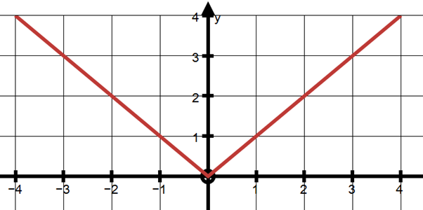

# Cartesian Product
- The cartesian product $A\times B$ is defined as the set: $\{(a,b):a\in A, b\in B\}$
- Properties of cartesian product
	- $A\times B = B\times A$ Only when $B=A$
	- If either $A$ or $B=\phi$, then $A\times B = \phi$
	- $n(A\times B) = \text{mn}\qquad[m=n(A), n=n(B)]$
	- $A\times(B-C) = (A\times B) - (A\times C)\qquad\text{[ Valid for }\cup\text{ and }\cap\text{ as well]}$
	- if $B\subseteq C$, then $A\times B \subseteq A\times C$
	- $\text{n}\big \{(A\times B) \cap (B\times A)\big \} = m^2\qquad[m=n(A\cap B)]$

# Relations
- Subset of $A\times B$
- Domain: Set of all Pre-Images $\qquad\text{[Domain}\subseteq A]$
- Range: Set of all images $\qquad\therefore$ Range $\subseteq$ Co-domain
- Co-domain: The whole set $B$ \[If $R$ is a relation from $A$ to $B$\]

**Note:** As $n(A\times B) = mn\qquad[n(A)=m,n(B)=n]$
$\implies$ Number of Relations(Subsets) from $A$ to $B = 2^{mn}$

**Note:** Any Equation/ineuqality/statement/graph(curve) with 2 variables or parameters is a relation in Real numbers
e.g. $x+y=4$, $a>b$, $l_1 \perp l_2$

**Note:** $(a,b)\in R$ is denoted by $aRb$ 

## Composition of Relations

let:

$$
R_1=\big \{ (1,3), (5,2), (6,9)\big \}

$$

$$
R_2=\big \{ (2,1), (3,5), (7,6), (2,3)\big \}

$$

$$
\text{Then, } R_1\overset{\color{red} \curvearrowleft}{o} R_2 = \big \{ (2,3), (3,2), (7,9)\big \}

$$

**Note:** $(R_1oR_2)^{-1} = R_2^{-1} o R_1^{-1}$

## Inverse Relations
 - $R^{-1}=\{(y,x):(x,y)\in R\}$
 - $R^{-1}\subseteq B\times A$
## Binary Relations

- A relation in/on set $A$ such that $R_B\subseteq A\times A$

## Null Relation

- $\phi$ is a relation from $A\text{ to }A\qquad\text{[As }\phi \subseteq A\times A]$
- Also called empty or void relation
- No. of void relations in a set = 1

## Universal Relation

- $A\times A$ is a relation from $A$ to $A$ \[As $A\times A \subseteq A\times A$ \]
- No. of Universal relations in a set = 1

**Note:** Universal & Null Relation are also called Trivial Relations

## Identity Relation

- if $a\in A,$, then, $(a,a) \in R$
- no. of possible Identity Relations = 1

## Reflexive Relation

- if $a\in A,$ then, $(a,a) \in R \ \forall\  a \in A$ and other element of $A\times A$ **may** be present
- Number of possible reflexive relations = $2^{n^2-n}$

## Symmetric Relation

- if $(a,b) \in R$ then $(b,a) \in R$
- Number of possible symmetric relations = $2^{\frac{n^2 +n}{2}}$
- Number of possible relations which are both Symmetric & Reflexive = $2^{\frac{n^2 -n}{2}}$
- Number of possible relations which are Symmetric but not Reflexive = $2^{\frac{n^2 +n}{2}} - 2^{n^2 - n}$

## Transitive Relation

- if $(a,b) \in R$ and $(b,c) \in R$ then $(a,c) \in R$

## Equivalence Relation

- Relation which is Relfexive, Symmetric & Transitive
- No. of Equivalence relations = Bell Numbers $(B_n)$
    - $B_0=1$
    - $B_1=1$
    - $B_2=2$
    - $B_3=5$

$$
B_{n+1}=\displaystyle\sum_{k=0}^n \  ^nC_kB_k \space \text{[for $n>2$]}

$$

## Asymmetric Relation

- No. of Assymetric relations = $3^{\frac{n^2-n}{2}}$

## Anti-Symmetric Relation

- If a symmetric relation has all elements in the form of $(a,a)$
- No. of Anti-Symmetric Relations = $2^n\times 3^{\frac{n^2-n}{2}}$

## Partial Order Relation

- If a relation is reflexive, transitive & **Anti-Symmetric**

## Equivalence Class
- These are partitions formed by equivalence relations
- Here, among the classes, the elements are equivalent
- Whereas, elements across classes are **not** equivalent.
- They generally have the same properties as an equality
#### Same Remainder Modulo 5
Although it is an equivalence relation it splits itself into 5 classes namely those with remainder 0,1,2,3,4 respectively
Therefore, 7 & 22 belong to the same class ($x\text{ mod }5=2$) whereas, 7 & 13 are in different classes.

#### Clock displays hours modulo 12
A clock showing time is an equivalence relation which is split into 2 equivalence classes:
1 for a.m. & 1 for p.m.

## Identification of a Relation
- For $R:x\rightarrow y$
	- Reflexive: Replace $y$ by $x$
	- Symmetic: Interchange $x$ and $y$
	- Transitive: if $(x,y)$ and $(y,z)$ satisfy relation, check for $(x,z)$
# Functions (Mappings)

- It is a relation from $A$ to $B$ such that each and every element of A has One and Only One image in B

**Note:** A pre-image cannot have 2 images but an image can have 2 pre-images
**Note:** A line parallel to the y-axis should not intersect the equation graph at more than 1 point to be a function

- $x$ is independent variable
    
- $y$ is dependent variable
    
- Domain: The whole set A
    
- Co-Domain: The whole set B
    
- Range: Set of values of $f(x)$
    **Note:** Range $\subseteq$ Co-Domain
    

**Note:** Number of functions from $A$ to $B = n(B)^{n(A)}$

## Rules to find Domain of a Function

1.  $\underbrace{f(x) = g(x) \pm h(x)}_{D \space = \space D_1\space \cap \space D_2}$
    
2.  Eliminate value of $f(x)$ for which function is not defined
    **e.g.** $\underbrace{\sqrt x}_{x\geq0}$, $\underbrace{\frac 1x}_{x\neq0}$, $\underbrace{\log x}_{x> 0}$, $\underbrace{\log_x a}_{x>0 \text{ \& }x\neq 1 }$,
    

## Rules to find Range of a Function

1.  For Odd order polynomials, $Range \in \R$
    
2.  For Even order:
    - Solve by completing the square OR
        - for $a>0$, $Range \in \Big[-\frac{D}{4a}, \infty\Big)$
        - for $a<0$, $Range \in \Big(-\infty, -\frac{D}{4a}\Big]$
            
3.  $a+\frac 1a$ inequality:
    - $a+\frac 1a \geq 2 \qquad \text{ for } a>0$
    - $a+\frac 1a \geq -2 \qquad \text{ for } a<0$
        
4.  $RMS \geq AM \geq GM \geq HM$
    
5.  for $\sqrt{f(x)}$, find range of $f(x)$, Remove -ve part and take root
    
6.  for $f(x)^m$, find range of $f(x)$ and take power $m$
    
7.  for continous & differentiable functions, use Maxima-Minima Method.
    
8.  for eqautions like $y = \frac{ax+b}{px^2 + qx + r}$, cross-multiply and put $D\geq 0$
    **Note:** for $a\sin x + b\cos x, \text{Range} \in \Big[-\sqrt{a^2+b^2}, \sqrt{a^2+b^2}\Big]$

# One-One Function [Injective]
- Each element of $A$ should have a **unique** and **different** image in $B$
- it will be one-one if:
	- $f(x_1)=f(x_2) \implies x_1 = x_2 \quad\forall\space x \in A$
	- $f'(x) > 0 \text{ or } f'(x)< 0\quad\forall \space x\in A \qquad\text{[Strictly Increasing or Stictly Decreasing]}$

**Note:** $\text{No. of One-One functions}=\begin{cases}^nP_m &, n\geq m\\ 0 & ,n<m\end{cases}$
where:
$m = \text{n}(A)$
$n=\text{n}(B)$

# Onto Function [Surjective]
- Each element of $B$ should have a **unique pre-image** in $A$``
- Thus, $\text{Range} = \text{Co-domain}$
**Note:** $\text{No. of Onto Functions} =\begin{cases} \displaystyle\sum_{r=1}^n {^nC_r\space(-1)^{n-r}\space r^m}&,1\leq n\leq m\\\\n! &,n=m \\\\0&,n>m\end{cases}$
where:
$m = \text{n}(A)$
$n=\text{n}(B)$

# One-One Onto Function [Bijective]
- Only possible when $\text{n}(A)=\text{n}(B)$

**Note:** $\text{No. of Bijective Functions} = \begin{cases} n!&,\text{where } \text{n}(A) = \text{n}(B) \\ 0 & ,\text{otherwise}\end{cases}$

# Composition of Functions
- if $f$ & $g$ are both bijective then $fog$ & $gof$ are both bijections as well.

# Inverse of a Function

- Only possible if function is bijective
- Graph of $f^{-1}(x)$ is mirror image of $f(x)$about $y=x$
- If graph is symmetrical about $y=x$ then $f(x)$ & $f^{-1}(x)$ are identical.
- if f(x) is increasing or decreasing the f^{-1}(x) is also increasing or decreasing respectively
# Even & Odd Function
## Even Function
- if $f(-x) = f(x)$
- Graph is symmetric about $y$-axis
- The Derivative of Even function is Odd
- Constant functions are always Even.
- $f(x) + f(-x)$ is always Even.

## Odd Function
- if $f(-x) = -f(x)$
- Graph is symmetric about origin.
- The Derivative of Odd function is Even
- If $f(x)$ is an odd function defined at $x=0$ then $f(0) = 0$.
	- if f(0) \neq 0 then f(x) cannot be odd.
	- However if f(x) is odd then $f(0)$ **MAY OR MAY NOT** $= 0$
- $f(x) - f(-x)$ is always Odd.

**Note:** 
- $f(x) = 0$ is both Even & Odd Function.
- Any function $f(x)$ (neither Even nor Odd) can be expressed as:
$$
f(x) = \underbrace{\frac{f(x) + f(-x)}{2}}_{Even} + \underbrace{\frac{f(x) - f(-x)}{2}}_{Odd}
$$

## Extension of a Function
Let $f(x)$ be defined from $[0,a]$
### a) Even Extension
$f_e(x) = \begin{cases}f(x) &, x \in [0,a]\\f(-x)&, x \in [-a,0]\end{cases}$

### a) Odd Extension
$f_o(x) = \begin{cases}f(x) &, x \in [0,a]\\-f(-x)&, x \in [-a,0]\end{cases}$

# Periodicity of Functions
- if $f(x) = f(x+T) \space\text{for } x,\space x+T \in D_f$
- A function having a restricted domain cannot be periodic
- for $|\sin x|,\space \sin^2 x, \tan x$ period = $\pi$
- Constant Functions are periodic but their fundamental period is not defined.
 
- When LCM is not possible (Rational & Irrational) there will be no fundamental period.
- if $f(x)$ is periodic and $g(x)$ is non-linear **&** non-periodic then $f(g(x))$ is non-periodic
- if $f(x)$ is periodic and $g(x)$ is **either** linear **or** periodic then $f(g(x))$ is periodic 
- If $f_1(x)$ & $f_2(x)$ are periodic, then $f_1(ax+b) \pm f_2(cx\pm+d)$ has period $\text{L.C.M.}\{\frac{T_1}{a}, \frac{T_2}{c}\}$
	- **Note:** This fails in some cases where $f_1(x)$ and $f_2(x)$ are cofunctions of each other (**e.g.** $\sin x$ & $\cos x$)
	- in such cases: 
$$
\text{Period}\{\sin mx + \cos nx\} = \begin{cases}\text{L.C.M.}\Big\{\frac{2\pi}{m}, \frac{2\pi}{n}\Big\}&,m\neq n \\ \\{\Large\frac 12}\space\text{L.C.M.}\Big\{\frac{2\pi}{m}, \frac{2\pi}{n}\Big\}&,m = n\end{cases}
$$ 
# Explicit & Implicit Functions
**Explicit:** $x$ & $y$ **can** be seperated
**Implicit:** $x$ & $y$ **can not** be seperated

# Modulus Function

- $f(x) = |x| = \begin{cases}x &,x\geq 0 \newline -x &,x<0\end{cases}$
- $Domain = \R$
- $Range = [0, \infty)$

Note: $|x| = \sqrt{x^2} = max\{x,-x\}$

- if $|x| \leq a \implies -a\leq x \leq a$
- if $|x| \geq a \implies x\leq-a\cup x\geq a$
    
- $|x\pm y| = |x| \pm |y|\qquad ,xy\geq0$
- $|x+y| = \big||x| - |y|\big|\qquad ,xy\leq0$
- $|x-y| = |x| + |y|\qquad ,xy\leq0$
    
- $|x+y| < |x| + |y|\qquad ,xy\leq0$
- $|x-y| < |x| + |y|\qquad ,xy\geq0$
    
- Maximum value of $|x-a| + |x-b|$ is $|a-b| \qquad \text{, for } x\in[a,b]$
- Maximum value of $\Big||x-a| - |x-b|\Big|$ is $|a-b|$
    
- $max\{x,y\} = \frac{x+y}{2} + \bigg|\frac{x-y}{2}\bigg|$
- $min\{x,y\} = \frac{x+y}{2} - \bigg|\frac{x-y}{2}\bigg|$

# Greatest Integer Function

$f(x) = [x]=n\qquad,x\in [n,n+1] , n \in \Z$

Note: $x=[x]+\{x\}$

$\text{Domain}= \R$
$\text{Range} = \Z$
    
- $[-x] = -[x]-1\qquad,x\notin \Z$
    
- $[x]\geq n \implies x\geq n\qquad ,n\in \Z$
- $[x]>n \implies x\geq n+1\qquad ,n\in \Z$
    
- $[x]\leq n \implies x<n+1\qquad ,n\in \Z$
- $[x]< n \implies x<n\qquad ,n\in \Z$
    
- $x-1<[x]\leq x$
- $[x]\leq x< [x] + 1$
- $[x]+[y] \leq [x+y] \leq [x]+[y] +1$
    
- $[x]=\Big[\frac x2\Big]+\Big[\frac{x+1}2\Big]$
    
- $\Big[\frac{x}{n}\Big] + \Big[\frac{x+1}{n}\Big]+\dots \Big[\frac{x+n-1}{n}\Big] = [x]\qquad,n\in \N$
    
- ${[x]} + \Big[x + \frac{1}{n}\Big] + \dots \Big[x + \frac{n-1}{n}\Big]= [nx]\qquad,n\in \N$
    
- $\Big[\frac{n+1}{2}\Big] + \Big[\frac{n+2}{4}\Big]\dots =n\qquad,n\in \N$

# Fractional Part Function

- $f(x) = \{x\} =x-[x]$
- **Note:** $\{x\}$ is periodic with period $1$.
- $Domain = R$
- $Range = [0,1)$
    
- $\{-x\} = -\{x\} +1\qquad, x\notin \Z$
    
- $[x+y] = [x] +[y], \qquad 0\leq \{x\}+\{y\} < 1$
- $[x+y] = [x] +[y]+1, \qquad 1\leq \{x\}+\{y\} < 2$
    **Note:**
- Domain of $\frac{1}{\{x\}} \in \R-\Z$
- Range of $\frac{1}{\{x\}} \in (1,\infty)$

# Signum Function

- $f(x) = \begin{cases}\large{\frac{x}{|x|}} \normalsize{\text{ or }}\large{\frac{|x|}{x}}, &x\neq0 \newline0, &x=0\end{cases}$
- $Domain = \R$
- $Range = \{-1,0,1\}$

# Exponential Function

- $f(x) = a^x, \qquad a>0, \space a\neq1$
- $Domain = \R$
- $Range = (0,\infty)$

# Logarithmic Function

$f(x)=\log_a x, \qquad a>0, \space a\neq1$
$Domain = (0,\infty)$
$Range = \R$

- $\log_{a^m}x^n=\frac{n}{m} \log_a x = \log_{a^{\frac1n}}x^{\frac1m}$
- $x^{\log_a y}=y^{\log_a x}$
- $\log_a b \times \log_c a = \log_c b$
    
- $\log_ax>b\begin{cases} x>a^b &\text{if }a>1\\ x<a^b &\text{if }0<a<1 \end{cases}$

# Transformation of Graphs
**Note:** $c$ is a Postive Real Number:
1. $f(x+c)$ shift left
2. $f(x) + c$ shift upwards
3. $f(-x)$ draw mirror image of $f(x)$ w.r.t. $y$-axis
4. $-f(x)$ draw mirror image of $f(x)$ w.r.t. $x$-axis
5. $f(cx)$ shrink along $x$-axis
6. $f(x)$ stretch along $y$-axis
7. $f(|x|)$ remove portion of $f(x)$ to the left side of $y$-axis and draw mirror image on left side w.r.t. $y$-axis
8. $|f(x)|$ draw mirror image on upper side w.r.t. $x$-axis and remove portion of $f(x)$ below $x$-axis
9. $|y| = f(x)$ remove portion of $f(x)$ below $x$-axis and draw mirror image on lower side w.r.t. $x$-axis
10. $y = \pmb[f(x)\pmb]$ mark intervals of unit length with integers as end-points on $x$-axis **&** mark the corresponding intervals.
11. $y = f(\pmb[x\pmb])$ plot lines parallel to $y$-axis for integral values of $x$ **&** Draw horizontal lines of 1 unit from point of intersection to meet the nearest vertical line. Horizontal line should be open on the right. Remove orignal graph.
12. $\pmb[y\pmb] = f(x)$ plot lines parallel to x-axis for integral values of $y$ **&** mark the points of intersection of these lines with the curve $y=f(x)$. Draw vertical lines of 1 unit from point of intersection to meet the next upper horizontal line excluding uppermost points. Remove orignal graph.
13. $y=\{f(x)\}$ Draw horizontal lines at integrals points transfer the graoh netween two consecutive lines to the interval $y \in [0,1]$
14. $\{y\} = f(x)$ Keep graph for $y \in [0,1]$ and remove all other values

**Note:** If graph of $f(x)$ is symmetric about $x=a$ then: $f(a-x) = f(a+x)$

# Binary Operations
An operation which produces a new element from two given element.

**Note:** In order to be defined, the new element obtained must belong to the same set as the two given elements.

**No. of Binary operations** from $A$ to $A = n^{(n^2)}\qquad \text{,where n}(A) = n$

### Commutative:
$$
a*b = b*a
$$

### Associative:
$$
a*(b*c) = (a*b)*c
$$

### Distributive: 
$$
a*(b\#c) = (a*b)\#(a*c)
$$
<b>
AND
</b>

$$
(b\#c)*a = (b*a)\#(c*a)
$$
$\therefore * \text{ is distributive over } \#$

### Identity Element
$$
a*e = e*a = a
$$
if $a*e=e*a\neq a$ then it is not identity element

### Invertibility
$$
a*c=c*a=e
$$
**Note:** Invertibility is only defined if there exist an identity element.

# Extras
## Inequalities
- If $a<b$ and $c<d$, then $a+c <b+d$
- if $0<a<b$:
	- $a^n<b^n,\quad n>0$
	- $a^n>b^n,\quad n<0$
- $a+\frac 1a \geq 2, \quad\text{ for }a > 0\qquad\text{[holds for }a=1 ]$
- $a+\frac 1a \leq -2, \quad\text{ for }a < 0\qquad\text{[holds for }a=-1 ]$
- $a<b\implies a^2<b^2$ is not always true.
	- We check for inclusion of 0
	- if $x^2\leq a^2:x\in[-a,a]$
	- if $x^2\geq a^2:x\in(-\infty,-a]\cup[a,\infty)$
	- Examples:
		- $x>2\implies x^2>4$
		- $x>-3\not\Longrightarrow x^2>9\implies x^2>0$
- $a>b\implies \frac1a<\frac1b,\quad \text{for }ab>0$
- $a>b\implies \frac1a>\frac1b,\quad \text{for }ab<0$

## Sign-Scheme (Wavy Curve Method)
- Consider: $\frac{(x-2)^2(x-5)}{x(x+3)^4}\leq0$
- Plot on number line:
- As equation starts with a plus sign we will also begin from "+ve"
- as $(x-5)$ has odd power, we continue by switching signs
- as $(x-2)^2$ has even sign, we will keep the same sign.
- As inequality is $\leq0$, we take only -ve parts.
- Also, we will not include $x=0,-3$ as they are in the denominator.
- $\therefore\text{ Solution set = }(0,5]$

final number line plot (for future ref)

$-\infty [+ve]-3[+ve]0[-ve]2[-ve]5[+ve]\infty$