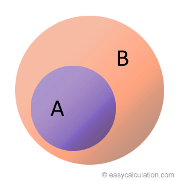
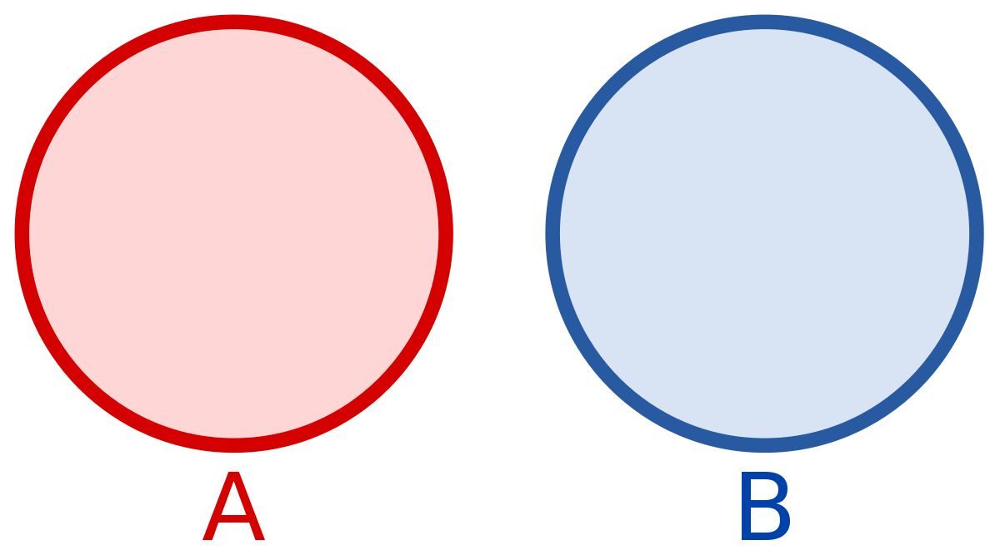
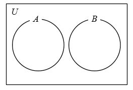
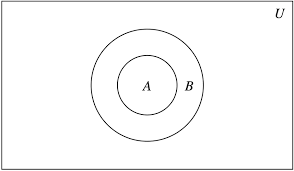
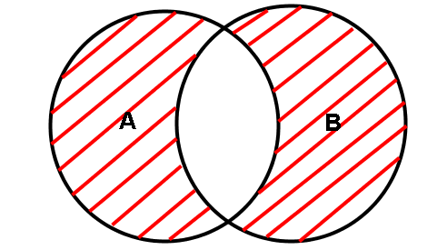
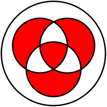
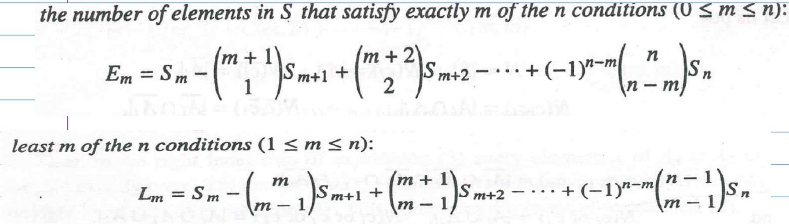

## Questions
1) $\text{The number of subset }S\text{ of }\{1,2,3,\dots,10\}\text{ with the propertry: "There exists intergers }a<b<c\text{ with }a,c\in S\text{ and }b\notin S$ 
	- Answer: 968
2) $\text{In a group of 50 items, each one is either type A or type B and is either sweet or hot. 14 are sweet items of type A, 31 are type B and 18 are hot. Find the number of items of Type B}$
	- Answer: 13
3. $\text{Let S be a set of positive integers such that every element n of S satisfies the conditions:}$
- $\text{i) } 1000<n<2000$
- $\text{ii) every digit of }n\text{ is odd}$

$\text{Then How many elements of S are divisble by 3?}$	
- Answer: 9

4. 
## 9) In a group of

# Introduction
**Set:** Well defined collection of objects
## Some Important Notations

| Symbol | Meaning |
| --- | --- |
| $\in$ | Belongs to |
| $\exists$ | There Exists |
| $\forall$ | For all values |
| $:$ **or** $\mid$ | Such that |
| $\implies$ | Implies that |
| $\iff$ | Implies that and Implied by **or** if and only if *(iff)* |
| $\subset$ or $\subsetneq$ | Proper Subset of |
| $\subseteq$ | Subset of |

# Cardinal Number (order) of a finite set

- The number of unique elements in a set
- It is denoted by $n(A)$ **or** $O(A)$ **or** $C(A)$ **or** $|A|$
    **e.g.** Let $A=\{\text{Letters of School}\}$, Then $n(A) = 5$

**Note:** Its value is always a whole number

# Types of Sets

- **Equal Sets:** If $A$ & $B$ are **exactly** the same
	- **i.e**, if $A \subseteq B$ and $B \subseteq A$
- **Equivalent Sets:** If $A$ & $B$ have the same no. of elements

### Proper Subset

If there is atleast one element in $B$ which is not in $A$.

- A is a **proper subset** of B
- B is the **superset** of A

**Note:** If $A \subset B$ then, $C-B \subset C-A$

### Disjoint Sets

If $A\cap B = \phi$
**Note:** If $A-B=A$ **and** $B-A=B \implies A\cap B =\phi$

### Power Set

It is the set of all subsets.
Denoted by $P(A)$
**e.g.** Let $B = \{0,1\}$
$\implies P(B) = \big\{\phi, \{0\},\{1\}\{0,1\}\big\}$

**Note:** If a set has $n$ elements: No. of Subsets = $2^n$
 Proof:-
 Let us have a set $A$ having $n$ elements:
$$
A = \{x_1 , x_2, x_3\dots x_n\}
$$
Therefore, for each of the elements we have 2 options: To choose an element or not
Therefore, for $n$ elements, $\underbrace{2\times2\dots2}_{n \text{ times}} = 2^n$

**Note:** This result can also be proved by binary by thinking of set $A$ as an $n$-bit binary number.
- No. of Proper Subsets = $2^n -1$

# Properties of Union & Intersection
- **Note:** $A-B$ is also dentoed by $A \space\backslash\space B$

| Union $(\cup)$ | Intersection $(\cap)$ |
| --- | --- |
| Given by **Or** & **Atleast** | Given by **And** & **Both (all)** |
| $A\cup B = B\cup A$ | $A\cap B = B\cap A$ |
| $A\cup(B\cup C)$ = $(A\cup B)\cup C$ | $A\cap(B\cap C)$ = $(A\cap B)\cap C$ |
| $A\cup(B\cap C) = (A\cup B)\cap(A\cup C)$ | $A\cap(B\cup C) = (A\cap B)\cup(A\cap C)$ |
| $A\cup(A\cap B) = A$ | $A\cap(A\cup B) = A$ |

**Notes:**

- $A\cap B = A\cup B$ Then, $A=B$
- $A\cap B = A\cap C$ need not imply $B=C$ (Same for $\cup$)

## Minimum and Maximum Values of $A\cup B$ and $A\cap B$

#### $\text{Case I: }n(A) + n(B) < n(U)$

$\qquad$

$n(A\cap B)_{min} = 0$
$n(A\cap B)_{max} = n(A)$
$n(A\cup B)_{min} = n(B)$
$n(A\cup B)_{max} = n(A) +n(B)$

#### $\text{Case II: }n(A) + n(B) \geq n(U)$

$n(A\cap B)_{min} = n(A) + n(B) - n(U)$
$n(A\cup B)_{max} = U$

# Symmetric Difference

- Combination of $A$ & $B$ except the common parts
- Denoted by $A \Delta B$ or $A\oplus B$

$$
\therefore A \Delta B = (A-B) \cup (B-A) = (A\cup B) - (A\cap B) 

$$

**Note:** For 3 sets, $A\cap B\cap C$ is included in $A\Delta B$

### Proof:-

Let us assume some arbitrary element $x \in A\cap B\cap C$
use $A-B=A\cap B'$
in $A\Delta B$
# Complement of a Set

- All those elements not in $A$
- Denoted by $A'/A^c$
- Properties of $A'$:
    - $A\subseteq B \iff B' \subseteq A'$
    - $A -B=B'-A'$
    - $A-B = A\cap B'$

# De Morgan's Laws

- $(A\cup B)' = A' \cap B'$
- $(A\cap B)' = A' \cup B'$
- $A-(B\cup C) = (A-B)\cap(A-C)$
- $A-(B\cap C) = (A-B)\cup(A-C)$

# Application of Sets
## Counting Principle
>Also called the principle of exclusion / inclusion

### 1) $n(A\cup B)$

$\boxed{n(A\cup B) = n(A) + n(B) - n(A\cap B)}$

### 2) $n(A\cup B\cup C)$

$\boxed{n(A\cup B\cup C) = n(A) + n(B) + n(C) - n(A\cap B) - n(B\cap C) - n(C\cap A) + n(A\cap B \cap C)}$

### 3) $n(A\cup B\cup C\cup D)$

$\boxed{n(A\cup B\cup C\cup D) = n(A) + n(B) + n(C) +n(D) - n(A\cap B) - n(B\cap C) - n(C\cap D) - n(D\cap A) - n(A\cap C) - n(B\cap D)+ n(A\cap B \cap C)+ n(B\cap C \cap D)+ n(C\cap D \cap A)+ n(A\cap B \cap D) - n(A\cap B\cap C\cap D)}$

**Tip:**

1. Add elements in each set
2. Subtract elements in 2 sets at a time
3. Add elements 3 sets at a time
4. Subtract elements 4 sets at a time
5. Continue Alternating...

 
# Extras
## The Set of All Sets is not a Set - Robert Bertrand
## Sets which appear infinite but are not
- The Set of all Platonic (3-D Regular) Solids has a cardinality of 5 where as the set of all regular polygons is infinite.
## Set-Builder Form Steps
There are 3 steps when it comes to obtaining elements using set-builder form
**e.g.**
$$
\{x^2\space|\space	x\in\Z,\space x\text{ mod }2=0\}
$$

1. Generator: Generates values from a pre-existing set
	- In this case, $x\in\Z$
2. Filter: Selects particular elements which satisfy a condition:
	- In this case, $x\text{ mod }2=0$
3. Transform: converts the obtained values into some desired form
	- In this case, $x^2$
	- If the output is the same as the input, it is called **Identity Transformation**
## Representation of Whole Numbers in the form of Sets
- Proposed by **Georg Cantor**
**Example:-**
$$
0=\phi
\\
1=\{\phi,\{\phi\}\}
\\
\vdots
\\
n+1=\{n,\{n\}\}
$$

- Do we expand the sets and the number of elements gives it whole number value?

# Some good questions:
- **Tip:** for Questions here we have to find relations b/w 2 sets, assume sets to be Disjoint, Overlapping, Intersecting, Equal etc.
	- Either use a venn diagram or substitute from options.
 1. Q) If $A = {1,2,3,4,5}$ from which two subsets $B$ & $C$ are made, find the no. of ways in which $B$ & $C$ are mutually disjoint.
	- Answer:
	   Now each element from $A$ can either be in $B/C/\text{not used at all}$
	  therefore: 1 (the element) can be used in 3 ways and so on.
	  This will repeat for every element.
	  therefore total ways in which $B\ \&\ C$ can be constructed is $3\times3\times3\dots_\text{5 times total (for 5 elements)}$
	  which is equal to $3^5$ ways.
2. Q) Find the total no. of integers $n$ such that $2\leq n\leq 2000$ and $\text{HCF}(n,36)=1$
	- Answer:
		Factors of $36$ are:- $2,3,4,6,9,12,18,36$
		for $HCF$ to be $1$, we remove all multiple of $2$ and $3$
		We also add the multiples of 6 as they have been removed twice:-
		$n=\text{[Total no. of integers]}-\text{[Multiples of 2]}-\text{[Multiples of 3]}+\text{[Multiples of 6]}$
		$\text{[Total no. of integers]}=(2000-2)+1=1999$
		$\text{[Multiples of 2]}=(\frac{2000}{2}-\frac{2}{2})+1=1000$
		$\text{[Multiples of 3]}=(\frac{1998}{3}-\frac{3}{3})+1=666$
		$\text{[Multiples of 6]}=(\frac{1998}{6}-\frac{6}{6})+1=333$

		$\therefore n = 1999-1000-666+333=666$ Integers

3. Q) Suppose $A_1, A_2, \dots ,A_{30}$ are 30 sets having 5 elements and $B_1,B_2,\dots,B_n$ are n sets having 3 elements.

	Let $\bigcup\limits^{30}_{i=1}A_i = \bigcup\limits^{n}_{j=1}B_j = S$ and each element of $S$ belongs to exactly 10 of the $A_i$'s and 9 of the $B_j$'s. Find $n$
	- Answer:
		As each element of $S$ is used 10 times in $A_i$'s:-
		$S = \frac{\text{Total number of elements}}{10} = \frac{30\times5}{10}$
		Also each element of $S$ is used 9 times in B:-
		$S=\frac{n\times 3}{9} =\frac{30\times 5}{10}$
		$\therefore n = 45$ sets
4. Q) In a battle, 60% of combatants lost one eye, 80% lost one leg, 85% lost one ear, 90% lost an arm. If $x\%$ lost all 4 organs, find $x$
	- Answer:
		 As $n(A) + n(B) > n(U):$
	  	$n(A\cap B)_{\text{min}} = n(A) + n(B) - n(U)$
	  $\therefore x = n(A\cap B\cap C\cap D) = n(A)+n(B)+n(C)+n(D)-3\times n(U)$
	  $= 60+80+85+90-300$
	  $\therefore x = 15$ percent