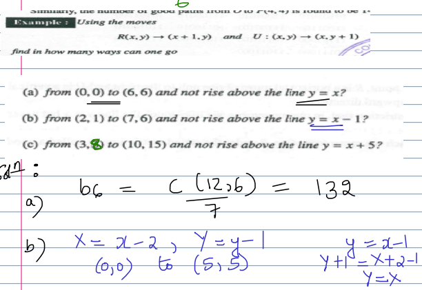

# Permutation & Combination
- When events are independent we **add**
- When events are dependent we **multiply**

## Factorial
$$
n!=n\times (n-1)\times (n-2)\times\dots\times 1
$$
## Permutation
- It is an ordered arrangement of $n$ objects taken $r$ at a time
- Suppose we have $n$ distinct objects and we wish to arrange $r$ of these.
$$
^nP_r=\frac{n!}{(n-r)!} \qquad(\text{No Repetition})
\\
\
\\
{}^nP_r=n^r \qquad(\text{Repetition})
$$
### A Generalization
Suppose it is required to find the number of permutations that can be formed from a collection of $n$ objects of which $n_1$ are of one type, $n_2$ of another, and so on.

Where $n_1+n_2+\dots+n_k=n$.

Then the number of permutations of the $n$ objects (taken all of them at a time) is:
$$
\frac{n!}{n_1!n_2!\dots n_k!}
$$
## Combination
Suppose we are interested in selecting a set of $r$ objects from a set of $n\geq r$ objects without regard to order.
$$
^nC_r = \frac{n!}{r!(n-r)!}
$$

## Derangements:
- A permutation of $n$ distinct object in which none of the objects are in their original place

# Binomial and Multinomial Theorems
## Binomial Theorem
$$
\boxed{(x+y)^n = \sum\limits_{r=0}^n {}^nC_r x^r y^{n-r}}= \sum\limits_{r=0}^n {}^nC_r x^{n-r} y^{r}
\\
\
\\
\Rightarrow {}^nC_0x^n+{}^nC_1x^{n-1}y+\dots+{}^nC_ny^n
$$

Binomial coefficient: ${}^nC_r = \begin{pmatrix}n\\r\end{pmatrix}$ is the coeffecient of $x^ry^{n-r}$ and $x^{n-r}y^r$

This result is known as the **Binomial Theorem for a positive integral index**

## Sums of Coefficents

## Multinomial Theorem:
**Theorem:** For positive integers $n$ and $k$, the coefficent of $x_1^{n_1}x_2^{n_2}\dots x_k^{n_k}$ in the expansion of $(x_1+x_2+\dots+x_k)^n$ is:
$$
\frac{n!}{n_1!n_2!\dots n_k!}
$$
where each $n_1$ is a non-negative integer and $n_1+n_2+\dots+ n_k=n$

This value is also called a **multinomial coefficient**

# Catalan Numebrs
The sequence of numbers:
$$
C_1=\frac12\begin{pmatrix}2\\1\end{pmatrix}\quad C_2=\frac13\begin{pmatrix}4\\2\end{pmatrix}\ \dots\  C_n=\frac{1}{n+1}\begin{pmatrix}2n\\n\end{pmatrix}\quad
$$
And $C_1,\ C_2\dots C_n$ are called Catalan numbers
$$
C_1=\frac12\times{}^2C_1 = 1
\\
\
\\
C_2=\frac13\times{}^4C_2 = 2
\\
\
\\
C_3=\frac14\times{}^6C_3 = 5
\\
\vdots
\\
C_n = \frac{1}{n+1}\times{}^{2n}C_n
\\
$$

b) answer = $b_5$ which is $C_5$