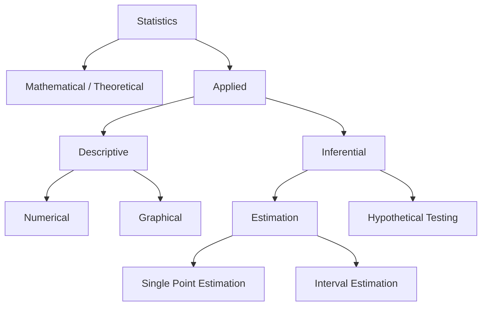
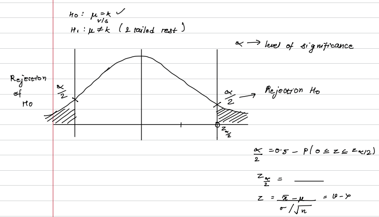
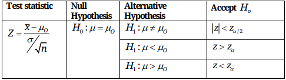
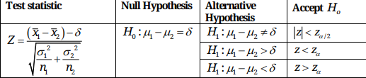
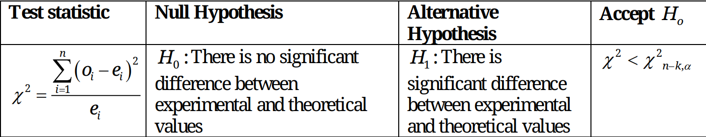

**Note:** when not mentioned take significance $(\alpha) = 0.01/ 0.05$

## Testing of Hypothesis
Follows a normal distribution.
1. Identify a random variable $X$ which is well defined.
2. "Claim" a Null Hypothesis $H_o$ on a mean $\mu = K$ which may or may not be correct.
3. Take an alternate hypothesis $H_1$ which will be the opposite of $H_1$ which will be true if $H_o$ isnt and vice versa on
	i) $\mu \neq K$ or 
	ii) $\mu < K$ or
	iii) $\mu >K$
4. Depending upon the value of $\mu$ we perform the following tests respectively
	i) 2 Tailed test
	ii) Left Tailed test
	iii) Right tailed test.

### 2-Tailed Test

Plot the normal curve and mark $\frac{\alpha}{2}$ on both side where $\alpha$ is the level of significance.
Find the the value of $z$ for $\frac\alpha2$ (by normal table)and find the area of rejection to be:
$$
\text{Area of Rejection} = 0.5 - (0\leq z\leq z_\frac{\alpha}{2})
\\
z = \frac{\bar{x}-\mu}{\sigma/\sqrt{n}}
$$

## Test of Significance for difference b/w 2 means
all same methods as the earlier tests:
$$
z = \frac{(\bar{x_1}-\bar{x_2})-\delta}{\sqrt{\frac{\sigma_1^2}{n_1}+\frac{\sigma_2^2}{n_2}}}
$$

# $z-\text{test}$
> for large sample $(n>30)$

Test of significance for single mean.

Test of significance for difference between two means

# $t-\text{distribution}$
> for small sample $(n<30)$

The number of independent variables free to vary is called degree of freedom (DOF)
**Note:** $\text{D.O.F.}=n-1\qquad\text{(for sample size }n)$

**Test-Statistic:**
$$
t=\frac{\bar{x}-\mu_o}{s/\sqrt{n}}\text{ or }t=\frac{\bar{x}-\mu_o}{s/\sqrt{n-1}}
\\
\
\\
\text{where, }s^2  = \frac{\sum\limits_{i=1}^n(x_i-\bar{x})^2}{n-1} \text{ or }s^2  = \frac{\sum\limits_{i=1}^n(x_i-\bar{x})^2}{n} 
$$
**Note:** If using the first formula for $t$, use the first formula for $s^2$ as well. Similiarly if using the second formula for $t$, use the second formula for $s^2$ as well. DO NOT mix and match the formulas.

Here, $s$ refers to the standard deviation.

We use $s$ instead of $\sigma$ here because we are refering to the sample, not the population.

**Note:** When $s$ is given use $n-1$ in the denominator of test-statistic.

Also:

$$
\begin{array}{cc}
\text{Null Hypothesis}
\\
\
\\
H_0:\mu=\mu_o
\\
\
\end{array}
\begin{vmatrix}
\text{Alternate Hypothesis}
\\
H_1:\mu\neq\mu_o
\\
H_1:\mu<\mu_o
\\
H_1:\mu>\mu_o
\end{vmatrix}
\begin{array}{cc}
\text{Accept }H_0
\\
|t|<t_{\frac{\alpha}{2},n-1}
\\
t>t_{\alpha, n-1}
\\
t<t_{\alpha, n-1}
\end{array}
$$

## Difference between 2 means
**Test-Statistic:**
$$
t= \frac{(\bar{x}_1-\bar{x}_2)-\delta}{s\sqrt{\frac{1}{n_1}+\frac{1}{n_2}}}
$$
$\text{where,}$
$$
s^2=\frac{\sum(x_{1i}-\bar{x_1})^2+\sum(x_{2i}-\bar{x_2})^2}{n_1+n_2-2}
$$
**Also:**
$$
\begin{array}{cc}
\text{Null Hypothesis}
\\
\
\\
H_0:\mu_1-\mu_2=\delta
\\
\
\end{array}
\begin{vmatrix}
\text{Alternate Hypothesis}
\\
H_1:\mu_1-\mu_2\neq\delta
\\
H_1:\mu_1-\mu_2>\delta
\\
H_1:\mu_1-\mu_2<\delta
\end{vmatrix}
\begin{array}{cc}
\text{Accept }H_0
\\
|t|<t_{\frac{\alpha}{2},n_1+n_2-2}
\\
t<t_{\alpha, n_1+n_2-2}
\\
t>t_{\alpha, n_1+n_2-2}
\end{array}
$$

# $f-\text{distribution}$ (Ratio of variance)
> It contains a negligible critical region (region of rejection is small)

\<put a picture of the graph here showing the region of acceptance and the region of rejection>

- not sure,As we can see the critical region is negligible.

- We use the distribution for the population distributed toward right skewed.
- population is independent with each other

**Test-statistic:**
$$
F=\frac{s_1^2}{s_2^2}\text{ or }\frac{s_2^2}{s_1^2}\qquad\text{(Depending on }F\text{, should be always}\geq1)
$$

$\text{where,}$
$$
s_1^2=\frac{\sum(x_{1i}-\bar{x_1})^2}{n_1-1}
\\
\
\\
s_2^2=\frac{\sum(x_{2i}-\bar{x_2})^2}{n_2-1}
$$
Note: The denominator needs to be $n-1$ for this to work. don't know why
Therefore if $s$ is already given, we need to normalize it to $n-1$ by multiplying by $n$ and dividing $n-1$ again don't know why
**Also:**
$$
\begin{array}{cc}
\text{Null Hypothesis}
\\
\
\\
H_0:\sigma_1^2=\sigma_2^2
\\
\
\end{array}
\begin{vmatrix}
\text{Alternate Hypothesis}
\\
\
\\
H_1:\sigma_1^2\neq\sigma_2^2
\\
\
\end{vmatrix}
\begin{array}{cc}
\text{Accept }H_0
\\
F<F_{n_1,n_2-1,\alpha}
\\
\text{or}
\\
F<F_{n_2,n_1-1,\alpha}
\end{array}
$$
Only one Alternative Hypothesis because region of acceptance is small I think

## $\chi^2-\text{distribution}$ (chi-square)
|$o_i$|$o_1$|$o_2$|$\dots$|$o_n$|
|----|----|----|----|----|
|$e_i$|$e_1$|$e_2$|$\dots$|$e_n$|

Here, $o\longrightarrow\text{Observed data}$ and $e\longrightarrow\text{Expected data}$

We use a pre-existing distribution (like poisson or normal distribution, etc.) on the observed data to find the expected data.

**Test-Statistic:**
$$
\chi^2=\frac{\sum\limits_{i=1}^{n}(o_i-e_i)^2}{e_i}
$$

**Accept $H_0$**
$$
\chi^2<\chi^2_{n-1-m}
$$

here, in $n-1-m$:

$m$ refers to the number of parameters excluding the running variable:
for e.g. poisson distribution has $m=1$
and normal distribution has $m=2$

1) $v=n-1$ if $e_i$ can be calculated without having to estimate parameters from sample statistic.
2) $v=n-1-m$ if $e_i$ can be calculated only by estimating $m$ number of population parameters from the sample statistic.
