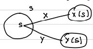
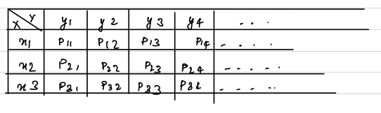

# Introduction

Consider a probabilistic model with discrete random variable $X$ and $Y$ with Probability Mass Functions (PMF):

$$
P_X(X=x)\quad\&\quad P_Y(Y=y)\text{ respectively}
$$

$\text{for any }x\in X \text{ and }y\in Y$  
The probability of occurrence of $x$ and $y$ denoted by $P_{X,Y}(X=x,Y=y)$ is called the Joint Probability Mass Function (JPMF)  

$\text{We know that:}$  
$\text{i) } P_{X,Y}(x,y)\geq 0$  
$\text{ii) } \sum\limits_{i=1}^\infty\sum\limits_{j=1}^\infty P_{X,Y}(x_i,\ y_j)=1$

<u>**Suppose:**</u>  
$X=\{x_1,\ x_2,\ x_3\}$  
$Y=\{y_1,\ y_2,\ y_3\}$  
The joint probability function is given by:  
$a_{ij}=P_{ij}=P_{X,Y}(x_i,\ y_j)$  

Once we have the JPMF $P_{X,Y}(X=x,Y=y)$ the individual PMFs $P_X(x)$ and $P_Y(y)$ are called the marginal PMFs.

$$
P_X(x_i) = P_{i1}+P_{i2}+\dots=\sum_{j\geq 1}P_{ij}=\sum_{j\geq 1}P_{X,Y}(x_i,y_j)
\\
\
\\
P_Y(y_j) = P_{1j}+P_{2j}+\dots=\sum_{i\geq 1}P_{ij}=\sum_{i\geq 1}P_{X,Y}(x_i,y_j)
$$

**Note:** If $X$ and $Y$ are independent random variables then:

$$
P_{X,Y}=P_x\times P_Y
$$

## Expected values of $g(x,y)$

$$
E[g(x,y)] = \sum_x\sum_y g(x,y) P_{X,Y}(x,y)
$$

## Expected values of $X+Y$

$$
E[X+Y] = E[X]+E[Y]
$$

## Covariance

Covariance of $X$ and $Y$ is denoted by $\text{cov}(X,Y)$ and is defined by :

$$
\text{cov}(X,Y)=\sum_x\sum_y(x-\mu_x)(y-\mu_y)P_{X,Y}(x,y)
$$

$\text{where }\mu_x=E[X=x]\text{ and }\mu_y=E[Y=y]$

$$
\therefore \boxed{\text{cov}(x,y)=E[XY]-E[X]E[Y]}
$$

$\text{If }X=Y\text{ then:}$

$$
\text{cov}(x,x) = E[(x-\mu_x)^2] = \text{var}(X)
$$

### Correlation Coefficient of $X$ and $Y$

For the random variable $X$ and $Y$ the correlation coefficient is:

$$
\rho(X,Y) = \frac{\text{cov}(X,Y)}{\sigma_x\sigma_y}
$$

$\text{where }\sigma_n\text{ is the standard deviation of }n$

For any random variable $X$ and $Y$, the correlation coefficient lies between $-1$ & $1$ 

# Continuous Joint Distribution

Let $X$ and $Y$ be two continuous random variables, the probability density function $f_{X,Y}(x,y)$ satisfy the following:  
$\text{i) }f(x,y)\geq0\qquad\forall\ (x,y)$  
$\text{ii) } \int\limits_{-\infty}^{\infty}\int\limits_{-\infty}^{\infty}f_{X,Y}(x,y)dxdy=1$  
$\text{iii) } P((x,y)\in R) = \int\int\limits_R f_{X,Y}(x,y)dA$

- where $R$ is the region in 2-D.
    
    - i.e. $P((x,y)\in R)$ depends on the area contained by $f(x,y)$
- **Note:** if Area $(R)=0$ then $P((x,y)\in R)=0$
    
    - $P((x,y)) = 0$ (i.e. Probability at a point = 0)
    - Probability on a line = 0

## Expectation

let $X$ and $Y$ are continuous random variables and $g(x,y)$ be the function of $X$ and $Y$ then:

$$
E[g(x,y)] = \int\limits_{-\infty}^{\infty}\int\limits_{-\infty}^{\infty}g(x,y)f_{X,Y}(x,y)dxdy
$$

## Linearity

$$
E[ax+by] = aE[x]+bE[y]
\\
\text{and}
\\
E[x+y]=E[x]+E[y]
$$

## Cumulative PDF

let $X$ and $Y$ are continuous random variables then the cumulative PDF is defined as:

$$
P(X\leq x,\ Y\leq y) = \int\limits_{-\infty}^{y}\int\limits_{-\infty}^{x}f_{X,Y}(x,y)dxdy
$$

## Marginal Distribution

let $X$ and $Y$ are continuous random variables then marginal distribution of $X$ and $Y$ are:

$$
f_X(x) = \int\limits_{-\infty}^{\infty}f_{X,Y}(x,y)dy
\\
\
\\
f_Y(y) = \int\limits_{-\infty}^{\infty}f_{X,Y}(x,y)dx
$$

## Covariance and Correlation

$$
\text{cov}(x,y)=E[xy]-E[x]E[y]
\\
\
\\
\rho = \frac{\text{cov}(x,y)}{\sqrt{\text{var}(x).\text{var}(y)}}
$$

where,  
$\text{var}(x)=E[x^2]-(E[x])^2$  
$\text{var}(y)=E[y^2]-(E[y])^2$

## Independence

Two joint random variables are independent if $f_{X,Y}(x,y) = f_X(x).f_Y(y)$

**Note:** If $x$ and $y$ are independent then:  
$\text{i) }E[XY]=E[X].E[Y]$  
$\text{ii) cov}(x,y)=0$

# Markov Chain

$S=\{a_1,\ a_2,\ a_3\dots\}\longrightarrow\text{sample space}$  
$X_1,\ X_2,\ X_3,\dots\longrightarrow\text{random variables}$

$$
\begin{array}{cc}
&&&&&&&&&&&&&a_1&a_2&a_3&\dots
\end{array}
\\
\text{stochastic matrix}\longleftarrow P=
\begin{array}{cc}
a_1\\a_2\\a_3\\\vdots
\end{array}
\begin{bmatrix}
P_{11}&P_{12}&P_{13}&\dots
\\
P_{21}&P_{22}&P_{23}&\dots
\\
P_{31}&P_{32}&P_{33}&\dots
\\
\vdots&\vdots&\vdots&\ddots
\end{bmatrix}
$$

$P_{ij}\longrightarrow\text{probability of happening of }a_j\text{ after }a_i\text{ has happened.}$

<u>**Note:**</u>

- $P_{ij}\geq 0\quad \forall\ i,j$
- $\sum\limits_{j=1}^{n}P_{ij} = 1\quad\forall\ i\quad(\text{i.e sum of row}=1)$

stochastic matrix $P$ is said to be a regular stochastic matrix if elements of $P$ are positive for some $n$ (i.e. elements $\neq0$)

$V=(v_1,\ v_2,\ v_3,\dots,\ v_n)$ is said to be probability vector if $v_i\geq0\ \& \ \sum v_i=1$  
(Therefore, each row in P can be taken to be a probability vector, <u>I think</u>)

if $P$ is a regular stochastic matrix:

- There exist vector $x$ such that $xp=x$
- Find unique fixed point vector $v$ such that $vp=v$ where $v_i=\frac{x_i}{\sum{x_i}}$

$p,\ p^2,\ p^3,\dots,\ p^n$ converges matrix $v$ in which each row is a unique fixed point vector $v$.

$up,\ up^2,\ up^3,\dots,\ up^n$ converges to unique fixed point vector $u$.

$v^{(n)}\longrightarrow n^\text{th}\text{ transition matrix}$

$$
v^{(0)}=v^{(0)}
\\
v^{(1)}=v^{(0)}p
\\
v^{(2)}=v^{(1)}p=v^{(0)}p^2
\\
\vdots
\\
\boxed{v^{(n)}=v^{(0)}p^n}
$$

for long time, we take $v=pv$

**Note:** Irreducible transition probability matrix means that from one step to the next all elements are positive. This is only possible when $P$ is a regular stochastic matrix.