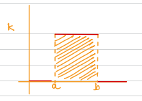

# Poisson Distribution

Let us assume the probablility of occuring of an event, $E$ at any sub interval is $P$.

Let $\Delta t$ be the length of each sub interval:
$$
\therefore n\times\Delta t = 1\qquad\text{(Because unit time)}
$$
where $n$ is the number of sub-intervals.

- Let $k$ be the number of events occured in 1 sub interval.
- Average number of events in the unit interval, $\lambda = np$
	- (Own) Average among unit intervals each with $np$
	- I think $p$ means $P$ here
- Let us assume that $P(E)$ of a sub interval is independent of $P(E)$ of other sub-intervals.

$\text{From binomial distribution:}$

$$
P(k) =\ ^nC_k\ p^k\ (1-p)^{n-k}
\\
\
\\
=\frac{n!}{(n-k)!k!}\bigg(\frac{\lambda}{n}\bigg)^k\bigg(1-\frac{\lambda}{n}\bigg)^{n-k}
\\
\
\\
\Rightarrow \frac{\cancel{n^k}(n-1)\dots(n-(k-1))}{k!}\bigg(\frac{\lambda}{\cancel{n}}\bigg)^k\bigg(1-\frac{\lambda}{n}\bigg)^{n-k}
$$
$\text{as }n\longrightarrow\infty:$
$$
P(k) = \lim\limits_{n\rightarrow\infty}\frac{\bigg(1-\frac1n\bigg)\bigg(1-\frac2n\bigg)\dots\bigg(1-\frac{(k-1)}{n}\bigg)\lambda^n\bigg(1-\frac{\lambda}{n}\bigg)^{n-k}}{k!}
\\
\
\\
\text{As, }\lim\limits_{n\rightarrow\infty}{\bigg(1-\frac{\lambda}{n}\bigg)^{n-k}} = e^{-\lambda}
\\
\
\\
\boxed{P(k) = \frac{\lambda^k e^{-\lambda}}{k!},\qquad k=0,1,2,\dots}
$$
$\text{This is called possion distribution.}$

**Note:** $\sum\limits^\infty_{k=0}P(k) =\sum\limits^\infty_{k=0}\frac{\lambda^ke^{-\lambda}}{k!}=e^{-\lambda}\sum\limits^\infty_{k=0}\frac{\lambda^k}{k!}=e^{-\lambda}\times e^\lambda=1$

**Note:** This interval was partitioned as a time interval. The same method can be applied to any length, an area or volume.

<u>**Generally**</u>
If $T$ is the time interval and $k$ is the random variable then:
$$
P(k:\lambda T) = \frac{(\lambda T)^k e^{-\lambda T}}{k!}\qquad ,k=0,1,2,\dots
$$

**Here also:**
$$
\sum\limits^\infty_{k=0}P(k:\lambda T) = \sum\limits^\infty_{k=0}\frac{(\lambda T)^k e^{-\lambda T}}{k!}
\\
\
\\
\Rightarrow e^{\lambda T}\sum\limits^\infty_{k=0}\frac{(\lambda T)^{k}}{k!} = e^{-\lambda T}\times e^{\lambda T} = 1
$$

Let us consider the time interval $T=1$, Then:
$\text{1) Variance:}$
$$
\text{var}(k)=\sum\limits^\infty_{k=0}k^2P(k:\lambda)-\lambda^2
\\
\
\\
\Rightarrow\sum\limits^\infty_{k=0}\frac{k^2\lambda^k e^{-\lambda}}{k!} -\lambda^2 = \sum\limits^\infty_{k=1}\frac{k^{\cancel2}\lambda ^k e^{-\lambda}}{(k-1)!\cancel{k}}-\lambda^2
\\
\
\\
\Rightarrow\sum\limits^\infty_{k=1}\frac{(k-1+1)\lambda^k e^{-\lambda}}{(k-1)!}-\lambda^2 = \sum\limits^\infty_{k=1}\frac{(k-1)\lambda^k e^{-\lambda}}{(k-1)!} + \sum\limits^\infty_{k=1}\frac{\lambda^k e^-\lambda}{(k-1)!} -\lambda^2
\\
\
\\
\Rightarrow \sum\limits^\infty_{k=2}\frac{(k-1)\lambda^k e^{-\lambda}}{(k-2)!(k-1)}+\sum\limits^\infty_{k=1}\frac{\lambda^k e^{-\lambda}}{(k-1)!}-\lambda^2
\\
\
\\
\Rightarrow\sum\limits^\infty_{k=0}\frac{\lambda^{k+2}e^{-\lambda}}{k!}+\sum\limits^\infty_{k=0}\frac{\lambda^{k+1}e^{-\lambda}}{k!}-\lambda^2
\\
\
\\
\Rightarrow \lambda^2\sum\limits^\infty_{k=0}\frac{\lambda^ke^{-\lambda}}{k!}+\lambda\sum\limits^\infty_{k=0}\frac{\lambda^ke^{-\lambda}}{k!}-\lambda^2
\\
\
\\
\Rightarrow \lambda^2 \sum\limits^\infty_{k=0}P(k)+\lambda \sum\limits^\infty_{k=0}P(k)-\lambda^2
\\
\
\\
\therefore \boxed{\text{var}(k)=\lambda}
$$
$\text{2) Expectation:}$
$$
\text{E}[k] = \sum\limits^\infty_{k=0}kP(k:\lambda)
\\
\
\\
\Rightarrow \sum\limits^\infty_{k=0}k\frac{\lambda^k e^{-\lambda}}{k!} = \sum\limits^\infty_{k=0}\cancel{k}\frac{\lambda^k e^{-\lambda}}{\cancel{k}(k-1)!}
\\
\
\\
\Rightarrow \sum\limits^\infty_{k=1}\frac{\lambda^k e^{-\lambda}}{(k-1)!} = \sum\limits^\infty_{k=0}\frac{\lambda^{k+1} e^{-\lambda}}{k!}
\\
\
\\
\Rightarrow\lambda\sum\limits^\infty_{k=0}\frac{\lambda^ke^{-\lambda}}{k!} = \lambda \sum\limits^\infty_{k=0}P(k)
\\
\
\\
\therefore\boxed{\text{E}[k]=\lambda}
$$

## Probability Mass Function
- Function that gives probability of discrete random variables.

For the poisson distribution, probabilty mass function (PMF) is given by:
$$
p(k=x) = \frac{\lambda^x e^{-\lambda}}{x!} = p(x) \qquad\text{,where }\lambda=np
$$

Consider the frequency distribution table:
<table>
	<tr>
		<th>x</th>
		<td>0</td>
		<td>1</td>
		<td>2</td>
		<td>3</td>
	</tr>
	<tr>
		<th>frequency</th>
		<td>f0</td>
		<td>f1</td>
		<td>f2</td>
		<td>f3</td>
	</tr>
</table>

Then the theoretical frequency of $x$ is given by:
$$
\text{Total freq.}=p(x)\times\sum\limits_{i=0}^{n}f_i = \frac{\lambda^x e^{-\lambda}}{x!}\times\sum\limits_{i=0}^{n}f_i 

\\
\
\\
\text{where, mean}=\lambda = \frac{\sum x_i f_i}{\sum f_i}
$$

# Geometric Distribution
- Geometric Distribution models the number of trials required for the first success in a series of independent Bernoulli's trials.

$\text{let }x\text{ be the number of trials}\qquad (x=0,1,2,\dots)$
$p\rightarrow\text{probability of success}$
$q\rightarrow\text{probability of failure }$

**Note:** $p+q=1$

**The PMF for Geometric Distribution is:**
The proability of succeeding in the $x^\text{th}$ trial:
$$
P(X=x) = q^{x-1}p$$

**Expectation:**
$$
\text{E}[x]=\frac1p
$$
**Variance:**
$$
\text{var}(x)=\frac{q}{p^2}
$$

# Continous Probability Distribution
For a continous random variable $x$, the continous function $f(x)$ is said to be probability density function if it satisfies the following:
i) $f(x) \geq 0 \quad \forall \ x$
ii) $\int\limits_{-\infty}^{\infty}f(x)dx = 1$
iii) $P(a\leq x\leq b)=\int\limits_{a}^{b}f(x)dx$

- **Note 1:** $P(x=a) = 0$
	Proof:
	$\lim\limits_{\Delta x=0}\int\limits_{a-\Delta x}^{a+\Delta x}f(x)dx$
	$= F(x)|_{a-\Delta x}^{a+ \Delta x} = F(a+\Delta x)-F(a-\Delta x)$
	$= F(a)-F(a) = 0$
- **Note 2:** $P(a\leq x\leq b) = P(a<x\leq b) = P(a\leq x<b)=P(a<x<b)$
# Cumulative Distribution Function
The Cumulative Distribution Function (CDF) of a random variable $x$ with a probability distribution function is given as:
$$
F_X(x)=P(X\leq x) = \int\limits_{-\infty}^{x}f(x)dx
$$
**Properties:**
- $F(-\infty)\leq F(x)\leq F(\infty) \implies F(x) \in [0,1]$
- $F_X(b)-F_X(a)=P(a< x \leq b)$
- $F_X$ is a non-decreasing function taking negative values

$\bold{\text{Expectation:}}$
Expectation or mean ($\mu$) is given by:
$$
\mu=\text{E}[x]=\int\limits_{-\infty}^{\infty}xf(x)dx
$$

**Variance:**
$$
\sigma^2 = \int\limits_{-\infty}^{\infty}(x-\mu)^2f(x)
\\
\
\\
\Rightarrow \boxed{
\sigma^2 = \int\limits_{-\infty}^{\infty}x^2f(x)dx -\mu^2
}
$$

# Uniform Distribution (Rectangular Distribution)

Taking function $f(x)$ to be defined as:
$$
f(x)=\begin{cases}
k,\quad x\in[a,b]
\\
0,\quad\text{otherwise}
\end{cases}
$$
$\text{Derivation of }k:$
$$
\text{since, }\int\limits_{-\infty}^{\infty}f(x)dx = \int\limits_a^bf(x)dx = 1
\\
\
\\
\therefore \int\limits_a^bkdx = 1\implies k(b-a)=1
\\
\
\\
\therefore \boxed{k=\frac{1}{b-a}}
$$
$\text{Therefore the Probability Distribution Function is given by:}$
$$
\boxed{
f(x)=\begin{cases}
\frac{1}{b-a},\quad x\in[a,b]
\\
0,\quad\text{otherwise}
\end{cases}
}
$$

**Expectation:**
$$
\mu = \int\limits_a^bxf(x)dx = \frac{x^2}{2(b-a)}\bigg|_a^b
\\
\
\\
\therefore \boxed{\mu=\frac{a+b}{2}}
$$

**Variance:**
$$
\sigma^2=\int\limits_a^bx^2f(x)dx -\mu^2
\\
\
\\
\Rightarrow \frac{x^3}{3(b-a)}\bigg|_a^b - \frac{(a+b)^2}{4}
\\
\
\\
\Rightarrow\frac{b^3-a^3}{3(b-a)} - \frac{(a+b)^2}{4} = \frac{\cancel{(b-a)}(a^2+b^2+ab)}{3\cancel{(b-a)}}- \frac{(a^2+b^2+2ab)}{4}
$$
$\text{After Simplifying:}$
$$
\boxed{\sigma^2 = \frac{(a-b)^2}{12}}
$$

### Cumulative Distribution
#### i) when $x\leq a$
$\Rightarrow\int\limits_{-\infty}^{a}f(x)dx=0\qquad[\text{As }f(x)=0]$

#### ii) When $x\in (a,b)$
$\Rightarrow \cancel{\int\limits_{-\infty}^{a}f(x)dx}+\int\limits_{a}^{x}f(x)dx \implies \frac{(x-a)}{(b-a)}$

#### iii) When $x\geq b$
$\Rightarrow \cancel{\int\limits_{-\infty}^{a}f(x)dx}+\underbrace{\int\limits_{a}^{b}f(x)dx}_1+\cancel{\int\limits_{b}^{x}f(x)dx} = 1$

# Exponential Distribution
For the continous random variable $x$, the proabability density function for the exponential distribution is:
$$
f(x) = \begin{cases}
\alpha e^{-\alpha x},\qquad x\geq0
\\
0,\qquad\text{otherwise}
\end{cases}
$$

**Mean ($\mu$)**
$$
\Rightarrow \int\limits_{-\infty}^{\infty}xf(x)dx = \cancel{\int\limits_{-\infty}^{0}xf(x)dx}+\int\limits_{0}^{\infty}xf(x)dx
\\
\
\\
\Rightarrow\int\limits_{0}^{\infty}x\alpha e^{-\alpha x}dx = \alpha \int\limits_{0}^{\infty}xe^{-\alpha x}dx
\\
\
\\
\Rightarrow \alpha\bigg[\frac{xe^{-\alpha x}}{-\alpha} - \frac{e^{-\alpha x}}{\alpha^2}\bigg]_0^\infty 
\\
\
\\
\Rightarrow\alpha\bigg[\bigg(\cancel{\frac{\infty e^{-\infty}}{-\alpha}} - \cancel{\frac{e^{-\infty}}{\alpha^2}}\bigg)-\bigg(\cancel{\frac{0e^{0}}{-\alpha}} - \frac{e^{0}}{\alpha^2}\bigg)\bigg]
\\
\
\\
\therefore \boxed{\mu=\frac1\alpha}
$$

**Variance:**
$$
\Rightarrow\int\limits_{-\infty}^\infty(x-\mu^2)f(x)dx=\int\limits_{-\infty}^{\infty}\bigg(x^2+\frac{1}{\alpha^2}-\frac{2x}{\alpha}\bigg)\alpha e^{-\alpha x}dx
\\
\
\\
\int\limits_0^{\infty}x^2\alpha e^{-\alpha x}+\frac{e^{-\alpha x}}{\alpha}-2xe^{-\alpha x}dx
\\
\
\\
\therefore \boxed{\text{var}(x) = \frac{1}{\alpha^2}}
$$

**Cumulative Distribution Function**
The CDF of Exponential Distribution is:
$$
F[X] = P(X\leq x)=\int\limits_0^xf(x)dx
\\
\
\\
\therefore \boxed{P(X\leq x)=1-e^{-\alpha x}}
$$

# Gamma Distribution
> Specialized form of Exponential Distribution

For the continous random variable $x$, the probabilit distribution function is given by:
$$
f(x)=\begin{cases}
\frac{x^{\alpha -1}e^{-x/\beta}}{\beta^\alpha\Gamma(\alpha)},\quad x>0
\\
0,\quad \text{otherwise}
\end{cases}
$$
$\text{where, }\Gamma(n) = \int\limits_0^\infty e^{-x}x^{n-1}dx$

Here, $\alpha$ is called the shape variable and $\beta$ is called the growth variable

**Mean $(\mu)$**
$$
\boxed{\mu=\alpha\beta}
$$

**Variance**
$$
\boxed{\sigma^2=\alpha\beta^2}
$$

**Cummulative Distribution Function**
$$
P(X\leq x) = \int\limits_0^x\frac{x^{\alpha -1}e^{-x/\beta}}{\beta^\alpha\Gamma(\alpha)}dx
$$
$\text{Put }\frac{x}{\beta}=t\implies dx=\beta dt$
$$
\int\limits_0^{x/\beta}\frac{t^{\alpha -1}\cancel{\beta^{\alpha -1}}e^{-t}}{\cancel{\beta^\alpha}\Gamma(\alpha)}\cancel{\beta} dt\Rightarrow \int\limits_0^{x/\beta}\frac{t^{\alpha -1}e^{-t}}{\Gamma(\alpha)}dt
\\
\
\\
\therefore \boxed{\text{CDF}=\frac{\Gamma(\alpha,x/\beta)}{\Gamma(\alpha)}}
$$

# Normal Distribution
The random variable $x$ with bell shaped distribution is called normal random variable.

The probability density function for the random variable $x$ is:
$$
N(x:\mu,\ \sigma)=\frac{1}{\sigma\sqrt{2\pi}}e^{-\frac{1}{2}(\frac{x-\mu}{\sigma})^2}
$$
where, $\mu$ is the mean and $\sigma$ is the standard distribution.

The probability of $x$ lies between $\mu$ and $x_2$ is given below:
$$
P(\mu\leq x\leq x_2)=\int\limits_\mu^{x_2}\frac{1}{\sigma\sqrt{2\pi}}e^{-\frac{1}{2}({\frac{x-\mu}{\sigma}})^2}dx\tag{1}
$$
Thus random variable $z$ with mean $0$ and standard deviation $1$ is standard normal random variable:
$z=\frac{x-\mu}{\sigma}$
$dz=\frac{dx}{\sigma}\implies dx=\sigma dz$

$\text{putting into (1):}$
$$
P(z_1\leq z\leq z_2)=\int\limits_{z_1}^{z_2}\frac{1}{\sigma\sqrt{2\pi}}e^{-\frac{1}{2}z^2}\sigma dz
\\
\
\\
\Rightarrow \int\limits_{z_1}^{z_2}\frac{1}{\sqrt{2\pi}}e^{-\frac{z^2}{2}}dz
\\
\
\\
\boxed{
z_1 = \frac{x_1-\mu}{\sigma}\qquad z_2=\frac{x_2-\mu}{\sigma}
}
$$
## Graphs:
$\text{Let, }k>0\text{ then:}$

## Properties of Normal Distribution:
1) Area under the normal curve in the interval $(-\infty,\infty)$ is $1$
2) The curve is symmetric about $x=\mu(z=0)$
	- $\text{Area b/w }(0,\infty)=\text{Area b/w }(-\infty,0)=0.5$