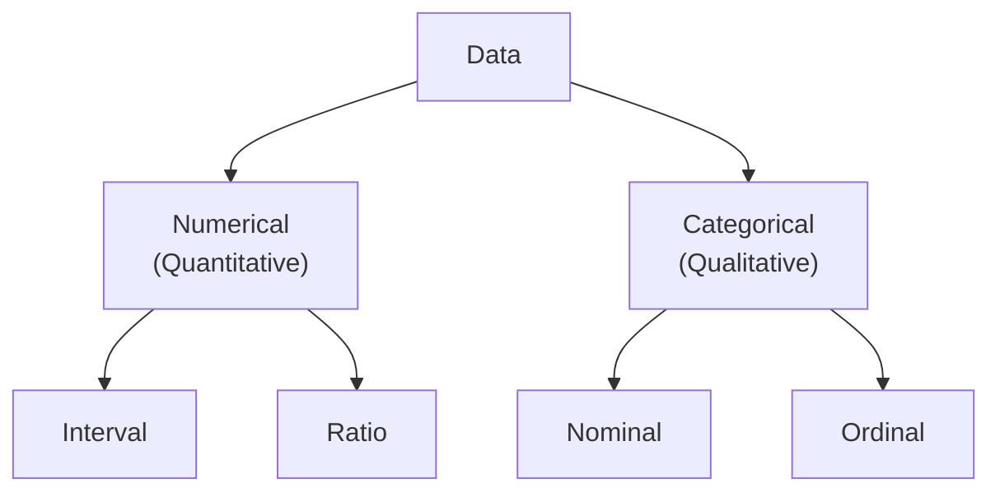

# Types of Statistics
## Differential
> the part of statistics concerned with the description and summarization of data
- Big to Small
- Summarizes Data
- Can be performed on either Sample or Population

## Inferential
> the part of statistics concerned with the drawing of conclusions 
- Small to Big (Infered / Assumed)
- Extrapolates Data
- Performed mainly on Sample
 
# Sample & Population
**Population:** Set of all elements we are interested in
**Sample:** Subset of Population which will be studied

# Data
- Facts/Figures we are interested in
- Two Types (On the basis of arrangement):
	- **Structured:** has context, mentions what is what (headers)
	- **Unstructured:** no context, scattered data
- Two Types on the basis of time

**Note:** $\underbrace{0}_{min}$ & $\underbrace{\text{\ <blank>}}_{absence}$ are not the same.

## Variables & Cases/Observations
**Cases (Observations):** Rows represent cases and for each case, same Attribute (type of value/unit) is recorded **e.g.** Name, S. No.
**Variables:** Column-wise data (as within these attributes there is a possibility of variation) **e.g.** Height, Gender, Marks

# Types of Data (On the basis of Value)

## Categorical (Qualitative)
- Identifies Group Membership
- Contains Nominal & Ordinal Scales of Measurement
### Nominal
- Label/Names with no real ordering
- May be numerically coded **e.g.** M,F = 1,0 (Gender)
- **e.g.** Name, Board, Gender, Blood Group

### Ordinal
- Label/Names with meaningful order
- May be numerically coded **e.g.** Bad-0, Good-1, Excellent-2
- Difference between orders is unclear
- **e.g.** Ratings

## Numerical
- Describe numerical properties.
- Have Units
- e.g. Height, Weight, Marks, Price, Temperature
- Further divided into 2 types
	- Discrete: No Decimal value (Integral Value only)
	- Continous: Over a range of values (can have decimals/floats) 
### Interval
- Always Numeric
- Can take any value (+ve or -ve)
- Values expressed as a fixed unit of measurement
- Can be Added / Subtracted
- Ratios ($\times$ & $\div$) have no meaning as there is no absolute zero
- **e.g.** Temperature, Averages (GPA...)
### Ratio
- Always Numeric
- Value $\geq 0$
- Has an Absolute Zero
- Ratio of values is meaningful
- All arithmetic operations valid (+, -, $\times$, $\div$)
- **e.g.** Age, Height, Marks

# Types of Data (On the basis of time)
## Time-Series Data
- Takes place over a period of time

### Timeplot
- Graphical way of representing time-series data in **chronological** order

## Cross-Sectional Data
- Takes place at the same point of time.