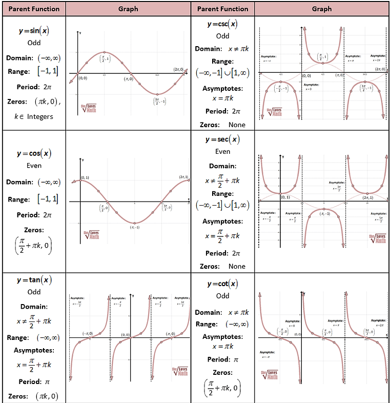

# Graphs of Trigonometric Functions

# Transformation Formulae
## Product to Sum/Differnce
$$
\\ \cot(A + B) = \frac{\cot A\cot B - 1}{\cot A + \cot B}\\
\
\\ \cot(A - B) = \frac{\cot A\cot B + 1}{\cot B - \cot A}\\
\
\\ \tan(A + B + C) = \frac{\tan A+\tan B+ \tan C-\tan A\tan B\tan C}{1 - (\tan A\tan B + \tan B\tan C + \tan C\tan A}\\
\
\\ \sin(A+B).\sin (A-B) = \sin^2 A - \sin^2 B = \cos^2B - \cos^2 A\\
\
\\ \cos(A+B).\cos (A-B) = \cos^2 A - \sin^2 B = \cos^2B - \sin^2 A\\
\
\\ \boxed{cos\theta.\cos2\theta.\cos4\theta\dots\cos2^n\theta= \frac{\sin(2^{n+1})\theta}{2^{n+1}\sin\theta} \
\qquad[\text{By Multiplying and dividing } 2\sin\theta]}\\
\
\\ \sin2A = 2\sin A\cos A =\frac{2\tan A}{1+\tan^2 A}\\
\
\\ \cos2A = \cos^2A-\sin^2A =\boxed{\frac{1-\tan^2A}{1+\tan^2A}
\ \therefore \tan^2 A = \frac{1-\cos A}{1+\cos A}}\\
\
\\ \sin3A = 3\sin A-4\sin^3A\\
\
\\ \cos3A = 4\cos^3A-3\cos A\\
\
\\ \tan3A = \frac{3\tan A -\tan^3A}{1-3\tan^2A}\\
\
\\ \cot3A = \frac{3\cot A -\cot^3A}{1-3\cot^2A}\\
\
\\ \tan\bigg(\frac \pi 4 \pm \theta\bigg) = \frac{1\pm \tan\theta}{1\mp \tan\theta}\\
\
\\ \boxed{\sin\bigg(\frac \pi 3 + \theta\bigg).\sin\theta.\sin\bigg(\frac \pi 3 - \theta\bigg) = \frac 14\sin3\theta}\\
\
\\ \boxed{\cos\bigg(\frac \pi 3 + \theta\bigg).\cos\theta.\cos\bigg(\frac \pi 3 - \theta\bigg) = \frac14\cos\theta}\\
\
\\ \boxed{\tan\bigg(\frac \pi 3 + \theta\bigg).\tan\theta.\tan\bigg(\frac \pi 3 - \theta\bigg) = \tan3\theta}\\
$$

## Sum\Difference to Product:
$$
\\ \boxed{\sin C + \sin D = 2\sin\bigg(\frac{C+D}{2}\bigg)\cos\bigg(\frac{C-D}{2}\bigg)} \\
\
\\ \boxed{\sin C - \sin D = 2\cos\bigg(\frac{C+D}{2}\bigg)\sin\bigg(\frac{C-D}{2}\bigg)} \\
\
\\ \boxed{\cos C + \cos D = 2\cos\bigg(\frac{C+D}{2}\bigg)\cos\bigg(\frac{C-D}{2}\bigg)} \\
\
\\ \boxed{\cos C - \cos D = -2\sin\bigg(\frac{C+D}{2}\bigg)\sin\bigg(\frac{C-D}{2}\bigg)} \\
$$

## Special Case
$$
\text{if,}\qquad a\sin\theta+b\cos\theta = c\\
\
\text{Then,}\qquad a^2+b^2=c^2 \iff \frac ac = \sin\theta\iff \frac bc=\cos\theta
$$

# Conditional Identities
### $\text{if }A+B+C=\pi$
$$
\\ \boxed{\sin2A + \sin2B + \sin2C = 4\sin A\sin B\sin C}\\
\
\\
\\ \boxed{\cos 2A + \cos 2B + \cos 2C = 1-4\cos A\cos B\cos C}\\
\
\\ \boxed{\sin A + \sin B + \sin C = 4\cos \frac A2\cos \frac B2\cos\frac C2}\\
$$
# Conversion to Half-Angle forms:
$$
\\\boxed{\sin A = \frac{2\tan \frac A2}{1+\tan^2 \frac A2}}\\
\
\\\boxed{\cos A = \frac{1-\tan^2 \frac A2}{1+\tan^2 \frac A2}}\ \implies \boxed{\tan \frac A2 = \pm \sqrt{\frac{1-\cos A}{1+\cos A}} = \frac{1-\cos A}{\sin A}}\\
\
\\ \boxed{1\pm \sin A = \bigg(\sin \frac A2\pm \cos\frac A2\bigg)^2}\\
$$

# Sweet Values
$$

\\ \boxed{\sin15\r\ = \frac{\sqrt3 -1}{2\sqrt2}}\\
\
\\ \boxed{\cos15\r\ = \frac{\sqrt3 +1}{2\sqrt2}}\\
\
\\ \boxed{\tan15\r\ = \frac{\sqrt3 -1}{\sqrt3 +1} {\Large{\implies}} 2-\sqrt3 \iff\frac{1}{2+\sqrt3}}\\
\
\\ \boxed{\sin 22.5\r\ = }\\
\
\\ \boxed{\cos 22.5\r\ = }\\
\
\\ \boxed{\tan 22.5\r\ = \sqrt2 -1}\\
\
\\ \boxed{\sin 18\r\ = \frac{\sqrt5-1}{4}}\\
\
\\ \boxed{\cos 36 \r\ = \frac{\sqrt5+1}{4}}\\
\
\\ \boxed{\cos 18\r\ = \frac{\sqrt{10+2\sqrt5}}{4}}\\
\
\\ \boxed{\sin 36\r\ = \frac{\sqrt{10-2\sqrt5}}{4}}\\
$$
# Principle Values:
## $\sin\theta=\sin\alpha$
$$\boxed{\theta = n\pi + (-1)^n\alpha}$$

## $\cos\theta=\cos\alpha$
$$\boxed{\theta = 2n\pi \pm \alpha}$$

## $\tan\theta=\tan\alpha$
$$\boxed{\theta = n\pi +\alpha}$$