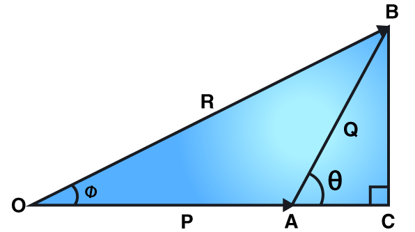

# Introduction
## Types of Vectors
- **Equal:** Same Magnitude & direction
- **Opposite / Negative:** Same Magnitude & Opposite Direction
- **Parallel:** Same Direction, May or may not have same magnitude
- **Anti-Parallel:** Opposite Direction, May or may not have same magnitude
- **Co-Initial:** Originate from same initial point
- **Concurrent:** Appear to pass through a common point
## Addition of Vectors
### 1) Triangle Law

# Introduction
Check what the following is:

- Scalar & Vector Function
- Scalar & Vector **Point** Function
# Gradient of Scalar Point Function
Let $\phi(x,y,z)$ be a continously differential scalar point function, the gradient of $\psi$, denoted by $\nabla\phi$ or $\text{grad}(\phi)$ and is defined as:
$$
\nabla\phi=\frac{\partial\phi}{\partial x}\hat i+\frac{\partial\phi}{\partial y}\hat j+\frac{\partial\phi}{\partial z}\hat k
$$
Here $\nabla$ is the differential operator = $\frac{\partial}{\partial x}\hat i+\frac{\partial}{\partial y}\hat j+\frac{\partial}{\partial z}\hat k$
**Note:**
- if $\phi$ is a scalar point function, $\text{grad}(\phi)$ is a vector point function.
- if $\text{grad}(\phi)=0$, then: $\frac{\partial\phi}{\partial x}=\frac{\partial\phi}{\partial y}=\frac{\partial\phi}{\partial z}=0$
	- implying that $\phi$ is constant

# Divergence of Vector Point Function
Divergence of a physical quantity at a point, represents the rate per unit volume at which the physical quantity is diverging at that point.
Alternatively, divergence measure the outflow / inflow.
Let $f(x,y,z)$ be a continously differentiable vector point function, Then $\text{div}(\overrightarrow f)$ or $\nabla.\overrightarrow f$ is defined as:
$$
\nabla.\overrightarrow f=\bigg(\frac{\partial}{\partial x}\hat i+\frac{\partial}{\partial y}\hat j+\frac{\partial}{\partial z}\hat k\bigg).(f_1\hat i+f_2\hat j+f_3\hat k) = \frac{\partial f_1}{\partial x}+\frac{\partial f_2}{\partial y}+\frac{\partial f_3}{\partial z}
$$
**Note:**
- $div(\overrightarrow f)$ is scalar
- if $div(\overrightarrow f)=0$, then $\overrightarrow f$ is said to be solenoidal.

# Curl of Vector Point Function
Curl gives the measure of rotation of vector field at any point.
If $f=f_1\hat i+f_2\hat j+f_3\hat k$ where $f_1,\ f_2, \ f_3$ are scalar functions of $x,y,z$, then curl of $f$ denoted by $\text{curl}(\overrightarrow f)$ or $\nabla\times\overrightarrow f$ is given by:
$$
\nabla\times\overrightarrow f=\begin{vmatrix}i&j&k\\\frac{\partial}{\partial x}&\frac{\partial}{\partial y}&\frac{\partial}{\partial z} \\ f_1&f_2&f_3\end{vmatrix}
$$
**Note:**
- $\text{curl}(\overrightarrow f)$ is vector
- if $\text{curl}(\overrightarrow f)=0$, then $\overrightarrow f$ is said to be irrotational.
	- therefore, angular velocity at that point = 0
### Practice:
Prove the following:
If $\overrightarrow r=x\hat i + y\hat j+z\hat k \quad\&\quad r=|\overrightarrow r|$
Then:
- $r^nr^{-1}$
	- curl=0 $\forall \ n$
	- div=0 for n=-3
- div(grad(r^n^)) = n(n+1)r^n-2^
- $\nabla^2f(r)=f''(r)+\frac2r f'(r)$ where $\nabla^2=\nabla.\nabla$
- $grad(div(\hat r))=\frac{-2\overrightarrow r}{r^3}$
# Ortholinear Curvilinear Coordinates (OCC)
Let $P(x,y,z)$ be a point in 3-D space.
suppose:
$$
\begin{rcases}
x=x(u,v,w)
\\
y=y(u,v,w)
\\
z=z(u,v,w)
\end{rcases}(1)
$$
Let $J=\frac{\partial (x,y,z)}{\partial (u,v,w)} \neq0$
i.e. they mean something idk what (functionally dependent or something), which means they can be written in terms of each other or not or something... check later

This implies $(1)$ are solvable for $u,v,w$ in terms of $x,y,z$
i.e.
$$
u=u(x,y,z)
\\
v=v(x,y,z)
\\
w=w(x,y,z)
$$
Geometricaly, this means that $u,v,w$ determine location of $p$ in the plane and conversely location of $p$ determine $u,v,w$. 
Thus $u,v,w$ serves as a system of coordinates for $p$.
If $\overrightarrow r$ is the position vector of $p$:
$$
\overrightarrow r=p(u,v,w)
$$
## $u,v,w\text{ - curve}$
If 2 of $u,v,w$ are held fixed and rhe third variable is allowed to vary continously, The point p traces the out a space urve called coordinate curve.

e.g. if $v$ & $w$ are held fixef then $(1)$ gives $x,y,z$ as a function of single variable, $u$ and locus of $P(x,y,z)$ is a space curve for which $u$ is the parameter.
This curve is called $u\text{-curve}$. $v$ & $w$ are similiarly defined.

Thus, at $P$ there exist 3 curves corresponding to $u,v,w$ for this reason $u,v,w$ are called curvilinear coordinates.

## $u,v,w\text{ - Surfaces}$
 If 1 of u,v,w is fixed and the other two are allowed to vary continously, then locus of P is a surface called coordinate surface.
 
 e.g. If $w$ is held fixed, $u$ & $v$ are allowd to vary continously. Then locus of P is a continous network of $u$ & $v$ curves. Such a network is a surface for which $u$ & $v$ are parameters. 
This surface is called $uv$-surface. Similiarly $vw$ & $wu$ surfaces are defined.

Thus at $P$, there exists three surfaces corresponding to $u,v,w$.
Note: 2 coordinate surfaces intersect along coordinate curves.

## Tangent Vector
Since the $u$ curve has $u$ as parameters and is given by $(1)$ with $v$ & $w$ fixed, the tangent vector to this curve at $P$ with position vector $\overrightarrow r$ is along the derivative of $\overrightarrow r$ w.r.t $u$. 

$\therefore$ Tangent vector $=\frac{\partial \overrightarrow r}{\partial u}$ gives the direction of tangent to $u$-curve.

Similiarly, $\frac{\partial \overrightarrow r}{\partial v}$ and $\frac{\partial \overrightarrow r}{\partial w}$ give direction of tangent to $v$ & $w$ curve respectively.

Now, as $\overrightarrow r=x\hat i+y\hat j+z\hat k$
Then, $\frac{\partial \overrightarrow r}{\partial u}=\overrightarrow r_u=\frac{\partial x}{\partial u}\hat i+\frac{\partial y}{\partial u}\hat j+\frac{\partial z}{\partial u}\hat k$

Then the scalar triple product $= [\overrightarrow r_u \ \overrightarrow r_v \ \overrightarrow r_w]=\begin{bmatrix}x_u&y_u&z_u\\x_v&y_v&z_v\\ x_w&y_w&z_w\end{bmatrix}=J$

but $J\neq0$.
This implies scalar triple product $\neq0$
Therefore $r_u, \ r_v,\ r_w$ are not co-planar.
i.e. the three coordinate curves do not lie on the same surface. Thus they are not co-incident.

Suppose coordinate curves are mutually perpendicular, 
Then:
$$
r_u . r_v=0,\\ r_v . r_w=0,\\ r_w . r_u=0
$$
Consequently, $r_u\times r_v$ is either along or opposite to $r_w$
Suppose:
$$
r_u\times r_v \text{ is along }r_w\\
r_v\times r_w \text{ is along }r_u\\
r_w\times r_u \text{ is along }r_v\\
$$

In this case, coordinate curves are mutually orthogonal and consequently, coordinate surfaces are mutually orthogonal at P. $u$-curve meets $v-w$ surface at right angles and is directed away from $v-w$ surface.
$v$ & $w$ hvae similiar properties under these, the system of coordinates $(u,v,w)$ are called righ-handed orthogonal coordinate system of point P.
## Base Vectors: Scale Vectors
let $e_1, \ e_2,\ e_3$ be unit vectors driected along $r_u,\ r_v,\ r_w$.
let: 
$\begin{rcases}h_1=|r_u|\\ h_2=|r_v|\\ h_3=|r_w|\end{rcases}\text{scale factors}$

Then:
$e_1=\frac{r_u}{h_1}\\ e_2=\frac{r_v}{h_2}\\e_3=\frac{r_w}{h_3}$

As $e_1, \ e_2, \ e_3$ are perpendicular then:
1. $e_1.e_2=0,\ e_2.e_3=0,\ e_3.e_1=0$
2. $e_1\times e_2=e_3,\ e_2\times e_3=e_1,\ e_3\times e_1=e_2$ 
3. $J=\frac{\partial (x,\ y,\ z)}{\partial(u,\ v,\ w)}=[h_1e_1\ h_2e_2\ h_3e_3]=h_1h_2h_3[e_1\ e_2\ e_3] = h_1h_2h_3$
	- As, $[e_1 \ e_2 \ e_3]=1$

Verification:
$$
f=(f.e_1)e_1+(f.e_2)e_2+(f.e_3)e_3
$$

## Case 1: Cartesian Coordinates $(x,\ y,\ z)$
Cartesian coordinates form a particular case of OCC in which:
$$u=x\\ v=y\\ w=z$$
Partial Derivatives:
$r_x=\hat i\\ r_y=\hat j\\ r_z=\hat k$

Scale Factors:
$h_1=h_2=h_3=1$

Therefore, unit vectors:
$e_1=\hat i\\ e_2=\hat j\\ e_3=\hat k$

## Case 2: Cylindrical Polar Coordinates $(R,\ \phi,\ z)$
$$
x=R\cos\phi\\ y=R\sin\phi\\ z=z
$$
Partial Derivatives:
$r_R=\cos\phi\hat i+\sin\phi\hat j$
$r_\phi=-R\sin\phi\hat i+R\cos\phi\hat j$
$r_z=\hat k$

Scale Factors:
$h_1=\sqrt{\cos^2\phi+\sin^2\phi}=1\\ h_2=\sqrt{R^2\sin^2\phi+R^2\cos^2\phi}=R\\h_3=\sqrt 1=1$

Therefore, unit vectors:
$e_1=\cos\phi\hat i+\sin\phi\hat j$
$e_2=-\sin\phi\hat i+\cos\phi\hat j$
$e_3=\hat k$

## Case 3: Spherical Coordinate System $(R,\ \theta, \ \phi)$
$$
x=R\sin\theta\cos\phi\\y=R\sin\theta\sin\phi\\z=R\cos\theta
$$
Parital Derivatives:
$r_R=\sin\theta\cos\phi\hat i+\sin\theta\sin\phi\hat j+\cos\theta\hat k\\
r_\theta=R\cos\theta\cos\phi\hat i +R\cos\theta\sin\phi\hat j-R\sin\theta\hat k\\
r_\phi=-R\sin\theta\sin\phi\hat i+R\sin\theta\cos\phi\hat j$

Scale Factors:
$h_1=\sqrt{\sin^2\theta\cos^2\phi+\sin^2\theta\sin^2\phi+\cos^2\theta}=1\\
h_2=\sqrt{R^2\cos^2\theta\cos^2\phi+R^2\cos^2\theta\sin^2\phi+R^2\sin^2\theta}=R\\
h_3=\sqrt{R^2\sin^2\theta\sin^2\phi+R^2\sin^2\theta\cos^2\phi}=R\sin\theta$

Therefore, unit vectors:
$e_1=\sin\theta\cos\phi\hat i+\sin\theta\sin\phi\hat j+\cos\theta\hat k\\
e_2=\cos\theta\cos\phi\hat i +\cos\theta\sin\phi\hat j-\sin\theta\hat k\\
e_3=-\sin\phi\hat i+\cos\phi\hat j$

# Some Important Equations:
### Tetrahedron
$$
\frac xa+\frac yb+\frac zc=1
$$
### Sphere
$$
x^2+y^2+z^2=a^2
$$
### Ellipsoid
$$
\frac{x^2}{a^2}+\frac{y^2}{b^2}+\frac{z^2}{c^2}=1
$$
### Cardiod
$$
r=a(1\pm\cos\theta)\ /\ a(1\pm\sin\theta)
$$
### Lemniscate
$$
r=a\cos2\theta\ /\ a\sin2\theta
$$