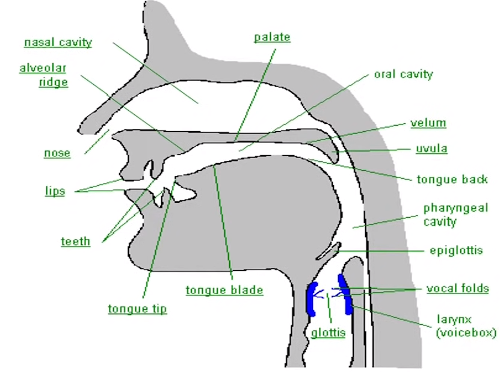
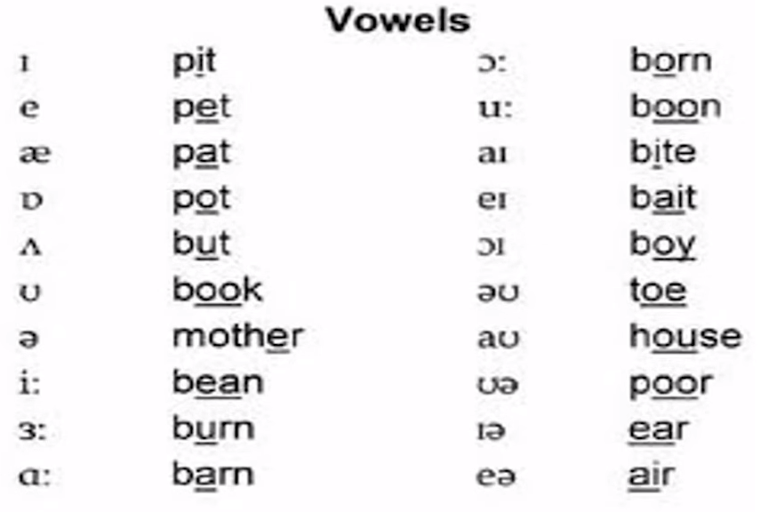
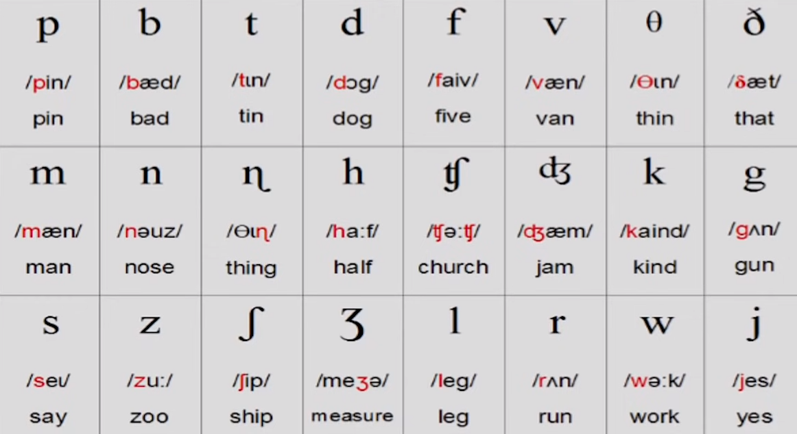

# Mouth Diagram (Articulators)

**Note:** Sounds from same places of articulation do not come close to each other e.g. bp, pb, td
# 20 Vowel Sounds

$$
\text{7 short vowels: /ɪ/ \space /e/ \space /æ/ \space /ɒ/ \space /ʌ/ \space /ʊ/ \space /ə/}
\\
\
\\
\text{5 long vowels: /iː/ \space /ɜː/ \space /ɑː/ \space /ɔː/ \space /uː/}
\\
\
\\
\text{8 diphthongs: /eɪ/ /aɪ//ɔɪ/ /əʊ/ /aʊ/ /ɪə/ /eə/ /ʊə/}
$$
- Formed by free flow of air in vocal tract.

# 24 Consonant Sounds

- Formed by modification of flow of exhaling air in the vocal tract
## Semi-Vowel
- **w** & **y** are Semi-Vowels
- There is no blockage of ari when articulating them thus giving vowel-like quality
- However they are **Non-Syllabic**
- They do not get pronounced at final positions eg. Window & Monday
- They are pronounced when between 2 vowels/semi-vowels eg. Go Away & Say It.
- Therefore, they are still Consonants.

## Clusters
- Group of consonant sounds next to each other where the first one has its inbuilt vowel sound removed
- Other than **Nasals**, no 2 sounds from the same place of articulation form a cluster
- They are formed only by consonants
- It is not possible to have a cluster of 4 sounds at the **beginning**
- it is the absence of vowel sounds. e.g. [gl] in glass & [nk] in sink
**Note:** All 3 consonant clusters start with **s**

It is not possible to make words without vowels as they are a combination of (C)onsonants and (V)owels:
	- CVCV
	- CVCVCV
	- CVC
	- VCVC
	- CVV
	- CCVC
	- CVCC
	- VV eg. eye
$\therefore$ words can be formed without the use of consonants