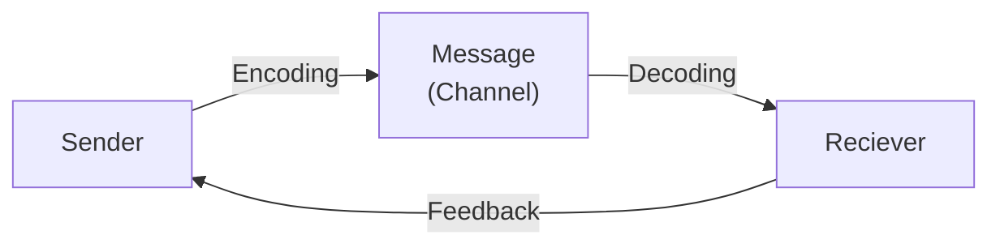

- Communication: Imparting or exhanging information / ideas / feelings.
- Language is a tool for communication
	- It provides a method or system for communication
	- Provides words and a structure for using words.
	- Also involves gestures or symbols.

## Verbal and Non-Verbal Communication
- Verbal communication involves the use of words to convey a message.
- These include written and oral communication.
- Non-verbal communication involves the use of non-verbal platforms such as eye contact,facial expressions, gestures, body language, posture, etc.

# Communication Process

## Barriers to Communication
1. **Semantic Barriers (Language Barriers):**
	- Lack of Clarity
	- Communicatng in a complex way
	- using too technical words.
2. **Psychological Barriers:**
	- Inadequate attention to the message recieved
	- Premature evaluation of the information recieved.
3. **Organisational Barriers:** 
	- Complexity of the organiztional structure
4. **Cultural Barriers:**
	- lack of similiarity or compatibility among different cultures
5. **Physical Barriers:**
	- Faulty equipment
	- Noise
	- Closed Doors / Cabins
6. **Physiological Barriers:**
	- Dyslexia
	- Nerve Disorders that interfere with speech or hearing

### Dealing with Barriers to Communication:
