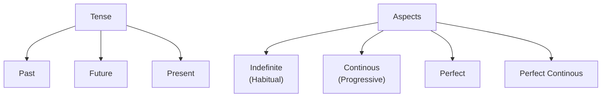

## Indefinite (Habitual)
- Example:
	- saw, see, will see

## Continous (Progressive)
- Example:
	- was, am, will be (doing)

## Perfect
- Example:
	- had, have, will have (done)

## Perfect Continous
- Example:
	- had been, have been, will have beem (doing)

# Regular & Irregular word forms
- In most of the verbs. the past & particple forms are formed by adding /d/ or /ed/ to the end.
	- Such verbs are called **regular** verbs.

Example: 
|Present|Past|Past Participle|
|:-----:|:----:|:---------:|
|Act|Acted|Acted|
|Live|Lived|Lived|
|Hope|Hoped|Hoped|

- In case of other verbs, the past & particple ways are different from the base word and cannot be formed by affixing /d/ or /ed/ to the end.
	- Such verbs are called **irregular** verbs.

Example: 
|Present|Past|Past Participle|
|:-----:|:----:|:---------:|
|Am|Was|Been|
|Are|Were|Been|
|Wake|Woke / Waked|Woke / Waked / Woken|
