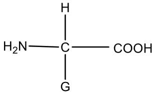

# Amino Acids

- α-amino acids are the building blocks of all the protein molecules.
    
- The general structure of amino acids is
    
    
    
    where G is a side chain group which is different for all the amino acids.
    
    ## 1\. Side-chain containing only Hydrocarbons \[No Heteroatoms\]
    
    |     |     |     |     |     |     |
    | --- | --- | --- | --- | --- | --- |
    | S.No | Side-chain group (G) | Hints | Complete Structure | Name | Symbol |
   
	