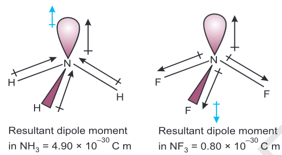

# Kossel-Lewis Approach \[Octet Theory\]

- Lewis pictured the atom in terms of a positively charged ‘Kernel’ and outer shell that could hold a maximum of eight electrons which occupy the corners of a cube surrounding the 'Kernel'.
- This octet of electrons, represents a stable electronic arrangement.
- Lewis postulated that atoms achieve the stable octet when they are linked by chemical bonds.
- the bond formed, as a result of the electrostatic attraction between the positive and negative ions was termed as the electrovalent bond. the electrovalence is thus equal to the number of unit charge(s) on the ion.

## Lewis-Langmuir Theory

* * *

Langmuir refined the Lewis postulations by abandoning the idea of the stationary cubical arrangement of the
octet, and by introducing the term covalent bond.
In general the least electronegative atom occupies the central position in the molecule/ion.

## Limitations of Octet Rule

* * *

### 1 ) Incomplete octet of the central atom

- No. of electrons surrounding the central atom is less than 8.
- Mostly Shown by atoms with less than 8 valence electrons
    **e.g.** Li, Be, B, Al, etc.

### 2) Odd electron Molecules

In molecules with an odd number of electrons the octet rule is not satisfied for all the atoms
\*\*e.g.\*\*NO, NO2

### 3) Expanded Octet

- When elements have more than eight valence electrons around the central atom due to presence of d-orbitals for bonding is called expanded octet
    **e.g.** PF5, SF6, H2SO4 and coordination compounds

**Note:** Sulphur also forms many compounds in which the octet rule is obeyed

### 4) Noble Gases forming compounds

- Octet rule is based on the chemical inertness of Noble gases
- However, some noble gases (Xe & Kr) also combine with O and F to form a number of compounds
    **e.g.** XeF2, KrF2 , XeOF2

### 5) Does not account for shape of molecules

### 6) Does not explain Stability and Energy

# Formal Charge

- Lewis dot structures, in general, do not represent the actual shapes of the molecules. -
- In case of polyatomic ions, the net charge is possessed by the ion as a whole and not by a particular atom.

$\therefore$ The formal charge of an atom in a polyatomic molecule or ion may be defined as the difference between the no. of valence electrons in isolated or free state and the no. of electrons assigned to that atom in the Lewis structure.

$$
\boxed{\text{Formal Charge} = \text{(Total No. of Valence Electrons)} - \text{(No. of Non-Bonding Electrons)} - \frac{1}{2}\text{(No. of Bonding Electrons)}}

$$

$\LARGE\hookrightarrow$ **ONLY IF** the atom in the molecule owns one electron of each shared pair and both the electrons of a lone pair
**Note:** Formal charges do not indicate real charge separation within the molecule
**Intead,** Formal charges help in the selection of the lowest energy structure from a number of possible Lewis structures for a given species.

Generally the lowest energy structure is the one with the smallest formal charges on the atoms. the formal charge is a factor based on a pure covalent view of bonding in which electron pairs are shared equally by neighbouring atoms

# Ionic Bonds \[Electrovalent Bonds\]

formation of ionic compounds depends on:

- The ease of formation of the positive and negative ions from the respective neutral atoms
- The arrangement of the positive and negative ions in the crystal lattice.
- Ionic bonds will be formed more easily between elements with comparatively low ionization enthalpies and elements with comparatively high negative value of electron gain enthalpy

**Note:** In ionic solids, the sum of the electron gain enthalpy and the ionization enthalpy may be positive but still the crystal structure gets stabilized due to the energy released in the formation of the crystal lattice.

**Note:** Thus stability of an ionic compound is provided by its enthalpy of lattice formation and not only by achieving octet of electrons.

**Lattice Enthalpy:** Energy required to completely separate one mole of a solid ionic compound into gaseous constituent ions

**Note:** it is not possible to calculate lattice enthalpy directly from the interaction of forces of attraction and repulsion only. Factors associated with the crystal geometry have to be included.

# Bond Angle

- It is defined as the angle between the orbitals containing bonding electron pairs around the central atom in a molecule/complex ion.
- Bond angle is expressed in degree which can be experimentally determined by spectroscopic methods.

# Bond Enthalpy

- Amount of Energy required to break the bond between 2 atoms in gaseous state
- For Polyatomic molecules we use **Mean/Average** Bond Enthalpy to account for change in Stability after succesive breaking of bonds

# Bond Order

In the Lewis description of covalent bond, the Bond Order is given by the number of bonds between the two atoms in a molecule.
**Note:** Isoelectronic molecules and ions have identical bond order

# Dipole Moment of NH3 and NF3

- Both have pyramidal shape with a lone pair of electrons on nitrogen atom.
- However, $\mu_{NH_3} > \mu_{NF_3}$ as in NH3 Resultant Dipole Moment due to 3-H is in the same direction in lone pair, whereas in NF3 It is in opposite direction.

# Fajan's Rule

Covalent Character depends on:

- Polarising Power of cation
- Polarsability of anion (extent of distortion)

As the cation polarises the anion, pulling the electronic charge toward itself and thereby increasing the electronic charge between the two

More Polar $\implies$ More Covalent

- Smaller cation & Larger anion $\implies$ **More** Covalent Character
- More Positive Charge on cation $\implies$ More Covalent Character.
- For same Size & Charge on cation the one with E.C of Transition Metals is more polarising than that of Alkali Metals & Alkali Earth Metals. $\therefore$ More Covalent Character

# Valence Shell Electron Pair Repulsion Theory \[VSEPR\]

Sidgwick & Powell proposed this theory in 1940 which was later refined by Nyholm & Gillespie in 1957.

- The shape of the molecule depends on the number of valence shell electrons pairs (Bonded or Non-Bonded) around the central atom
- Lone pairs in the valence shell repel each other. Thus, the occupy position where repulsion in minimum
- The valence shell is taken as a sphere with the electron pairs localising on the spherical surface at maximum distance from one another.
- A multiple bond is treated as if it is a single electron pair and the two or three electron pairs of a multiple bond are treated as a single super pair
- VSEPR model is applicable to any resonating structure.

**Note:** lone pair electrons occupy more space than bonding pairs as bonding pairs are **Shared** between 2 atoms.

### Repulsion order:

$$
\boxed{\ce{L\text{.}P\text{.}-L\text{.}P\text{.} {\LARGE>} {L\text{.}P\text{.}-B\text{.}P\text{.}} {\LARGE>} B\text{.}P\text{.}-B\text{.}P\text{.}}}

$$

For the prediction of geometrical shapes of molecules with VSEPR theory, We divide molecules into two categories as:

1.  molecules in which the central atom has no lone pair
2.  molecules in which the central atom has one or more lone pairs.

For Prediction of shape of molecule we split the molecule into 2 types:

# Features of $\ce\pi{-}\text{bonds}$

- In $\ce\pi{-}\text{bond}$ formation, parallel orientation of $\ce{p}-\text{orbitals}$ of adjacent atoms is necessary for proper sideways overlap
- The $\ce{p}-\text{orbitals}$ are mutually perpendicular and perpendicular to the plane of the molecule.
- As rotation interferes with maximum overlap of $\ce{p}- \text{orbitals}$ rotation about $\ce\pi{-}\text{bonds }(\ce{= \& #})$ is restricted
- $\ce{e-}$ charge cloud of $\ce\pi{-}\text{bond}$ is located above & below the plane of bonding atoms
    $\therefore$ electrons become easily available to the attactking reagents
- In general $\ce\pi{-}\text{bonds}$ provide most reactive centres in molecules containing multiple bonds.

# Calculation of Fraction of s/p charcter by bond angle

$$
\cos\theta = \frac{s}{s-1} = \frac{p-1}{p}

$$

$\text{Where:}$
$\theta$ = Bond Angle
$s/p$ = fraction of $s/p$ character