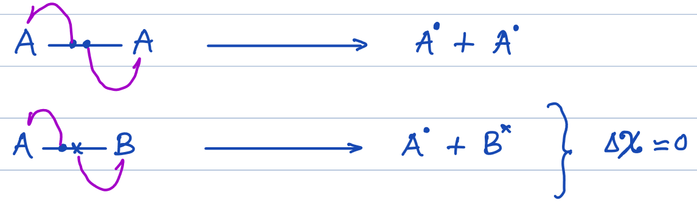

# Introduction
- Organic Chemistry due to Self-Linking (Catenation) property of Carbon
- Earlier, It was believed that synthesis of organic compounds required some mysterious force. This was called **The Vital Force Theory**
- The synthesis of Urea from Ammonium Cyanate proved that there was no such mysterious force required and this altogether changed the concept of Organic Chemistry.
- Thus, the modern definition of Organic Chemistry is the chemistry of Hydrocarbons and its Derivatives.

# Classification of Organic Compounds

## $\text{I) Acyclic / Aliphatic (Open Chain)}$
- Contain open chains of carbon atoms which may be straight or brached.
**e.g.** $\\\begin{array}{c}\ce{CH_3-C-CH_3}\\|\\\phantom{||}\ce{CH3}\end{array}\begin{array}{c}
\ce{CH_3-C-OH}\\
\phantom|\| \\
\phantom{|}\ce{O}
\end{array}$

 

## $\text{II) Cyclic/Ring (Closed Ring)}$

 

### $\text{i) Alicyclic}$
- Also called **Aliphatic Cyclic** as many of their properties resemble aliphatic compounds.

 

#### $\text{a) Homocyclic (Carbocyclic)}$
- Contains only carbon atoms joined in a ring
**e.g.** Cyclopropane & Cyclopropene
#### $\text{b) Heterocyclic (Non-Aromatic)}$
- Contain Atoms other than carbon present in their ring.
**e.g.** $\text{Tetrahydrofuran (Oxalane)}$  

 

### $\text{ii) Aromatic}$
- $\text{Planar}$
- $\text{Complete Continous Conjugation}$
- $\text{Contain }(4n+2)\pi\text{ electrons}\qquad (n=0,1,2,3\dots)$

#### $\text{a) Benzenoid}$
Compounds which show Aromaticity and have at least one free benzene ring.
**e.g.** Phenol
#### $\text{b) Non-Benzenoid}$
Compounds which show aromaticity but do not contain any Benzene Ring.
**e.g.** Tropone
#### $\text{c) Heterocyclic (Aromatic)}$
- Compounds which show aromaticity but contain atoms other than carbon present in the ring.

**e.g.** Furan, Thioshene, Pyridine

# Degree of Unsaturation \[D.U.\]
- Also called **Index of Hydrogen Deficiency**

$$
D.U. = \frac{(2C+2-H+N)}{2}

$$

where:
$\ce{C =}$ No. of **Tetravalent** Atoms
$\ce{H =}$ No. of **Monovalent** Atoms
$\ce{N =}$ No. of **Trivalent** Atoms

**Note:** 1 Ring = 1 D.U
1 $\ce{C=C = }$ 1 D.U.
1 $\ce{C#C = }$ 2 D.U.

# Bond Fission \[Bond Cleavage\]

**Note:** Direction of arrow represents the flow of electrons:
## 1) Homolytic Fission / Homolysis \[Symmetrical\]

- Each atom takes away **1 electron** from the shared pair
- Homolysis results in formation of **Paramagnetic & Neutral** Free Radicals.
    
- Homolysis takes place in **Non-polar solvent** or in **Gaseous phase**
- Homolysis occurs in presence of any of the following:
    
    

- **Bond Dissociation Energy:** Energy required to break a bond during **Homolysis** 
- **Average of BDE** is taken as successive fissions require more energy.

- $\text{More Stable free Radical Formation }\rightarrow\text{ Less B.D.E.}$
## 2) Heterolytic Fission / Heterolysis [Asymmetrical]
- One of the bonded atoms takes away both the electrons from the shared pair to form ions
- The atom with a higher E.N.($x$) will take both the electrons
- Usually occurs in polar covalent bonds and is favoured by the presence of polar solvents (As polar solvents interact with formed ions by ion-dipole interactions)
- Major part of the solvation energy is obtained from solvation of anionic part in organic reactions
e.g.$\ce{Ph-CH2^{\delta -}-I^{\delta +}->[H2O] Ph-CH2^{\oplus} + I-}$

# Electron Displacement Effects

# Electromeric Effect $(E \text{-effect})$
- Temporary Displacement of $\pi\space-$ electrons under the influence of reagent from one atom to another.
## $+E-\text{effect}$
- If $\pi-$ electrons are shifting **towards** the atom on which the reagent is attacking.

## $-E-\text{effect}$
- If $\pi-$ electrons are shifting **away** from the atom on which the reagent is attacking.

## Properties of $E\text{-effect}$
- Takes place only in the presence of a reagent
	- If the reagent is removed, molecule return to its original state
- Usually $\pi\text{-} e^-$ gets transferred to the bonding atom which is more EN.
- Generally, Sign of $E-$ effect is same as sign of charge of attacking reagent (Not valid for Neutral):
	- If Atacking reagent is e^-^ deficient (+ve) $\implies+E$ effect
	- If Atacking reagent is e^-^ rich (-ve) $\implies- E$ effect

# Inductomeric Effect
Temporary shifting of $\sigma-$electrons in presence of attacking reagent

# Inductive Effect $I\text{-effect}$
- Shifting of electrons (Development of polarity) in $\sigma-$bonds due to EN difference

**Note:** For comparison of relative $I\text{-effect}$ $\ce{C-H}$ Bond is used as a reference.

## $+I\text{-effect}$
- e^-^ pushing / donating / repelling
### Overall $+I\text{-effect}$ Orders

### Comparison of $+I$ Powers:
1) **Greater No. of C in the Alkyl Group, more is the $+I$ power**
**e.g.**$\ce{-CH2CH2CH3}>\ce{-CH2CH3}>\ce{-CH3}$
2) **If C-atoms are same, then branched alkyl group has more $+I$ power than unbranched**

3) **As, $\ce{-T}>\ce{-D}>\ce{-H}$**

$\implies\ce{-CT3}>\ce{-CD3}>\ce{-CH3}$

## $-I\text{-effect}$
- e^-^ pulling / accepting / withdrawing
### Overall $-I\text{-effect}$ Orders
$$\text{Positively Charged Groups}\begin{cases}
\ce{-O+F2 > -O+R2 > -O+H2 > -N+F3 > -N+R3 > -S+R2 > -N+H3}
\end{cases}
\\
\
\\\text{Partial +ve Charge}
\begin{cases}
\ce{> -NO2 > }\underbrace{\ce{-SO2OH}}_{\ce{HSO3}} > \ce{-CN > -CHO > -COCH3 > -COOH > -CONH2}
\end{cases}
\\
\
\\\text{Neutral Groups}
\begin{cases}
\ce{> -F > -CCL3 > -Cl > -Br > -I > -OR > -OH > # > -NH2 > {\Large{-⌬}}  > = > -H}
\end{cases}
$$
### Comparison of $-I$ Powers
1) Greater the $\%s$ character $\implies$ More E.N. $\implies$ More $-I$-effect
2) Full +ve Charge > Partial +ve Charge
3) EN Order:
$$
\boxed{\ce{N_{(sp)} > N_{(sp^2)} > C_{(sp)} > N_{(sp^3)} >  > C_{(sp^2)} > C_{(sp^3)}}}
$$
4) Alkyl Groups show $-I$ effect in organometallic compounds.
e.g. $\ce{Li-CH3}$ and $\ce{R-MgX}$

## Properties of $-I$ effect
- Represented by 
- Operates through $\sigma-$bonds only
- Distance Dependant: Does not factor after 3rd carbon
- Electrons do not leave their original position, they are only partially shifted toward more E.N. atom.
- Due to polarisation, Physical properties (dipole moment, M.P., B.P., etc.) and Chemical properties(reactivity, stability, acidity) are affected
- As, $\text{Stretching Frequency} \space\alpha\space \frac{1}{\text{Mass of Atom}}$, when lighter atoms are affected, Avg. Distance is only very slightly increased.
- When both of the attached groups are similiar, $I-$effect does not take place (Due to no EN difference)
e.g. $\ce{CH3-CH3}$

## DNP Rule
1) **D** $\longrightarrow$ **Distance** [First compare distance]
2) **N** $\longrightarrow$ **Number** [If distance is the same, compare number of groups]
3) **P** $\longrightarrow$ **Power** [if that is also same, compare power of groups]
# Order of Stability of Free Radical
****
**Note:** Allylic > Benzylic > 3 degree

# Order of Stability of Carbocation

1.  Dancing Resonance / Sigma Resonance
2.  Backbonding (Presence of Lone Pair on Adjacent atom to Carbocation)
3.  Aromaticity \[Anti-Aromatic is the most **UNSTABLE**\]
4.  Resonance
5.  Hyperconjugation
6.  Inductive

**Note:** For Carbocation order of Stability goes by:
Benzyllic > Allylic > 3 degree

# SN~AR~: Substitution Nucleophilic Aromatic
- Occurs When Attached Group [E.W.G] ]is Deactiviting
- Nu$^\circleddash$ should be Deactivation
- It is Generally **Not** Favourable by Normal Conditions.
### Mechanism:

**1st Step:** Attachment of Nucleophile
**2nd Step:** Elimination of Leaving Group

## Properties of SN~AR~
- Rate = $\text{k[Ar][Nu}^\circleddash]$
- Rate $\alpha \text{ Stability of Carbocation}$
- When E.W.G. like -NO~2~, -CCl~3~, -CF~3~ are attached to O, P position, rate of the reaction is increased.

# Benzyne Mechanism \[Dow's Process\](SN~EA~)
It is a temporary effect which takes place only in the presence of reagent

# Aromaticity
## Aromatic Compounds
Huckel's Rule:
- One Planar Ring (monocyclic)
- Complete continous conjugation
- Planarity
- $(4n+2)\space \pi-$electrons

**Note:** In Aromatic Compounds, $\pi-$electrons are delcalized over the entire ring and it is stabilized by $\pi-$electron delocalization.
- They have very high resonance energy
- They are highly stable and Diamagnetuc
**Note:** L.P. which is part of resonance is counted in $\pi-$electrons:
- Aromatic compounds have relatively low reactivity
- They prefer substitution reaction over addiction reaction

## Anti-Aromatic Compunds
- Cyclic conjugated compounds with $4n\space\pi-$electrons, $(n=1,2,3\dots)$
- They are highly unstable and paramagnetic
- They are know but at very low temperatures in inert matrix.
**Note:** Anti-Aromatic are generally 3-7 Membered.
**Note:** Beyond 7 members, compounds adopt non-polarity instead of being non-aromatic
## Non-Aromatic Compounds
- Cyclic but neither Aromatic nor Non-Aromatic
- Non-Aromatic Compounds and their counter Open-Chain compounds are nearly equally stable

## Special Cases of Aromaticity:
### $\text{Case I) Annulenes}$
- Cyclic Hydrocarbons having double bonds in alternate positions
- It is a general name for Monocyclic conjugated system.
- $\begin{rcases}\text{Formala} = \ce{C_nH_n}\\\text{Name} =\ce{[n]-annulene}\end{rcases}(n=4,6,8,10\dots)$
	
**Note:** Structure of [10]-annulene changes due to steric repulsion:

# Qualitative Analysis of Organic Compounds
- Glacial Acetic Acid: Anhydrous Acetic Acid
- Rectified Spirit: 95% Ethanol Solution
- 