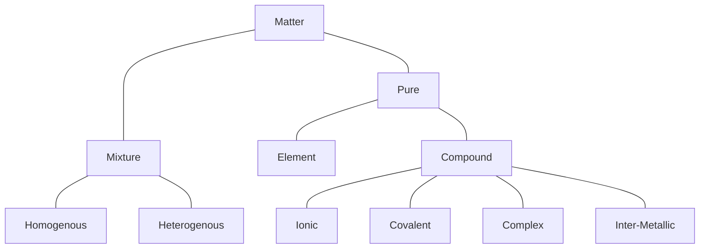

# Classification of Matter

# Laws of Chemical Combination
## 1) Law of Conservation of Mass
- Mass on both sides of the reaction is the same

## 2) Law of Definite Propertions
- A given compound always contains the same elements compined together in the same proportion by mass.
- **Note:** This law is not valid for compounds in which **Isotope** is concerned or in **Non-Stoichiometric Compounds**

## 3) Law of Multiple Proportions
- If Two elements combine to form more than one compound then the mass of one element which combines in a fixed amount of the other is a simple whole number ratio.

$$
\ce{C + 1/2O2 -> CO}
$$

$$
\ce{C + O2 -> CO2}
$$

## 4) Law of Reciprocal Proportions
- Ratio of two elements combining seperately with a third element is a simple whole number ratio to the two elements combining directly with each other.

$$
\ce{C + O2 -> CO2}
$$

$$
\ce{S + O2 -> CO2}
$$

$$
\ce{C + 2S -> CS2}
$$

## 5) Law of Combining Volumes
- When gases react, they do so in a simple ratio of their volumes.

$$
\ce{H2 (1 vol) + Cl2 (1 vol) -> 2HCl (2 vol)}
$$
# Mole Concept
- 1 Mole = 1 gm atom = 1 gm molecule
- 1 amu is 1/12^th^ the mass of 1 $\ce{C12}$ atom.
- 1 amu = $\frac{1}{\ce{N_A_}}$ = 1.66 x 10^-24^ gm
- Average Atomic Weight = $\sum{\frac{\text{\% abundance by mole}}{100}\times \text{Molar mass}}$
- Vapour Density (Relative Density) = $\frac{\text{Density of Gas}}{\text{Density of}\  H_2}$ = $\frac{M}{2}$ As, $\rho=\frac{PM}{RT}$
**Note:** for V.D. of Mixtures we use Avg. Atomic Weight

# Empirical Formula
- Smallest whole number ratio of constituent atoms within the molecule.
e.g. C~6~H~12~O~6~, CH~3~COOH, HCHO all have an empirical formula of CH~2~O
Molecular Formula = (Empirical Formula)~n~
# Limiting Reagent
- The Reactanct which is completely consumed in the reaction
**Tip:** Divide given moles by stoichiometry to find **effective** no. of moles
# Equivalent Weight
- Weight which reacts or liberates **1g H~2~** (11.2 L) / **8g O~2~** / **35.5g Cl~2~** / **80g Br~2~**
- Eq. Weight = $\frac{\text{Molar Mass}}{n-factor}$

| Acid | H~3~PO~2~ | H~3~PO~3~ | H~3~PO~4~ | H~3~BO~3~ | HClO~4~ | H~2~SO~3~ | Oxalic Acid |
|:---:|:---:|:---:|:---:|:---:|:---:|:---:|:---:|
|**Basicity (n)** |1|2|3|1|1|2|2|
# Combustion of Organic Compounds
$$
\ce{C_xH_y}+\frac{2x+\frac{y}{2}}{2}\ce{O2->xCO2 + y/2H2O}
$$

$$
\ce{C_xH_yO_z}+\frac{2x+\frac{y}{2}-z}{2}\ce{O2->xCO2 + y/2H2O}
$$

$$
\ce{C_xH_yN_z}+\frac{2x+\frac{y}{2}}{2}\ce{O2->xCO2 + y/2H2O + z/2N2}
$$

# % Free SO~3~ in Oleum
- Let there be Oleum Sample with strength 109%
Then, mole of H~2~O = $\frac{9}{18}$ = $\frac{1}{2}$ mole
$$
\ce{H2O + SO3 -> H2SO4}
$$
Therefore, moles of SO~3~ = moles of H~2~O = $\frac{1}{2}$ mole
Therefore, % free SO~3~ = $\frac{1}{2} * 80$ = 40%