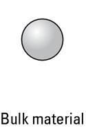
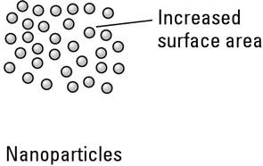
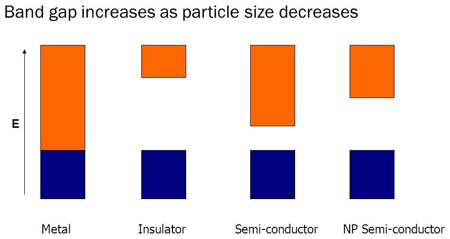
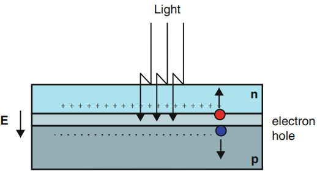
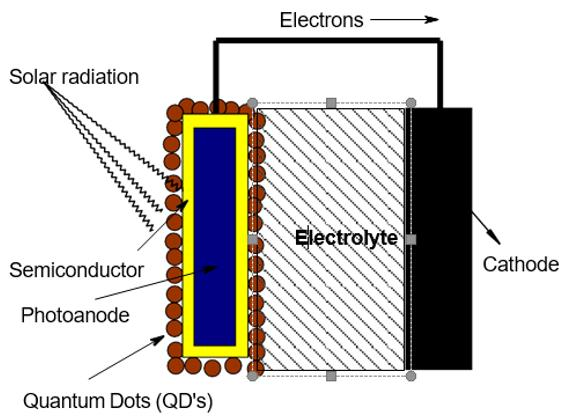
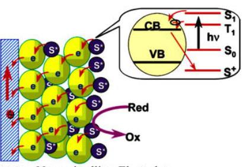
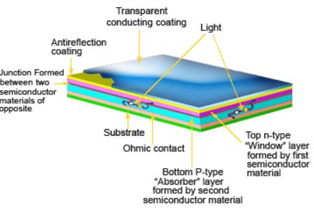

- **Nanoparticles:** Particles of the order of 1-100 nm in atleast one dimension.
- Richard Feynam said that "There's Plenty of Room at the Bottom" long before the term nanotechnology was used.
- Term "nanotechnology" first coined by Norio Taniguchi in 1974.

# 1) Properties:

- These properties are often not present in the bulk material.

## 1.1) Catalytic Activity / Surface Area

 

- Surface Area increases due to increase in number of particles for same volume.
    - $\therefore$ High Surface-to-Volume ratio.
- Therefore, Nanoparticles show catalytic property as increased surface area $\rightarrow$ more active sites.
    - **e.g.** Bulk Gold is practically inert, however Au-NP is used as a catalyst for low temperature oxidation of CO and Partial Oxidation of Hydrocarbons.
- Porous materials exhibit high surface area:
    - If pore size is < 2 nm, they are called Micropores
    - Mesopores have size 2 – 50 nm
    - Macropores have size > 50 nm

## 1.2) Optical Properties

- Nanoparticles show a wide range of colors depending upon the particle size.
- This occurs due to **Surface Plasmon Resonance Phenomenon (SPR)**
    - If the size of nanoparticles is smaller than the wavelength of light, It causes coherent oscillation matches of conduction band electrons induced by the interaction with an electromagnetic field between electronic states
    - This causes absorption and emission of light of specific wavelength which gives specific colors.
- **e.g.** for Gold:

| Particle Size | Color |
| :---: | :---: |
| $2-5 \text{ nm}$ | Yellow |
| $10-20 \text{ nm}$ | Red |
| $> 20 \text{ nm}$ | Purple |

## 1.3) Magnetic Properties

- Increase in magnetic coercivity and paramagnetic behavior
- Magnetic nanoparticles show remarkable new phenomena such as superparamagnetic, extra anisotropy contributions, etc.
- A particle of ferromagnetic material, below a critical particle size (<15 nm for the common materials), would consist of a single magnetic domain, i.e., a particle that is in a state of uniform magnetization at any field.
- e.g.:
    - Au, Pt, Pd are non-magnetic in bulk, but magnetic in Nano
    - In Pt and Pd, ferromagnetism arises due to structural changes with size effect
    - Iron oxide nanoparticles such as magnetite (Fe3O4) or its oxidized form maghemite ($\gamma$\-Fe2O3) are the most commonly used nanoparticles for biomedical applications.

## 1.4) Electrical Properties

- When compared to bulk materials, the Conductivity of nanoparticles reduces.
- This is due to decreased size due to which particles are further apart due to which valence band and conduction band move further away.

## 1.5) Thermal Properties

- Melting point of nanomaterial is lower than its bulk material as there are fewer atoms which are further apart which leads to reduced intermolecular force.
- Example:
    - Melting point of bulk CdSe = 1678 K
    - Melting point of 3 nm CdSe = 700 K

## 1.6) Mechanical Properties

- Nanoparticles have good tensile strength, hardness, ductility, elasticity, and fracture resistance compared to their bulk counterparts
- This is because nano size grains have fewer defects due to smaller size.
- They have excellent mechanical properties due to the volume, surface and quantum effects.
- That is why addition of nanoparticles can promote mechanical properties of the matrix.
    - Therefore, they are used as fillers in polymers to enhance mechanical properties.
    - In addition, the amount, ratio, and nanoparticle size have a certain impact on the mechanical properties of nanocomposites
- e.g. Cu-NP is 3x more resistant to stress than Bulk Cu.

# 2) Types of Nanoparticles

## 1) 0D

- All its dimensions are of the order of nm (in nano range)
- Here the charge carriers cannot move freely in any direction and is restricted in all the 3 directions.
- **e.g.** Fullerenes, Quantum Dots, Nano clusters, Carbon Dot, Onion like Carbon, Nano Diamond, Graphene Dot

## 2) 1D

- 1 dimension is beyond nano range while the other 2 dimensions are in nano range.
- Here the charge carriers are free to move in only one direction but their movement is confined in other two directions.
- **e.g.** CNTs, Nano rods, Nano wires, Nano fibers. Carbon Nanohorns

## 3) 2D

- 2 Dimensions are beyond nano range and only 1 dimension is in nano range
- Here the charge carriers are free to move in two directions but confined to only one direction.
- **e.g.** Graphene, Nano thin films, Nano Coatings, Multilayered Graphitic Sheets, Carbon Nanoribbons (Unizpped CNTs)

## 4) 3D

- All dimensions are beyond nano range.
- Basically, not even nanoparticles.
- e.g. Diamond, Graphite

&nbsp;

# Nanoforms of Carbon

-  A wide variety of carbon nanostructures have been emerged such as fullerenes, nanotubes, graphene, cup-stacked nano-tubes, nano-horns, nano-buds, nano-onions, etc.

## 1) Fullerenes (AKA Buckminster Fullerene or bucky balls)

- Fullerene is a nanocarbon molecule consists of carbon atoms connected by single and double bonds forming a closed or partially closed mesh, with fused rings of $5 - 7$ atoms (pentagonal or heptagonal rings) making icosohedron (polyhedron with 20 faces)
- They are made up of a sheet of connected hexagonal rings, but they have pentagonal (or sometimes heptagonal) rings that prevent the sheet from being planar.
- The fullerene molecule can either have a hollow sphere, be it an ellipsoid, a
tube, or it can also have many other different shapes and sizes.
- Closed fullerenes, especially C60, are called buckyballs (due to resemblence to soccer balls)
	- They have 12 pentagonal and 20 hexagonal faces.
- Fullerenes can exist in several forms such as $\text C_{60}$, $\text C_{70}$, $\text C_{60}$ and $\text C_{90}$
- Properties:
	- Stable but not completely unreactive.
		- In chemical reactions, fullerene can act as an electrophile.
		- Acts as an electron-accepting group and is characterized as an oxidizing agent.
    - highly symmetrical (especially C60)
    - exhibit superconductivity properties when doped with Alkali or Alkaline earth metals.
    - ferromagnetic
    - Some fullerenes are inherently chiral
    - highly soluble in organic solvents such as toluene, chlorobenzene and 1,2,3-trichloropropane.
    - changes structure under different pressures
    - shows variation in behavior and structure on changing the temperature.
        - At higher temperature, the fullerene is converted into the C70 form.
- Applications:
	- Used in medical field:
		- as light-activated microbial agents
		- Used in the design of high performance MRI contrast agents
		- X-ray imaging contrast agents
		- photodynamic therapy and drug and gene delivery 
    - Conductor
    - Some types are used as absorbent for gases
    - Buckminsterfullerene is used in drug delivery systems, in lubricants and as a catalyst.
    - Some fullerenes are used in making cosmetics-related materials
    - used in making carbon nanotubes-based fabrics and fibers
    - $\text C_{60}$ based films are used for photovoltaic applications.

## 2) Carbon Nanotubes (CNTs)

- CNTs are hollow-core carbon tubes made from one or more carbon layers (graphene) wrapped into a 1D seamless tube with a hollow core about an axis
- There are 2 Types:
    - Single-walled CNTs (SWCNTs)
        - Formed by rolling 1 graphene layer.
        - Diameter: 1-2 nm
    - Multi-walled CNTs (MWCNTs)
        - Formed by rolling multiple graphene layers.
        - Diameter 2-25 nm
- Aspect Ratio (L:W Ratio) > 1000
- The walls are a one-atom thick sheet of carbon.
- Properties:
    - High Electrical & Thermal Conductivity
    - Unique Optical Properties
    - High Mechanical Strength (tensile strength) due to covalent $sp^2$ bonds between carbon atoms.
    - High Chemical Storage Capacity (Like Li ions)
    - Can be easily functionalized (addition of functional groups) as bonds near curvature become weak due to strain making it susceptible to chemical reagents.
- Applications:
    - As electrode material in Li-ion batteries.
    - In cancer chemotherapy, as CNTs absorb IR radiations and convert them to heat which is dissipated in surrounding medium.
    - As templates in synthesis of nanorods as they generally have fixed diameter (not sure) (1.4nm)
    - In CNT based transistors, fibers, fabrics, composites, ceramics etc.

## 3) Graphene

- Graphene is a plane monolayer of carbon atoms closely packed into 2D honey-comb (hexagonal) crystal lattice
- Carbon atoms in graphene are $sp^2$ hybridized
- Bond Length = 1.42 $\AA$
- Properties:
    - High Electrical and Thermal conductivity due to free, delocalized π electrons (better conductivity than $\text{Cu}$)
    - Unique optical properties
    - Chemically inert and less toxic
    - High tensile strength ($\sim 130\text{ GPa}$), therefore highly flexible and can even be bent or folded.
    - If stretched, magnetic property of graphene can be altered
- Applications:
    - Biological / Chemical Sensors
    - Electrodes (due to Large Surface area and low resistance)
    - Low cost display screens
    - Low cost solar cells.
    - Storing hydrogen for fuel cells
    - In lithium ion batteries for fast recharging
    - Supercapacitors as energy storage devices: fast charging, long life span, environmentally friendly production

# Metal and Metal Oxide nanoparticles
- Metal Nanoparticles (MNPs) made up of only one element.
- Au, Ag, Pt, Cu, Pd, Re, Zn, Ru, Co, Cd, Al, Ni, and Fe are some of the most commonly produced nanoparticles
- MNPs are used in various scientific fields but are primarily employed in heterogenous catalysis.
-  Their reactivity is linked to their elementary composition, atomic arrangement, shape, and size, a variety of features whose role is often intertwined.
-  They can be synthesized from their metal precursors by simple approaches, such as bio-assisted method, hydrothermal method, and microwave-assisted method

# Methods of Preparation:
There are 2 primary approches that can be taken for preparation for naotechnology
## Top-Down Approach
- Bulk to Nano
- Expensive and Slow, threrefore not used for large scale production.
- Methods:
	- Sputtering
	- Chemical Etching
	- Laser Ablation (Thermal)
	- Ball Milling (Mechanical)
	- Explosion Process
## Bottom-Up Approach
- Atoms/Molecules to Nano
- Methods:
	- Atomic / Molecular Condensation
	- Vapour Deposition
	- Sol-gel Process
	- Spray Pyrolysis
	- Chemical / Electrochemical Deposition
	- Aerosol Process
	- Bioreduction
### Synthesis of ZrO~2~ NP
1) 1 mole of Zr(NO~3~)~2~.3H~2~O is dissolved in 50ml of distilled water followed by dropwise addition of 0.5M KOH to adjust pH to around 10.
2) A white ppt. was observed and stirred for 2 hours constantly.
3) After stirring, it is filterd through beckmann filter paper, washed several times with distilled water and dried for 4 hours at $70\degree \text C$.
4) Subsequently, the dried white powder taken into a quartz tube and Aniline at $90\degree \text C$ for 2 hours from a muffle furnace .
5) The RPM mained at $10\degree \text C/\text{min}$
6) After Aniline, the sample characterized through XRD and SEM to confirm tge formation of ZrO~2 NP.

### Synthesis of TiO~2~ NP through soln combustion method.
1) 2 mole of TiCl~4~ is mixed with 2M NH~4~OH, Here TiCl~4~ acts as a \n oxider and NH~4~OH acts as a fuel source.
2) This rxn mixture is stirred for 30 mins to get a colloidal form of TiO(OH)~2~ [Titanyl Hydroxide]
3) subsequently, add 2-5ml og HNO~3~ to clear the colloidal solution. It will form a TiO(NO~3~)~2~ [Titanyl Nitrate], mixed with 2M urea soln, the mixtyre heated through the hot plate, afterwards the temperature is raised to $450\degree\text C$ 
4) The reaction mixture is calcinated for 1hr at $450\degree\text C$, the final products were collected and washed several times with acetone and dried at $100\degree\text C$ for 4 hours. finally, a pale while color TiO~2~ NP is obtained.

# Applications of Nanoparticles
- NP Used in a wide variety of industries due to superior synthesis processes and new properties of materials developed at the nanoscale.
# Nanomaterials in Renewable Energy
## Nanomaterials in Solar Cell
### Classical Solar Cell
- It is a P/N junction in its basic form which converts sunlight to electricity.
- Conversion takes place when electron-hole pairs absorb photons whose $E\geq \text{Energy Gap}$
- The types of materials used as the photovoltaic absorbant are of mostly silicon and its different forms(monocrystalline or multicrystalline):
	- GaAs
	- CdTe
	- CuInSe~2~
- There is free carrier migration from in P/N Junction until the excess electron holes in P and electrons in N attain equilibrium.
- Classical solar cells require thicker materials to perform good optical absorption.
- Have Fixed Band Gap

### Nano-Based Solar Cells
- Photovoltaic cells built on a substrate with a coating of nanomaterial as light absorbing component.
- Nanoenabled solar cells can lead to
	- Higher optical absorption, lower reflectance and tunable band gaps, and hence solar cell efficiency.
	- Improved trapping, and plasmonic effects therefore, increased effective path length of light in the solar cell
	- Flexible and easy integration with other materials.
#### Quantum dot solar cells
- Uses PbSe, PbS, CdSe quantum dots as the photovoltaic absorbent.
- Have tunable bandgaps across a wide range of energy levels depending upon their size.
	- Therefore, light from a wider spectrum can be absorbed
##### Working of QDSSC:
1) QD's present on photo anode is exposed to sunlight.
2) QD's absorb energy and eject electrons to the semiconductor, forming electron holes.
3) Electrolyte occupys the electron hole and gets reduced.

##### Benefits of QDSSC
- Favourable power to weight ratio
- High efficiency
- Mass and area savings as well as flexibility leads to miniaturisation.
- Lower power consumption
- Versatility
- Increased electrical performance at low production costs.
- Can be used in complete buildings including windows and not just rooftops

#### Dye-sensitized Nano solar cell or pigmented solar cell
- A photo-electrode is prepared by coating dye (Ex- Ruthenium-polypyridyl) bound Nano titanium dioxide (TiO2) on the electrode.
- Dyes contain light active area due to extended systems of conjugated double bonds.
- When photons in the sunlight strike the electrode, electrons in the dye are passed to the TiO2 nanoparticle, then enters the electrode and finally reaches the opposite electrode through the wire (reducing electrode) producing current in the external  circuit.
- Pigment cavity, on the other side, is regenerated by a solvent and hence absorbs the next photon in the sunlight.

#### Nano thin-film solar cell
- Nano thin-film solar cells are made by depositing few nanometers (nm) of one or more thin layers of photovoltaic material (Si / CdTe / CuIGS / GaAs) on to a substrate, such as glass, plastic or metal.
	- Therefore they require small quantity of photosensitive material and are lighter and more flexible.

#### Nano Carbon based solar cell
**CNTs:** templated with inorganic halide materials.
**Graphene:** Used due to high tensile strength
**Fullerenes:** Fullerenes absorbs solar energy over a broad range of frequencies and converts it to back to light at a frequency that can be absorbed by the solar cell.
## Nanomaterials in Batteries
- CNT
- SbO nanocrystals
- Si Thin Film
- Lithium Titanate
- PVA
- Silicate Nano
# Nanomaterials in Water Treatment
## Photocatalytic degradation of toxic chemicals in water
- **Photocatalysis:** Chemical reaction induced by the absorption of photons by solid material called photocatalyst.
	- Being a catalyst, it does not undergo any chemical changes during and after the reaction.
- **Photocatalytic Activity:** Reaction rate (absolute or relative) of the photocatalytic process.
- Catalyst may be in the form of powder or film, some commonly used are:
	- Metal oxides: ZnO, TiO~2~, WO~3~
	- Metal Sulfides: ZnS, CuS, MoS~2~
	- Tungstates, Titanates, Graphene
- Light source may be Ultra-violet, visible, sunlight or LED
- Water may be from an industrial, domestic or municipal setup.
- Nanophotocatalysts are used in the removal of dyes, drugs, pesticides and pathogenic microorganisms from contaminated water.
### Steps of photocatalysis:
1) Transfer of pollutants to the photocatalyst’s surface
2) Adsorption of pollutants on the surface
3) Photonic activation and decomposition of adsorbed molecules (Main Principle)
4) Reaction product’s desorption
5) Removal of reaction products from the photocatalyst’s surface.
### Factors affecting photocatalytic activity:
