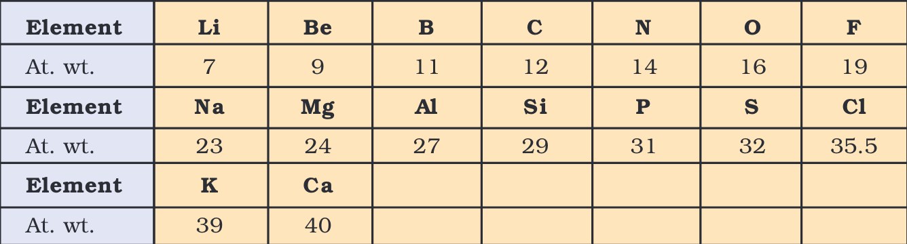
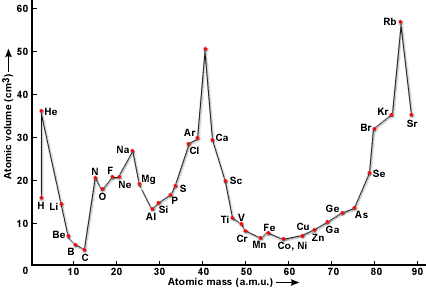
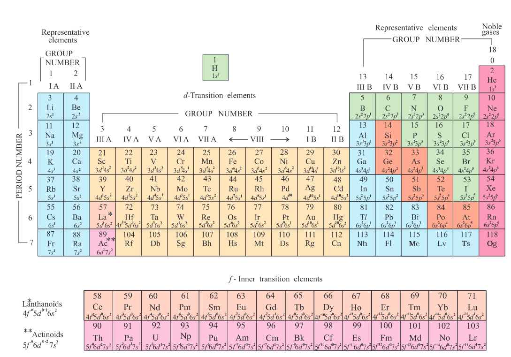
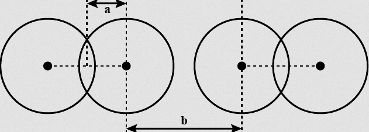

# Periodic Properties

## Dobereiner's Triads
- Groups of 3 elements were arranged such that the Atomic Mass of the middle element was equal to the average Atomic Mass of the other 2 elements.
e.g.
$$
\ce{^7Li\quad ^23Na \quad ^39K}
\\
\
\\
\ce{^35Cl\quad ^80Br \quad ^127I}
\\
\
\\
\ce{^40Ca\quad ^87Sr \quad ^137Ba}
\\
\
\\
\ce{^56Fe\quad ^58Co \quad ^58Ni}
$$
**Drawbacks:**
- Only limited Triads are arranged in this pattern
- As it worked only for a few elements, It was dismissed as a coincidence

## A.E.B. de Chancourtis' Cylindrical Table
- Arranged elements in Increasing Atomic Weight
- Dis not attract much attention and was dismissed

## Newland's Law of Octaves
- 1st and 8th elements have similiar properties just like octaves (Do Re Mi / Sa Re Ga) repeat at every 8th note.

**Drawbacks**
- Was only valid till $\ce{Ca}$

## Lother Meyer's Curve
- He plotted a graph between atomic mass and atomic volume to construct a graph showing similiarities among a particular set of elements.
- He used physical properties such as atomic volume, melting point and boiling point to construct the graph.

**Some important points about the curve:**
- Strongly electropositive metals occupy the peak
- Except $\ce{He}$, all noble gases are on the ascending portion.
- Alkaline earth metals occupy the descending portion
- Electronegative elements occupy the ascending portion.

## Mendeleev's Periodic Table
"The physcial and chemical properties of elements are a periodic function of their atomic weights."
- Divided **Vertically** into columns called **Groups**
- Divided **Horizontally** into rows called **Periods**
	- Groups are further numbered $\text{I}$ to $\text{VIII}$ and then $\text{Zero}$
	- With the exception of $\text{Zero}$ and $\text{VIII}$ group each group is further subdivided into sub groups $\text{A}$ and $\text{B}$
	
- He left gaps for undiscovered elements and also predicted their properties:
	- Eka-Aluminium - Galium
	- Eka-Silicon - Germanium

**Defects in Mendeleev's Table:**
- **Position of Hydrogen:** was not justified
- **Position of Isotopes:** Isotopes should be placed seperately according to periodic law
- **Cause of Periodicity:** Not explained
- **Anomalous pairs of elements:** When some elements did not fit, he ignored atomic weight and put them along with elements of similiar properties.
	- Tellurium & Iodine
	- Argon & Potassium
	- Cobalt & Nickel
## Moseley's Modern Periodic Table
"The Physical & Chemical properties of elements are a periodic function of their Atomic Number"

- Moseley calculated the atomic numbers of elements by X-Ray method.
- He plotted the graph between $\sqrt{\nu}$ of X-Rays and $\text{Z}$ and obtained a straight line.
- If the same graph was plotted between $\sqrt{\nu}$ and Atomic Weights, a zig-zag graph was formed.
### Derivation of Moseley's Equation from Bohr's Model
By Rydberg's Equation we have:
Note that in place of $\text{Z}$ we use $\text{Z}_{\text{eff}}$
$$
\frac{1}{\lambda}= \frac{2\pi^2K^2e^4m}{ch^3}\times \text{Z}^2\biggr[\frac {1}{n_1^2}-\frac {1}{n_2^2}\biggr]
\\
\
\\
\text{Replacing Z by Z}_\text{eff}:
\\
\
\\
\therefore\nu=\frac{2\pi^2K^2e^4m}{h^3}\times \text{Z}_{\text{eff}}^2\biggr[\frac {1}{n_1^2}-\frac {1}{n_2^2}\biggr]
\\
\
\\
\implies\underbrace{\frac{2\pi^2K^2e^4m}{h^3}\biggr[\frac {1}{n_1^2}-\frac {1}{n_2^2}\biggr]}_{\text{constant }\rightarrow \space a^2}\times(\text{Z}-\underbrace{\sigma}_{\text{constant }\rightarrow \space b})^2
\\
\
\\
\therefore \quad\nu =a^2(\text{Z}-b)^2
\\
\
\\
\therefore \quad \boxed{\sqrt\nu=a(\text{Z}-b)}
$$

- Total no. of Elements = 118 (94 Natural, 24 Man-made)
- No. of Periods (Rows) = 7
- No. of Groups (Columns) = 18
- No. of Blocks ($s,p,d,f$) = 4
### Advantages over Mendeleev's Periodic Table
**Position of Isotopes:** As all Isotopes of an element have the same atomic number, they are placed in the same spot.
**Position of Anomalous Pairs:** As Atomic Numbers are used over Atomic Weights, this problem was also solved
**Note:** The 7^th^ Period is currently incomplete
### Defects
- $\ce{He}$ belongs to $s-$block but its position in Group-18 is justified as it has fully filled $1s^2$ orbital and shows properties similiar to other noble gases.
- Position of $\ce{H}$ is not justifed as it shows properties similiar to Group-1 & Group-17
- It does not reflect the exact distribution of electrons among all orbitals.
- It is mechanically incapable to include Lanthanoids & Actinouds in the main body of the table.
# IUPAC Nomenclature of Elements
- For elements with At. No. > 100
- Usually used for undiscovered elements (as a placeholder)

|No.|Word|
|:---:|:---:|
|0| nil|
|1| un|
|2|bi|
|3|tri|
|4|quad|
|5|pent|
|6|hex|
|7|sept|
|8|oct|
|9|enn|

These are used with the suffix *-ium*
**Note:** If same alphabet is repeated 3 times in a row, then 1 can be ommited.
## Method to Predict Location in Periodic Table
- Period No. = Principal Quantum No. of Valence Shell.
- Group no. =
	- $s-$block $\implies$ no. of valence electrons ($s-$shell)
	- $d-$block $\implies$ no. of valence electrons ($d-$ & $s-$shell)
	- $p-$block $\implies$ no. of valence electrons ($s-$ & $p-$shell)

## Calculation of Screening Constant
1. Write configuration in increasing order of $n$, igonring Aufbau's Principle (Group $s$ & $p$ together)
	e.g. $(1s),(2s,2p),(3s,3p),(3d),(4s,4p),(4d),(4f),(5s,5p),(5d),(5f)$ etc.
2. Multiply the number of electrons in each orbital by the following values:

|Electrons in Orbital|$n$|$(n-1)$|Remaining|
|:----:|:----:|:----:|:----:|
|$s-$ & $p-$| 0.35| 0.85|1|
|$d-$ & $f-$| 0.35| 1|1|

**Note:** For $1s$ orbital we use 0.3 instead

## Penetration Effect
- Ability of electrons to come closer to the nucleus
- Higher the value of Penetration power, closer will be the electron to the nucleus.
$$
\boxed{s>p>d>f}\tag{within the same energy level}
$$

# Periodic Properties
## Atomic Radius
- Distance from centre of nucleus to outermost electron.
- Not possible to caluclate precisely as it changes with neighbourhood.
- Can be measured via X-Ray or Spectroscopic methods
- Factors affecting atomic radii
	- No. of shells
	- Nuclear Charge
	- Shielding Effect
### 1) Covalent Radius
$\text{r}_{\text{Covalent}} = \frac{\text{Bond Distance}}{2} = \text{a}$

#### Schomaker & Stevenson Equation
- For atoms with **diffenrent electronegativity**
$$
\boxed{\text{r}_{\ce{A-B}}=\text{r}_A + \text{r}_B -0.09(\chi_A -\chi_B)}
$$

### 2) van der Waal's Radius
- $\text{r}_\text{van der Waal's} = \frac{\text{Internuclear distance between identical non-bonded neigbouring atoms}}{2} = \frac{\text{b}}{2}$
- Used to compare Noble gases as they are **monoatomic**

### 3) Metallic Radius
- $\text{r}_{\text{Metallic}}=\frac{\text{Internuclear Distance (In metal lattice)}}{2}$
- Metallic Radius or Crystal Radius depends on Co-ordination Number.
## Ionic Radius
- The radius of cation is smaller than parent atom
	- Due to same Z holding lesser no. of electrons
- The radius of anion is always larger than that of parent atom
	- Due to same Z holding larger no. of electrons which cause higher $\sigma$, reducing $\text{Z}_{\text{eff}}$

### Isoelectronic Species

## Ionization Enthalpy
- Amount of energy required to remove the outer most electron from an isolated atom in its gaseous state.

### Factors affecting Ionization Energy:
- Atomic Size
- Effective Nuclear Charge
- Penetration Effect
- Stability of Electronic Configuration
## Electron Gain Enthalpy
- Enthalpy change when an electron is added to a gaseous neutral atom.
## Electronegativity