# NCERT
- very large molecules, have high molecular mass $(10^3-10^7 \mu) \longrightarrow$ Also called macromolecules.
- Formed by joining repeating structural units on a very large scale.
- Monomers linked together by covalent bonds to form polymers.
- **Polymerization:** Process of formation of polymers from respective monomers. 
## Types of Polymers:
### Based on Source:
#### 1) Natural
- found in plants/animals
- e.g. Proteins, cellulose, starch, resins, rubber, etc.
#### 2) Semi-Synthetic
- Natural Derivatives
- e.g. Cellulose derivatives such as rayon (cellulose acetate) and cellulose nitrate.
#### 3) Synthetic
- Not derived form nature and instead prepared artificially.
- e.g. plastic (polyethene), nylon 6,6, Buna -S

# Type of Polymer Reactions:
2 Main Types:
1. Addition or Chain growth
2. Condensation or step growth

## 1) Addition / Chain Growth
- Molecules of same / different monmer add together on a large scale to form polymers.
- Monomers used are generally unsaturated compounds:
- e.g. Alkenes, alkadienes, derivatives etc.
- Leads to increase in chain length and takes place through free radicalsor inoic species.
	- Free Radical most common.

### 1.1) Free Radical
- Free radical generator(catalyst) such as benzoyl peroxide, acetyl peroxide, tert-butyl peroxide, etc.
- e.g. Manufacturing of ethen to polyethene (plastic) consists heating or exposing to light with a small amount benzoyl peroxide indicator.
	- 1. Chain Initiating Step: Starts with formation of phenyl free radical which then generates new larger free radical from ethene
	- 2. Chain Propogation Step: This ethene radical reacts with other ethene radicals to form bigger, newer free radicals
	- 3. Chain Termination Step: In the end, after multiple combinations, the produced radical reacts, with another radical to form the polymer product.
# Introduction
- "Polymer" come from Greek words: ***Polus*** meaning many / much and ***Meros*** meaning parts
	- Term coined by Jöns Jacob Berzelius in 1833.
- Very large molecule, have high molecular mass (10^3^ - 10^7^ $\mu$), Also called **macromolecules**
- Formed by joining repeating structural units on a very large scale.
- Monomers are linked together by covalent bonds.
- **Polymerisation:** Process of formation of polymers from respective monomers with or without the elimination of by-products.
- **Degree of polymerization:** no. of monomers in the polymer
- **Functionality:** no. of functional groups / bonding sites (Active Sites) present in a monomer
	- e.g. Linear chain is formed with polymers of Functionality = 2 (Bifunctional)
## Types of Polymers:

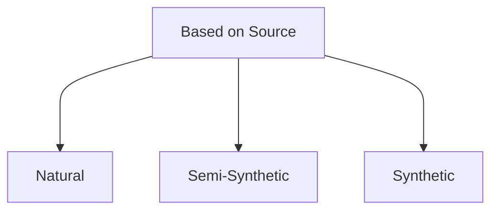
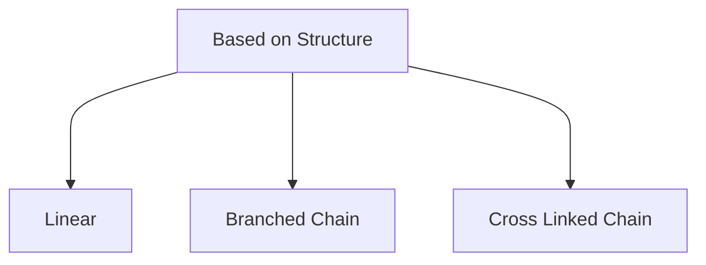
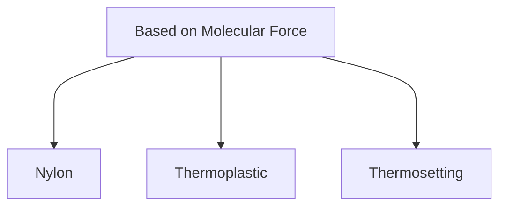
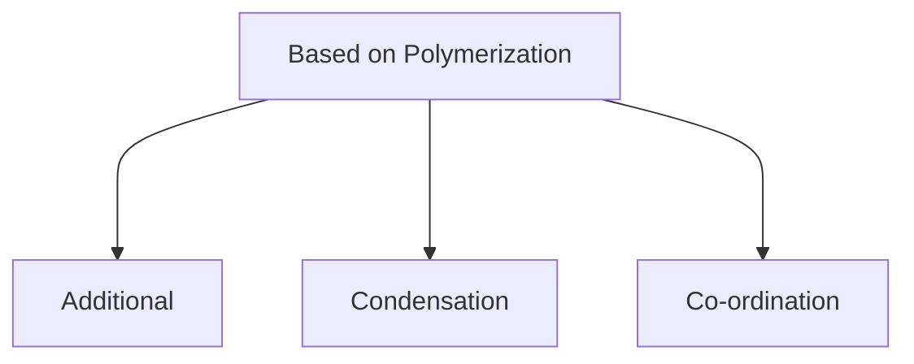

## Types of Polymer Reactions
### 1) Addition / Chain Growth
- Molecules of same / different monomer added together on a large scale.
- Monomers used are generally unsaturated compounds, **e.g.** alkenes & alkadienes derivatives
- Leads to increase in chain length and takes place through free radicals or ionic species
	- Free radical is generally the most common.
- Molecular weight of polymer product is an integral multiple of the monomer used.
- Generally produces Thermoplastics
- Results in Homo-chain polymers
#### Free Radical Mechanism in Addition / Chain Growth Reactions
- Free radical generator (catalyst) is added such as benzoyl peroxide, acetyl peroxide, tert-butyl peroxide
- **e.g.** Manufacturing of Polythene from ethene
	- Starts with heating or exposing to light ethene with a small amount of benzoyl peroxide
	- **Chain-Initiating Step:** Phenyl free radical is formed which then generates new larger free radicals from ethene.
	- **Chain-Propogating Step:** Ethene radical reacts with other ethene radicals to form newer and bigger free radicals.
	- **Chain-Terminating Step:** After multiple combinations, the product reacts one final time to form polymerised product.
### 2) Condensation / Step Growth
- Linking of two monomer molecules leads to elimination of a by-product like H~2~O or NH~4~, etc
- Therefore, the monomer must have at least two similiar or different functional groups
- Molecular weight of polymer product may or may not be an integral multiple of the weight of the monomers used.
- Produces Thermosettings Polymers.
- Produces hetero-chain polymers
- Mineral acids & bases are used as polymers.

# Molecular Weight Determination
Can be determined using:
- Gel permeation chromatography
- Osmometry
- Light scattering
- Viscometry
- Cryoscopy
- Ebulliometry
- Ultracentrifugation
- Mass Spectrometry
- End-group analysis

## Number Average Molecular Weight (M~n~)
$$
M_n = \frac{\text{Total Weight of Polymer}}{\text{Total Number of Molecules}} = \frac{n_1M_1 + n_2M_2 + \dots }{n_1 + n_2 + \dots} = \frac{\sum n_iM_i}{\sum n_i}
$$
- It is determined by measurement of colligative properties:
	- Relative Lowering in Vapour Pressure
	- Depression in Freezing Point
	- Elevation in Boiling Point
	- Osmotic Pressure
## Weight Average Molecular Mass (M~w~)
$$
M_w = \frac{m_1M_1 + m_2M_2 + \dots }{m_1 + m_2 + \dots} = \frac{\sum m_iM_i}{\sum m_i} = \frac{\sum n_iM_i^2}{\sum  n_iM_i}
$$
$\text{As, }m_i=n_iM_i$
$\text{Where:}$
$m=\text{given mass}$
$n=\text{number of moles}$
$M=\text{Molar Mass}$ 
- Obtained by:
	- Light Scattering
	- Ultracentrifugation

$\therefore M_w \geq M_n$ in general, and are equal in the case of monodisperse system (all molecules have identical molar mass)
## Polydispersion Index (PDI)
- Also called heterogeneity index.
- Used to measure broadness of molecular weight dispersion as polymers are polydispersed and heterogenous in their molecular weight due to having molecules of different molecular weight.
- The larger the PDI, the more the spread of molecular weight / particle size distribution.
$$
PDI = \frac{\text{mass average molecular
mass}}{\text{number average molecular mass}} = \frac{\bar{M_w}}{M_n}
$$
- For natural polymers, $\text{PDI} \approx 1$ which implies they are monodisperse and homogenous.
- For Synthetic Polymers, generally $\text{PDI} > 1$ which means they are polydisperse and less homogenous.

# Glass Dispersion Temperature (T~g~)
- Temperature at which polymer changes abruptly from glassy state (hard) to rubber state (soft)

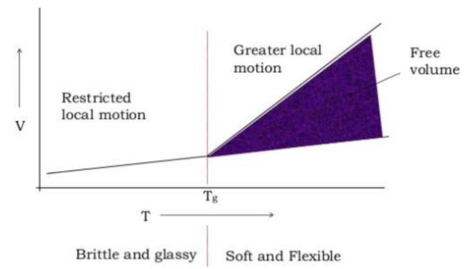

- Tells about thermal expansion, heat capacity, electrical and mechanical properties.
	- Due to this, the use of any polymer at any temperature is decided by its T~g~ value.
	- We can look at the stiffness & flexibiliy of a polymer with the help of T~g~.

## Factors affecting T~g~
- **Flexibility:** The flexibility of the polymer chain is determined by the degree of freedom.
	- High degree of freedom of rotation = lower T~g~ as polymer is already close to rubber-like, this is observed in linear polymers with single bonds.
	- Presence of rigid structures such as aromatics, cyclic structures or bulky groups on backbone hinder this rotation and increase in Tg.
- **Intermolecular Forces:** Presence of large number of polar groups in the molecular chain lead to strong
intermolecular cohesive forces which restrict the molecular mobility which leads to increase in T~g~
- **Presence of branching and cross-linking:** More Branching & cross-link = less freedom = More T~g~
- **Molecular weight:** As molecular mass increases, Tg also increases, but Tg is not affected by
molecular masses if degree of polymerization is above 250.

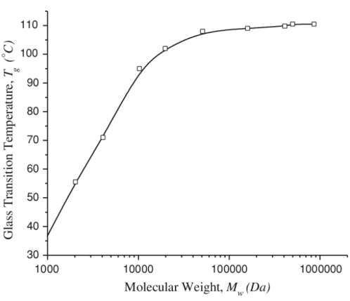

- **Presence of stereo regularity of the polymer:** Syndiotactic polymer has a higher Tg than atactic
stereoisomer compare to isotactic polymer.  HUH??? 

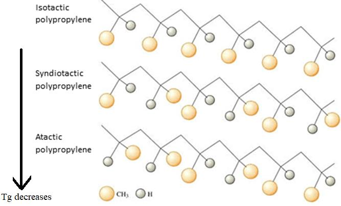

## Structure-Property Relationship of Polymers
- The properties of a polymer largely depend on the structure.
### Tensile Strength
- Mostly depend on molecular weight, and increases with molecular weight **upto 20000**, beyond that increase is negligible.
- Density, Melt Viscosity and other mechanical properties also have the same characteristics

## Crystallinity
- Depends on structure and stereo regularity.
- Close Packing = High Degree of Crystallinity = High Tensile Strength = High Impact Resistance = High T~g~ Value, etc.

## Chemical Resistance
- Depends on composition of polymer & nature of attacking reagents
	- Hydrocarbon polymers (non-polar) dissolved easily in hydrocarbon based solvents such as gasoline, benzene etc. and resistant to polar solvents
	- Polymers with polar groups are resistant to non-polar solvents and attacked by polar instead.
	- Polymers containing residual unsaturation undergo oxidative degradation when exposed to air & light. e.g. Natural & Synthetic Rubbers.
- More Cross Linking = More Chemical Resistance
- Mole Crystallinity = More CHemical Resistance

# Plastics
- High Molecular Weight
- Can be molded 
## Components
1) Resin
2) Plasticizer
3) Stabiliser
4) Filler
5) Catalyst
6) Colorant
7) Lubricant

# Polymethyl Methacrylate (PMMA)

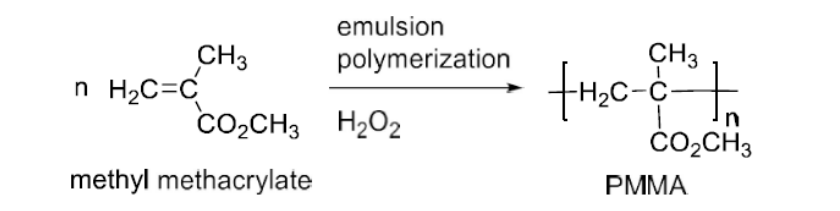

# Urea-Formaldehyde Resin (UF Resin)

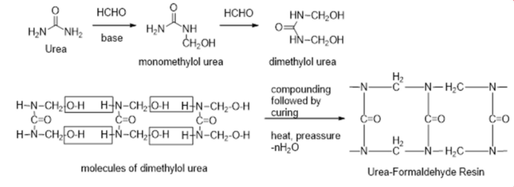

# Butyl Rubber

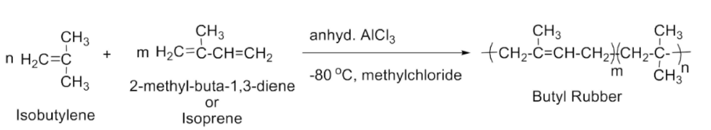

# Nitrile Rubber (Buna N)

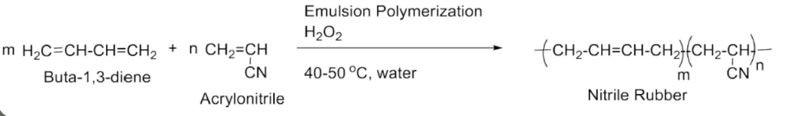

- less resistant to alkile groups due to -CN group

# Kevlar

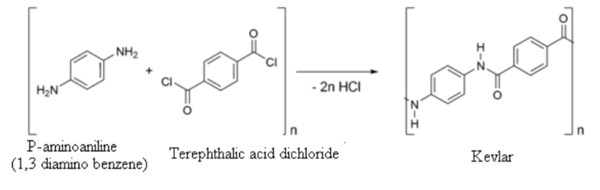

# Carbon Fibre

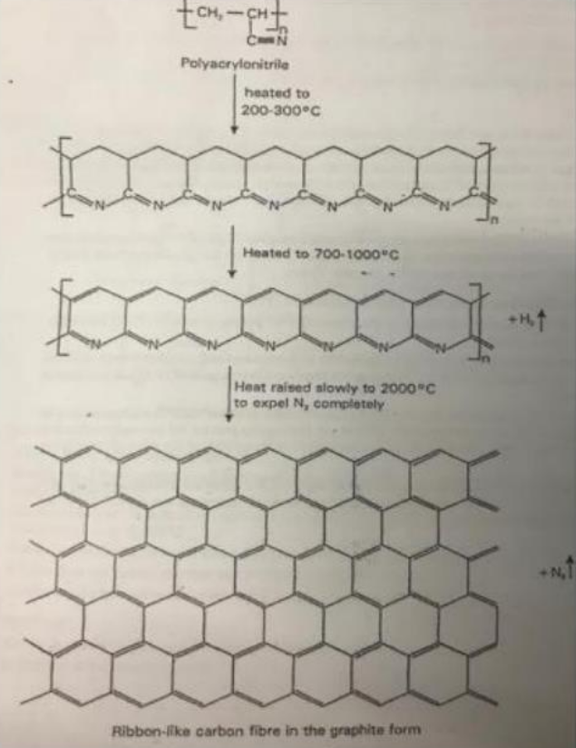

# Polyacetylene (PAN)

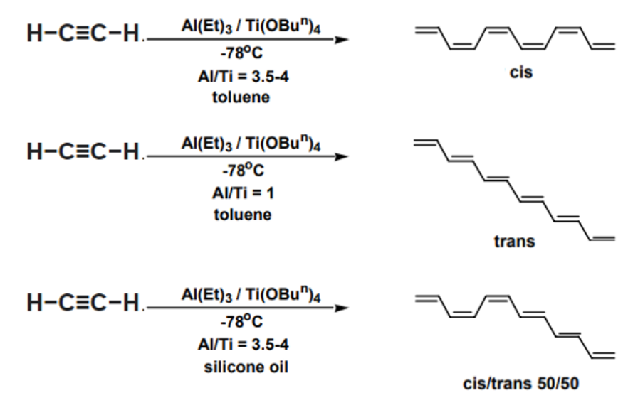
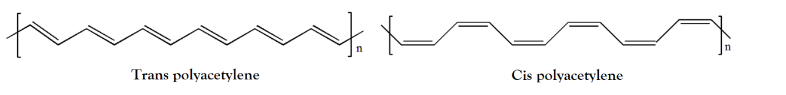

# Polyglycolic Acid

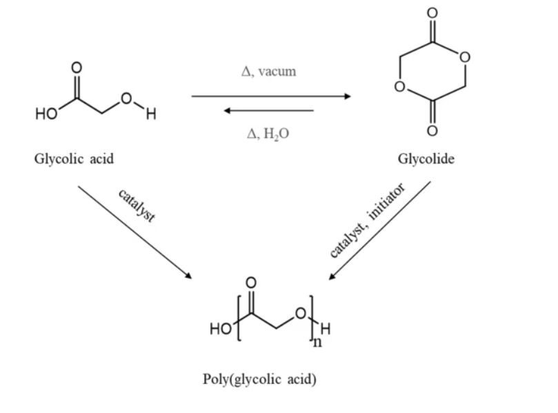

