# General Properties of Solids:
- Definite Mass & Shape
- Strong Intermolecular Forces [ >>> Thermal Energy]
- Less Intermolecular Spaces
- Particles are fixed and vibrate about their mean positions
- Almost Incompressible (rigid)
- Do not diffuse at all.
# Types of Solids

| Crystalline Solids | Amorphous Solids |
| :---: | :---: |
| **Regular** Arrangement of Particles | **Irregular** Arrangement of Particles |
| Also Known as **True/Real Solids** | Also known as **Super-Cooled Liquids** or **Pseudo-Solids** |
| **Long Range Order** (regular pattern) | **Short Range Order** (irregular pattern) |
| Have **Plane, Centre** and **Axis** of symmetry | **No Symmetry** |
| Generally **Hard** and **Water Soluble** | Generally **Soft** and **Water Insoluble** |
| **Sharp** Melting point   (**Definite** Enthalpy of Fusion) | Melt over a **Range of temeperatures**   (**Indefinite** Enthalpy of Fusion)|
| When Cut with Sharp Knife, the freshly cut surface is **Smooth** | When Cut with Sharp Knife, the freshly cut surface is **Rough & Irregular** |
| Show **Anisotropy** | Show **Isotropy** |
| **Examples:** All Metals, Salts, Sugar, P4, S8, Iodine, Diamond, Graphite, Fullerenes, Quartz, etc. | **Examples:** All Polymers, Glass, Plastic, Rubber, Talc, Lampblack, Charcoal, Wood, Cellophane, Fiber Glass, etc. |

**Anisotropy:** Ability to **change** the values of Physical Properties (Conductance, Refractive Index etc.) with change in direction.

**Isotropy:** Ability to keep the vale of Physical Property almost the **same** with change in direction

**Polycrystalline Solids:** Solids which appear Amorphous but have **Micro-Crystalline** Structures. These Individual Crystals are randomly oriented which cause it to appear isotropic despite being crystalline.
**E.g.** Metals show Isotropy due to this

# Classification of Crystalline Solids

## 1) Based on Structure

**i) Isomorphous:** Many Solids having the **Same Structure**.
      **E.g** 1) K2SO4 & K2SeO4
        2) FeSO4.7H2O & MgSO4.7H2O
**ii) Polymorphous:** One Solid having **Many Structures**

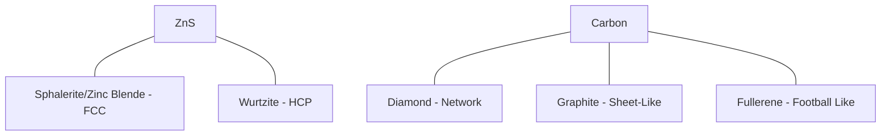

## 2) Based on Particles and Intermolecular Bonding

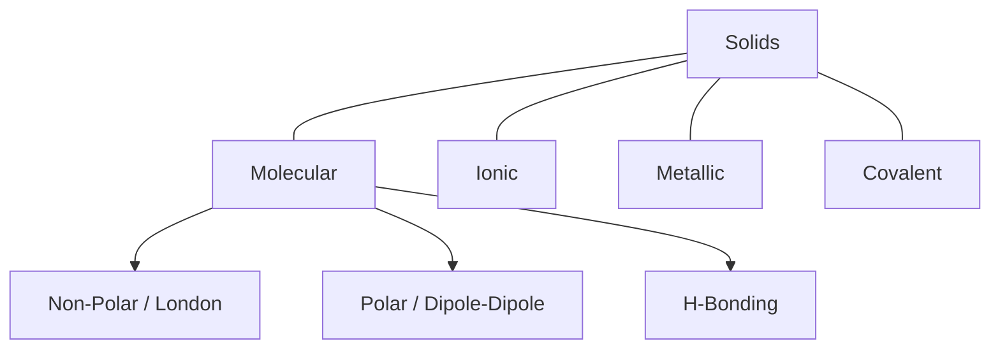

| Property | Molecular Solids | Ionic Solids | Metallic Solids | Covalent Solids |
| --- | --- | --- | --- | --- |
| **Constituent Particles** | Molecules | Ions (Cations & Anions) | Kernels in a sea of electrons | Atoms |
| **Binding forces** | Van der Waal's Forces | Electrostatic/Coulumbic Forces | Metallic Bonds | Covalent Bonds **in 3-D Cross Network** |
| **Physical State** | Soft (Except: Ice) | Hard and Brittle | Hard, Malleable & Ductile | Hard and Brittle (Except: Graphite) |
| **Electrical Conductivity** | Non-Conductor | Conductor in Aqueous/Molten State | Conductor | Non-Conductor (Except: Graphite) |
| **Melting Point** | Low | High | High | Very High |
| **Examples** | I2, CO2, C6H12O6, Ar, CCl4, H2, HCl, SO2, H2O, S8 | NaCl, MgO, ZnS, CaF2, MgCl2 | Cu, Fe, Ag, Pt, Au, Mg | Diamond, Graphite, SiC. BN, SiO2, AlN |

# Close Packed Structures
## Some Important Terms:
- **Unit Cell:** Smallest, repeating structural unit of crystalline solid, which when extended in all directions give the whole crystal.
-  **Lattice Point / Site:**  Represents the position occupied by atoms
-  **Crystal Lattice:** Regular 3-D arrangement of lattice points in space.
-  **Rank $(Z)$:** Effective no. of atoms in a unit cell
-  **Coordination Number:** The number of nearest neighbours of an atom.
## 1) 1-D Packing \[Linear Packing\]

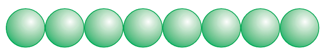

## 2) 2-D Packing

### a) Square Close Packing \[AAA Type\]

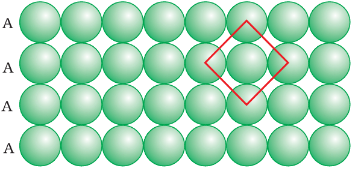

### b) 2-D Hexagonal Close Packing \[ABAB Type\]

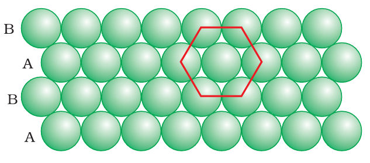

## 3) 3-D Packing

### a) Simple Cubic Close Packing \[AAAA Type\]

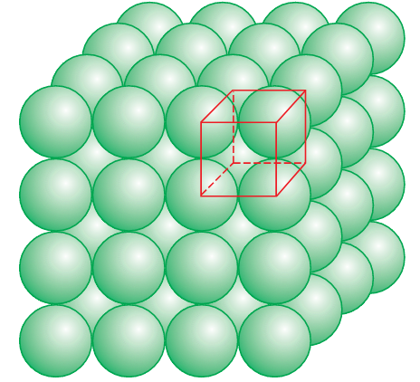

- All Layers are **Perfectly Aligned**
- Forms **Cubical Voids**
- Coordination No. **= 6**

### b) Hexagonal Close Packing \[ABAB Type\]

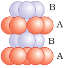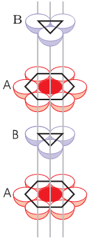

- Every **Alternate Layer** is Aligned
- Formed when placing spheres on **Tetrahedral Voids**
- Coordination No. **= 12**

### c) Cubic Close Packing / Face-Centred Cubic \[ABCABC Type\]

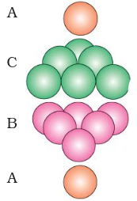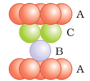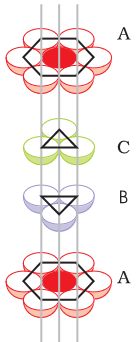

- Every **4th Layer** is Aligned
- Formed when placing spheres on **Octahedral Voids**
- Coordination No. **= 12**

# Crystal Systems \[14 Bravais Lattices\]

| Crystal system | Possible Variations | Axial distances or Edge lengths | Axial angles | Examples |
| --- | --- | --- | --- | --- |
| Cubic | Primitive, BCC, FCC | a = b = c | α = β = γ = 90° | NaCl, Zinc Blende, Cu |
| Tetragonal | Primitive, BCC | a = b ≠ c | α = β = γ = 90° | White Tin, SnO2, TiO2, CaSO4 |
| Orthorhombic | Primitive, BCC, FCC, End-Centred | a ≠ b ≠ c | α = β = γ = 90° | Rhombic Sulphur, KNO3 , BaSO4 |
| Hexagonal | Primitive | a = b ≠ c | α = β = 90° γ = 120° | Graphite, ZnO, CdS |
| Rhombohedral (Trigonal) | Primitive | a = b = c | α = β = γ ≠ 90° | Calcite (CaCO3), HgS (Cinnabar) |
| Monoclinic | Primitive, End-Centred | a ≠ b ≠ c | α = γ = 90° β ≠ 90° | Monoclinic Sulphur, Na2SO4.10H2O |
| Triclinic | Primitive | a ≠ b ≠ c | α ≠ β ≠ γ ≠ 90° | K2Cr2O7, CuSO4.5H2O, H3BO3 |

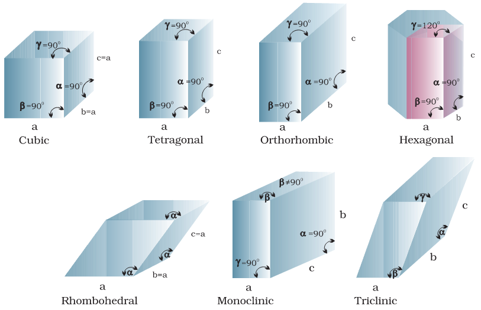

# Coordination No. of Unit Cells

| Coordination No. | Simple Cubic (SCP) | Body-Centred Cubic (BCC) | Face-Centred Cubic (FCC) |
| --- | --- | --- | --- |
| 1st | 6 ($a$) | 8 $(\frac{\sqrt3a}{2})$ | 12 $(\frac{a}{\sqrt2})$ |
| 2nd | 12 ($\sqrt2a$) | 6 ($a$) | 6 ($a$) |
| 3rd | 8 $(\sqrt3a)$ | 12 $(\sqrt2a)$ | 24 $(\frac{\sqrt3a}{2})$ |
| 4th | 6 $(2a)$ | 24 $(\frac{\sqrt11a}{2})$ | 12 $(\sqrt2a)$ |
| 5th |     |     | 24  |
| 6th |     |     | 24  |

# Location of Voids in FCC
**Note:** Number of T.Vs = $2\times$ Number of O.Vs
## 1) Tetrahedral Voids

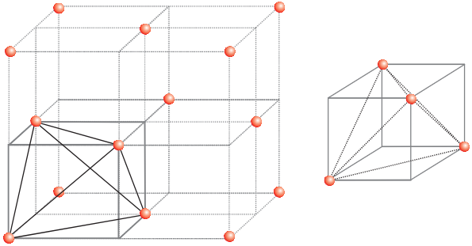

- Formed by corner atoms with three adjacent face-centred atoms
- 2 T.V's located at a body diagonal with $\frac{\sqrt3a}{4}$ distance from the corner.
- Distance between 2 T.V's is $\frac{\sqrt3a}{2}$
- Coordination No. = 4

## 2) Octahedral Voids

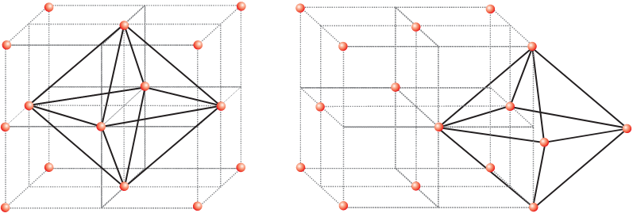

- Exactly 1 O.V. Located at the Body-Centre by 6 Face-Centred Atoms.
- There are 12 Shared O.V's at every Edge-Centre with 1/4th contribution each formed by any 2 corner atoms with adjacent face atoms.
- Coordination No. = 6

#  Location of Voids in HCP

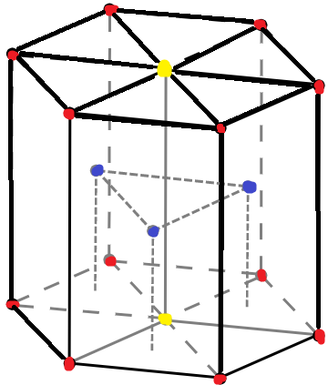

## 1) Tetrahedral Voids
- 2 T.V.s Formed by 3 Centre Atoms and 1 Face-Centre Atoms at $\frac h4$ distance from each face centre.
- 6 T.V.s Formed by 1 Face Centre Atom Along with 2 Adjacent Corner Atoms + 1 Centre Atom	

## 2) Octahedral Voids

# Elements of Symmetry \[23\]

## 1) Centre of Symmetry \[1\]

- Located at the body-centre of the cube.
- The distance of all corners or face-centres from this Centre of Symmetry are equal

## 2) Axis of Symmetry \[13\]

### a) 2-Fold Axis \[6\]

- Also called Diad Axis or C-2 Axis
- Passes through diagonally opp. edges
- Total rotation about 360° = 2

### b) 3-fold Axis \[4\]

- Also called Triad Axis or C-3 Axis
- Passes along body-diagonals through diagonally opp. corners
- Total rotation about 360° = 3

### c) 4-fold Axis \[3\]

- Also called Tetrad Axis or C-4 Axis
- Passes through opp. face centres
- Total rotation about 360° = 4

## 3) Planes of Symmetry \[9\]

### a) Rectangular Plane \[3\]

- Made by cutting the cube along the lines joining the edge-centres of the opp. faces

### b) Body-Diagonal Plane \[6\]

- Made by cutting the cube along the face diagonals of opp. faces

# Packing Fraction

$$
\frac{\text{Volume occupied by atoms}}{\text{Volume of unit cell}} = \frac{Z.{\Large\frac{4}{3}}\pi r^3}{a^3} 

$$

| Unit Cell | Square \[2-D\] | Hexagonal \[2-D\] | Simple Cubic | Body Centred | Face Centred | Hexagonal \[3-D\] |
| --- | --- | --- | --- | --- | --- | --- |
| **Packing Efficiency** | 78.5% | 90.75% | 52.4% | 68% | 74% | 74% |

# Density of Unit Cell

$$
\frac{\text{Mass of unit cell}}{\text{Volume of unit cell}} = \frac{Z.m}{a^3} =\frac{Z.M}{a^3.N_A}
$$

**Note:** No. of Unit Cells = $\frac{\text{Mass of crystal}}{\text{Mass of Unit Cell}}$

# Structure of Ionic Solids

- For an ionic solid to be efficiently packed it is required that a particular ion is surrounded by as many opp. ions as possible.
- As cations are generally smaller in size, they occupy void positions in a crystal (exception: CaF2)

## Radius Ratio Rule

$\frac{\text{radius of smaller ion}}{\text{radius of larger ion}} =\frac{r^+}{r^-}$ (generally)
**Note:** when r+ \> r-, location of cation & anion are exchanged

| Radius Ratio | Type of Void | Coordination No. | Examples |
| --- | --- | --- | --- |
| **$0.155 \leq\frac{r^+}{r^-}<0.225$** | Planar Triangular | 3   | Boron Oxides |
| **$0.225 \leq\frac{r^+}{r^-}<0.414$** | Tetrahedral | 4   | Zns |
| **$0.414 \leq\frac{r^+}{r^-}<0.732$** | Octahedral | 6   | NaCl, NaBr |
| **$0.732 \leq\frac{r^+}{r^-}<1.00$** | Cubic | 8   | CsCl |

**Note:** Anions generally do not touch each other however, in limiting or critical case, they touch each other.

# Structures of Some Ionic Compounds

| Type of Structre | Arrangement of Ions | No. of Formula Units per Unit Cell | Coordination No. | Examples |
| --- | --- | --- | --- | --- |
| NaCl Type (Rocksalt) | Na+: In all O.Vs Cl-: In FCC Lattice | Na+: 4 Cl-: 4 4 NaCl per unit cell | $6:6$ | Alkali Metal Halides (Except Cs), Silver Halides (Except AgI) |
| CsCl Type | Cs+: In Cubic Voids Cl-: In FCC Lattice | Cs+: 1 Cl-: 1 1 CsCl per unit cell | $8:8$ | CsBr, CsI, CsCN, TiCl, TiBr, TiI, TiCN |
| ZnS Type (Zinc Blende/Sphalerite) | Zn2+: In Alternate T.Vs S2-: In FCC Lattice | Zn2+: 4 S2-: 4 4 ZnS per unit cell | $4:4$ | CuCl, CuBr, CuI, AgI, BeS |
| ZnS Type (Wurtzite) | Zn2+: In Alternate T.Vs S2-: In HCP Lattice | Zn2+: 6 S2-: 6 6 ZnS per unit cell | $4:4$ |     |
| CaF2 Type (Fluorite Structure) | Ca2+: In FCC Lattice F-: In all T.Vs | Ca2+: 4 F-: 8 4 CaF2 per unit cell | $8:4$ | BaF2, BaCl2, CaCl2 |
| Na2O Type (Anti-Fluorite Structure) | Na+: In all T.Vs O2-: In FCC Lattice | Na+: 8 O2-: 4 4 Na2O per unit cell | $4:8$ |     |
| Al2O3 Type (Corrundum Structure) | Al3+: 2/3rd O.Vs O2-: In HCP Lattice | Al3+: 4 O2-: 6 2 Al2O3 per unit cell |     | H2O3, Cr2O3 |
| AB2O4 Type (Spinel Structure) | A2+: 1/8th of T.Vs B3+: 1/2 of O.Vs O2-: In FCC Lattice | A2+: 1 B3+: 2 O2-: 4 1 AB2O4 per unit cell |     | MgAl2O4, ZnAl2O4, MgIn2O4 |
| AB2O4 Type (Inverse Spinel Structure) | A2+: 1/4th of O.Vs B3+: 1/4th of O.Vs + 1/8th of T.Vs O2-: In FCC Lattice | A2+: 1 B3+: 2 O2-: 4 1 AB2O4 per unit cell |     | Fe3O4, NiFe2O4, CoFe2O4 |

**Notes:**

- Diamond Unit cell is just like ZnS where Zn2+ & S2- have been replaced by carbon atoms
- Be, Mg, Sc, Ti, Zn, Cd crystallize in HCP
- Ca, Sr, Cu, Ag, Au, Crystallize in FCC
- Group 1 (Alkali) Metals crystallize in BCC
- Mn Crystallizes in SCP

# Effect of Temperature & Pressure on Coordination No.

### As Temperature Increases, Coordination No. Decreases:

$$
\ce{CsCl Type_(_8_:_8_)->[\Delta]NaCl Type_(_6_:_6_)}

$$

### As Pressure Increases, Coordination No. Increases:

$$
\ce{ZnS Type_(_4_:_4_)->[pressure]NaCl Type_(_6_:_6_)}

$$

# Imperfections in Solids

- Defects are irregularities / imperfections in the arrangement of constituent particles in a crystalline solid.
- Defects are generally formed when crystallization occurs at a fast or moderate rate.
- No crystal is free from defects, even single crystals formed when crystallization occurs at a very slow rate have defects.

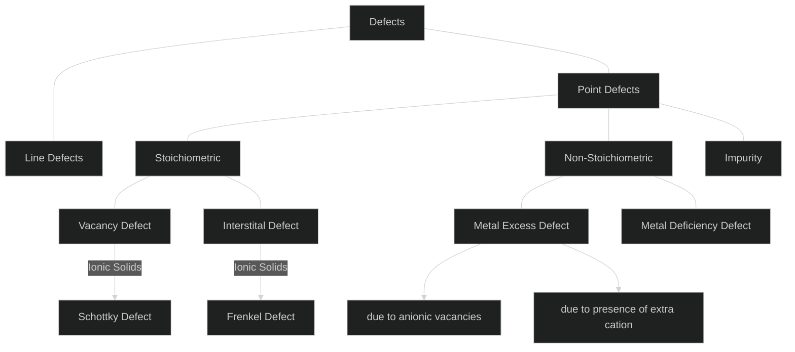

# Stoichiometric Defect

- Also called **Intrinsic** defects or **Thermodynamic** defects

## 1) Vacancy Defect

- When some of the lattice sites are vacant and the atoms/ions are missing from their original places.
- This can develop when the crystal is heated

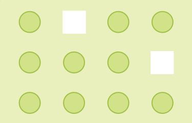

### Schottky Defect

- In Ionic Solids, this is known as Schottky Defect
- In Schottky defect, equal no. of anions & cations are missing to maintain electrical neutrality.
- Schottky defect is usually shown by those solids where anion & cation have similiar sizes. It is also shown in those solids with high Coordination No.
    **e.g.** NaCl, KCl, CsCl, AgBr
    **Note:** Density of the crystal decreases in both Vacancy as well as Schottky defect. However, in Schottky Defect, electrical Conductivity increases

## 2) Interstitial Defect

- When some of the constituent particle occupy interstitial sites in the crystal, and extra atoms/ions are present in between.

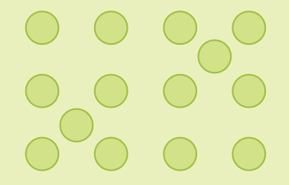

### Frenkel Defect

- In Ionic Solids, this defect is known as Frenkel Defect or Dislocation Defect.
- In Frenkel Defect, the smaller ion is dislocated from its normal site to an interstitial site, Therefore creating a Vacancy defect at its original location and an Interstitial defect at its new location.
    **e.g.** AgCl, AgBr, AgI, ZnS
    **Note:** In Interstitial Defect, the density of the crystal increases, however in Frenkel defect, the density of the crystal remains the same whereas its electrical conductivity increases

**Note:** AgBr shows both Frenkel & Schottky Defect

# Non-Stoichiometric Defect

## 1) Metal Excess Defect

### a) Due to anionic vacancies \[F-centre Defect\]

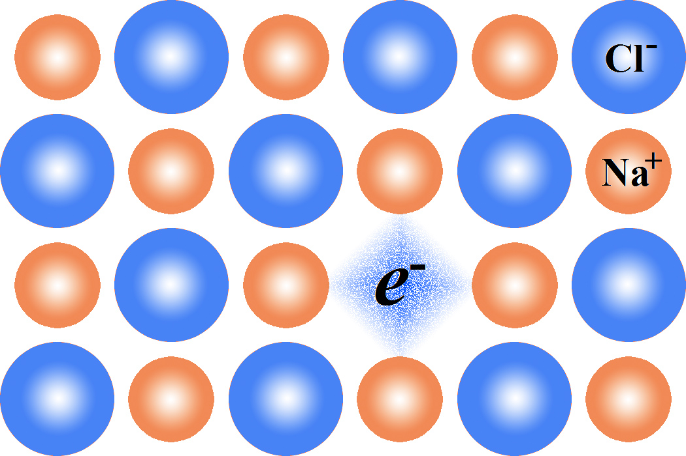

- Usually shown by Alkali Metal Halides
- In this defect unpaired electrons occupy the anionic sites creating an excess of metal
- This defect occurs when Alkali Metal Halides are heated in the presence of corresponding alkali metal vapor. The halide ions diffuse to the surface and combine with the vapours to give alkali halides at the surface.
- The released electrons from the alkali metal diffuse into the crystal and occupy anionic sites.
- The anionic sites occupied by unpaired electrons are called F-centres (from German word - Farbenzenter meaning color centre)
- Due to the presence of electrons, they may get excited by absorbing energy and impart a color onto the crystal

**e.g.**

$$
\underset{\text{(White)}}{\text{NaCl}} \xrightarrow[\text{Na Vapours}]{\Delta}\underset{\text{(Yellow)}}{\text{NaCl}}
\\
\
\\
\underset{\text{(White)}}{\text{LiCl}} \xrightarrow[\text{Li Vapours}]{\Delta}\underset{\text{(Pink)}}{\text{LiCl}}
\\
\
\\
\underset{\text{(White)}}{\text{KCl}} \xrightarrow[\text{K Vapours}]{\Delta}\underset{\text{(Violet / Lilac)}}{\text{KCl}}
$$

### b) due to presence of extra cations:

- In this defect, the anion is lost upon heating due to which an excess of metal is created
- the metal ions move to interstitial sites and the electron to neighbouring insterstitial sites

**e.g.**
$$
\underset{\text{(White)}}{\text{ZnO}} \xrightarrow{\Delta}\text{Zn}^{2+}+\text{O}^{2-}\longrightarrow\underset{\text{(Yellow)}}{\text{Zn}_{1+x}\text{O}}+\frac12\text{O}_2+2e^-
$$

## 2) Metal Deficiency Defect

- This defect occurs due to absece of cations from lattice site or extra interstitial anions
    **e.g.** $\ce{FeO -> Fe_{0.93}O}$
- Here, some Fe2+ ions are replaced by Fe3+ ions

# Impurity Defect

## 1) Substitution Impurity Defect

**e.g.** Brass $(\ce{Cu + Zn})$

## 2) Interstital Impurity Defect

**e.g.** Steel $(\ce{Fe + C + Ni + Cr\text{...}})$

**Note:** In Ionic Solids, Impurity defect occurs such that the charges are balanced.
**e.g.** If NaCl is doped with SrCl2 the Sr2+ ion occupies Na+ ion's position and to maintain electrical neutrality, 1 **additional** Na+ ion leaves its postion.

# Electric Properties

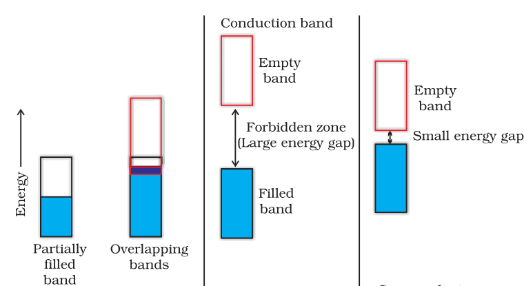

- Semi-Conductors' Conductivity can be increased by rise in tempertaure due to which more electrons can jump to the conduction band.

## 1) n-type Semiconductors

- When Element of Group-14 is doped with Group-15 Element they form 4 covalent bonds and the 5th electron becomes unbounded and delocalised.

## 2) p-type Semiconductors

- When Element of Group-14 is doped with Group-13 Element they form 3 covalent bonds and form an electron hole or electron vacancy.

## Applications of n-type & p-type Semiconductors

- A Diode is a combinaion of n-type & p-type Semiconductors and is used as a rectifier.
- Transitors are made by sandwhiching a layer of Semiconductors \[npn & pnp\] and are used to detect and amplify Radio or Audio Signals
- Solar Cell is an efficienct photo-diode used for conversion of light energy into electrical energy.
- Combinations of G-13 and G-15 elements form Semiconductors in the form of compounds such as GaAs, InSb, AlP.
    - GaAs conductors have a very fast response time.
- Combinations of G-12 and G-16 elements form Semiconductors in the form of compounds such as ZnS, CdS, CdSe, HgTe
- These compounds are not covalent andd ionic character depends upon the electronegatvities of the 2 elements.
- Transition elements' Oxides also show marked differences in electrical properties:
    - TiO, CrO2 & ReO3 behave like metals
    - ReO3 is like Copper in its Conductivity and Appearance
    - Oxides like VO, VO2, VO3, TiO3, show metallic or insulating properties depending upon temperature.

# Magnetic Properties

- Every Substance has some Magnetic Properties associated with it which depend upon its electrons as each electron behaves like a tiny magnet.

Its Magnetic Moment is due to 2 types of motion of electron:

1.  Its orbital motion around the nuclues
2.  It spin motion around its own axis.

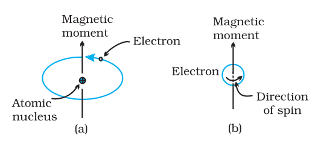

- Electron being a charged particle undergoing these motions can be considred to be a small loop of current which posses a magnetic moment.
    - Thus each electron has a permanent spin and orbital motion attached to it.
- Magnitude of this magnetic moment is very small and is measured in Bohr Magneton $(\mu_B)$.
    $\mu_B = 9.27 \times 10^{-24} \text{Am}^2$

**For Ferromagnetic, Anti-Ferromagnetic & Ferrimagnetic Substances:**

- In Solid State, ions are grouped together in small regions called **Domains** which acts like a tiny magnet.

|Name|Property|Something|Examples|
|:----:|:----:|:---:|:----:|
|Diamagnetic $[\space\upharpoonleft\downharpoonright\space\upharpoonleft\downharpoonright\space\upharpoonleft\downharpoonright\space]$ |Due to Paired-Up electrons cancel each others magnetic moment|- **Weakly repelled** by a magnetic field  - Weakly magnetised by a magnetic field in the opposite direction **temporarily**|H2O, NaCl, C6H6, Ne, Ar, Na+|
|Paramagnetic $[\space\upharpoonleft\downharpoonright\space\upharpoonleft\downharpoonright\space\upharpoonleft\space\upharpoonleft\space]$|Due to Unpaired Electrons|- **Weakly Attracted** by a Magnetic Field  - Weakly magnetised by a magnetic field in the same direction **temporarily** |O2, VO2, Fe3+ |
|Ferromagnetic $[\space\uparrow\space\uparrow\space\uparrow\space\uparrow\space\uparrow\space]$ |Due to allignement of Domains in same direction|**Strongly Attracted** by a magnetic field and will retain their magnetivity **permanently** |Fe, Co, Ni, Gd, CrO2 |
|Anti-Ferromagnetic $[\space\uparrow\space\downarrow\space\uparrow\space\downarrow\space\uparrow\space\downarrow\space]$ |Due to oppositely oriented Domains which cancel each others magnetic moment| |  BaFeO3, MnO, Mn2O3, Mn3O4, FeO |
|Ferrimagnetic $[\space\uparrow\space\uparrow\space\downarrow\space\uparrow\space\uparrow\space\downarrow\space]$ |Due to Domains being Alligned in Parallel & Anti-Parallel directions in Unequal Numbers|Weakly attracted by magnetic field as compared to Ferromagnetic Substances |Fe3O4, MgFe2O4, ZnFe2O4 |

**Note:** Upon heating Ferrimagnetic substances they lose their magnetism and become paramagnetic
**Note:** In solid state, the ions are grouped together into small regions called domains and each domain act slike a tiny magnet.
**Note:** Initially, Domains in Ferromagnetic substances are randomly oriented and their magnetic moments get cancelled.

# Dielectric Properties
| Name | Property | Examples |
|:-------:|:-----:|:----:|
|Ferroelectric $[\space\uparrow\space\uparrow\space\uparrow\space\uparrow\space\uparrow\space]$|Dielectric Dipoles are permanently alligned|BaTiO3, KH2PO4, NaKC4, H4O6|
|Anti-Ferroelectric $[\space\uparrow\space\downarrow\space\uparrow\space\downarrow\space\uparrow\space\downarrow\space]$|Dielectric Dipoles are oppositely oriented|PbZrO3|
|Piezoelectric $[\space\uparrow\space\uparrow\space\uparrow\space\uparrow\space\uparrow\space]$ |Production of electricity on application of mechanical stress|BaTiO3, KH2PO4, PbZrO4, Quartz|
|Pyroelectric $[\space\uparrow\space\uparrow\space\uparrow\space\uparrow\space\uparrow\space]$|Production of electricity on Heating|C5NO3, GaN, Tourmaline, Bones & Tendons|

# Bragg's Law

**When X-Rays are incident on a crystal they are defracted by layer of constituent particles of solid as:**

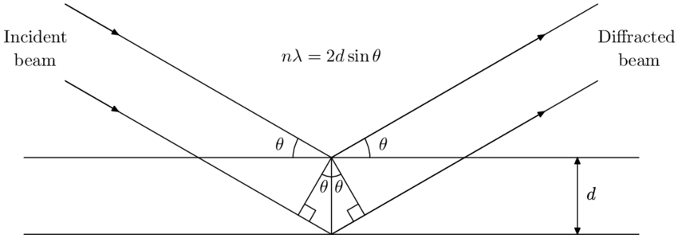

where:
$n =$ Order of reflection (1,2,3...)
$\lambda =$ wavelength of X-Ray
$d =$ Interplanar distance
$\theta =$ Angle of Incidence

# Truncated System
- Made by cutting along corners of a 3-Dimensional Shape

|System|No. of Vertices|No. of Edges|No. of Faces|
|:----:|:----:|:----:|:----:|
|Octahedron|6|12|8|
|Truncated Octahedron|24 (6 x 4)| $\underbrace{12}_{(\text{old})} +\underbrace{(6\times4)}_{(\text{new})} = 36$| $\underbrace{8}_{(\text{hexagonal})} +\underbrace{6}_{(\text{square})} = 14$|
|Tetrahedron| 4|6|4|
|Truncated Tetrahedron|12 (4 x 3)| $\underbrace{6}_{(\text{old})} +\underbrace{(4\times3)}_{(\text{new})} = 18$|$\underbrace{4}_{(\text{hexagonal})} +\underbrace{4}_{(\text{triangular})} = 8$|
|Cube|8|12|6|
|Truncated Cube| 24 (8 x 3)| $\underbrace{12}_{(\text{old})}+\underbrace{(8\times3)}_{(\text{new})} = 36$|$\underbrace{8}_{(\text{Triangular})} +\underbrace{6}_{(\text{Octagon})} = 14$|

**Note:** 
$$
\text{Euler's Formula for Polyhedrons} \implies V+F-E = 2
$$
$\text{where:}$
$V = \text{Vertices}$
$F = \text{Faces}$
$E=\text{Edges}$