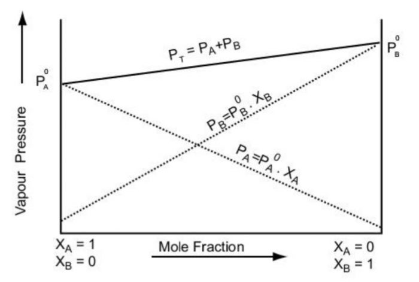
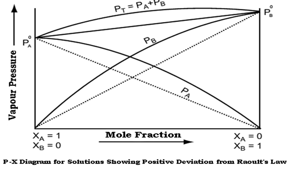
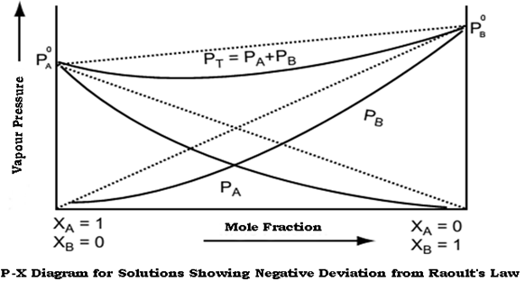
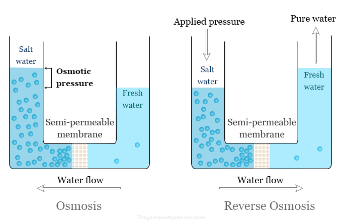

- **Solution:** Homogenous Mixture of two or more components
- **Solvent** has the same Physical Property as the Solution. It is generally present in larger quantity
- **Solute** is the constituent which may or may not have the same physical state as the solution. It is generally present in smaller quantity.

$\therefore\space$ A solvent retains its identity while solute loses it. 

# Some Important Concentration Terms
### Molarity $\text{(M)}$
$$
\text{M} =\frac{\text{Moles of solute}}{\text{Volume of Solution}}
$$
**Note:** The Molarity of an Ionic Compound is called **Formality $\text{(F)}$**
### Normality $\text{(N)}$
$$
\text{N} = \frac{\text{equivalent moles of solute}}{\text{Volume of Solution}} = \text{n-factor}\times\text{ Molarity} 
$$
### Molality $\text{(m)}$
$$
\text{m} = \frac{\text{Moles of Solute}}{\text{Mass of Solvent}}
$$
### Strength (g/L)
$$
\frac{\text{mass of solute(in g)}}{\text{Volume of Solution}}
$$

**Note:** Concentration terms which are expressed in terms of Volume are temperature dependent as Volume changes with temperature. **e.g.** Molarity

# Solubility
- Depends upon nature of Solute & Solvent, Temperature, Pressure.

 

## $\text{I)}$ Solubilty of Solids in Liquids
- A solute dissolves in a solvent only if their inter-molecular interactions are similiar. (**Like dissolves Like**)
- After a solution is saturated, no matter how much solute is added, its concentration will not change.
- Its concentration will only changed once we modify the Temperature and Pressure, forming a Super-Saturated Solution.
- Crystallisation takes place when solute particles collide with each other and get seperated out.
- At the point of saturation, both processes occur at the same rate and dynamic equilibrium is achieved.
$$
\ce{\text{Solute}+\text{Solvent}<=> Solution}
$$

**Effect of Temperature on Solubility:** 
- Generally, Solubility increases with rise in temperature as solubility is generally Endothermic $(\Delta H_{sol} > 0)$
- However, for Exothermic $(\Delta H_{sol} < 0)$ solubility should decrease with rise in Temperature.

**Effect of Pressure on Solubility:** 
- Decrease in Pressure increses solubility but only to a small extent as solids & liquids are highly incompressible

 

## $\text{II)}$ Solubilty of Gases in Liquids
- Generally gases which can be easily liquified are more soluble in common solvents. **e.g.** CO~2~ in H~2~O
- The gases which are capable of forming ions in aqueous solutions are much more soluble in water. **e.g.** NH~3~ & HCl
	- These however are not as soluble in organic solvents like benzene as they do not ionize in them.

### Effect of Temperature on Solubility:
- Generally, solubility decreases with rise in temperature as Dissolution of gases evolves heat (exothermic)
- The dissolution process involves dynamic equilibrium and thus follows Le Chatelier's Principle
### Henry's Law (Effect of Pressure on Solubility): 
$$
\ce{p_A=K_{H}.\chi_A}
$$	
**Note:** $\ce{K_H}$ is a function of the nature of gas as well as temperature.
**Note:** The graph of $p_A$ vs $\chi_A$ is a straight line with slope = \ce${K_H}$

Henry's Law is not Applicable when:
- **Molecules are not in equilibrium**
- Pressure is too high
- Temperature is too low
- Gas is highly soluble and chemically reacts with solvent
- Gas Dissociates.

## Applications of Henry's Law:
1. Aquatic Life is more comfortable in cold waters than warm waters
2. Soft Drinks Packages at high pressure to increase solubility of CO~2~
3. Scuba divers use tanks of air diluted with helium (11.7% helium, 56.2% nitrogen, 32.1% oxygen) to avoid **bends** which used to dissolve N~2~ in their blood at high pressures which was very painful when rising up to the surface
4.  Low blood oxygen due to high altitude causes climbers to become weak and unable to think
clearly known as **anoxia**.
 

# Factors affecting Vapour Pressure [By Liquids]
## a) Nature of Liquid
- Stronger Intermolecular Forces of Attraction $\implies$ Lesser Vapour Pressure
- Higher Temperature $\implies$ More Vapour Pressure	- As Temperature increases K.E. of molecules due to which more molecules are able to get converted to vapour.
	- Effect of Temperature on Vapour Pressure is given by Clausius-Clapeyron Equation:
$$
\log{\frac{P_2}{P_1}} = \frac{\Delta {H}_{\text{vap}}}{2.303\times R}\bigg(\frac{1}{T_1}-\frac{1}{T_2}\bigg)
$$
where:
$P_1\space \&\space P_2 \implies \text{Vapour Pressure of Liquid at Temperatures } T_1 \space\&\space T_2 \text{ respectively}$
$\Delta H_{\text{vap}} \implies \text{ Enthalpy of vapourisation of the liquid}$

# Raoult's Law
$$
\ce{p_A = \chi_A.\r{p}_A}
$$
where
$p_A = \text{Partial pressure of A}$
$\chi_A = \text{mole fraction of A}$
$\r p_A = \text{Pure Partial pressure of A}$

$$
\therefore P_T = \r P_A\chi_A + \r P_B\chi_B
$$
$$
\implies \boxed{P_T = (\r P_A-\r P_B)\chi_A + \r P_B} \qquad{[\text{Putting }\chi_B = 1-\chi_a]}
$$

## Dalton's Law of Partial Pressures
$$
y_A = \frac{P_A}{P_T} \qquad y_B = \frac{P_B}{P_T}
$$
where:
$y\implies \text{mole fraction in vapour}$

## Ideal & Non-Ideal Solution
**Note:** Ideal solutions obey Raoult's Law over a **range** of Temperatures & Pressures

| Ideal Solution| **Positive** Deviation  (Non-Ideal) | **Negative** Deviation  (Non-Ideal) |
|:-----:|:-----:|:-----:|
|Obeys Roult's Law| Does **not** Obey Roult's Law|Does **not** Obey Roult's Law|
| New Bonds are of Same Strength | New Bonds are **Weaker** | New Bonds are **Stronger** |
| A & B are of **same nature** | A & B are of **different nature** | A & B form **ions** upon mixing|
| $\Delta H = 0$ | $\Delta H = +\text{ve}$ |$\Delta H = -\text{ve}$ | 
|$\Delta V = 0$ | $\Delta V = +\text{ve}$ |$\Delta V = -\text{ve}$ | 
| **Examples:**  Benzene + Toluene   n-hexane + n-heptane   Chlorobenzene + Bromobenzene   Ethyl Chloride + Ethyl Bromide   CCl~4~ + SiCl~4~ | **Examples:** Acetone + CS~2~  Acetone + C~2~H~5~OH  Acetone + Benzene   Ethyl Alcohol + Water  CCl~4~ + CHCl~3~|**Examples:** HCl + Water  CHCL~3~ + Acetone  HNO~3~ + Water   Acetic Acid + Pyridine    Water + HI   Water + HClO~4~|
||||

# Azeotropic Mixture [Constant Boiling Mixtures]
- Two volatile liquids when combined in a **specific ratio** will both boil at a constant temperature and thus, have constant composition.
- These two liquids cannot be seperated by Fractional Distillation.
- The point where concentration does not change is called azeotropic point
 
 ## a) Minimum Boiling Azeotropes
 - Shown by $+\text{ve}$ deviation
 - Pressure / Vapour Pressure Maximum $\uparrow$
 - Intermolecular Forces Minimum $\downarrow$

## b) Maximum Boiling Azeotropes
 - Shown by $-\text{ve}$ deviation
 - Pressure / Vapour Pressure Minimum $\downarrow$
 - Intermolecular Forces Maximum $\uparrow$

# Colligative Properties
- Depend on the no. of solute particles
- Does not depend upon nature of solute

## 1) Relative Lowering in Vapour Pressure $[\text{R.L.V.P.}]$
$$
\r P_A - P \implies \text{ Lowering in Vapour Pressure}
$$

$$
\boxed{\frac{\r P_A - P}{\r P_A} = \chi_B} \implies \text{ Relative Lowering in Vapour Pressure}\qquad [\text{As }\r  P_A - P = \r P_A\chi_B]
$$

## 2) Elevation in Boiling Point $(\Delta \text{T}_\text{B})$
$$
\Delta \text{T}_\text{B}= \text{K}_\text{B}.m
$$
where $K_B = \text{Ebullioscopic Constant [ Molal Elevation Constant ]}$

## 3) Depression in Freezing Point $(\Delta \text{T}_\text{f})$
$$
\Delta \text{T}_\text{f} = K_f.m
$$
where $K_f = \text{Cryoscopic Constant [ Molal Depression Constant ]}$

## Osmotic Pressure $(\pi)$
- Minimum Excess Pressure that has to be applied on the solution to prevent Osmosis.

**Note:** Osmosis takes place from higher **solvent** concentration to lower concentration
**Note:** Reverse Osmosis Takes place in Opposite Direction on Application of some pressure $>\pi$

$$
\pi = MRT
$$

Isotonic Substance have Same **Osmotic Pressure** (& Same Molarity)
$$
\pi_1 = \pi_2
$$

$$
\therefore M_1 =M_2
$$

# Van 't Hoff Factor $(i)$
- Correction Factor introduced for association & dissociation

$$
i = \frac{\text{Experimental colligative properties}}{\text{Normal colligative properties}}
$$

 

$$
i = \frac{\text{No. of particles after dissociation / association}}{\text{Initial No. of particles}}
$$

 

$$
i = \frac{\text{Normal Molecular Mass}}{\text{Experimental Molecular Mass}}

$$

$$
\because\text{Colligative Properties } \alpha\space \frac{1}{\text{Molecular Mass}}
$$

## Association
- Formation of bigger molecules from two or more molecules
- $\text{no. of molecules } \downarrow \quad\therefore\space\text{Colligative Properties} \downarrow$
$$
\ce{
\underset{1-\alpha}{nA} <=> \underset{\alpha}{A_n}
}
$$
$$
\boxed{\therefore \space i = \frac{(1-\alpha) + \frac \alpha n}{1}}
$$ 

**Note:** For Association: $0<i<1$

## Dissociation
- Fomation of 1 big molecule to multiple smaller molecules
- $\text{no. of molecules } \uparrow \quad \therefore \space \text{Colligative Properties} \uparrow$

$$
\ce{
\underset{1-\alpha}{A_n} <=> \underset{n\alpha}{nA}
}
$$
$$
\boxed{\therefore i = \frac{(1-\alpha) + n\alpha}{1}}
$$ 

**Note:** For Dissociation: $i>1$

# Ostwald-Walker Apparatus
