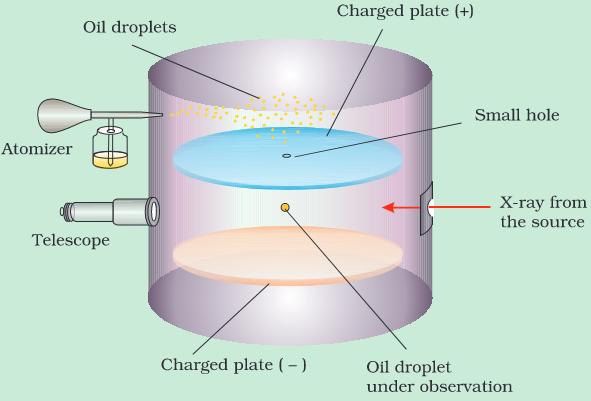

**# Particles & their properties

| Particle | Mass | Charge | Discovered by |
| --- | --- | --- | --- |
| Electron | 9.1 x 10-31 kg | \- 1.6x10-19 C | J.J. Thomson |
| Proton | 1.67 x 10-27 kg | \+ 1.6x10-19 C | Goldstein |
| Neutron | 1.67 x 10-27 kg |     | Chadwick |
| Positron |     | \+ 1.6x10-19 C | Anderson |
| $\pi$-meson | $\pi^o$ = 264 Me $\pi^+$ = 273 Me $\pi^-$ = 273 Me |     | Yukuwa |

# Discharge Tube Experiments

- **Discharge Tube:** Long glass tube fitted with two electrode at ends of tube and a vacuum pump to keep the desired pressure inside the tube.

## Cathode Ray

- J.J. Thomson took a discharge tube and applied a voltage of 10000 V at a pressure of 10-2 mm Hg.
- He noticed some invisible, negatively charged rays produced at the cathode strike behind anode and produce flouresence (due to ZnS).
- The Color produced is independent of nature of gas

## Anode Ray \[Canal Rays\]

- Goldstein took a discharge tube having a perforated anode and applied a voltage of 10000 V at a pressure of 10-2 mm Hg.
- He noticed some invisible, positively charged rays produced at the cathode strike behind perforated anode and produce flouresence (due to ZnS).
- Property of Anode ray depends upon nature of gas.
    **e.g.** if H2 gas is taken inside discharge tube, then anode ray is made up of protons.

**Note:** Both rays have Mechanical energy and travel in a straight line.

# Calculation of Charge to mass ratio

- J.J. Thomson argued that amount of deviation of the particle from their path in the presence of electrical and magentic field depends upon:
    - Magnitude of negative charge on the particle
    - Mass of particle
    - Strength of magnetic field
- He found $\frac{q}{m}$ = 1.758820 × 1011 C kg–1

# Milikan's Oil Drop Experiment

- Fine Oil droplets produced by atomiser were ionised by X-Rays due to which oil droplets acquire negative charge.
- When Sufficient electric field was applied, Milikan was able to make these droplets stationary and found the smallest value of charge to be *q* = 1.6 x 10-19 C.

# Discovery of Neutron

- Chadwick in 1932 found evidence for production of neutron in the following reaction:

$$
\ce{_4^9Be + _2^4He -> _6^12C + _0^1n}

$$

# Rutherford's $\alpha$-Scattering Experiment

- Most of the $\alpha$-particles went through without any deviation
- few particles deviate with a small angle
- very few particles deflect greater than 90°

$$
\text{Number of Particles Deflected}\  \alpha \frac{Z^2}{\sin^4{\frac{\theta}{2}}}

$$

# Planck's Theory of Quantization

$$
E = hv

$$

- Total Energy is an integral multiple of number of photons

$$
E = Nhv

$$

where, $N$ = no. of photons

# Photoelectric Effect

- when light of a suitable frequency an electron from a metal surface
    **Note:** 1 photon can eject a maximum of 1 electron

$$
hv=hv_o +KE

$$

where:

$$
KE = \frac{1}{2}mv^2 = eV_s

$$

# Atomic Models

**Isotones:** Atoms of different elements having same number of neutrons
**e.g.** $\ce{_6^14C}$ and $\ce{_8^16O}$

**Isodiaphers:** Atoms of different elements having same isotopic number ( $n-p$ )
**e.g.** $\ce{_11^23Na}$ and $\ce{_13^27Al}$

## 1) Thomson's Model \[Plum Pudding / Watermelon Model\]

- Mass of atom is assumed to be uniformly distributed over whole atom
- It failed after Rutherford's $\alpha$-Scattering Experiment

## 2) Rutherford's Model

- Atom is of spherical shape of size of order of 10-10 m
- Whole mass is concentrated at the nucleus around 10-15 m and the electron revolves around the nucleus in a circular path,
- However, it could not explain the stability of atom, as an accelerating particle liberates energy, the electron should radiate energy and will come on the nucleus in a spiral path in 10-8 seconds.

## 3) Bohr's Model

- Atom is of spherical shape of size of order of 10-10 m
- Whole mass is concentrated at the nucleus around 10-15 m
- Electron revolves around the nucleus in a **limited** circular path
- Electron does not radiate energy on fixed permitted paths (integral multiples of $\frac{h}{2\pi}$).

$$
mvr = \frac{nh}{2\pi}

$$

- When an electon moves orbits it absorbs or radiates energy, thus explaining spectra.
- Electrostatic Force and Centrifugal Force are Equal and Opposite in Magnitude.

$$
\frac{Kze^2}{r^2} = \frac{mv^2}{r}

$$

- It is only applicable for mono-electric Hydrogen-like species.

### Limittations of Bohr's Model

- **Zeeman Effect:** When spectral lines split up into sublines when placed in a **magnetic field**.
- **Stark Effect:** When spectral lines split up into sublines when placed in a **electric field**.
- Dual nature of matter
- Spectra of multi-electronic system
- Atoms are Spherical \[3-D\] while path of electron is Circular \[2-D\]

# Bohr's Equations

### Radius

According to Bohr's Theory:

$$
r=\frac{n^2h^2}{4\pi^2KZe^2m} 

$$

$$
\boxed{=0.529 \frac{n^2}{Z} Å}

$$

### Velocity

$$
v=\frac{nh}{2\pi mr}

$$

$$
\boxed{=2.19\times 10^6 \frac{Z}{n} m/s}

$$

### No. of revolutions / second

$$
\frac{v}{2\pi r}

$$

### Potential Energy

$$
\frac{-KZe^2}{r}

$$

### Kinetic Energy

$$
\frac{1}{2}mv^2 

$$

$$
\boxed{= 13.6\frac{Z^2}{n^2}eV}

$$

$$
\boxed{= 1312\frac{Z^2}{n^2} kJ/mol }

$$

$$
\boxed{= 313.6\frac{Z^2}{n^2} kcal/mol}

$$

**Notes:**

- Potential Energy = $-2 \times$ Kinetic Energy
- Ionisation Energy = $E_{\infty}-E_1$
- Seperation Energy = $E_{\infty}-E_{excited}$
- For a particle in a box: $E=\frac{n^2h^2}{8ml^2}$

# Rydberg Equation

$$
E = \frac{KZe^2}{2r} =\frac{KZe^2}{2}\times \frac{4\pi^2 KZe^2m}{h^2n^2}
\\
\
\\
\therefore \frac {hc}{\lambda} = \frac{2\pi^2K^2Z^2e^4m}{h^2}\biggr[\frac {1}{n_1^2}-\frac {1}{n_2^2}\biggr]
\\
\
\\
\therefore \frac {1}{\lambda} = \bar \nu =\frac{2\pi^2K^2Z^2e^4m}{ch^3}\biggr[\frac {1}{n_1^2}-\frac {1}{n_2^2}\biggr]
\\
\
\\
\boxed{\therefore \frac {1}{\lambda} = \bar \nu =R_\infty Z^2\biggr[\frac {1}{n_1^2}-\frac {1}{n_2^2}\biggr]}
$$
where:
$$
R_H=\frac{2\pi^2K^2e^4m}{h^2}
$$
and:
$$
R_\infty=\frac{R_H}{hc}=\frac{2\pi^2K^2e^4m}{ch^3} = 109678\ cm^{-1}
$$

# Modification of Rydberg Equation

- This is to be considred when:
    - Mass of Nuclues and Electron are not much different
    - for Isotopes, as any difference will only come due to difference in atomic masses

$$
R_M=\frac{R_\infty}{1+\frac{m_e}{m_n}}

$$

This formula comes from subtituting the reduced mass of the system

$$
\mu = \frac{ m_e.m_n}{m_e + m_n} 

$$

# de Broglie Equation

$$
E = \frac {hc}{\lambda} =mc^2

$$

$$
\boxed{\therefore \lambda = \frac{h}{mc}}

$$

- These waves are known as **matter waves.**
- No. of waves made by electron in a shell = $n$.
    **i.e.** $2\pi r = n\lambda$

**Note:**

$$
\lambda = \frac{h}{\sqrt{2mKE}} =\frac{h}{\sqrt{2mqV}} 

$$

# Heisenberg's Uncertainty Principle

$$
\Delta x.\Delta P \geq \frac{h}{4\pi}

$$

### where:

$\Delta x$ = Uncertainty in position
$\Delta P$ = Uncertainty in Momentum

$$
\Delta E.\Delta t \geq \frac{h}{4\pi}

$$

### where:

$\Delta E$ = Uncertainty in Energy in Excited State
$\Delta t$ = Uncertainty in time

$$
\Delta \theta.\Delta \phi \geq \frac{h}{4\pi}

$$

### where:

$\Delta \theta$ = Uncertainty in Angular Displacement
$\Delta \phi$ = Uncertainty in Angular Momentum

## For numericals:

$$
\Delta x.\Delta P \approx \frac{h}{4\pi}
$$

# Quantum Model

## Schrodinger Equation

$$
\boxed{\frac{\delta^2 \psi}{\delta x^2}+\frac{\delta^2 \psi}{\delta y^2}+\frac{\delta^2 \psi}{\delta z^2}+\frac{2m}{ \hbar^2}(E-V)\psi}

$$

### where:

$\hbar$ = $\frac{h}{2\pi}$
$\psi$ = Wave Function \[ Solution of Schrodinger Equation \]
$x$, $y$ & $z$ = Direction coordinates
$m$ = mass of electron
$E$ = Total Electric Energy
$V$ = Total Potential Energy

**Note:** Only those solutions of Scrodinger equation are accepted which are:

- Continous
- Finite
- Single-Valued
- First Derivative of Wave Function is Continous

**Note:** Wave function is also called **Amplitude Wave Function** as it gives information about the probablilty amplitude of electron wave.

### Probability Wave Function \[$\psi^2$\]

- It gives informaiton about the probability of finding electron

# Quantum Numbers

- The first 3 Quantum Numbers ($n$,$l$ & $m$) are derived from the mathematical solution of Schrodinger equation for hydrogen atom.

$$
\psi = \underbrace{\psi_r}_{\text {Radial Wave Function}}.\underbrace{\psi_{\theta \phi}}_{\text{Angular Wave Function}}
$$

## 1) Principal Quantum Number $(n)$ \[ Proposed by Neil Bohr\]

### it gives information about:

- main energy level
- size of the orbital
- Energy of e- in hydrogen atom.
- **no. of orbitals** in main energy level $[n^2]$
- max. **no. of e-** filled in main energy level $[2n^2]$

## 2) Azimuthal Quantum Number $(l)$ \[ Proposed by Sommerfeld \]

- Also known as Subsidiary Quantum Number or Secondary Quantum Number
- Its value lies from $0$ to $n-1$

### it gives informaition about:

- sub-energy level to which e- belongs
- shape of orbital
- maximum no. of e- in any subshell $[2(2l+1)]$
- orbital angular momentum $\big[\hbar\sqrt{l(l+1)}\ \big]$ where $\hbar$ = $\frac{h}{2\pi}$

## 3) Magnetic Quantum Number $(m)$ \[ Proposed by Linde \]

- It explains Zeeman effect
- its value lies from $-l$ to $l$

### it gives information about:

- no. of possible orientations of an orbital in which probability of finding an electron is maximum $\[2l+1\]

## 4) Spin Quantum Number $(m_s)$

- Not obtained from Schrodinger's equation and is defined on its own
- it has 2 possible values $-\frac 12$ and $\frac 12$
- Describes orientation of electron in an orbit.

**Note:** The spin-only magnetic moment $(\mu_s)$ is given by

$$
\mu_s= \sqrt{4S(S+1)} = \sqrt{n(n+2)}

$$

**where:**
$S$ = $\sum m_s$
$n$ = no. of unpaired e-

# Shape of Atomic Orbitals

- The orbital wave function $(\psi)$ for an electron in the atom has no physical meaning
- The square of wave function $(\psi^2)$ gives probability of finding an electron in a given region or space.

## Nodes

**Nodes:** point or region in space where probability of finding an e- is zero.

### No. of Nodes

# Energies of Atomic Orbitals

**Degenerate Orbitals:** Those orbitals which have the same energy.

## For Mono-electronic Species

- Energy of electron depends only upon value of principal quantum number $(n)$ as the only electrical interaction present is between nucleus and electron.
- Here, all orbitals with the same principal quantum number $(n)$ are Degenerate.

$$
\therefore \underbrace{1s<2s=2p<3s=3p=3d<4s=4p=4d=4f...}_{\xrightarrow[Energy]{}}

$$

## For Multi-Electronic Species

- Energy of electron depends value of principal quantum no. $(n)$ as well as azimuthal quantum no. $(l)$ as 2 types of electrical interaction are present:
    - Attraction between nucleus and electron
    - Repulsion between electon and electron

### Bohr-Bury's Rule or $(n+l)$ rule

- Orbital with higher ($n+l$) value has higher energy
- If 2 or more orbitals have the same $(n+l)$ value, the orbital having lower value of $n$ has lower energy.

$$
\therefore \underbrace{1s<2s<2p<3s<3p<4s<3d<4p<5s<4d<5p<6s<4f<5d<6p<7s<5f<6d<7p}_{\xrightarrow[Energy]{}}

$$

**Note:** For the same orbital, energy decreases with higher atomic no. due to increase in Zeff
**e.g.** E2s(H) > E2s(Li) > E2s(Na) > E2s(K)

# Electronic Configuration

## 1) Aufbau Principle

- Orbitals with lower energy are filled before orbitals with higher energy

## 2) Pauli's Exclusion Principle

- An orbital always accomodates electrons in **opposite spins**

## 3) Hund's Rule of Maximum Multiplicity

- Electrons are distributed in such a way to give maximum no. of unpaired electrons.
- Spin Multplicity($S$) = $2S + 1$ \[ where $S$ = $\sum m_s$ \]

**Note:** Fully Filled Orbitals are always the most stable due to spherical symmetry.
**Note:** Half-filled Orbitals are more stable than other configurations due to maximum spin multiplicity.