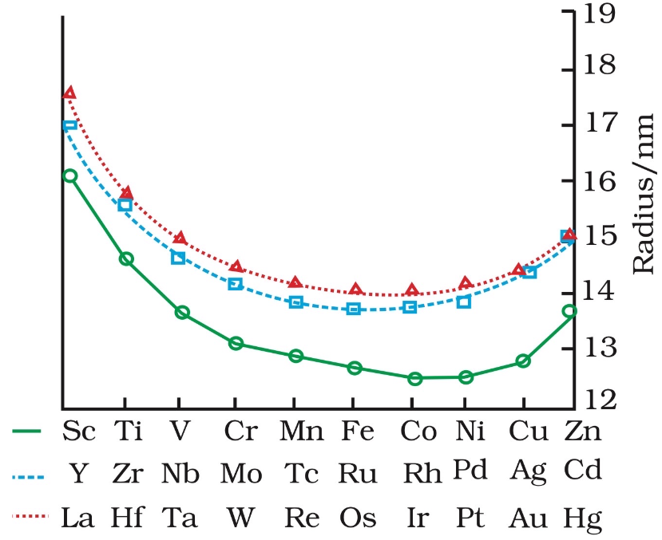
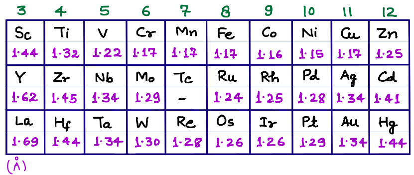
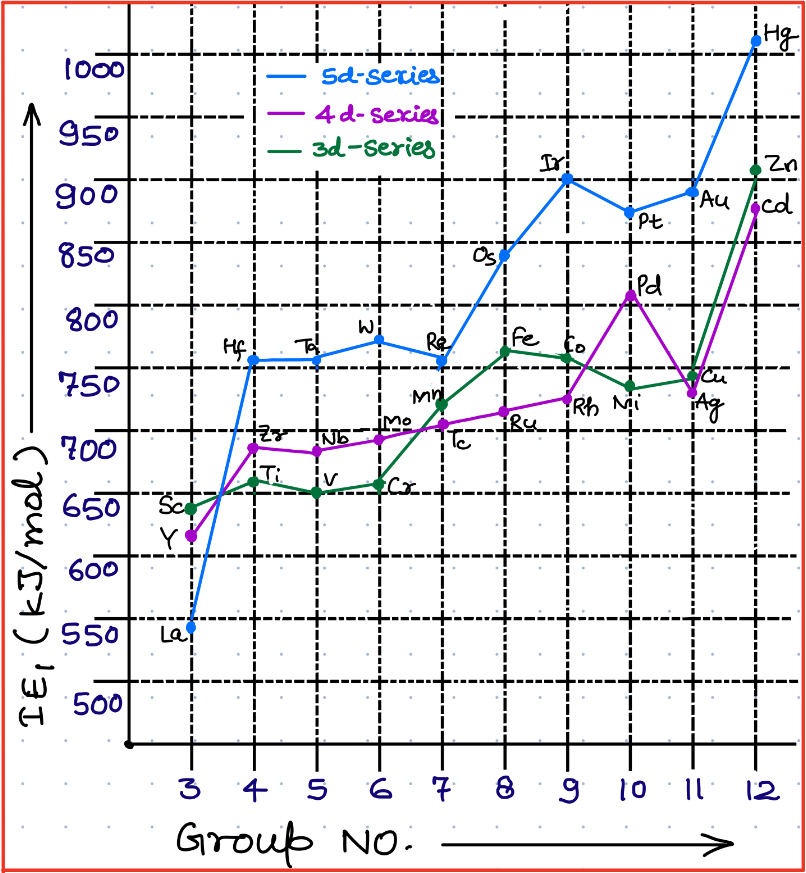
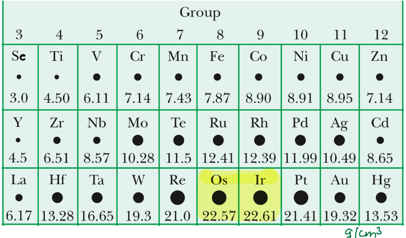
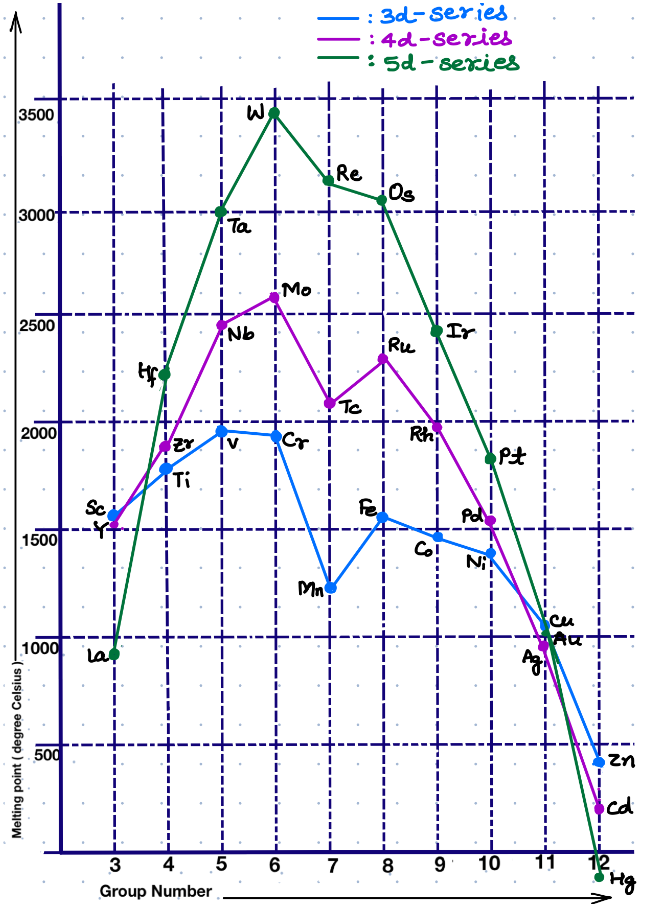

# $d-$ Block Elements

General Configuration: $ns^{1-2}nd^{1-10}$
Exception: $\ce{Pd46}: 5s^04d^{10}$

## Transition Elements
- Those elements which have incomplete d- shell in its ground state or any one of its excited states
- Named as Transition elements as they are placed between s- & p- Block **and** their properties are "Transitional" between s- & p- Block.
**Note:** Group-12 elements $\ce{(Zn, Cd, Hg)}$ are not called transiton elements as they d^10^ configuration in both ground state and oxidation states.
# General Properties
## Metallic Properties
- Almost All d-Block metals are metals and thus show typical metallic properties:
	- Ductility
	- Malleability
	- Thermal & Electrical Conductivity
	- Metallic Lustre
	- Hardness
	- Tensile
	- Low Volatility
- All d-Block Metals (except Zn, Cd, Hg, Mn) Have typical one or more metallic structures at high temperatures
**Typical Metallic Structures:** BCC, FCC, HCP
## Atomic Radius
### Across a Period

	
1) Initially, Size decreases upto the middle due to increase in $Z_{eff}$
2) Then Size remains almost constant in the middle, as $Z_{eff}\approxeq\sigma$
3) Towards the end, Size increase, as $\sigma > Z_{eff}$  

### Down the Group

1) $3d < 4d$ due to increase in number of shells
2) $4d \approxeq 5d$ due to Lanthanoid Contraction

## Ionisation Energy
### Across a Period

- Generally, increases from left to right with many irregularities due to stability of half & fully-filled shell.

### Down a Group
In General:
$$
\text{3d-series \& 4d-series} \space{\large<}\space \text{5d-series}
$$
**Exception:** $\ce{Sc > Y > La}$ (Size Basis)
#### In 3d-series:
Maximum IE~1~: $\ce{Zn}$ [Stable Configuration + High $Z_{eff}$]
Minimum IE~1~: $\ce{Sc}$ [Larger Size]
Maximum IE~2~: $\ce{Cu}$ [e^-^ from d^10^] 
Maximum IE~3~: $\ce{Zn}$ [e^-^ from d^10^]

#### In d-block:
Maximum IE~1~: $\ce{Hg}$ [Stable Configuration + High $Z_{eff}]$
Minimum IE~1~: $\ce{La}$ [Largest Size]
**Note:** Maximum $\text{IE}_1$ from each period is from Group-12.
**Note** Ni, Cu, Hg rarely exhibit oxidation state greater than 2 due to high $\text{IE}_3$
$\implies$ Ni & cu rarely show greater than +2 oxidation state whereas, Zn does not at all.

## Density

### Across a Period
Increases upto the middle then decreases in the last. (due to increase in Atomic Size towards end)

### Down a Group
Increases

Maximum Density in $3d\text{-series}$: Cu, Co, Ni
Maximum Density in $d\text{-block}$: Ir, Os
Minimum Density in $3d\text{-series}$: Sc
Minimum Density in $d\text{-block}$: Sc

## Melting point

