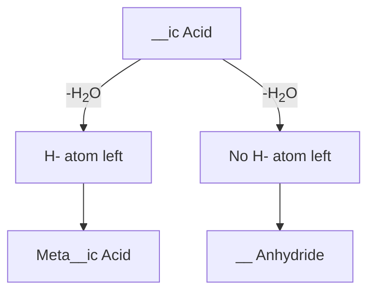
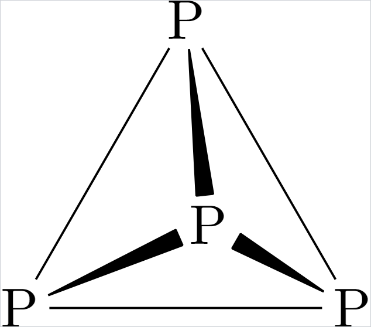
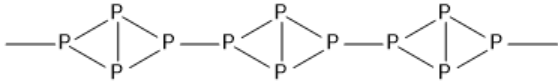
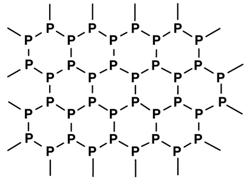

**General Configuration** $ns^2np^{1-6}$
Anomalous Properties of 2nd Period Elements;
1) Small Size
2) Absence of d- and f- orbitals
3) Multiple bond formation

# Oxoacids
$$\begin{rcases}
\text{Per\_\_ic Acid: Beyond Max OS}
\\
\text{\_\_ic Acid: Max OS}
\\
\text{\_\_ous Acid: Moderate OS}
\\
\text{Hypo\_\_ous Acid: Least OS}
\end{rcases} \text{For Halogens: }\Bigg\downarrow^\text{Max O.S.}_\text{Least O.S.}
$$

$\text{Note: Ortho is aaplied to those without any prefix}$

	

## Dehydration on Heating
$$
\text{\_\_ic Acid}\qquad \xrightarrow[-\text{H}_2\text{O}]{\Delta} \qquad\text{Pyro\_\_ic Acid}
$$
- Only applicable when removal of H_2_O is possiible with 1 mole
- In such cases 2 moles are always taken despite dehydration being possible with 1 mole

## Structure of Oxoacids
1) There is no rule for drawing structure
2) Identify presence of Peroxy/Direct Linkage
	- If, Calculated O.S. > Max O.S. $\implies$ Peroxy Linkage Present
		- **Unicentral** Atom: $\text{No. of Peroxy Bond} = \frac{\text{Calculate O.S} - \text{Max O.S.}}{2}$
		- **Multicentral** Atom: $\text{No. of Peroxy Bond} = \text{Calculate O.S} - \text{Max O.S.}$
	- If, Calculated O.S = Max O.S. $\implies$ Oxy Linkage
	- If, Calculated O.S < Max O.S. $\implies$ Direct Linkage
3) 2nd Period $\implies$ Draw without violating Octet Rule
4) 3rd Period $\implies$ Draw without violating Tetrahedral Skeleton

**Notes:**
- Hydrogen will never be directly connected to the Central Atom
	- For $\text{P}$, first connect $\ce{H}$ atoms to as many $\ce{O}$ atoms as possible then when no $\ce{H}$ atoms are left join the $\ce{O}$ directly to the $\ce{P}$ Atom
- Try to make the molecule as Symmetrical as Possible

# Phosphorous
 $\xrightarrow{\Delta}$$\xrightarrow{\Delta}$

- white Phosphourous is Highly Unstable
- It readily catches fire in air to form $\ce{P4O10}$ & is thus kept in Water.