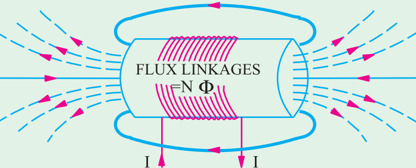
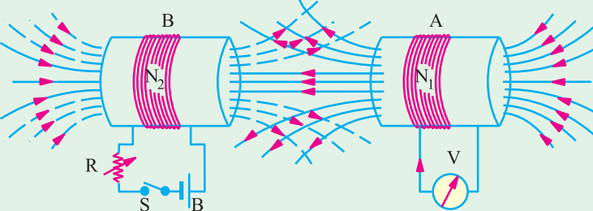

# Unit 1: Energy

- Energy sources that are present naturally and take a long time to produce / replenish are called conventional sources of energy.
	- They are also called Non-Renewable energy sources.
- Conventional sources are mainly of two types:
	- Commercial: We need to pay to obtain these sources.
	- Non-commercial: Generally, available free to use.

|Conventional|Non-Conventional|
|:---:|:---:|
|Readily available in nature|Requires mechanical devices for procuring|
|Limited in nature|We can extract an unlimited amount of energy from them|
|Used since centuries|Alternate sources of energy|
|Highly polluting|Non-Polluting|
|Commercially viable and used in industries|Used domestically|
|Generally scarce|Available in abundance|
|Efficient and good electricity conversion.|Low energy conversion but high potential due to being a newer source|
|Low Exploration costs|High initial capital & exploration costs|
|High Energy Density|Low Energy Density Also, Difficult to store & transport|
|Time-Consuming|Uncertain (Energy flow depends on various phenomenon beyond human control)|

## Power System

## Hydro Power Generation

**Energy Process:**
Potential -> Kinetic -> Mechanical -> Electrical

**Types of hydro power plants:**
The types depend on the height of the operating head of the water.
1. High Head power plants: >70m
	- Uses Pelton wheel turbine as the primary mover.
2. Medium Head power plants: >15m <70m
	- Uses Francis turbine as the primary mover.
3. Low Head power plants: <15m
	- Uses Francis or Kaplan turbine as the primary mover.
**Components of a Hydro Power Plant:**
1. Headpond
	- Reservoir storing large amounts of water.
2. Control Gate
	- Regulates the flow of water.
3. Penstock
	- The pipe transporting the water from the control gate to the turbine.
	- There is usually a high elevation difference betweeen the control gate and the turbine.
	- It is made of hard steel.
4. Valve & Nozzle
	- Valve works similiar to the control gate.
	- Nozzle is striking water in a specific direction.
5. Surge Tank
	- Used to acccumulate water which is in the pipe when we wish to close the turbine working.
	- It is used to avoid bursting the pipe.
6. Turbine
	- Responsible for converting kinetic energy into rotational energy (mechanical).
	- The high K.E. water comes through the penstock to the nozzle which strike the turbine blades due to which it starts rotating.
7. Generator
8. Transformer
9. Transmission line
10. Power House
	- House in which power is stored and released to the transformer and so on.

## Nuclear Power Plant

**Basic Overview:**
- Works on the nuclear fission of heavy elements such as U~235~ and Th~232~
- Due to fission, a large amount of heat is released which is transferred to the reactoer coolant which may be water, gas or liquid metal.
- The heated coolant is flowed through a heat exchanger where water is converted into high-temperature steam.
- The generated steam is then allowed to drive a steam turbine.
- The steam is then converted back into water where the entire process is repeated all over again.
- It is found that 1Kg of Uranium produces as much heat energy as 4,500 tons of high grade coal.
- About 10% of total electricity in the world is generated in nuclear power plants.

**Energy Conversion Process:**
Nuclear -> Heat -> Electrical

**Components of a Nuclear Power Plant:**
1. Nuclear Reactor
	- Special apparatus used to perform nuclear fission
	- Due to being radioactive, it is covered by a protective shield.
	- Consists of fuel rods, control rods and moderator
		- Fuel rods contains small round fuel pallets (uranium pallets)
		- Control rods are of cadmium which absorb neutrons, and can be moved in or out to control the reaction.
		- Moderator can be graphite rods or the coolant itself which slows down the neutrons before they bombard on the fuel rods.
	- Two types of nuclear reactors are commonly used:
		1. Pressurized water reactor (PWR)
			- Use regular water as a coolant.
			- The water is kept at a very high temperature so that it does not boil.
			- The heated water is transferred through heat exchanger where water from secondary coolant loop is converted into steam.
			- Thus the secondary loop is completely free from radioactive stuff.
			- The coolant water itself acts as a moderator.
			- Due to these advantages, PWRs are commonly used.
		2. Boiling water reactor (BWR)
			- Only one coolant loop is present.
			- The water is allowed to boil in the reactor, whose steam then flows through the reactor.
			- One major disadvantage is that the coolant water is in direct contact with the fuel rods as well as the turbine, so there is a possibility that radioactive material could be placed on the turbine.
2. Heat Exchanger
	- Here, primary coolant transfers heat to the secondary coolant (Water) converting it to steam.
	- The primary coolant and secondary coolant are closed loop, and never mix with each other.
	- It is absent in BWRs.
3. Steam Turbine
	- Runs due to the pressure of generated steam.
	- As the steam is passed through the turbine blades the pressure of steam gradually decreases and it expands in volume.
	- The steam turbine is couple to an alternator through a rotating shaft.
4. Alternator
	- The steam turbine rotates the shaft of the alternator generating electricity.
	- Electrical output of the alternator is delivered to a step up transformer to transfer it over distances.
5. Condenser
	- Converts the steam back into water.
	- The steam is cooled by passing it through a third cold water loop.

## Wind Power Generation

**Components of wind power generation**
1. Tower
	- Round tubular steel of 3-4m diameter and 75-100m height depending on the size of turbine and its location.
2. Rotor
	- It is the rotating part of the turbine.
	- It generally consists of a number of blades and a central hub that the blades are attached to.
	- The number of blades varies but a three blade rotor has the best efficiency and other advantages.
	- Blades are hollow and are made of composite material to be light and strong.
	- The trend is to make blades larger (for more power), lighter and stronger.
3. Hub
	- Responsible for holding the blades and making it possible for them to rotate with respect to the rest of the turbine body.
4. Nacelle
	- It is the housing on top of the tower that accomodates all the components that need to be on a turbine top.
	- There are a number of components for the proper and healthy operation of a compolicated electromechanical system that a turbine is.
	- A major turbine part among these components is the generator and the turbine shaft that transfers the harvested power from wind to the generator through a gearbox.
5. Generator
	- The generator is the component that converts the mechanical energy from wind into electrical energy.

## Solar Power Generation

**Brief Overview**
- Also called the Photovoltaic (PV) power plant.
- Silicon is the most commonly used material in solar cells which is a semiconductor 
- Materials which show photoelectric properties such as cadmium, gallium arsenide also may be used.
- When the semiconductor is exposed to light, it absorbs the light's energy and transfers it to the electrons.
- The extra energy allows the electrons to flow through the material as an electrical current.

**Components of a solar power plant**
1. Photovolataic (PV) panel
	- PV panels is made of small solar cells and is the device used to convert solar photon energy to electrical energy.
2. Inverter
	- Converts the DC output of the solar panel to AC.
3. Battery.
	- Used to store the energy generated by the solar power plants.
	- The storage components are used to meet the demand and variation of the load.
4. Charge Controller
	- Used to control the charging and discharging of the battery.
	- The charge controller is used to avoid overcharging of the battery.
# Unit 2
## Thevinin's Theorem
 > Any linear complex circuit containing several voltages and resistances can be replaced by a simple equivalent circuit consisting of just one single voltage in series with a single resistance connected across the load.

- $\text{V}_{\text{th}}$: V Thevinin's is the open circuit voltage across load terminals.
 - $\text{R}_{\text{th}}$: R Thevinin's is the effective resistance w.r.t to load terminal after turning off independent sources (remove the load), short circuiting the voltage sources.

**Process of finding the Thevenin values:**
- $\text{V}_\text{th}$: Remove load resistor, $\text{R}_\text{L}$ from the circuit and calculating the voltage across the open connection (where the load resistor was.
- $\text{R}_\text{th}$: Remove all power sources (voltage sources shorted and current sources open) and calculating the total resistance between open connection points.

## Superposition Theorem
> A linear bilateral active network having more than one source, the response (voltage or current) across any element is equal to the algeabric sum of the responses by each individual source acting alone. The other sources are replaced by their internal resistances.

- linear - R, C, L
- bilateral - both dir. flow
- active - has active independent sources
- response = I or V (not P as P=I^2^R (Not Linear))

To find the contribution of each individual source, all other sources first must be "turned off" (set to zero) by:
- Replacing all other voltage sources with a short circuit .
- Replacing all other current sources with an open circuit.

Superposition principle works for voltage and current but not for power. In other words, the sum of the powers of each source with the other sources turned off is not t**First Law**he real consumed power.

To calculate power, we first use superposition to find both current and coltage of each linear element and then calculate the sum of the multiplied voltages and currents.

For example, the following circuit consists of two voltage sources V~1~ and V~2~:

First, we take the source V~1~ alone and short circuit V~2~ and calculate the values of current in each branch as $i_1',\ i_2', i_3'$ by Kirchoff's laws, maintaing appropriate sign as per direction.

Next, we take the source $\text{V}_2$ alone and short circuit $\text{V}_1$ and then calculate the value of the current in each branch as $i_1'',\ i_2'',\ i_3''$ by Kirchoff's Laws

Then add the values of $i_n'$ and $i_n''$ to obtain the value of $i_n$ (keeping in mind the correct sign as per direction).

## Electromagnetism
### Faraday's Laws of Electromagnetic Induction
**First Law:** Whenever a conductor cuts varying magnetic flux, an EMF is inducd in that conductor.If the conductor circuit is closed, a current is induced.
- The magnetic field can be varied by:
	- Moving magnet towards or away from the coil.
	- Moving the coil into or out of the magnetic field.
	- Rotating the coil relative to the magnetic field.

**Second Law:** The magnitude of the induced EMF is equal to the rate of change of flux linkages with the conductor, such that:
$$
e=\frac{N\phi_2-N\phi_1}{t}=\frac{N(\phi_2-\phi_1)}{t}
$$
putting in differential form we get:
$$
e=\frac{d}{dt}(N\phi)=N\frac{d\phi}{dt}
$$
Although, a negative sign is given to the RHS to signify that the induced EMF sets up currrent in a direction which opposes the magnetic field producing it. (Lenz's Law):
$$
\boxed{e=-N\frac{d\phi}{dt}}
$$

### Lenz's Law:
> the direction of current induced in a conductor by a changing magnetic field is such that the magnetic field created by the induced current opposes the initial chaing magnetic field which produced it, signified by the negative sign in Faraday's law.

There exists a definite relation between the direction of induced current, flux and motion of the conductor.

The direction of the induced current can be found by applying either Fleming's Right Hand Rule (dynamically induced EMF) or Lenz's Law (statically induced EMF).

### Fleming's Rules
A pair of visual method for determining the relative direction of magnetic field, electric current and motion of a conductor.

**Fleming's left hand rule:** Applicable whenever a current carrying conductor is placed in a magnetic field, to find the direction of force or motion of a conductor. It is often applied to electrical motors.

**Fleming's right hand rule:** Applicable wheber a current movedf in a magnetic field, to find the direction of induced current.

Both these rules follow the following order of nomenclature:
|Thumb|Index|Middle|
|:----:|:---:|:---:|
|Force|Magnetic Field|Current|

In the case of right-hand rule, current is obviously replaced by induced current.

The order can easily by remembered by using a acrynom (or whatever tf this is) in the form of
|Father Mother Child|
|:---:|
|Force Magnetic (field) Current|

### Induced EMF
is mainly of two types
1. Dynamically Induced EMF
	- Conductor is moved in a stationary magnetic field.
	- If the conductor moves at an angle $\theta$ with the direction of flux then the magnitude of induced EMF is given by $e=Blv\sin\theta$.
	-  Its direction is given by Fleming's right hand rule.
2. Statically Induced EMF
	- The conductor remains stationary and the magneti flux linked with it is changing by changing the current producing it. (e.g. Transformers)
	- Can be Further divided into i) Self-Induced ii) Mutually Induced.

### Self Induced EMF

- It is the induced EMF in a coil due to the change of its own flux linked with it.
- If current through the coil is changed, then the flux linked with its own turns will also change.
- Self Inductance ($L$): Property of a coil due to which it opposses any change if current in the coil known as self-inductance.
	$e=-L\frac{di}{dt}=-N\frac{d\phi}{dt}$
	
	$\therefore\ L=N\frac{d\phi}{di}=N\frac{\phi}{i}\text{ Henry}$
- Energy stored in a magnetic field $= \frac{1}{2}LI^2$

### Mutually Induced EMF

- Induced EMF in one coil by the influence of changing magnetic flux in other coil.
- Consider two coupled coils A and B with $N_1$ and $N_2$ turns respectively.
- Coil B is connected to a battery, switch and variable resistor whereas coil A is connecterd to a sensitive voltmeter.
- When the switch in coil B is closed, the magnetic field set up partially links with coil A, producing mutually induced EMF in coil A.
- As current through coil B is changed, the amount of flux linked with coil A also changes, changing mutually induced EMF as well.
- Mutually Induced EMF ($M$): Ability of first coil to produce EMF in the second coil, when the current in the first coil is changing.
	- Suppose the alternating current $i_1$ produces the flux $\phi_{11}$ linking through the coil A only and the mutual flux $\phi_{12}$ between the coils such that $\phi_1=\phi_{11}+\phi_{12}$
	- Hence self induced EMF will be $L_1=N_1\frac{\phi_1}{i_1}$
	- Mutually induced EMF in coil B will be $M_{12}=\frac{N_2\phi_{12}}{i_1}$
	- The same logic is applied for when coil B is energized by an alternating current $i_2$.
- As the coupling between two coils is bilateral:
$M_{12}=M_{21}=M$

### Coeffecient of Coupling ($K$)
- Used to determine the amount of coupling between the inductively coupled coils.
- It is the fraction of magnetic flux produced by the current in one coil that links with the other coil.
- It is the ratio of mutual flux to total flux:
$$
K_{12}=\frac{\phi_{12}}{\phi_1}\qquad\text{and}\qquad K_{21}=\frac{\phi_{21}}{\phi_2}
$$
- As the coupling is bilateral, $K=K_{12}=K_{21}$:
$$
\phi_{12}=K\phi_1\qquad\text{and}\qquad \phi_{21}=K\phi_2
$$
- We know that mutual inductance, $M$:
$$
M^2=M_{12}\times M_{21} = N_1\frac{d\phi_{12}}{d\phi_1}\times N_2\frac{d\phi_{21}}{di_2}
$$
- Substituing the values we get:
$$
\boxed{
K=\frac{M}{\sqrt{L_1L_2}}
}
$$

# Unit 3: AC
- An alternating voltage or current is a quantity, whose magnitude continuously changes with time but can have two direction, either positive or negative.

## Generation of Sine Voltage

- Consider a rectangular coil of length, $l$ kept under uniform magnetc flux density $B$ between the north and south pole.
- Let the coil rotates in anticlockwise direction with an angular velocity $\omega$ or linear velocty $v$ around the central axis which is perpendicular to the magnetic field.
- Hence it cuts the lines of magnetic field between north and south poles at diffrerent angles at different angles and induces EMF in the coil.
- When the coil is rotated in anticlockwise by some angle $\theta$, then the velocity will have two components, $v\sin\theta$ (perpendicular to flux lines) and $v\cos\theta$ (parallel to the flux lines).
- Due to $v\sin\theta$ component, there will be cutting of the flux and EMF will be induced whic his given by:
$e=E_m\sin\theta=Blv\sin\theta$
where $\theta=\omega t=2\pi ft$
- Relation between magnitude of induced EMF and angle follows the same pattern as $\sin\theta$.
- Due to the induced EMF, a current will also flow in the circuit with a similiar equation:
	$i=I_m \sin\theta$

**Important Terminology:**
- **Instantaneous Value ($e$):** value of induced EMF at any instant.
- **Amplitude ($E_m$):** Maximum value (postive or negative) of induced EMF in the conductor.
- **Cycle:** One complete set of positive and negative values of induced EMF.
- **Angular frequency ($\omega$):** Number of radians per second. Since 1 cycle covers $2\pi$ radians and there are $f$ cycles in 1 second, $\omega=2\pi f$

## Average Value
- The average value of AC is equal to that steady current that transfers the same amount of charge as transferred by the alternating current in the same circuit doing the same time.
- In the case of symmetrical alternating current (whose 2 half-cycles are exactly similiar and opposite), the average value over a complete cycle is zero.
- Therefore, for symmetrical current, we find average value by adding or integrating the instantaneous values of current over one half-cycle only.
- For unsymmetrical current, we take the average value over the whole cycle.

### 1. Mid-Ordinate Method
- The waveform is divided into $n$ equal parts so that the duration of each interval is $t/n$ seconds.
- Let the average values of instantaneous current during these intervals are $i_1,\ i_2,\ \dots,\ i_n$
- Then $I_\text{avg}=\frac{(i_1 +i_2+\dots+i_n)}{n}$
	- That is the average value is the arithmetic mean of the sum of all values divided by the total numbers of values.

### 2. Analytical Method
Consider the standard form of a sinusoidal alternating current as $i=I_m\sin\theta$, then its average value is given by:
$$
I_\text{avg}=\frac{\text{Area under half cycle}}{\text{Length of half cycle}} = \frac 1\pi\int\limits_0^\pi id\theta
\\
\therefore \ I_\text{avg}=\frac 1\pi\int\limits_0^\pi I_m\sin\theta d\theta
\\
\boxed{
\therefore I_\text{avg}=\frac{2I_m}{\pi} = 0.637I_m
}
$$
Therefore the average value of alternating current is 0.637 times its maximum value.

## Root Mean Square Value
The RMS value or effective value is equal to that steady current which produces the same amount of heat as produced by the alternating current in the same circuit during the same time.

Therefore, it is defined on the basis of amount heat produced, given by:
$$
H=I^2RT
$$

### 1. Mid Ordinate Method
For a waveform,
Heat produced during the first interval $= i_1^2Rt/n$
Heat produced during the second interval $= i_2^2Rt/n$
Heat produced during the $n^\text{th}$ interval $= i_n^2Rt/n$

Therefore total heat produced in $t$ seconds:
$$
H=\frac{(i_1^2+i_2^2+\dots+i_n^2)}{n}Rt = I^2Rt
\\
\
\\
\therefore I_\text{avg}=\sqrt{\frac{(i_1^2+i_2^2+\dots+i_n^2)}{n}}
$$

Therefore, RMS value is the square root of the mean of squares of instantaneous values.

### 2. Analytical Method
Consider the standard form of a sinusoidal alternating current as $i=I_m\sin\theta$, then its RMS value is given by:
$$
I^2 = \frac{1}{T}\int\limits_0^T i^2d\theta = \frac{1}{2\pi}\int\limits_0^{2\pi}I^2_m\sin^2\theta d\theta
\\
\
\\
\boxed{
I=\frac{I_m}{\sqrt 2} = 0.707I_m
}
$$

### Some important values:
**Form Factor ($K_f$):** Ratio of RMS to average value:
$$
K_f=\frac{I_m/\sqrt 2}{2I_m/\pi} = \frac{\pi}{2\sqrt 2} = 1.11 \qquad\text{(for sine wave)}
$$

**Peak Factor ($K_p$):** Ratio of max value to RMS.
Also called crest or amplitude factor.
$$
K_p=\frac{I_m}{I_m/\sqrt 2} = \sqrt 2= 1.414 \qquad \text{(for sine wave)}
$$

## Pure Resistive AC Circuit

The instantaneous value of current flowing through the resistor will be:
$$
i=\frac{v}{R}={V_m\sin\omega t}{R}=I_m\sin\omega t
$$

By observing the equations for both voltage and current we can see that both these quantities are in phase with each other.

Instantaneous power consumed by the resistance is given by:
$$
p=vi=V_mI_m\sin^2\omega t
\\
\
\\
=V_mI_m\bigg(\frac{1-\cos2\omega t}{2}\bigg)
\\
\
\\
\therefore\ p=\frac{V_mI_m}{2}-\frac{V_mI_m\cos2\omega t}{2}
$$

The power equation consists of two parts, first part is constant, whereas the second is a periodically alternating quantity whose frequency is two times the frequency of the applied voltage

The average power is given by:
$$
P_\text{avg}=\frac{1}{2\pi}\int\limits_0^{2\pi}vi\ d\theta = \frac{V_mI_m}{2} = \frac{V_m}{\sqrt 2}\frac{I_m}{\sqrt 2} = VI
$$

## Pure Inductive AC Circuit

The current produces an alternating flux, which links with the inductor and hence self induced EMF induced in it. This induced EMF opposes the applied voltage and is given by:
$$
v=-e=L\frac{di}{dt}
\\
\
\\
\therefore L\frac{di}{dt}=V_m\sin\omega t
\\
\
\\
\implies \ di=\frac{V_m\sin wt\ dt}{L}
$$
Integrating both sides we get:
$$
i=\frac{V_m}{\omega L}(-\cos\omega t) = I_m\sin(\omega t-90\degree)
$$
Where $X_L = \omega L$ is the inductive reactance.

By comparing the equations of current and voltage, we observe that current lags voltage by $90\degree$

Instantanous Power is given by:
$$
p=vi=-V_mI_m\sin\omega t\cos\omega t
\\
\
\\
\implies p=-\frac{V_mI_m}{2}\sin2\omega t
$$
The average value of power is given by:
$$
P_\text{avg}=\frac{1}{2\pi}\int\limits_0^{2\pi}vi\ d\theta = 0\qquad\text{(on solving...)}
$$

In the purely inductive circuit, during the first quarter cycle, when the voltage is increased, the magnetic field increases, and the power supplied by the source is stored in the inductor. 

Further, in the next quarter cycle, when the voltage decreases, the magnetic field decreases, and the stored power is released to the source. 

This process continues in every cycle, and thus, no power is consumed in the pure inductive circuit.

## Pure Capacitve AC Circuit

The instantaneous value of current will flow across the circuit. This current will charge the plates of capacitor with a charge of $q$ coulomb and is given by:
$$
i=\frac{dq}{dt}=\frac{d(Cv)}{dt} = (\omega C)V_m\cos\omega t
\\
\
\\
\implies i=\frac{V_m\cos\omega t}{1/\omega C} = I_m\cos\omega t = I_m\sin(\omega t+90\degree)
$$
where, $X_C=1/\omega C$ is the capactive reactance.

By comparing the equations of current and voltage, we observe that current leads voltage by $90\degree$

Instantaneous power is given by:
$$
p=vi=V_mI_m\sin\omega t\cos\omega t
\\
\
\\
\implies p =\frac{V_mI_m}{2}\sin2\omega t
$$
The average power consumed by the pure inductance is given by:
$$
P_\text{avg}=\frac{1}{2\pi}\int\limits_0^{2\pi}vi\ d\theta = 0\qquad\text{(on solving...)}
$$

In the purely capacitive circuit, during the first quarter cycle, when the voltage is increased, the capacitor gets charged and reaches its maximum value and, therefore the power supplied by the source is stored in the capacitor.

Further, in the next quarter cycle, when the voltage decreases, the capacitor gets discharged and the stored power is released to the source.

This process continues in every cycle, and thus, no power is consumed in the pure capacitive circuit.

## Series RL Circuit

$V_R=IR$ (Voltage drop across $R$, same phase)
$V_L=IX_L$ (Voltage across $L$, leads current by $90\degree$)

Therefore:
$V=V_R+V_L = IR+ I(jX_L) = I\underbrace{[R+jX_L]}_Z = IZ$

Now in $\triangle \text{OAB}:$
$$
V^2=V_L^2+V_R^2
\implies V^2=I^2(R^2+X_L^2)
\\
\
\\
\therefore |Z|=\sqrt{(R^2+X_L^2)}
$$

Also in $\triangle \text{OAB}:$
$$
\tan\varphi=\frac{V_L}{V_R} = \frac{X_L}{R}
$$
Now, $Z$ is the impedance of the circuit.

From the phasor diagram, we find that current lags voltage by an angle $\varphi$.
Therefore, if $v=V_m\sin\omega t$ then, $i=I_m\sin(\omega t-\varphi)$

Therefore instantaneous power is given by:
$$
p=vi=V_mI_m\sin\omega t\sin(\omega t-\varphi)
\\
\
\\
\implies p=\frac{V_mI_m}{2}[\cos\varphi-\cos(2\omega t-\varphi)]
\\
\
\\
\therefore p=\frac{V_mI_m}{2}\cos\varphi-\frac{V_mI_m}{2}\cos(2\omega t-\varphi)
$$

Here, $\cos\varphi$ is the power factor of the circuit.

From $\triangle\text{OAB}$, we have:
$$
\cos\varphi = \frac{V_R}{V}=\frac{R}{Z}
$$

Also the average power consumed by the RL circuit is given by:
$$
P_\text{avg}=\frac{1}{2\pi}\int\limits_0^{2\pi}vi\ d\theta =\frac{1}{2\pi}\int\limits_0^{2\pi} \frac{V_mI_m}{2}\cos\varphi-\frac{V_mI_m}{2}\cos(2\theta-\varphi)
\\
\
\\
\implies \frac{V_mI_m}{2}\cos\varphi=\frac{V_m}{\sqrt{2}}\frac{I_m}{\sqrt{2}}\cos\varphi = VI\cos\varphi
$$

## Series RC Circuit

# Unit 4
## Transformers
**Types of Transformers:**
1) Windings:
	i) 2
	ii) Auto Transformers (1)
2) Phases
	i) Single-Phase
	ii) Three-Phase
3) Coolant
	i) Air
	ii) Oil
4) Applications
	i) Measuring
	ii) Distribution
	iii) Power
5) Magnetic
	i) Core Type
	ii) Shell Type